# Ragent — 总体架构与技术选型

> 本文是 Ragent AI 的总体设计基线。
> 目标：覆盖既定产品能力，复用现有 React 前端并沿用 PostgreSQL / Redis / ES / LightRAG 等基础设施类型，保持对外 API 与 SSE 事件协议兼容；项目拥有独立的数据模型与运行状态。

## 1. 建设目标与原则

| 原则 | 说明 |
|---|---|
| 功能覆盖 | 覆盖混合检索、问题理解、会话记忆、模型档位与熔断、流量保护、可编排入库、MCP、Trace、管理后台 |
| 契约兼容 | REST 路径（`/api/ragent/**`）、`Result<T>` 包装、SSE 六种事件（meta/message/finish/cancel/reject/done）保持不变，现有前端直接可用 |
| 独立数据模型 | 按当前领域模型设计 PostgreSQL Schema，启动时初始化，不依赖其他实现的表结构、数据或迁移历史 |
| 自研轻量 | 不引入 LangChain/LangGraph/LlamaIndex；模型运行时自研档位路由、首包探测和三态熔断 |
| 配置驱动 | 检索通道、向量后端、引擎模式等均以配置开关装配，启动期一致性校验 |
| 分期交付 | 先打通问答主链路，再补入库、混合检索增强、管理后台，最后补韧性机制（见第 9 节路线图） |

## 2. 技术选型总表

| 领域 | 选型 | 说明 |
|---|---|---|
| 语言 / 运行时 | Python 3.12+ | 全 asyncio |
| Web 框架 | FastAPI + Uvicorn | `root_path=/api/ragent` |
| 数据校验 / 配置 | Pydantic v2 + pydantic-settings | YAML + 环境变量分层配置 |
| ORM | SQLAlchemy 2.0（async）+ asyncpg | 异步数据访问 |
| Schema 初始化 | SQLAlchemy `create_all` | 全新项目启动时幂等建表，先创建 pgvector 扩展 |
| 向量库 | **pgvector**（HNSW） | 一期只保留 pgvector，协议层预留其他实现 |
| 关键词检索 | Elasticsearch（`elasticsearch[async]`，IK 分词） | 可选通道，配置开关 |
| 知识图谱 | LightRAG 外置服务（httpx 调用） | 可选通道 |
| 缓存 / 会话 / 限流 | redis-py（asyncio） | 公平排队用 ZSet + Lua 脚本 + pub/sub |
| 异步任务 | **自研 PG 队列**（`t_async_task` 表即队列，`FOR UPDATE SKIP LOCKED` 原子 claim + `LISTEN/NOTIFY` 唤醒，asyncio 定时器承载 cron） | 可靠性 = 租约超时重投 + 数据库幂等 |
| HTTP 客户端 | httpx（AsyncClient，连接池复用） | 统一出站 HTTP 能力 |
| MCP | FastMCP 3（独立包，基于 MCP SDK v2 引擎） | client/server 统一用 FastMCP |
| 文档解析 | MinerU SaaS、markdown-it-py、openpyxl、python-docx、chardet、BeautifulSoup4 | 覆盖结构化文档、文本与图片 |
| 对象存储 | boto3（S3 兼容：rustfs/minio） | 统一 S3 协议 |
| 认证 | PyJWT + Redis 会话 | 保持 login/token 前端契约 |
| ID 生成 | DB 内部主键 `BIGINT GENERATED BY DEFAULT AS IDENTITY`（自增）；跨存储/预分配/对外业务标识用 UUIDv7（PostgreSQL 原生 `UUID`，接口序列化为字符串） | 不依赖机器号或时钟回拨处理 |
| 日志 | structlog（JSON） | 结构化日志与上下文注入 |
| 测试 | pytest + pytest-asyncio + httpx ASGITransport | |
| 依赖管理 | uv + pyproject.toml | 锁文件保证可复现安装 |

明确不做的事：

- 不引入 LangChain / LangGraph / LlamaIndex / Haystack 等编排框架。
- 不保留 Milvus 双实现（如需二期再加，向量层接口预留）。
- 不引入 RocketMQ / Kafka / Celery / ARQ 等任何外部任务 broker（异步任务由自研 PG 队列承载，见 §5.3）。
- v2 ReAct 引擎不作为第一阶段目标，但目录与配置开关预留（`ragent.engine.type=workflow|agent`）。

## 3. 总体架构

```
                        ┌────────────────────────────────────────┐
                        │        React 前端（现有，零改动）        │
                        └───────────────┬────────────────────────┘
                                        │ HTTPS / SSE
┌───────────────────────────────────────▼────────────────────────┐
│                   API 进程（FastAPI，:9090）                    │
│ ┌─────────────┬─────────────┬─────────────┬─────────────────┐  │
│ │  system     │  knowledge  │  ingestion  │  rag（问答核心） │  │
│ │ 用户/认证/  │ 知识库/文档 │ 可编排入库  │ 记忆→改写→意图→ │  │
│ │ 审计        │ /chunk      │ Pipeline    │ 检索→溯源→SSE   │  │
│ ├─────────────┴─────────────┴─────────────┴─────────────────┤  │
│ │ admin（dashboard / kg / trace / agents / intent-tree）     │  │
│ ├───────────────────────────────────────────────────────────┤  │
│ │ model_runtime：LLM / Embedding / Rerank / VLM（路由+熔断+ │  │
│ │           首包探测，OpenAI 兼容协议）                      │  │
│ ├───────────────────────────────────────────────────────────┤  │
│ │ framework：Result 包装 / 错误码 / 幂等 / SSE              │  │
│ │           发送器 / 流任务管理 / Trace 上下文               │  │
│ └──────────┬──────────────┬───────────────┬─────────────────┘  │
└────────────┼──────────────┼───────────────┼────────────────────┘
             │              │               │
   ┌─────────▼──┐   ┌───────▼───────┐   ┌───▼──────────────┐
   │ PostgreSQL │   │     Redis     │   │   MCP Server     │
   │ + pgvector │   │ 缓存/会话/    │   │ （独立进程:9099， │
   │ + 业务表   │   │ 队列/锁       │   │  Streamable HTTP）│
   └────────────┘   └───────────────┘   └──────────────────┘
   ┌────────────┐   ┌───────────────┐   ┌──────────────────┐
   │ ES（可选）  │   │ LightRAG(可选)│   │ LLM/Embedding/   │
   │ 关键词通道  │   │ 图谱通道       │   │ Rerank/VLM 供应商 │
   └────────────┘   └───────────────┘   └──────────────────┘

   Worker 进程（python -m app.worker，自研 PG 队列）：入库分块执行、反馈持久化、会话摘要、定时刷新（asyncio 定时器承载 cron）
```

### 进程拓扑

| 进程 | 端口 | 说明 |
|---|---|---|
| `api` | 9090 | FastAPI 主应用，`root_path=/api/ragent`，可多副本水平扩展 |
| `worker` | — | 自研 PG 队列 worker（`python -m app.worker`），消费入库/反馈/摘要任务，含 asyncio 定时器 cron（定时刷新文档），可多实例水平扩展（SKIP LOCKED 保证安全） |
| `mcp-server` | 9099 | 独立 MCP 工具服务（Streamable HTTP），示例工具 + 业务工具 |
| 中间件 | — | PostgreSQL+pgvector、Redis 必选；ES、LightRAG 按配置可选 |

### 业务框架设计

本节从「应用内组件」视角补充三张视图：分层依赖与核心 Protocol（类图）、一次问答请求的全链路组件协作（时序图）、api/worker 进程围绕 `t_async_task` 的协作（时序图）。图中类名均为项目实际落点，与各专题文档的模块表一致。

#### 分层依赖总览

视角：八大层的单向依赖关系（箭头 = 依赖方向），每层标注代表性类。依赖单向无环，上层可依赖下层，禁止反向。

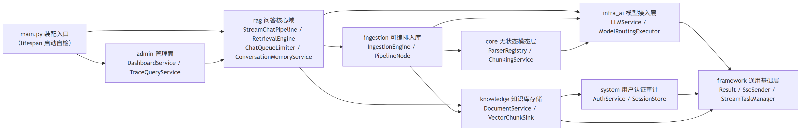

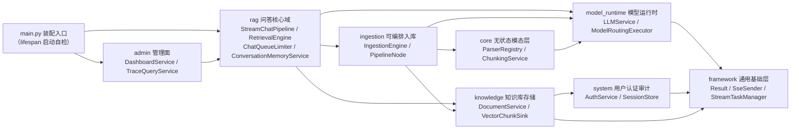

#### 模型运行时类图（model_runtime）

视角：四能力（chat / embedding / rerank / vlm）同构的「Protocol + Routing 实现 + provider Client」三层结构，选路/首包探测/熔断收敛在 `ModelRoutingExecutor` + `ModelHealthStore`。

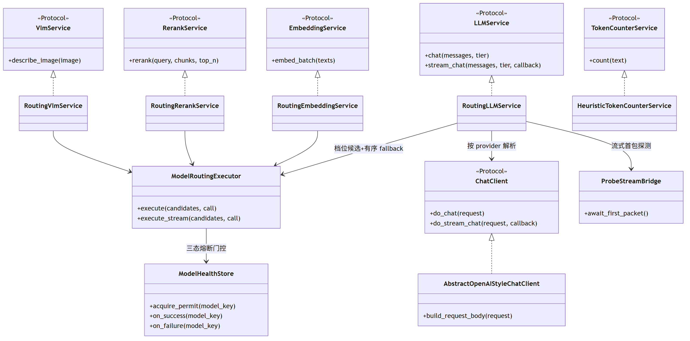

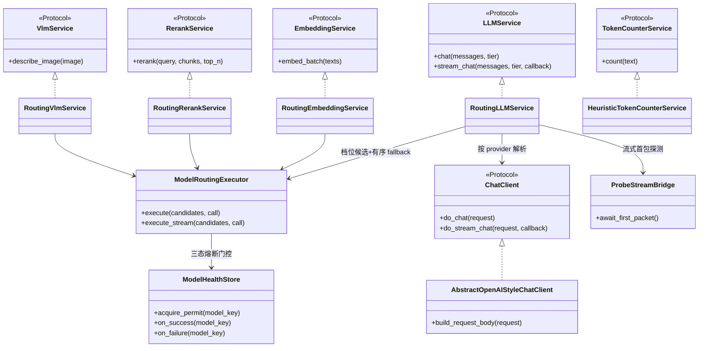

#### 问答域类图（rag）

视角：入口编排 → 限流 → Pipeline 的核心协作关系；检索引擎与通道、记忆服务与存储均面向 Protocol 编程。

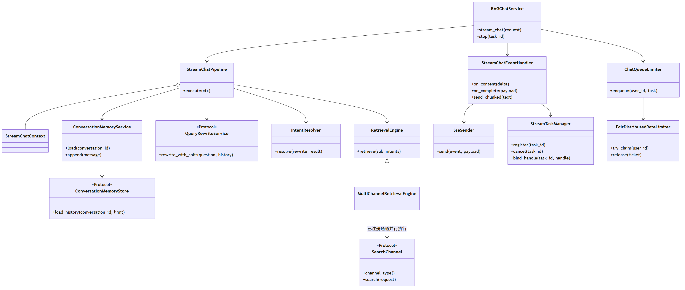

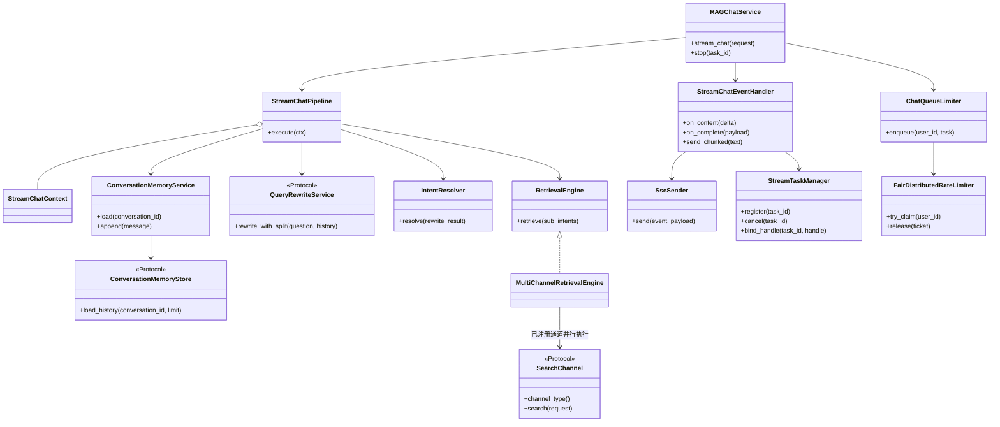

#### 入库与知识域类图（ingestion / knowledge / core）

视角：可编排引擎驱动六类节点，解析/分块内核无状态可复用；向量写入面向 `VectorStoreService` 协议（Milvus 二期可插拔）。

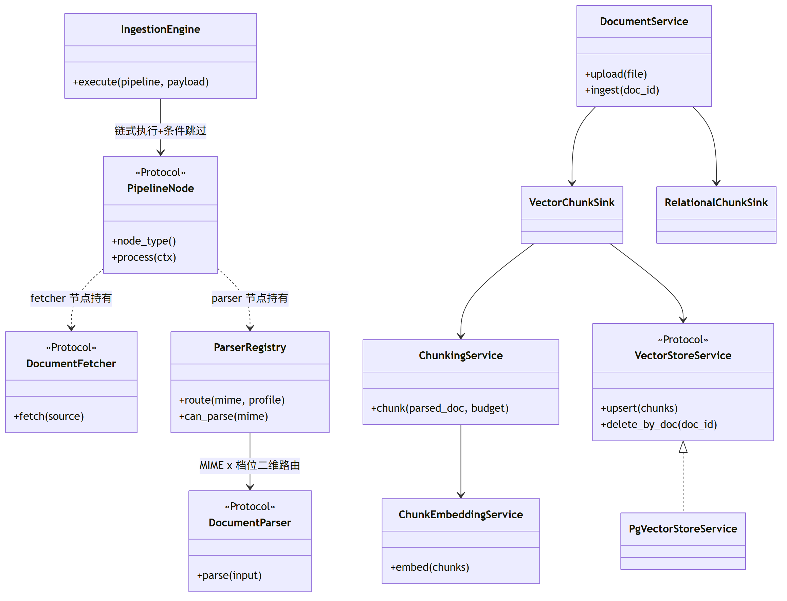

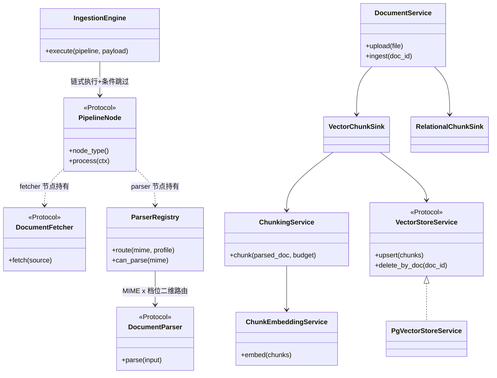

#### 系统与管理面类图（system / admin）

视角：认证/审计为薄服务层，管理面只做查询聚合，均不持有复杂状态机。

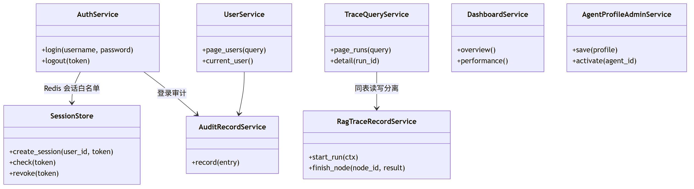

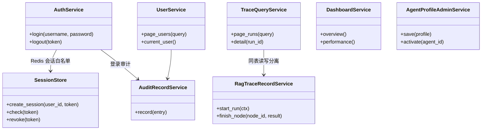

#### 问答请求全链路组件协作

视角：一次 SSE 问答请求从 FastAPI 路由到模型供应商的组件调用时序，标注经过的核心类（Pipeline 内部七步逻辑见 01 文档 §5，模型选路/首包探测细节见 04 文档 §12，此处不重复展开）。

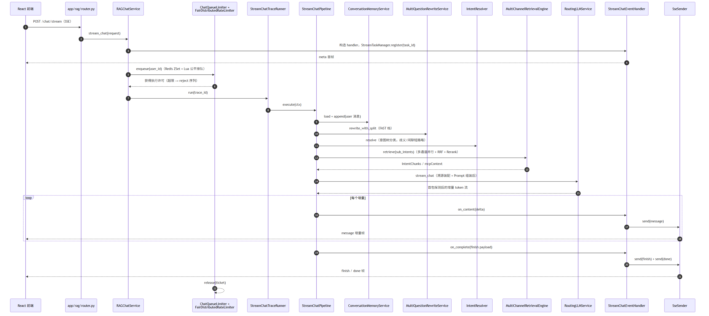

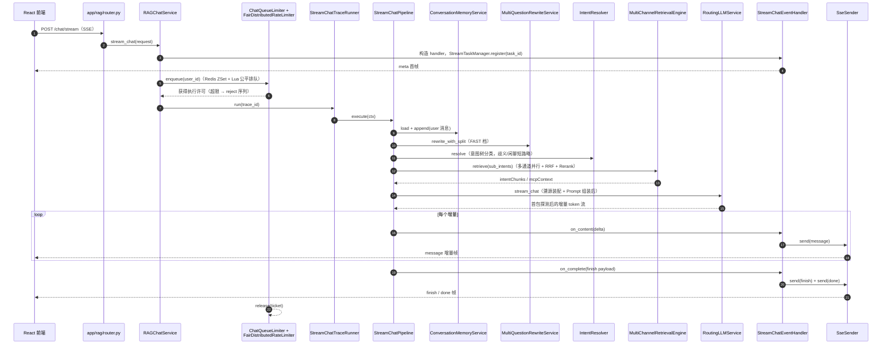

#### api / worker 进程围绕 t_async_task 的协作

视角：`t_async_task` 表即队列——api 进程业务事务内入队，worker 进程原子 claim、租约重投、幂等消费（对应 §5.3）。

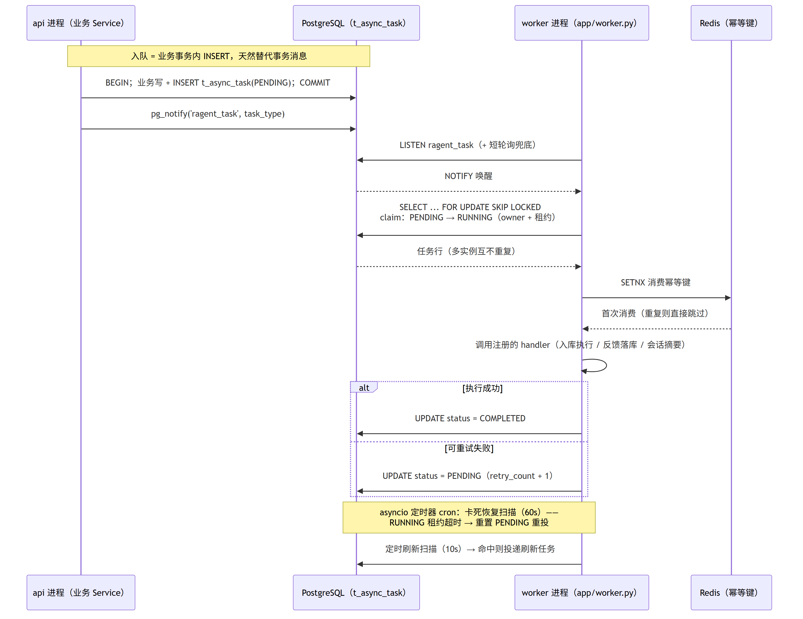

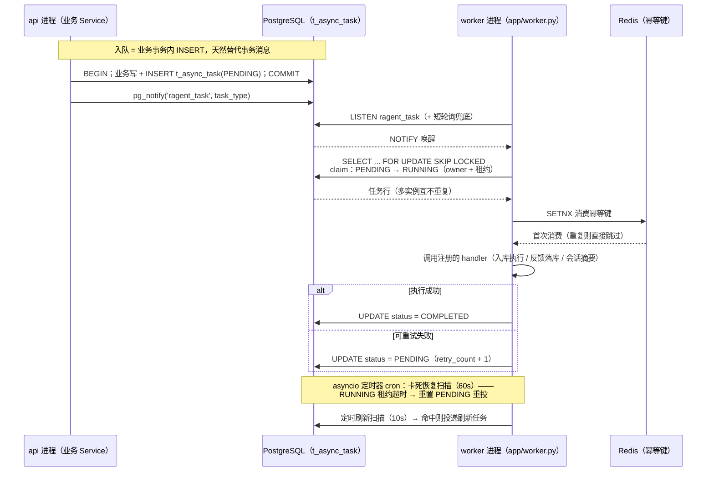

## 4. 工程结构

```
rag-agent/
├── pyproject.toml                # uv 管理
├── config/
│   ├── application.yaml          # 单文件配置，pydantic-settings 加载
│   └── prompts/                  # 运行时 Prompt 模板（rewrite / intent / mcp 提参等）
├── app/
│   ├── main.py                   # FastAPI 装配入口（ lifespan 启动自检）
│   ├── framework/                # 通用基础层（禁业务代码）
│   │   ├── result.py             # Result<T> 统一包装与错误码
│   │   ├── idempotency.py        # 提交/消费幂等装饰器
│   │   ├── sse.py                # SSE 发送器、事件协议定义
│   │   ├── stream_tasks.py       # 流任务管理（取消广播：本地 registry + Redis pub/sub）
│   │   └── trace_ctx.py          # Trace 上下文（contextvars）
│   ├── model_runtime/            # 模型运行时（见 04 文档）
│   │   ├── chat/ embedding/ rerank/ vlm/ token/
│   │   └── routing.py            # 档位路由 + 首包探测 + 三态熔断
│   ├── system/                   # 用户、认证、审计日志
│   ├── knowledge/                # 知识库 / 文档 / chunk CRUD 与存储
│   ├── ingestion/                # 可编排入库 Pipeline（见 03 文档）
│   │   ├── engine/ nodes/ fetchers/
│   ├── core/                     # 无状态模态层：parser / chunker / ingest 内核
│   ├── rag/                      # 问答核心域（见 01/02 文档）
│   │   ├── pipeline/             # 问答主链路编排
│   │   ├── memory/ rewrite/ intent/ retrieval/ mcp/ prompt/ source/
│   │   └── ratelimit/            # 公平排队限流（见 05 文档）
│   ├── admin/                    # dashboard / kg / trace 查询
│   └── worker.py                 # 自研 PG 队列 worker（任务注册 + SKIP LOCKED claim + asyncio 定时器 cron）
├── mcp_server/                   # 独立 MCP 服务（可单独部署）
│   ├── main.py
│   └── tools/                    # weather / sales / ticket / youcom_search
├── resources/
│   ├── database/                 # 可选初始化数据
│   └── docker/                   # 中间件 compose（PG / Redis / ES / LightRAG）
├── scripts/
├── tests/
└── docs/                         # 本系列设计文档
```

依赖方向（单向无环）：

```
framework ← model_runtime / system ← knowledge / ingestion ← rag ← admin ← main
mcp_server 独立，不依赖 app 内部模块
```

## 5. 关键架构决策

### 5.1 确定性管线，而非 Agent 循环

问答主链路是**确定性编排管线**（v1 WORKFLOW）：
`记忆加载 → 改写拆分 → 意图树分类 → 歧义追问/闲聊短路 → 多通道检索/MCP 工具 → 溯源装配 → Prompt 组装 → SSE 流式`。
工具调用不走 function-calling 协议，而是“意图命中 + LLM 提参 + 三态结局（SUCCESS / NEED_CLARIFICATION / FAILED）”。`engine.type=agent` 仅预留配置位。

### 5.2 自研模型接入层

OpenAI 兼容协议 + httpx，提供模型档位（fast/standard/deep）、有序候选 fallback、流式首包探测（缓冲-提交桥）、三态熔断（CLOSED/OPEN/HALF_OPEN 单探测）。详见 04 文档。

### 5.3 自研 PG 队列（替代 RocketMQ 事务消息）

不引入 ARQ / Celery / RocketMQ 等任何外部 broker，`t_async_task` 表即队列（单层模型，不再是"broker 触发 + DB 状态机"两层）：

- 入队 = 业务事务内 INSERT 一行任务（与业务写同事务提交，天然替代 RocketMQ 事务消息的原子性）；
- 领取 = worker 内 `SELECT ... FOR UPDATE SKIP LOCKED` 原子 claim（`PENDING`→`RUNNING`，带 owner / 租约）；唤醒 = PG `LISTEN/NOTIFY` + 短轮询兜底；
- 定时任务（cron）= worker 进程内 asyncio 定时器承载（定时刷新扫描 10s、卡死恢复 60s 等周期不变）；
- worker 进程 = 独立 asyncio 进程（`python -m app.worker`），可仿 api 进程水平扩展（SKIP LOCKED 保证多实例安全）；
- 可靠性：`RUNNING` 租约超时由定时扫描重置 `PENDING` 重投 + 消费端幂等（业务键 + Redis SETNX 装饰器，不变）。

### 5.4 检索与存储的可插拔

向量只保留 pgvector，但 `VectorStore` 协议（Protocol 类）保留，Milvus 二期可加；ES / LightRAG / WebSearch 通道均为配置开关，未启用则不注册，检索引擎按已注册通道并行执行。

### 5.5 独立数据模型与 ID 策略

项目是全新系统，不导入旧数据或迁移历史；启动时幂等创建 pgvector 扩展和业务表。验收以业务测试、API/SSE 契约测试和故障场景测试为准；Redis 使用独立 key namespace，不与其他实现共享运行状态。

ID 分为两类：仅在关系库内部使用的主键采用 `BIGINT GENERATED BY DEFAULT AS IDENTITY`；需要在落库前生成、对外暴露或跨 PostgreSQL / pgvector / Elasticsearch 对齐的业务标识采用 UUIDv7。PostgreSQL 优先使用原生 `UUID` 类型，输出 API 或作为外部存储 key 时序列化为标准字符串。关系表可同时保留自增主键和唯一 UUID 业务键；对天然以跨存储标识寻址的记录，也允许 UUIDv7 直接作为主键，但必须在对应表设计中明确。

## 6. 配置体系

- `config/application.yaml` 单文件，pydantic-settings 分层模型强类型加载，环境变量覆盖（`RAGENT_` 前缀）；
- 启动期一致性校验：如 `keyword.type=es` 但无 ES 地址 → 启动失败；embedding 候选维度 ≠ `rag.default.dimension`(1536) → 启动失败；
- 检索关键参数默认值：`recall-budget=20`、`fusion.rrf-k=20`、通道权重 vector 1.0 / keyword 1.0 / graph 0.8 / web 0.5、`rerank-candidate-limit=40`、`default-top-k=10`、`scope.supplement-ratio=0.25`、意图阈值 `confidence-threshold=0.6`。

## 7. 认证与权限

- 两类角色 `admin` / `user`，一期只做角色校验，不设置细粒度权限点；
- 登录颁发 token（JWT），服务端 Redis 存会话白名单支持登出失效；`GET /user/me` 等接口契约不变；
- 管理接口 `/admin/**` 角色守卫；普通用户数据（会话、消息、反馈）按归属隔离。

## 8. 观测与审计

- RAG Trace 为领域功能而非通用 APM：沿用 `t_rag_trace_run` / `t_rag_trace_node` 表与 `/rag/traces/**` 查询接口，Python 侧用 `contextvars` + 装饰器实现节点树；
- 结构化日志 structlog，trace_id 贯穿；
- 业务变更审计沿用 `t_biz_change_log` 与 `/biz-change-logs` 接口。

## 9. 分期路线图

| 里程碑 | 范围 | 验收 |
|---|---|---|
| M1 骨架 + 问答主链路 | 工程骨架、配置、认证、pgvector 单通道检索、记忆、SSE 协议、模型层（档位+fallback） | 前端可登录、可流式问答、来源引用正确 |
| M2 入库链路 | 固定入库内核（解析→分块→向量化→落库）、文档/知识库 CRUD、PG 队列 worker | 上传 PDF/MD 可入库可检索 |
| M3 混合检索增强 | ES 通道、LightRAG 通道、WebSearch、RRF+去重+Rerank、问题改写拆分、意图树与多库路由 | 召回质量达到验收集指标，Trace 可查 |
| M4 可编排入库 + MCP + 管理面 | Pipeline 编排、远程刷新、MCP server/client、意图-MCP 工具、dashboard、agents/prompt 管理 | 本阶段功能清单完成并通过契约与故障场景测试 |
| M5 韧性与生产化 | 公平排队限流、首包探测、三态熔断、取消广播、评测接口、压测调优 | 并发、恢复与降级场景通过专项测试 |

## 10. 文档索引

| 文档 | 内容 |
|---|---|
| `00-总体架构与技术选型.md` | 本文 |
| `01-问答主链路与会话记忆.md` | StreamChatPipeline、SSE 协议、记忆与摘要、反馈、推荐追问 |
| `02-问题理解与混合检索.md` | 查询词映射、改写拆分、意图树、多通道检索、RRF、Rerank、多库路由 |
| `03-入库管线与文档处理.md` | 解析器矩阵、Block 模型、分块、向量化、多 Sink、可编排 Pipeline、定时刷新 |
| `04-模型接入层.md` | 档位、候选路由、首包探测、熔断、Token 估算、Prompt 管理 |
| `05-流量保护与韧性设计.md` | Redis 公平排队、Lua 原子 claim、取消广播、幂等、超时与降级 |
| `06-MCP 工具体系.md` | MCP server/client、工具注册、LLM 提参与三态结局 |
| `07-系统管理与可观测.md` | 用户认证、角色、审计、dashboard、Trace、agents 人设与 Prompt 槽位 |
| `08-前端工程与页面设计.md` | React 工程、蓝色视觉体系、页面规划、REST/SSE 联调、测试与分期 |
