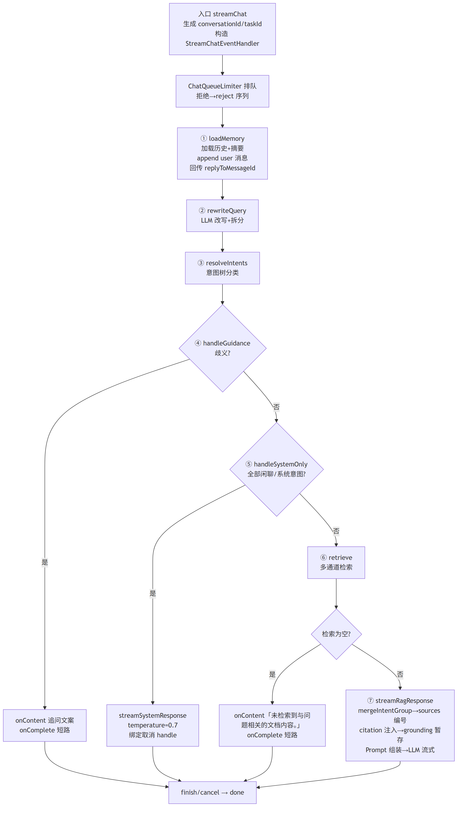
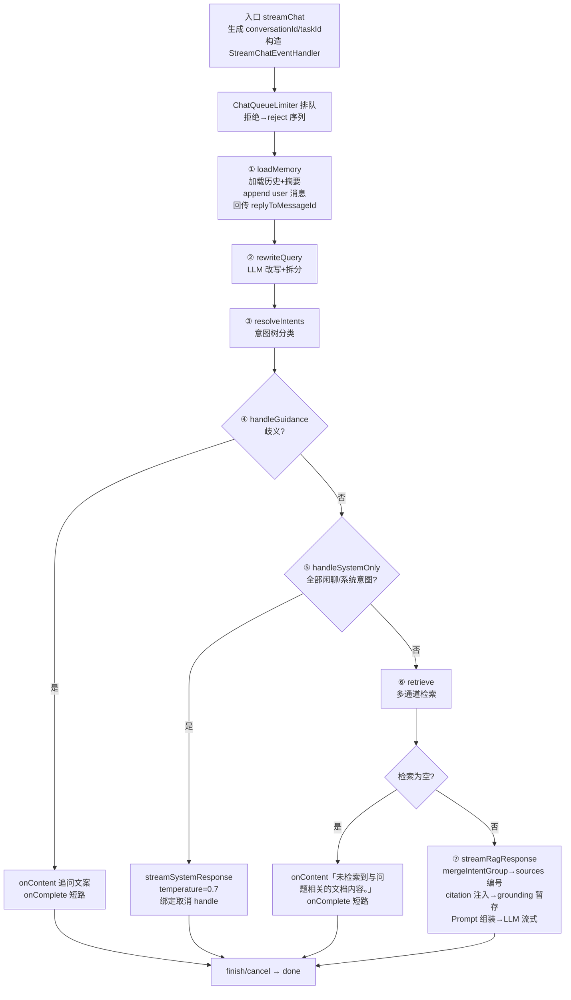
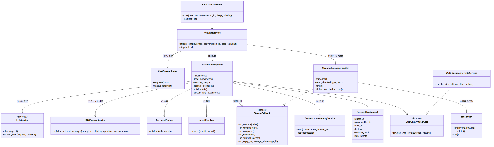
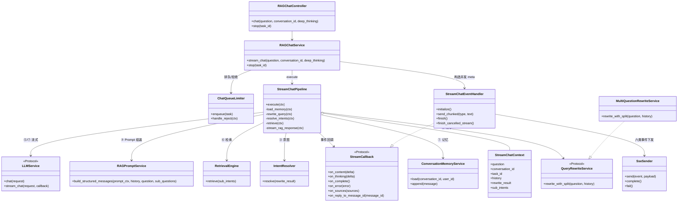
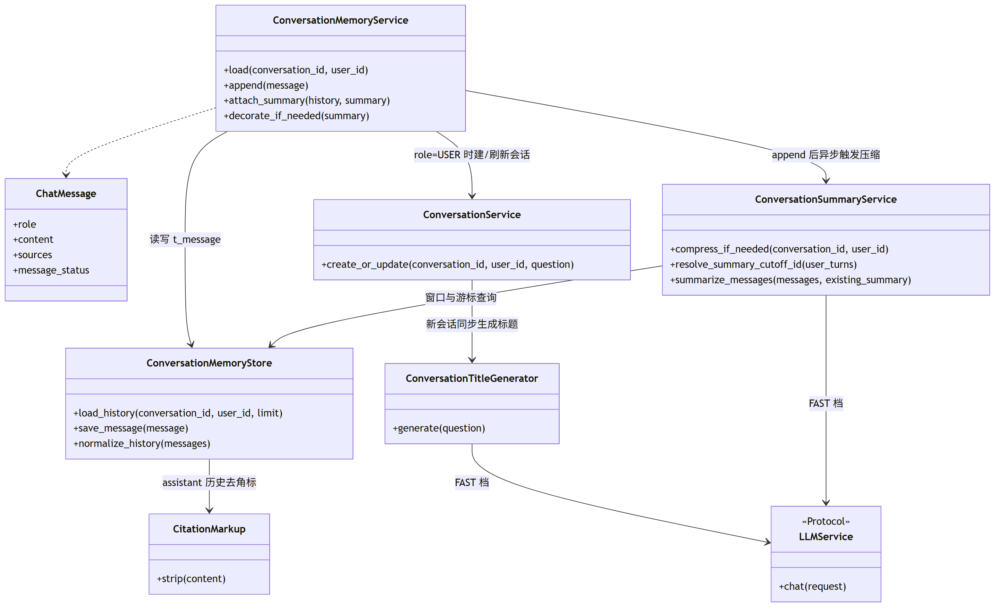
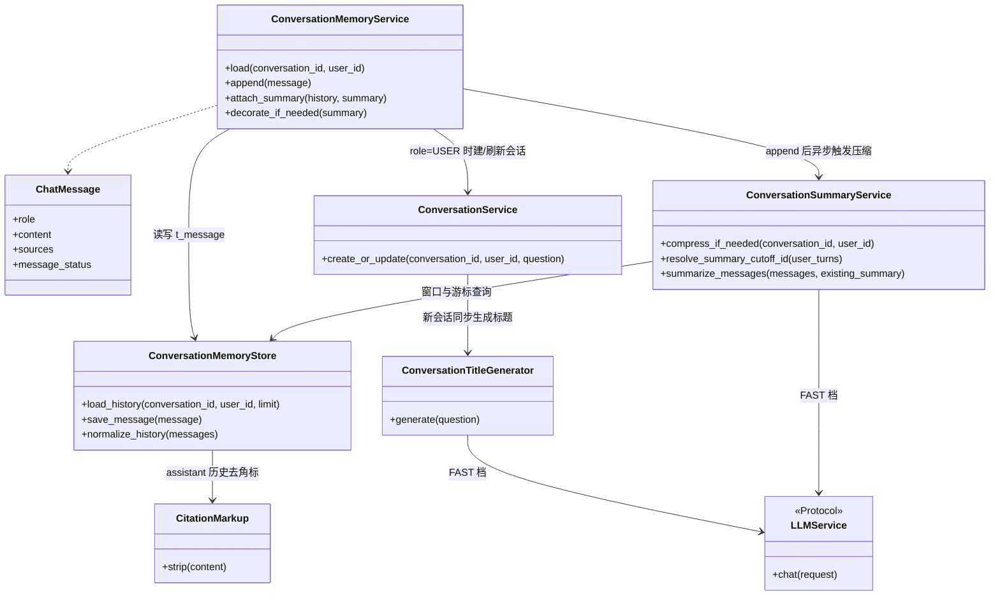
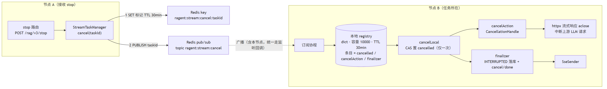
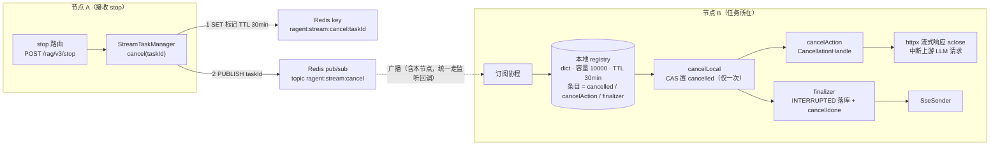
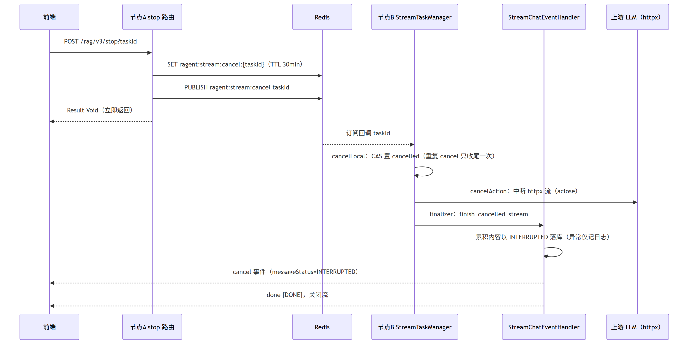
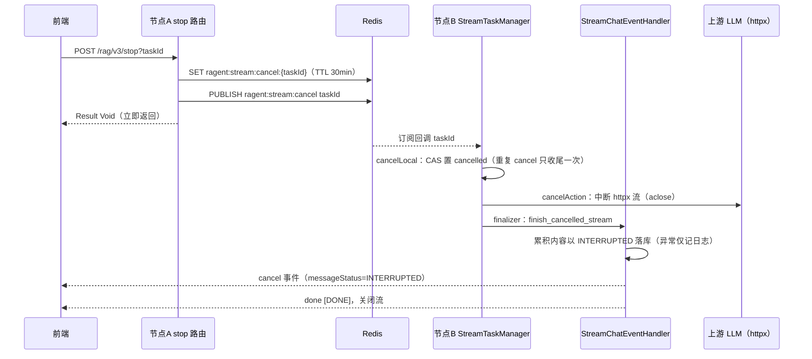

# Ragent — 问答主链路与会话记忆

> 本文覆盖问答主链路编排、SSE 事件协议、会话记忆与摘要、推荐追问、消息反馈、停止取消。
> 检索与意图的内部细节（改写拆分、意图树、多通道检索、RRF/Rerank）见 `02-问题理解与混合检索.md`，本文只定义编排顺序与对外契约。
## 1. 功能清单

| # | 功能 | 要求 |
|---|---|---|
| 1 | SSE 流式问答 | GET 传参、幂等防重、UUIDv7 conversationId/taskId |
| 2 | 主链路七步编排 | 固定步骤顺序与短路语义 |
| 3 | SSE 七事件协议 | 基础 meta/message/finish/cancel/reject/done + 可选 guidance，payload 字段稳定 |
| 4 | message 分块 | 按 code point × `messageChunkSize` 切块，think/response 两类 |
| 5 | 会话记忆加载/追加 | 最近 N 轮（默认 8）、摘要+历史并行加载、摘要插头部 |
| 6 | 会话摘要压缩 | 触发阈值、Redis 锁、半窗重叠、游标、FAST 档 |
| 7 | 会话标题生成 | FAST 档、≤30 字、失败降级「新对话」 |
| 8 | 会话 CRUD + 消息列表 | 列表/重命名/删除/消息列表（含 vote 回填） |
| 9 | 推荐追问 | 独立 POST 触发、3 条、JSON 数组解析、负缓存落库 |
| 10 | 消息反馈 | vote 1/-1、异步持久化、乱序保护、取消即软删 |
| 11 | 停止任务 | taskId 取消、本地 registry + Redis 广播、INTERRUPTED 落库 |
| 12 | 限流拒绝短路 | reject 事件序列 + REJECTED 落库（排队细节见 05 文档） |

## 2. 领域模型与表设计

以下表属于项目独立 PostgreSQL Schema，由启动期 Schema 初始化创建。

### 2.1 `t_conversation`（会话）

| 字段 | 类型 | 说明 |
|---|---|---|
| `id` | BIGINT PK | 自增主键（`GENERATED BY DEFAULT AS IDENTITY`），DB 内部使用 |
| `conversation_id` | UUID | 会话 ID（UUIDv7，对外序列化为字符串），`(conversation_id, user_id)` 唯一 |
| `user_id` | BIGINT | 归属用户（对应 `t_user` 自增主键） |
| `title` | VARCHAR(128) | 会话标题（LLM 生成，≤`title-max-length`） |
| `last_time` | TIMESTAMP | 最近消息时间，列表按此倒序（索引 `idx_user_time(user_id, last_time)`） |
| `create_time` / `update_time` / `deleted` | — | 常规审计与软删（0/1） |

### 2.2 `t_message`（会话消息，注意表名非 t_conversation_message）

| 字段 | 类型 | 说明 |
|---|---|---|
| `id` | UUID PK | 消息 ID（UUIDv7，对外序列化为字符串，SSE meta 前预分配），时间有序可比较，同时作为摘要游标（`last_message_id`）比较基准 |
| `conversation_id` / `user_id` | UUID / BIGINT | 归属 |
| `role` | VARCHAR(16) | `user` / `assistant` |
| `content` | TEXT | 正文；assistant 内容可能含行内引用角标，读回历史时须 `CitationMarkup.strip` |
| `thinking_content` / `thinking_duration` | TEXT / INTEGER | 思考内容与耗时（秒，可为空） |
| `sources` | JSONB | `SourceRef[]`：`{index, docId, docName, sourceType, fileType, url, excerpt}`，null 字段不序列化 |
| `recommended_questions` | JSONB | `string[]`，推荐追问缓存（含空数组负缓存） |
| `retrieved_chunks` | JSONB | `GroundingChunk[]`：`{docName, text}`，供推荐追问 grounding |
| `reply_to_message_id` | UUID | assistant 消息指向对应的 user 消息 |
| `message_status` | VARCHAR(16) | `NORMAL`（默认）/ `INTERRUPTED` / `REJECTED` |
| `create_time` / `update_time` / `deleted` | — | 索引 `idx_conversation_user_time(conversation_id, user_id, create_time)` |

### 2.3 `t_conversation_summary`（会话摘要）

| 字段 | 类型 | 说明 |
|---|---|---|
| `id` | BIGINT PK | 自增主键（`GENERATED BY DEFAULT AS IDENTITY`） |
| `conversation_id` / `user_id` | UUID / BIGINT | 索引 `idx_conv_user(conversation_id, user_id)` |
| `last_message_id` | UUID | 摘要覆盖到的最后一条消息 ID（UUIDv7 游标，时间有序可比较） |
| `content` | TEXT | 摘要正文（≤`summary-max-chars`，单行） |
| `create_time` / `update_time` / `deleted` | — | 最新摘要按时间倒序取首条 |

### 2.4 `t_message_feedback`（消息反馈）

| 字段 | 类型 | 说明 |
|---|---|---|
| `id` | BIGINT PK | 自增主键（`GENERATED BY DEFAULT AS IDENTITY`） |
| `message_id` / `user_id` | UUID / BIGINT | `(message_id, user_id)` 唯一，upsert 冲突键 |
| `conversation_id` | UUID | 冗余便于统计 |
| `vote` | SMALLINT | `1`=赞，`-1`=踩；取消时软删行而非置 0 |
| `reason` / `comment` | VARCHAR(255) / VARCHAR(1024) | 可选 |
| `create_time` / `update_time` / `deleted` | — | 取消反馈即 `deleted=1` |

### 2.5 内存模型

`ChatMessage`（对齐 framework 同名类）：`role(SYSTEM/USER/ASSISTANT)`、`content`、`thinkingContent`、`thinkingDuration`、`sources`、`retrievedChunks`、`replyToMessageId`、`messageStatus(NORMAL/INTERRUPTED/REJECTED)`。`StreamChatContext`：`question/conversationId/taskId/deepThinking/userId/callback` + 管道中间态 `history/rewriteResult/subIntents`。

## 3. 对外 API 契约

统一前缀 `root_path=/api/ragent`，除 SSE 外均为 `Result<T>` 包装（`{code, message, data, requestId}`）。

### 3.1 流式问答

```
GET /rag/v3/chat?question={q}&conversationId={cid?}&deepThinking={bool=false}&intentCodes={codes?}
Accept: text/event-stream;charset=UTF-8
```

- 提交幂等（对齐 `@IdempotentSubmit`）：以 userId 为键 Redis SETNX，同用户上一个请求未释放时拒绝，错误文案「当前会话处理中，请稍后再发起新的对话」；释放时机为请求处理完成。
- `conversationId` 缺省时服务端生成 UUIDv7 开新会话；`taskId` 每次请求生成 UUIDv7。
- `intentCodes` 为 guidance 下一轮可选的逗号分隔 intentCode；管线仅在本轮已分类候选中
  过滤这些 code，不允许客户端凭空扩大知识范围，并跳过重复歧义确认。
- 响应为 SSE 流，事件协议见第 4 节；连接总超时 `rag.default.sse-timeout-ms`（默认 300000ms）。

### 3.2 停止任务

```
POST /rag/v3/stop?taskId={taskId}   → Result<Void>
```

接口只允许停止当前登录用户自己的任务；任务不存在、已完成、重复停止或不属于当前用户时均
幂等返回成功，不泄露任务归属。F3 基线由当前 API 进程的 registry 直接取消；跨副本经 Redis
广播路由到任务所在节点是 M5 生产化增量（见第 9 节）。

### 3.3 会话管理

| 方法/路径 | 请求 | 响应 |
|---|---|---|
| `GET /conversations` | — | `Result<ConversationVO[]>`，`{conversationId, title, lastTime}`，按 `last_time` 倒序 |
| `PUT /conversations/{conversationId}` | `{title}` | `Result<Void>`；title 非空且 ≤`title-max-length`(30)，否则 `ClientException` |
| `DELETE /conversations/{conversationId}` | — | `Result<Void>`；事务内软删会话 + 全部消息 + 全部摘要 |
| `GET /conversations/{conversationId}/messages` | — | `Result<ConversationMessageVO[]>`，ASC |

`ConversationMessageVO`：`{id, conversationId, role, content, thinkingContent, thinkingDuration, vote, sources, recommendedQuestions, messageStatus, createTime}`。`vote` 由 `t_message_feedback` 按当前用户回填（仅 assistant 消息查询，未反馈为 null）；`content` 保留原文（含引用角标，strip 只发生在记忆加载路径）。会话不存在或无权限时返回空数组而非报错。

`lastTime/createTime` 统一返回 Unix epoch milliseconds（13 位毫秒时间戳），由客户端按用户
本地时区格式化。所有查询和写操作的 `userId` 只从登录上下文取得，不接受请求参数覆盖。

### 3.4 消息反馈

```
POST   /conversations/messages/{messageId}/feedback   body: {vote: 1|-1, reason?, comment?}  → Result<Void>
DELETE /conversations/messages/{messageId}/feedback                                         → Result<Void>
```

入口从登录上下文取得 userId，校验本人 assistant 消息、vote ∈ {1,-1}，然后立即返回成功；
持久化走 PG 队列任务，事件键为 `userId:messageId`。同一业务键的新事件会原子替换 active
任务的 eventId/payload；若旧快照已经 running，worker 确认时发现 eventId 已变化便把同一行重新
置 pending，保证快速改票或撤销时最后一次操作不丢失。消费者再以 feedback `update_time`
比较 `submittedAt`，阻止晚到旧事件覆盖新状态。校验失败抛 `ClientException`（如
「反馈值必须为 1 或 -1」）；删除会写一条 `deleted=1, vote=0` 的软删事件。

### 3.5 推荐追问

```
POST /conversations/messages/{messageId}/recommended-questions  → Result<RecommendedQuestionsPayload>
```

`RecommendedQuestionsPayload`：`{status: "SUCCESS"|"EMPTY"|"FAILED", questions: string[]}`。语义：null=未生成（首次调用触发），`EMPTY`=已生成但无合适追问（负缓存），`FAILED`=生成异常（不落库，可重试）。仅允许对本人 assistant 消息调用，否则「消息不存在」；`messageStatus != NORMAL` 的消息直接返回 `EMPTY`。

## 4. SSE 事件协议

七种事件（`SSEEventType`），data 均为 JSON（`done` 除外）。基础六事件保持原有语义，
`guidance` 是仅在歧义命中时出现的向后兼容扩展；服务端同时发送普通 response 文本作为降级。
字段命名保持 camelCase，null 字段不输出（对齐 `@JsonInclude(NON_NULL)`）。

### 4.1 `meta` — 流起始，固定首帧

```json
{"conversationId": "1234567890", "taskId": "1234567891"}
```

发送后立即向 `StreamTaskManager` 注册 taskId 收尾回调（对齐 `StreamChatEventHandler#initialize`）。

### 4.2 `message` — 增量内容

```json
{"type": "think" | "response", "delta": "..."}
```

- `think`：思考链增量；`response`：正文增量。
- 切块算法（对齐 `sendChunked`）：对每个 LLM 原始 chunk，按 **Unicode codePoint**（Python 即按字符迭代，天然等价）累计满 `messageChunkSize`（配置 `ai.stream.message-chunk-size`，代码兜底默认 5，`Math.max(1, …)`）发一帧 `message`，尾部不足一块的残余立即补发。即：不跨 chunk 缓冲，每个上游 chunk 独立切成 N 帧。
- 空/空白 chunk 直接丢弃；任务已取消时静默丢弃。

### 4.3 `guidance` — 结构化歧义选项

```json
{
  "prompt": "请选择更接近你问题的知识范围",
  "originalQuestion": "怎么配置",
  "options": [
    {"id": 1, "intentCode": "product.standard", "label": "产品 > 标准版", "query": "怎么配置（知识范围：产品 > 标准版）"}
  ],
  "allQuery": "怎么配置（知识范围：产品 > 标准版、产品 > 企业版）"
}
```

命中歧义时顺序为 `message(response 文本降级) → guidance → finish → done`。options 为 2–6 项，
每项 query 由服务端生成且不超过 chat 的 4000 字符上限；前端点击后直接以该 query 发起下一轮。
`allQuery` 可选，用于显式检索全部候选范围。guidance 仍以 NORMAL assistant 文本落库，历史回放
不依赖结构化字段也能显示完整编号选项。

### 4.4 `finish` — 正常完成

```json
{"messageId": "…", "title": "…", "sources": [SourceRef…], "messageStatus": "NORMAL"}
```

- `messageId`：assistant 消息落库后的 ID；落库失败则为 null（不阻断下发）。
- `title`：仅当会话此前无标题（新会话首问）时下发当前标题，否则为 null；查不到标题时兜底「新对话」。
- `sources`：来源列表，与消息落库同源同编号。
- 发送顺序：`finish` → `done` → 注销任务 → 关闭流。

### 4.5 `cancel` — 任务被取消

payload 同 `finish`，但 `messageStatus = "INTERRUPTED"`，`messageId` 为已累积内容落库后的 ID（无累积内容则为 null，payload 退化为 `{messageId: null, title: null}` 的 `CompletionPayload`，status 仍为 INTERRUPTED）。序列：`cancel` → `done` → 关闭流。由 `StreamTaskManager` 注册的 finalizer 发出（对齐 `finishCancelledStream`）。

### 4.6 `reject` — 限流拒绝

由限流层发出（对齐 `ChatQueueLimiter#sendRejectEvents`），完整序列：

```
meta {conversationId, taskId}
reject {"type": "response", "delta": "系统繁忙，请稍后再试"}
finish {messageId, title, messageStatus: "REJECTED"}   // sources 为 null
done [DONE]
```

user 问题与 reject 答复均以 `REJECTED` 状态落库（问题 NORMAL），保证消息列表可见。记录失败不阻塞 `done` 下发。排队与拒绝触发条件详见 05 文档。

### 4.7 `done` — 流终止哨兵

```
event: done
data: [DONE]
```

字面量 `[DONE]`，非 JSON。所有结局（正常/取消/拒绝/异常）都必须以 `done` 收尾，前端据此断开。

### 4.8 异常路径

LLM 流中途异常（`onError`）：注销任务后以错误方式关闭连接（对齐 `SseEmitterSender#fail` → `completeWithError`）；Python 侧无等价物，实现为：已取消则静默；否则记录日志并直接关闭流（前端 EventSource 触发 error 重连或放弃），**不补发 finish**。发送器内部维护 closed 原子标志，`complete`/`fail` 幂等。

### 4.9 帧格式示例

```
event: meta
data: {"conversationId":"123","taskId":"456"}

event: message
data: {"type":"think","delta":"用户在"}

event: message
data: {"type":"response","delta":"根据文档"}

event: finish
data: {"messageId":"789","title":"年假计算","sources":[{"index":1,"docId":"d1","docName":"员工手册.pdf","sourceType":"KB","fileType":"pdf"}],"messageStatus":"NORMAL"}

event: done
data: [DONE]
```

## 5. 核心流程：主链路七步编排

主链路采用私有阶段方法 + 短路返回的流水线模式，各 async 阶段按定义顺序 await。





编号步骤与关键参数：

1. **记忆加载**（`loadMemory`）：先 `memoryService.load` 取历史（含摘要），再 `append` user 消息拿到 `questionMessageId`，经 `callback.onReplyToMessageId` 回传 handler。注意顺序——**历史加载在当前问题落库之前**，历史不含本问。
2. **改写拆分**（`rewriteQuery`）：`queryRewriteService.rewriteWithSplit(question, history)` → `RewriteResult{rewrittenQuestion, subQuestions}`。细节见 02 文档。
3. **意图分类**（`resolveIntents`）：`intentResolver.resolve(rewriteResult)` → `List<SubQuestionIntent>`。
4. **歧义追问短路**（`handleGuidance`）：判定需追问时，先 `onContent(完整编号文本)` 保留旧客户端与历史降级，再 `onGuidance(结构化选项)`，最后 `onComplete()` 走完正常 finish 流程（消息以 NORMAL 落库，无 sources）。
5. **闲聊/系统意图短路**（`handleSystemOnly`）：所有子问题 `isSystemOnly` 时，取首个非空节点 `promptTemplate` 作 systemPrompt（缺省用 `AgentPromptSlot.SYSTEM_CHAT` 槽位），消息序列 = system + history + user(改写后问题)，`temperature=0.7, thinking=false` 直接流式；`taskManager.bindHandle` 绑定取消。
6. **多通道检索**（`retrieve`）：`retrievalEngine.retrieve(subIntents)` → `RetrievalContext{kbContext, mcpContext, intentChunks, eligibleIntentIds, hasMcpSuccess, needsClarification, hasMcpFailure}`。**空检索短路**：`onContent("未检索到与问题相关的文档内容。")` + `onComplete()`。
7. **溯源 + Prompt 组装 + 流式**（`streamRagResponse`）：
   - `mergeIntentGroup` 聚合意图用于 prompt 规划；
   - `sourcesAssembler.assemble(intentChunks)` 生成唯一来源编号（同一列表供 finish 事件、来源面板、落库、行内角标），`callback.onSources(sources)` 暂存；
   - `citationContextEnricher.enrich(kbContext, sources)` 注入/清理引用标记（开关关闭时仅清内部 docId）；
   - `groundingChunksAssembler.assemble` 暂存 grounding 片段随消息落库（**不参与 prompt**）；
   - `promptBuilder.buildStructuredMessages(promptContext, history, rewrittenQuestion, subQuestions)` 组装消息；
   - LLM 参数：`thinking=deepThinking`；temperature/topP 由 Agent/Profile 和模型档位统一解析，默认 `0 / 1`，不按 MCP 上下文是否非空切换；`taskManager.bindHandle` 绑定取消。

入口层（`RAGChatServiceImpl#streamChat`）：生成 ID → 构造 handler（发 meta、注册任务）→ `chatQueueLimiter.enqueue`（限流细节见 05）→ `traceRunner.run` 包裹 `pipeline.execute(ctx)`（Trace 见 07）。

### 5.1 主链路协作类图

视角：入口编排（路由 → 服务 → 管道）+ 各阶段协作类 + SSE 事件推送一侧的静态关系；类名与第 11 节模块映射及 02/04 文档一致。





`StreamCallback` 是管道与事件推送之间的协议接口，`StreamChatEventHandler` 实现该协议并经 `SseSender` 输出六类 SSE 事件；`MultiQuestionRewriteService`、`IntentResolver`、`RetrievalEngine`、`RAGPromptService` 的内部结构见 02 文档，`LLMService` 的档位路由与熔断见 04 文档，本图只表达主链路的依赖方向。

## 6. 会话记忆

### 6.1 加载（`DefaultConversationMemoryService#load`）

- 摘要与历史通过 `asyncio.gather` **并行加载**，各自独立降级：摘要失败→null，历史失败→空列表，整体异常→空列表。conversationId/userId 任一为空直接返回空。
- 合并（`attachSummary`）：历史为空→返回空（**摘要不单独返回**）；否则摘要以 `SYSTEM` 角色消息插到历史头部。

### 6.2 历史读取与归一化（`JdbcConversationMemoryStore#loadHistory`）

- 条数上限 = `history-keep-turns`（默认 8）× 2（一轮 = user+assistant 两条），按 `create_time DESC, id DESC` 取最新再翻转为正序。
- 过滤：仅保留 user/assistant 且 content 非空；assistant 内容经 `CitationMarkup.strip` 去除行内引用角标后再入上下文。
- `normalizeHistory`：丢弃列表头部的连续 assistant 消息，保证历史**以 user 消息开头**（截断窗口可能切在半轮中间）；若全为 assistant 则返回空。

### 6.3 追加（`append`）

- 写 `t_message`（role/content/thinking/sources/retrievedChunks/replyToMessageId/messageStatus 全量），返回 messageId。
- role=USER 时创建会话并刷新 `last_time`。当前 F3 基线使用首个问题的前 30 个字符作为确定性标题，后续接入 FAST 档 `ConversationTitleGenerator` 后异步覆盖；生成失败仍保留该标题或「新对话」。
- 追加后调用 `summaryService.compressIfNeeded`（仅 assistant 消息触发，见第 7 节）。

### 6.4 摘要装饰（`decorateIfNeeded`）

摘要进上下文前用 `prompt/context-format.st` 的 `summary-wrapper` 段包装为 SYSTEM 消息：

```
<conversation-summary>
{content}
</conversation-summary>
```

### 6.5 会话记忆类图

视角：记忆加载/追加路径与摘要压缩、标题生成的协作关系；类名与第 11 节模块映射一致。





`ConversationMemoryService`（对齐 `DefaultConversationMemoryService`）只做编排与独立降级，SQL 访问收敛在 `ConversationMemoryStore`（对齐 `JdbcConversationMemoryStore`，SQLAlchemy async 直读 `t_message`）；`ConversationSummaryService`（对齐 `JdbcConversationMemorySummaryService`）承载触发阈值、Redis 锁与半窗重叠游标，算法细节见第 7 节。

## 7. 摘要压缩机制

触发点为 assistant 消息落库后异步执行，可用 `asyncio.create_task` 或 PG 队列任务，**不得阻塞问答链路**。

### 7.1 触发与并发控制

- 开关 `rag.memory.summary-enabled`（代码默认 false，生产 yaml 置 true）；关闭直接返回。
- 触发条件：会话内 **user 消息总数 ≥ `summary-start-turns`（默认 9）**。
- 防重：Redis 锁 `ragent:memory:summary:lock:{userId}:{conversationId}`，`tryLock` 抢不到直接放弃（本次不补），对齐 Redisson `RLock.tryLock()`；Python 用 `SET NX` + 过期或 `redis.lock.Lock(blocking=False)`，finally 释放前校验持锁。
- 参数合法性：`history-keep-turns` 与 `summary-start-turns` ≤0 时不执行；pydantic 启动校验必须保证 `startTurns > keepTurns`。

### 7.2 窗口与游标算法（伪代码）

```
total        = countUserMessages(conv, user)                 # user 消息数
return if total < summaryStartTurns

latestSummary  = findLatestSummary(conv, user)               # 最近一条摘要
latestUserTurns = listLatestUserOnlyMessages(conv, user, historyKeepTurns)  # 最近 N 条 user 消息（DESC）
historyStartId  = latestUserTurns.last.id                    # 当前历史窗口最早一条 user 消息 ID

afterId = latestSummary?.lastMessageId
       ?? findMaxMessageIdAtOrBefore(conv, user, latestSummary.updateTime ?? createTime)  # 老数据无游标时按时间回推
       ?? null
return if afterId != null and afterId >= historyStartId      # 摘要已覆盖到窗口内，无需再压

# 重叠设计：cutoff 取窗口中位 → 摘要覆盖约一半原文窗口，重叠滑出后才再次触发
summaryCutoffId = latestUserTurns[(len-1) // 2].id
toSummarize = listMessagesBetweenIds(conv, user, afterId, summaryCutoffId)  # (afterId, cutoffId] 区间全部消息
return if empty
lastMessageId = max(toSummarize.id)                          # 新游标
summary = summarizeMessages(toSummarize, latestSummary?.content ?? "")
insert t_conversation_summary(content=summary, last_message_id=lastMessageId)
```

要点：游标基于消息 ID（UUIDv7，时间有序可比较）；`afterId >= historyStartId` 即跳过，保证摘要与滚动历史窗口衔接、约一半重叠。

### 7.3 摘要 LLM 调用

- 档位：**FAST**（`Tier.FAST`）；参数 `temperature=0.3, topP=0.9, thinking=false`。
- 消息结构（`AgentPromptSlot.CONVERSATION_SUMMARY` 槽位渲染，注入 `summary_max_chars`）：

```
system: {摘要生成 prompt 模板}
assistant: 历史摘要（仅用于合并去重，不得作为事实新增来源；若与本轮对话冲突，以本轮对话为准）：\n{existingSummary}   # 仅当已有摘要
user/assistant...: 待压缩消息原文（assistant 内容先 strip 引用角标）
user: 合并以上对话与历史摘要，去重后输出更新摘要。要求：严格≤{summaryMaxChars}字符；仅一行。
```

- `summary-max-chars` 代码默认 **200**（生产 yaml 示例为 400），约束区间 [200, 1000]。
- LLM 异常：返回 existingSummary（**不写库**，本次放弃）；结果为空同样放弃。整条 doCompress 路径任何异常仅记日志，绝不影响主链路。

## 8. 推荐追问

对齐 `RecommendedQuestionServiceImpl` + `RecommendedQuestionGenerator`。POST 接口按需触发，不占 chat 流式路径。

F3 实现采用页面显式触发，不在回答完成后自动消耗 FAST 模型额度；生成中、空结果和失败均有
独立 UI 状态，FAILED 不缓存并保留重试入口。

1. 加载本人 assistant 消息（含归属校验）；`messageStatus != NORMAL` → 返回 `EMPTY`。
2. `recommended_questions` 字段非 null → 直接返回缓存（含空数组负缓存）。
3. 取 `replyToMessageId` 指向的 user 消息作 question；调用 LLM 生成：
   - 档位 FAST；`temperature=0.7, topP=0.8, maxTokens=256, thinking=false`；默认生成 **3** 条。
   - 输入预算（模型边界统一截断）：question ≤1000 字符、answer ≤6000 字符（先 strip 引用角标）、grounding chunks 拼接 ≤6000 字符（逐条 `N. 【docName】text`，超预算截断），无片段时注入「（无检索片段，仅依据问答生成）」。
4. 解析：去 markdown 代码围栏 → JSON 数组 → trim/去空/去重（保序）/单条 ≤200 字符 → 截取前 3 条；解析失败或原文为空 → `FAILED`；数组有效但全空 → `EMPTY`。
5. **SUCCESS 与 EMPTY 都落库** `t_message.recommended_questions`（空数组作为有效负缓存）；FAILED 不落库允许重试。生成器整体 try-catch，异常返回 FAILED。
6. Trace：生成调用挂 `recommended-question-gen`/`RECOMMEND_GEN` 节点，保留独立函数与 trace 装饰器。

## 9. 停止与取消

### 9.1 取消协议（`StreamTaskManager` → `app/framework/stream_tasks.py`）

- **F3 已实现**：进程内 dict registry，容量 10000，条目 TTL 30 分钟；每条目 =
  `{userId, cancelled, cancelAction?, finalizer}`。`cancel(taskId, userId)` 校验归属并在条目锁内
  幂等置位，然后先执行 `cancelAction`（中断上游 LLM 流），再执行 `finalizer`（补发终态）。
- **F3 竞态兜底**：停止早于模型 handle 绑定时，后续 `bindCancel` 立即回放取消动作；正常完成
  调 `unregister(taskId)`，取消条目保留到 TTL，重复停止不会再次收尾。
- `isCancelled` 检查贯穿 handler 所有回调（onContent/onThinking/onComplete/onSources/onGroundingChunks），已取消一律静默丢弃。
- **M5 目标**：增加 Redis 标记 `ragent:stream:cancel:{taskId}`（TTL 30 分钟）及 topic
  `ragent:stream:cancel`。stop 先 SET 再 PUBLISH，各节点订阅后调用本地取消；注册和绑定时查询
  Redis 标记以回放跨节点早停。下方组件图与时序图描述这一生产化目标。

### 9.2 取消收尾（INTERRUPTED 落库）

finalizer（对齐 `finishCancelledStream`）执行：

1. 若已累积 answer 非空：以 `messageStatus=INTERRUPTED` 落库 assistant 消息（含 thinking/thinkingDuration/sources/groundingChunks/replyToMessageId），拿到 messageId；落库异常仅记日志。
2. 发 `cancel` 事件（payload 同 finish，status=INTERRUPTED，title 规则同 4.4）。
3. 发 `done [DONE]`，关闭流。注意 finalizer 路径**不调 unregister**（Redis 标记留待 TTL 过期，避免重复取消风暴下的状态抖动）。

### 9.2.1 取消组件关系

视角：stop 请求如何经 Redis 标记 + 广播路由到任务所在节点，并经 `CancellationHandle` 中断 httpx 上游流。





要点：`StreamTaskManager.cancel` 不直接调本地取消，本节点同样经 pub/sub 监听回调收口，保证跨节点与本地路径一致；`CancellationHandle` 由 `bindHandle` 在 LLM 流式调用启动时绑定，封装对该 httpx 响应流的关闭动作；`register`/`bindHandle` 时先查 Redis 标记做竞态回放。

### 9.2.2 取消时序





### 9.3 思考计时

`thinkingStartMs` 在首个 think chunk 时打点，首个 response chunk 到达时结算 `thinkingDuration = max(1, round(秒))`，随消息落库；无 response 时为 null（对齐 `resolveThinkingDuration`）。

## 10. 关键算法与默认参数汇总

| 参数 | 配置键 | 默认值 | 出处 |
|---|---|---|---|
| 历史保留轮数 | `rag.memory.history-keep-turns` | 8（读取条数 ×2） | `MemoryProperties` |
| 摘要开关 | `rag.memory.summary-enabled` | false（代码）/ true（yaml） | 同上 |
| 摘要触发阈值（user 消息数） | `rag.memory.summary-start-turns` | 9，须 > keep-turns | 同上 |
| 摘要最大字符 | `rag.memory.summary-max-chars` | 200（yaml 示例 400），∈[200,1000] | 同上 |
| 会话标题最大长度 | `rag.memory.title-max-length` | 30，∈[10,100] | 同上 |
| 摘要窗口重叠 | — | cutoff = 最近 N 条 user 消息的中位（`(len-1)//2`），约半窗重叠 | `resolveSummaryCutoffId` |
| message 切块大小 | `ai.stream.message-chunk-size` | 5（代码兜底，yaml 示例 1），下限 1，按 codePoint | `StreamChatEventHandler` |
| SSE 总超时 | `rag.default.sse-timeout-ms` | 300000 | `RAGDefaultProperties` |
| 闲聊短路 LLM 参数 | — | temperature=0.7, thinking=false | `streamSystemResponse` |
| RAG 应答 LLM 参数 | — | 默认 temperature=0, topP=1；Agent/Profile 可覆盖，MCP 状态不隐式切换 | `streamLLMResponse` |
| 摘要 LLM 参数 | — | FAST 档，temperature=0.3, topP=0.9 | `summarizeMessages` |
| 标题 LLM 参数 | — | FAST 档，temperature=0.7, topP=0.3 | `ConversationTitleGenerator` |
| 推荐追问 | — | 3 条；FAST 档；temperature=0.7, topP=0.8, maxTokens=256；输入截断 1000/6000/6000；单条 ≤200 | `RecommendedQuestionGenerator` |
| 取消标记 TTL / registry | — | 30 分钟 / 10000 条 | `StreamTaskManager` |
| 空检索短路文案 | — | 「未检索到与问题相关的文档内容。」 | `handleEmptyRetrieval` |
| 限流拒绝文案 | — | 「系统繁忙，请稍后再试」 | `ChatQueueLimiter` |
| Redis key | — | `ragent:memory:summary:lock:{userId}:{conversationId}`；`ragent:stream:cancel[:{taskId}]` | — |

## 11. 模块与类落点

落到 00 文档目录结构：

| 位置 | 类/函数 |
|---|---|
| `app/rag/pipeline/stream_chat.py` | `StreamChatPipeline` / `StreamChatContext` |
| `app/rag/pipeline/event_handler.py` | `StreamChatEventHandler`（含 `send_chunked`、cancel finalizer） |
| `app/framework/sse.py` | `SseSender`、事件枚举与 payload 模型（MetaPayload/MessageDelta/CompletionPayload/RecommendedQuestionsPayload） |
| `app/framework/stream_tasks.py` | `StreamTaskManager`（F3 进程内 registry；M5 增加 Redis SET/pub-sub） |
| `app/framework/idempotency.py` | `@idempotent_submit` 装饰器 |
| `app/rag/router.py` | chat/stop/conversations/feedback/recommended-questions 路由 |
| `app/rag/service.py` | `RAGChatService`（流式入口编排） |
| `app/rag/conversation.py` | `ConversationService`（会话列表、消息历史、重命名、软删除） |
| `app/rag/memory/service.py` | `ConversationMemoryService`（并行加载、attachSummary） |
| `app/rag/memory/store.py` | `ConversationMemoryStore`（SQLAlchemy async 直读 `t_message`） |
| `app/rag/memory/summary.py` | `ConversationSummaryService`（触发/锁/窗口/LLM 摘要） |
| `app/rag/memory/title.py` | `ConversationTitleGenerator` |
| `app/rag/feedback.py` | `MessageFeedbackService`（入口校验 + PG 队列任务） |
| `app/rag/recommend.py` | `RecommendedQuestionService` / `RecommendedQuestionGenerator` |
| `app/worker.py` | PG 队列 worker（`python -m app.worker`）任务：`message_feedback_persist` |
| `app/rag/models.py` | `Conversation/Message/ConversationSummary/MessageFeedback` ORM |
| `config/prompts/` | `conversation-title.st`、`context-format.st`（含 summary-wrapper） |

依赖注入用 FastAPI `Depends` + lifespan 装配单例；并发任务统一由 asyncio 事件循环调度。

## 12. 配置项清单

`config/application.yaml` 对应段（pydantic-settings 强类型，启动校验）：

```yaml
rag:
  default:
    sse-timeout-ms: 300000
  memory:
    history-keep-turns: 8        # [1,100]
    summary-enabled: true
    summary-start-turns: 9       # 启动校验：> history-keep-turns
    summary-max-chars: 200       # [200,1000]
    title-max-length: 30         # [10,100]
ai:
  stream:
    message-chunk-size: 1        # 代码兜底 5；建议 yaml 显式声明
```

启动校验（对齐 `MemoryConfigValidator`/`@ValidMemoryConfig`）：`summary-start-turns > history-keep-turns` 且区间合法，违反即启动失败。

## 13. 异常与降级策略

| 场景 | 策略 |
|---|---|
| 记忆加载异常 | 摘要→null、历史→空、整体→空列表；仅记日志，问答继续 |
| 摘要生成失败 | 返回旧摘要不写库；锁内任何异常仅记日志；`tryLock` 失败直接放弃 |
| 标题生成失败 | 兜底「新对话」；rename 校验失败抛 `ClientException` |
| assistant 消息落库失败（onComplete） | messageId 置 null 仍发 finish/done，不阻断流 |
| 取消时落库失败 | 仅记日志，cancel/done 照常发 |
| LLM 流异常 | 注销任务、关闭连接，不补 finish；已取消则静默 |
| 检索为空 | 固定文案短路，NORMAL 落库，无 sources |
| 反馈消费乱序 | upsert `WHERE update_time < excluded.update_time`（PG `ON CONFLICT (message_id,user_id)`），晚到旧事件不覆盖；取消反馈即软删（`deleted=1`，vote 占位 0） |
| 反馈/推荐追问越权 | 按 `user_id` 归属过滤，查不到即「消息不存在」，不泄露存在性 |
| 推荐追问 LLM 失败 | 返回 FAILED 不落库（可重试）；SUCCESS/EMPTY 均落库负缓存 |
| SSE 发送失败 | sender closed 原子标志，后续发送静默丢弃；complete/fail 幂等 |

## 14. 测试要点

1. **SSE 协议**：七事件顺序与 payload 快照测试（正常/取消/拒绝/空检索/歧义/闲聊六种结局）；`done` 必达；null 字段不序列化。
2. **切块算法**：codePoint 边界（含 emoji/代理对）、chunkSize=1 与 >chunk 长度、空 chunk 丢弃、不跨上游 chunk 缓冲。
3. **取消竞态**：cancel 先于 register 到达（Redis 标记回放）；cancel 在 bindHandle 之前/之后；重复 cancel 只收尾一次；跨节点广播（两个进程 + 真实 Redis）。
4. **INTERRUPTED 落库**：累积内容非空/为空两路；落库后 messageId 进入 cancel payload。
5. **记忆**：摘要+历史并行加载的独立降级；`attachSummary` 历史为空时摘要不返回；`normalizeHistory` 头部 assistant 裁剪；CitationMarkup.strip 只作用于 assistant 历史。
6. **摘要**：阈值 9 边界（8 不触发/9 触发）；`afterId >= historyStartId` 跳过；中位 cutoff 窗口计算；锁抢占失败放弃；LLM 失败不写库；游标 `last_message_id` 推进；老数据无游标时按时间回推。
7. **反馈**：vote 校验 1/-1；upsert 乱序保护（旧 submitTime 不覆盖）；取消后 `getUserVotes` 不再返回；PG 队列任务消费幂等。
8. **推荐追问**：缓存命中不再调 LLM；空数组负缓存；FAILED 不落库；INTERRUPTED/REJECTED 消息返回 EMPTY；解析（围栏/去重/截断/前 3 条）。
9. **会话**：rename 长度边界 30/31；删除级联软删三表；消息列表 vote 回填与 ASC 排序；越权返回空数组。
10. **契约回归**：用版本化的前端协议样本做回放对比（字段名、事件名、文案逐字节一致）。
