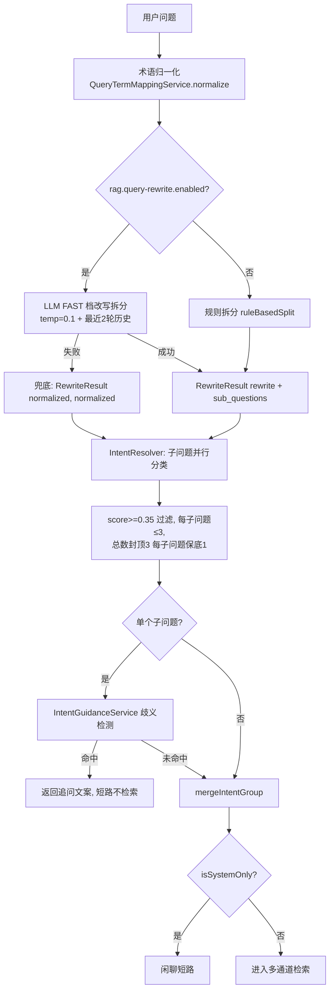
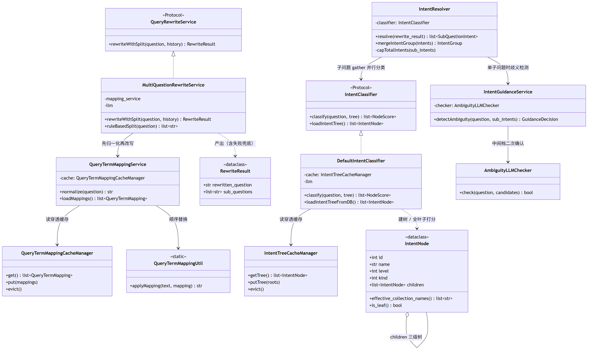
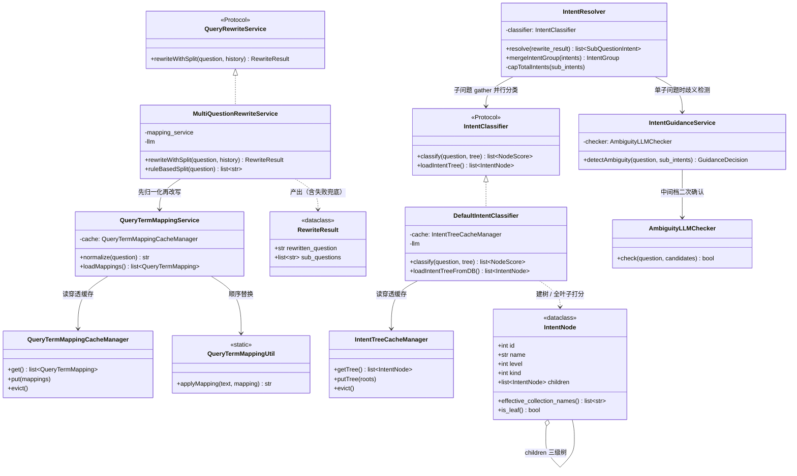
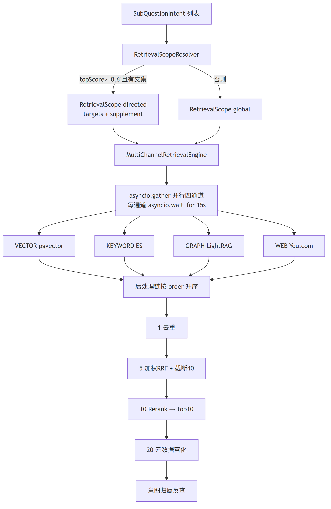
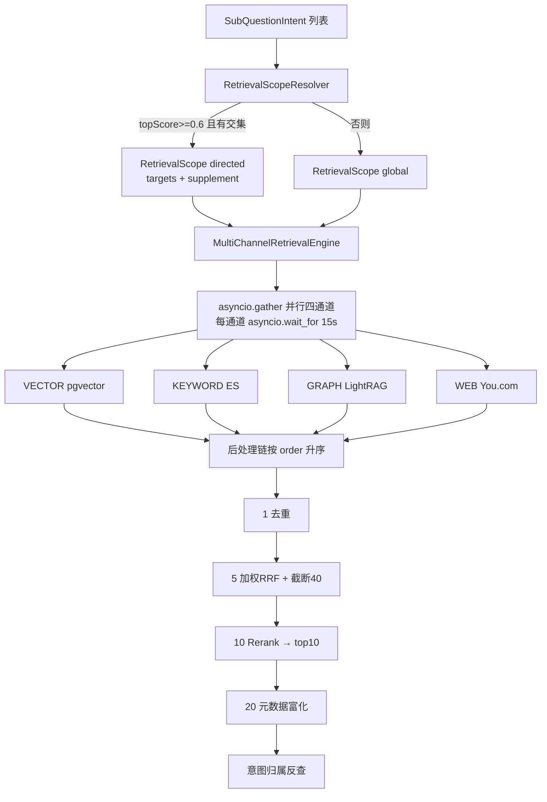
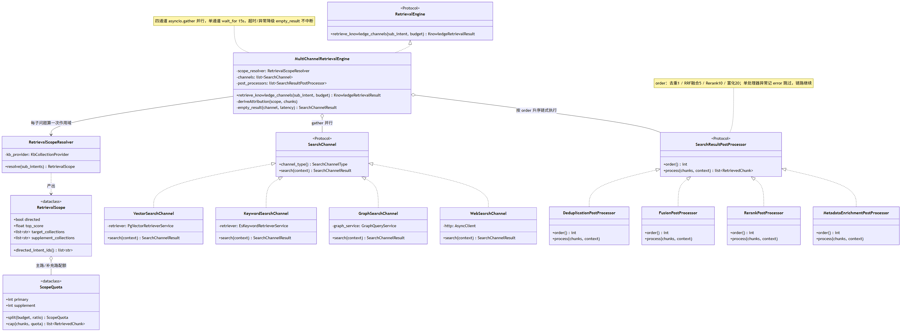
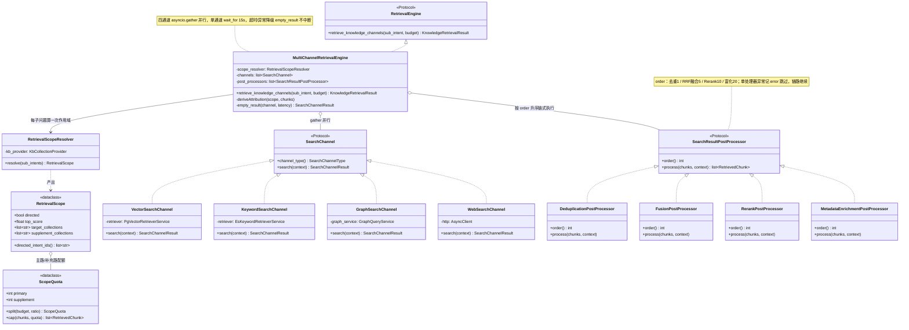
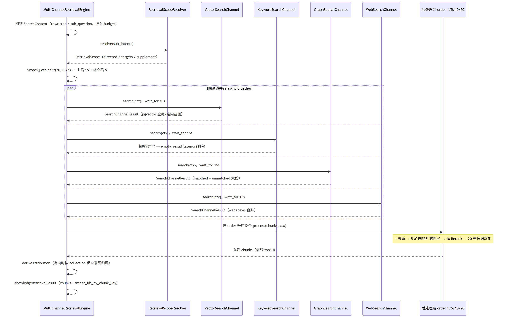
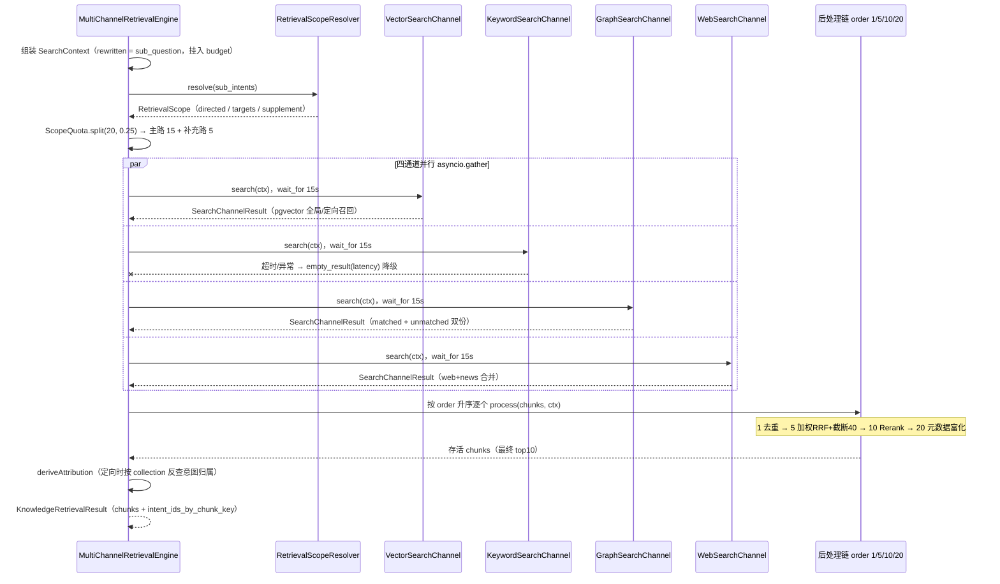

# Ragent — 问题理解与混合检索

> 本文覆盖问答链路的中段：查询词映射 → 改写拆分 → 意图树分类 → 歧义引导 → 多库路由 → 四通道并行检索 → 后处理链（去重/RRF/截断/Rerank/富化）→ 溯源装配。
> 各阶段的对外契约、降级策略与默认值以本文为实现和验收基线。
> 前置文档：`00-总体架构与技术选型.md`（目录结构、配置体系、模型档位）；`01-问答主链路与会话记忆.md`（StreamChatPipeline 上下文、SSE 协议）；`04-模型接入层.md`（Tier 路由、Rerank 候选 fallback）。

## 1. 功能清单

### 问题理解

- [x] 查询词映射：`t_query_term_mapping` 表 + Redis 缓存（key `ragent:query-term:mappings`，TTL 7 天，空列表也缓存）
- [x] 映射加载：仅 `enabled=1`，按 priority 降序（null 最前）、再按 `sourceTerm` 长度降序（对齐 `QueryTermMappingService.loadMappings` 实际行为，见 §9 注意事项）
- [x] 顺序替换算法 `QueryTermMappingUtil.applyMapping`：仅应用 `matchType=1`（精确）规则；命中位置已是 target 开头则跳过防重复替换
- [x] `/mappings` CRUD 五个端点，写操作清缓存
- [x] 改写拆分：术语归一化 → LLM FAST 档（temperature=0.1, topP=0.3, thinking=false）+ 最近 2 轮（4 条）USER/ASSISTANT 历史 → 输出 `{"rewrite", "sub_questions":[]}`
- [x] 失败兜底：模型调用或解析失败时使用确定性规则拆分（正则 `[?？。；;\n]+`，段尾补 `？`）
- [x] 意图树：`t_intent_node` 三级 DOMAIN(0)→CATEGORY(1)→TOPIC(2)，`kind` KB(0)/SYSTEM(1)/MCP(2)，Redis 缓存（key `ragent:intent:tree`，TTL 7 天）
- [x] 单 Prompt 全叶子打分：STANDARD 档，输出 `[{"id","score","reason"}]`，未知 id 跳过，按 score 降序
- [x] `INTENT_MIN_SCORE=0.35` 过滤、`MAX_INTENT_COUNT=3` 封顶、每子问题保底 1 个最高分意图（`IntentResolver.capTotalIntents`）
- [x] 子问题并行分类（asyncio.gather，子问题异常降级空意图）
- [x] 意图分流：MCP（kind=MCP 且 mcpToolId 非空）/ KB / SYSTEM；`isSystemOnly` 短路
- [x] 歧义引导 `IntentGuidanceService`：ratio 阈值 + FAST 档 LLM 二次确认，异常时保守追问
- [x] 意图树 REST：`/intent-tree/trees`、CRUD、批量 enable/disable/delete

### 混合检索

- [x] 检索漏斗预算 `RetrievalBudget(20, 40, 10)`：召回 20 → Rerank 候选 40 → 进上下文 10，启动校验单调性
- [x] 多库路由 `RetrievalScopeResolver`：KB 意图按 `minIntentScore=0.4` 过滤 → 最高分 ≥ `confidenceThreshold=0.6` 收窄到 `collectionNames`（与有效库求交），否则全局
- [x] 补充路 `ScopeQuota`：`supplement-ratio=0.25`，默认 20 → 主路 15 + 补充路 5
- [ ] 四通道并行，通道级超时 `timeout-ms=15000`，超时/异常降级空结果不中断
- [x] 向量通道：pgvector HNSW（`ef_search=200`、`iterative_scan=relaxed_order`），`<=>` 余弦距离，score = 1 - 距离，单 SQL `collection_name IN (...)` 全局召回
- [ ] 关键词通道：ES 共享索引 `rag_keyword_store`，BM25 `match(content)` + `terms(collection_name)` 过滤，写入 `ik_max_word` / 查询 `ik_smart`，`_id=chunkId` 跨模态对齐
- [ ] 图谱通道：LightRAG `POST /query`，`mode=hybrid`、`only_need_context=true`、`include_references=true`、`include_chunk_content=true`，定向 topK = 预算 × 3（`FILTER_TOPK_BOOST`），matched/unmatched 双份，score = 1/(rank+1)
- [ ] Web 通道：You.com `GET https://ydc-index.io/v1/search`，web+news 合并截断 count=5（上限 20），中性分数 1/(rank+1)，任何失败空结果
- [x] 后处理链：去重（order=1）→ 加权 RRF（order=5，k=20，权重 vector 1.0/keyword 1.0/graph 0.8/web 0.5，单通道跳过融合仅截断）→ 截断 40 → Rerank（order=10，qwen3-rerank，最终 top10）→ 元数据富化（order=20）
- [x] 溯源装配 `SourcesAssembler`：docId 归并取最高分 → 降序 → 从 1 统一编号；`CitationContextEnricher` 把 `data-ragent-doc-id` 改写为 `ref="N"`；正文角标 `[N](#cite-N)`（`CitationMarkup`）

## 2. 领域模型与表设计

### 2.1 沿用表（schema_pg.sql，不改动）

**`t_query_term_mapping`** — 关键词归一化映射表（`schema_pg.sql:327`）

| 字段 | 类型 | 说明 |
|---|---|---|
| id | BIGINT PK | 自增主键（`GENERATED BY DEFAULT AS IDENTITY`） |
| domain | VARCHAR(64) | 领域（预留，当前不过滤） |
| source_term / target_term | VARCHAR(128) NOT NULL | 源词 / 目标词 |
| match_type | SMALLINT DEFAULT 1 | 1 精确 / 2 前缀 / 3 正则 / 4 整词；**归一化仅应用 1** |
| priority | INTEGER DEFAULT 100 | 优先级 |
| enabled / deleted | SMALLINT | 1 启用 / 0 删除 |
| remark | VARCHAR(255) | |
| create_by/update_by/create_time/update_time | 审计字段 | |

索引：`idx_domain(domain)`、`idx_source(source_term)`。

**`t_intent_node`** — 意图树节点配置表（`schema_pg.sql:300`）

| 字段 | 类型 | 说明 |
|---|---|---|
| id | BIGINT PK | 自增主键（`GENERATED BY DEFAULT AS IDENTITY`） |
| kb_id | BIGINT | 所属知识库（对应 `t_knowledge_base` 自增主键） |
| intent_code | VARCHAR(64) NOT NULL | 业务唯一标识（建树 key） |
| name / description | VARCHAR(64) / VARCHAR(512) | 展示名 / 语义描述（打分依据） |
| level | SMALLINT | 0 DOMAIN / 1 CATEGORY / 2 TOPIC |
| parent_code | VARCHAR(64) | 父节点标识 |
| examples | TEXT | JSON 数组字符串，示例问题 |
| collection_name | VARCHAR(128) | 旧单值字段，兼容兜底 |
| collection_names | JSONB DEFAULT '[]' | KB 意图绑定的逻辑 Collection 集合 |
| top_k | INTEGER | 节点级检索深度，空回退全局 `recall-budget` |
| mcp_tool_id | VARCHAR(128) | MCP 工具 ID |
| kind | SMALLINT DEFAULT 0 | 0 KB / 1 SYSTEM / 2 MCP |
| prompt_snippet / prompt_template | TEXT | 上下文 `<rules>` 片段 / 单意图场景答题模板 |
| param_prompt_template | TEXT | MCP 参数提取模板（专属） |
| sort_order / enabled / deleted + 审计字段 | | |

**`t_knowledge_vector`** — 向量 chunk 表（`schema_pg.sql:511`，pgvector）

```sql
CREATE TABLE t_knowledge_vector (
    id              UUID PRIMARY KEY,          -- 分块ID（UUIDv7，接口序列化为字符串），与 ES _id、向量库主键对齐
    collection_name VARCHAR(64) NOT NULL,
    content         TEXT,
    metadata        JSONB,                     -- chunk.metadata + doc_id + chunk_index
    embedding       vector(1536)
);
CREATE INDEX idx_kv_collection_name ON t_knowledge_vector (collection_name);
CREATE INDEX idx_kv_metadata ON t_knowledge_vector USING gin(metadata);
CREATE INDEX idx_kv_embedding ON t_knowledge_vector USING hnsw (embedding vector_cosine_ops);
```

### 2.2 内存模型（Python dataclass / Pydantic）

| Python 类型 | 职责 | 关键字段 |
|---|---|---|
| `QueryTermMapping` | 术语映射 | id, source_term, target_term, match_type, priority, enabled |
| `RewriteResult` | 问题改写结果 | `rewritten_question: str`, `sub_questions: list[str]` |
| `IntentNode` | 意图树节点 | id, kb_id, name, description, level, parent_id, examples, children, full_path, kind, collection_names, mcp_tool_id, top_k, prompt_snippet, prompt_template, param_prompt_template；方法 `effective_collection_names()`（去空白去重，空回退 collection_name）、`is_leaf()` |
| `NodeScore` | 节点评分 | node, score |
| `SubQuestionIntent` | 子问题意图 | sub_question, node_scores |
| `IntentGroup` | 意图分组 | mcp_intents, kb_intents |
| `GuidanceDecision` | 引导决策 | action: NONE\|PROMPT, prompt |
| `RetrievalBudget` | 检索预算 | recall_budget=20, candidate_limit=40, context_top_k=10 |
| `RetrievalScope` | 检索范围 | directed, top_score, intents, target_collections, supplement_collections；`directed_intent_ids()` |
| `ScopeQuota` | 主路与补充路配额 | primary, supplement；`split()` / `cap()` |
| `RetrievedChunk` | 召回分块 | id, text, score, collection_name, doc_id, chunk_index, doc_name；`BY_SCORE_DESC`（None/非有限分沉底） |
| `SearchContext` | 检索上下文 | original_question, rewritten_question, sub_questions, intents, budget, retrieval_scope, metadata；`main_question` 优先 rewritten |
| `SearchChannelResult` | 通道结果 | channel_type, channel_name, chunks, latency_ms, metadata |
| `KnowledgeRetrievalResult` | 聚合结果 | chunks, intent_ids_by_chunk_key, directed_intent_ids；`retrieved_intent_ids()`、`eligible_intent_ids()`、`group_by_intent()` |
| `SourceRef` | 溯源引用 | index, doc_id, doc_name, source_type, file_type, url, excerpt（≤100 字符） |

Redis key 一览：

| Key | 内容 | TTL |
|---|---|---|
| `ragent:query-term:mappings` | 映射列表 JSON（含空列表） | 7 天 |
| `ragent:intent:tree` | 意图树根节点列表 JSON | 7 天 |

## 3. 对外 API 契约（保持兼容）

全部挂 `root_path=/api/ragent` 之下，响应统一 `Result<T>` 包装（`{code, message, data, requestId}`）。

### 3.1 查询词映射 `QueryTermMappingController`

| 方法 | 路径 | 请求 | 响应 data |
|---|---|---|---|
| GET | `/mappings` | query：`current`, `size`, `keyword`（匹配 source/target term） | `IPage<QueryTermMappingVO>`：`{records:[...], total, current, size}` |
| GET | `/mappings/{id}` | — | `QueryTermMappingVO` |
| POST | `/mappings` | `{sourceTerm, targetTerm, matchType, priority, enabled, remark}` | `String`（新 id） |
| PUT | `/mappings/{id}` | 同 POST 体 | `null` |
| DELETE | `/mappings/{id}` | — | `null` |

`QueryTermMappingVO`：`{id, sourceTerm, targetTerm, matchType, priority, enabled, remark, createTime, updateTime}`。所有写操作成功后删除 Redis key `ragent:query-term:mappings`。

### 3.2 意图树 `IntentTreeController`

| 方法 | 路径 | 请求 | 响应 data |
|---|---|---|---|
| GET | `/intent-tree/trees` | — | `List<IntentNodeTreeVO>`（树形嵌套 children） |
| POST | `/intent-tree` | `{kbId, collectionNames, intentCode, name, level, parentCode, description, examples, mcpToolId, topK, kind, sortOrder, enabled, promptSnippet, promptTemplate, paramPromptTemplate}` | `String`（新 id） |
| PUT | `/intent-tree/{id}` | `IntentNodeUpdateRequest`（**无 kbId/intentCode/mcpToolId**，含 collectionName + collectionNames） | `null` |
| DELETE | `/intent-tree/{id}` | — | `null` |
| POST | `/intent-tree/batch/enable` `/batch/disable` `/batch/delete` | `{ids: [String]}` | `null` |

`IntentNodeTreeVO`：`{id, intentCode, name, level, parentCode, description, examples(String), collectionName, collectionNames, topK, kind, sortOrder, enabled, mcpToolId, promptSnippet, promptTemplate, paramPromptTemplate, children}`。写操作清 `ragent:intent:tree` 缓存。

## 4. 核心流程

### 4.1 问题理解总流程




### 4.2 改写拆分（`MultiQuestionRewriteService.rewriteWithSplit`）

1. `queryTermMappingService.normalize(question)`：从缓存取映射，按排序顺序逐条 `applyMapping`。
2. 历史截取：仅 USER/ASSISTANT 角色，最多最近 **4 条（2 轮）**，system 摘要过滤。
3. 消息组装：`system = user-question-rewrite.st`（整体加载，无模板变量）+ 历史 + `user = 归一化后问题`。
4. 调用 `llm.chat(req, Tier.FAST)`，`temperature=0.1, topP=0.3, thinking=false`。
5. 解析：`stripMarkdownCodeFence` 去 ```` ``` ```` 围栏 → JSON 解析；取 `rewrite`、`sub_questions`（**忽略 `should_split`**）；`rewrite` 空白 → 返回 null；`sub_questions` 空 → `[rewrite]`。
6. 任何异常 → `RewriteResult(normalized, [normalized])`，不跨档升级。
7. 开关关闭时规则拆分：

```python
parts = [p.strip() for p in re.split(r'[?？。；;\n]+', question) if p.strip()]
for p in parts:
    if not p.endswith(('?', '？')): p += '？'
return parts or [question]
```

### 4.3 意图分类（`DefaultIntentClassifier` + `IntentResolver`）

**建树（读穿透缓存）**：每次 classify 先读 Redis `ragent:intent:tree`，miss 则查 `t_intent_node WHERE deleted=0 AND enabled=1` 全量，两遍组装（`intent_code→id`、`parent_code→parent_id`，父缺失的节点当根），递归 `fillFullPath`（`parent.fullPath + " > " + name`），回填缓存。

**打分（单 Prompt 全叶子）**：

1. 收集全部叶子节点（`is_leaf()`，仅叶子挂知识库/工具参与打分）。
2. 拼节点块，注入 `intent-classifier.st` 的 `{intent_list}`：

```
- id=<node.id>
  path=<fullPath>
  description=<description>
  type=KB|MCP|SYSTEM        # MCP 附 toolId=<mcpToolId>
  examples=例1 / 例2
```

3. STANDARD 档，`temperature=0.1, topP=0.3, thinking=false`，system + user 两条消息。
4. 模板要点：交互导向→只选 SYSTEM；实体导向→强匹配实体名；主题导向→匹配主题词；默认返回 1 个主意图，同名主题多系统歧义最多 3 个；全体 <0.6 优先返回 `[]`。
5. 解析输出 `[{"id","score","reason"}]`（容错外层 `{"results":[...]}`），未知 id 跳过，按 score 降序；失败/异常返回空列表（下游按无意图兜底）。

**`IntentResolver.resolve(RewriteResult)`**：

1. 每个子问题通过 `asyncio.gather` 并行分类，子问题异常降级为空意图。
2. 每子问题过滤 `score >= INTENT_MIN_SCORE(0.35)` 且 `limit(MAX_INTENT_COUNT=3)`。
3. `capTotalIntents`：总数 ≤3 直接返回；超限则**每子问题保底 1 个最高分意图**（全局按分降序遍历，每子问题取首个），剩余配额按分降序补齐到 3，再按子问题索引重建。
4. `mergeIntentGroup`：MCP = kind=MCP 且 mcpToolId 非空；KB = kind 空或 KB（不再做分数过滤）。`isSystemOnly` = 仅 1 个意图且 kind=SYSTEM。

### 4.4 歧义引导（`IntentGuidanceService.detectAmbiguity`）

配置 `rag.guidance`：`enabled=true`、`ambiguityScoreRatio=0.8`、`ambiguityMargin=0.15`、`maxOptions=6`。

1. 开关关闭或子问题数 ≠ 1 → `none()`。
2. 候选 = KB 且 `score>=0.35`，<2 个 → none。
3. 按「系统组」归并：向上找 CATEGORY 且父为 DOMAIN 的节点，每组保留最高分；<2 组 → none。
4. 快速跳过：`top<=0`；`ratio = second/top < 0.8-0.15 = 0.65`；用户问题（去标点空格、lower）包含任一候选 DOMAIN 名（长度≥2）。
5. 确认：`ratio >= 0.8` 直接判歧义；`ratio ∈ [0.65, 0.8)` 调 `AmbiguityLLMChecker`（FAST 档，temp=0.1，输出 `{"ambiguous", "category_ids", "reason"}`，**解析失败/异常一律降级 true**）。
6. 命中：截断到 6 个选项，生成完整编号降级文本，并发送结构化 `guidance` SSE payload
   `{prompt, originalQuestion, options:[{id,intentCode,label,query}], allQuery}`。选项 query 显式携带
   知识范围，因此下一轮会跳过同一歧义并进入范围检索；旧客户端仍可使用以下文本：

```
关于{topic_name}，在知识库中检索到了以下内容：
{options}

请问你具体想了解哪个？请回复数字选择（可多选，如 1,2），或回复"都/全部"
```

**问题理解类图**（视角：改写与意图两条线的 Protocol/实现关系；两个缓存管理器仅做读穿透与写失效，类名对应 §8 `app/rag/rewrite/` 与 `app/rag/intent/` 模块映射）：





### 4.5 多库路由与四通道并行检索





**路由（`RetrievalScopeResolver.resolve`）**：

1. 取全部子问题 KB 意图，`score >= scope.min-intent-score(0.4)` 过滤、`effective_collection_names()` 非空、按节点 id 去重保留最高分；`topScore = max(score)`。
2. 无 KB 意图或 `topScore < confidence-threshold(0.6)` → 全局（directed=false，supplement 空，collections = 全部有效库）。
3. 否则 targets = 绑定库集 ∩ 有效库（`KnowledgeBaseDO deleted=0` 去重去空）；交集空退化全局；supplement = 有效库 − targets。

**配额（`ScopeQuota.split(budget=20, ratio=0.25)`）**：

```python
if not directed or not supplement or ratio <= 0 or budget <= 0:
    return (budget, 0)
supplement = min(budget - 1, max(1, round(budget * 0.25)))   # 20 → 5
primary = budget - supplement                                # 20 → 15（主路恒 ≥1）
```

**引擎（`MultiChannelRetrievalEngine`）**：

- `retrieve_knowledge_channels(sub_intent, budget)`：`rewritten = original = sub_intent.sub_question`，scope 由 resolver 算一次挂入 `SearchContext`。
- 启用通道按 `SearchChannelType` 枚举序（VECTOR, KEYWORD, GRAPH, WEB_SEARCH, HYBRID）并行；每通道 `wait_for(timeout_ms=15000)` + `try/except`：超时或异常 → `empty_result(latency)`（空结果降级，其余通道照常融合）。
- 后处理链按 `order` 升序逐个执行，单处理器异常只记 error 跳过；无启用处理器直接平铺原始 chunks。
- `deriveAttribution`：定向作用域下按存活 chunk 的 collectionName 反查「collection → 命中意图 id 集」（一库多意图则多归属），产出 `intent_ids_by_chunk_key`。

**检索引擎类图**（视角：引擎对「作用域解析 + 通道注册表 + 后处理链」的组装；`SearchChannel` 与 `SearchResultPostProcessor` 均为 Protocol，未启用的通道/处理器不注册，类名对应 §8 `app/rag/retrieval/` 模块映射）：





一次 `retrieve_knowledge_channels` 调用的时序（单个子问题视角：作用域解析 → 四通道并行 → 后处理链 → TopK；`K` 分支演示超时降级路径）：





## 5. 四通道契约

### 5.1 向量通道（`VectorSearchChannel` + `PgVectorRetrieverService`，默认启用）

查询前在连接上执行（pgvector ≥ 0.8，防过滤召回悬崖）：

```sql
SET hnsw.ef_search = 200;
SET hnsw.iterative_scan = relaxed_order;
```

核心 SQL（单条同时服务单库/全局，无 score 阈值）：

```sql
SELECT id, content, collection_name, 1 - (embedding <=> $1::vector) AS score
FROM t_knowledge_vector
WHERE collection_name = ANY($2)
ORDER BY embedding <=> $1::vector
LIMIT $3
```

- 查询向量：`embedAndNormalize`（embedding → L2 归一化 → `[f1,f2,...]` 字面量 `::vector` 传参）。
- `supports_global_retrieval() = True`：一次跨库召回；接口保留 False 分支（`CollectionParallelRetriever` 逐库并行 fan-out，出口统一 `BY_SCORE_DESC` 排序后截断，防 relaxed_order 乱序）。
- 定向深度：`min(max(node.top_k>0 ? node.top_k : recall_budget), candidate_limit)`，按 ScopeQuota 分主/补两路；补充路独立 task 并行（共用一次 embedding），异常只丢补充路；出口 `merge_by_score` 重排。
- metadata：`scope=directed|global, topScore`。

### 5.2 关键词通道（`KeywordSearchChannel` + `EsKeywordRetrieverService`，默认关）

- 配置 `rag.keyword.type=es` 才装配；共享索引 `rag_keyword_store`。
- mapping 要点：`content: text(analyzer=ik_max_word, search_analyzer=ik_smart)`、`collection_name: keyword`、`doc_id: keyword`、`chunk_index: integer`。
- 查询 DSL：

```json
{
  "size": topK,
  "query": {"bool": {
    "must":   [{"match": {"content": query}}],
    "filter": [{"terms": {"collection_name": [...]}}]
  }}
}
```

- `ignore_unavailable=true, allow_no_indices=true`；collections 为空则不过滤（全局）。
- `_id = chunkId`（与向量库主键对齐，跨模态去重前提）；score = BM25 `_score`；异常返回空列表。
- 主/补两路与向量通道同一 ScopeQuota 规则，出口 `merge_by_score`。

### 5.3 图谱通道（`GraphSearchChannel` + `LightRagClient`，默认关）

- `rag.graph.type=lightrag` 才注册；base-url 默认 `http://127.0.0.1:9621`，`X-API-Key` 仅显式配置时附带。
- `FILTER_TOPK_BOOST = 3`：定向 topK = recall_budget × 3（结果侧过滤补召回），全局 = recall_budget。
- `POST /query` 请求体（超时复用通道级 `timeout-ms`）：

```json
{
  "query": "...",
  "mode": "hybrid",
  "only_need_context": true,
  "include_references": true,
  "include_chunk_content": true,
  "top_k": 60
}
```

（`mode` 配置 `rag.graph.lightrag.query-mode` 默认 `hybrid`，空回退 `mix`；`top_k` 仅 >0 时携带。）

- 响应 `{"response": "...", "references": [{"reference_id", "file_path", "content": [...]}]}`：content 按 `\n` 拼接；`file_path` 经 `GraphFileSource.parse`（编码 `{collectionName}_{docId}`，正则 `^(.+)_(\d+)((?:\.[A-Za-z0-9]+)*)$` 右锚定末段 `_数字`，先取 basename；归属必须全名等值，防库名互为前缀串库）切 matched/unmatched 两份，共用全图名次计数器 rank。
- chunk：`id = reference_id`（空则 `"graph:"+rank`），`score = 1.0/(rank+1)`；docId 解析到则 docName 留空交富化，否则 docName 回退 file_path。
- references 缺失回退：全局作用域下 response 整体作单块（`id="graph:context", score=1.0`）；定向时丢弃并 warn。
- 通道侧按 ScopeQuota 切 `cap(matched, primary)` / `cap(unmatched, supplement)`，`merge_by_score` 出口。

### 5.4 Web 通道（`WebSearchChannel`，默认关）

- 端点 `GET https://ydc-index.io/v1/search`（`api-url` 可配）；参数 `query`、`count`（默认 5，非法回退 5，上限 `MAX_COUNT=20`）；头 `X-API-Key`（配置优先，空回退环境变量 `YDC_API_KEY`）；`timeout-seconds=10`（min 1s）。启用条件：enabled 且 API Key 可解析。
- 响应 `{"results":{"web":[...], "news":[...]}}`：web 在前 news 在后合并，统一截断 count。
- 每条：`text = "【title】\n description \n snippets... \n 来源: url"`，`id = url`，`score = 1.0/(rank+1)`（合并后全局名次）；docId/chunkIndex/docName 保持 None。
- 任何失败（非 2xx、异常、超时）warn + 空结果，绝不上抛。

## 6. 后处理链（`retrieval/postprocessor/`）

| order | 处理器 | 启用条件 | 行为 |
|---|---|---|---|
| 1 | `DeduplicationPostProcessor` | 恒启用 | 按 `RetrievedChunkKey` 去重：id 非空取 id，否则 `sha256(text)`；LinkedHashMap 保序留首次 |
| 5 | `FusionPostProcessor` | `fusion.strategy=rrf`（默认） | 加权 RRF + 截断 40；单通道跳过融合仅截断 |
| 10 | `RerankPostProcessor` | `rag.rerank.enabled=true` | qwen3-rerank → top10 |
| 20 | `MetadataEnrichmentPostProcessor` | `rag.context.enrich.enabled=true` | 回表补 docId/chunkIndex/docName |

> 后处理执行顺序以 `order` 为唯一基准：截断 40 在 RRF 内（order=5），富化在 Rerank 之后（order=20）。

**加权 RRF（`FusionPostProcessor`）**：

```
score(chunk) = Σ_channel weight_channel / (rrf_k + rank + 1)
rrf_k = 20，rank 从 0 起，取各通道原始结果序
weights: vector=1.0, keyword=1.0, graph=0.8(yaml 覆盖，代码默认 0.5), web_search=0.5, default=1.0
```

得分回写 `chunk.score` 后降序；`size > rerank-candidate-limit(40)` 截前 40；`limit<=0` 全量透传。`ChannelAttribution` 建 chunkKey→通道集反查索引，仅用于可观测日志（融合池 vs 送入 Rerank 按通道归因、图谱存活率），不改结果。

**Rerank（`RerankPostProcessor` → `RoutingRerankService`）**：

- `rerank(main_question, chunks, context_top_k=10)`；主问题 = rewritten 优先。
- 候选 `qwen3-rerank`（provider=bailian，端点 `/api/v1/services/rerank/text-rerank/text-rerank`，priority=1），降级 `rerank-noop`（priority=100，保持输入序截 topN）。
- BaiLian 报文：`{model, input:{query, documents[]}, parameters:{top_n, return_documents:true}}`；先按 id 去重，`size <= topN` 直接返回。
- 两层降级：rerank 候选 fallback；处理器异常被引擎 catch 跳过（保留 RRF 序）。

**元数据富化（`MetadataEnrichmentPostProcessor`）**：

1. 按 chunkIds 批量 `ChunkMetadataResolver.resolve()` 回表，原地补 `doc_id / chunk_index / doc_name`（向量/关键词证据，id 即向量库主键）。
2. 仍无 docName 但有 docId 的（图谱证据）`resolveDocNames(docIds)` 补真实标题。只富化不重排；联网证据查不到自然跳过。

## 7. 溯源装配与引用编号链

**`SourcesAssembler`**（文档级来源列表，SSE 面板 + 行内角标唯一编号源）：

1. 输入 `Map<意图ID, List<RetrievedChunk>>` → 按 docId 归并保留最高分 chunk → score 降序（同分按 docId）→ 从 1 连续赋 `index`。
2. 批量回表补文档信息；`SourceRef{index, docId, docName, sourceType, fileType, url, excerpt}`。
3. `excerpt` 截 100 字符；`url` 仅 sourceType ∈ {url, feishu} 取 `sourceLocation`（file 类型走 docId 预览）。

**编号链（四段接力）**：

1. `DefaultContextFormatter` 渲染 kb-doc-block 时只写内部锚点：`<content data-ragent-doc-id="{doc_id}">`（docId 经 `sanitizeAttribute` 去 `"<>`；**刻意不注入文档标题**）。
2. `SourcesAssembler` 赋号后，`CitationContextEnricher` 用正则 `(?m)^<content([^>]*) data-ragent-doc-id="([^"]*)">$` 把锚点替换为模型可见的 `ref="N"`；查不到编号则**抹掉** docId 属性（内部 docId 永不进模型可见文本）；`citationEnabled=false` 一律抹锚点。
3. 模型按 `answer-citation-rules.st`（追加在 system prompt 后，条件：citationEligible && 有 KB 上下文 && 开关开）输出 `[N](#cite-N)`，标在所支撑内容末尾、紧邻无空格；每段落/列表项/表格单元格各自标注；多来源连写 `[1](#cite-1)[3](#cite-3)`；MCP 动态数据不得标文档引用。
4. `CitationMarkup.strip()`（正则 `\[[1-9]\d*]\(#cite-[1-9]\d*\)`）在回答入历史/推荐问题生成前移除角标，防编号污染。

**`GroundingChunksAssembler`**（推荐问题 grounding，职责分离）：按 docId 去重取最高分，降序，上限 **8 条**，产出 `GroundingChunk{docName(空回退docId), text}`，随 assistant 消息落库 `t_message.retrieved_chunks`。

## 8. Python 模块与类映射

落到 `00` 文档 §4 目录结构（`app/rag/`）：

```
app/rag/
├── rewrite/
│   ├── term_mapping.py          # QueryTermMappingService + QueryTermMappingCacheManager + QueryTermMappingUtil
│   ├── service.py               # MultiQuestionRewriteService（协议 QueryRewriteService）
│   └── models.py                # RewriteResult, QueryTermMapping
├── intent/
│   ├── node.py                  # IntentNode, IntentLevel, IntentKind, NodeScore, NodeScoreFilters
│   ├── classifier.py            # IntentClassifier 协议 + DefaultIntentClassifier（含 loadIntentTreeFromDB）
│   ├── resolver.py              # IntentResolver, SubQuestionIntent, IntentGroup, IntentCandidate
│   ├── cache.py                 # IntentTreeCacheManager
│   └── guidance.py              # IntentGuidanceService, AmbiguityLLMChecker, GuidanceDecision
├── retrieval/
│   ├── engine.py                # RetrievalEngine + MultiChannelRetrievalEngine
│   ├── models.py                # RetrievalBudget, RetrieveRequest, RetrievedChunk, SearchContext,
│   │                            #   SearchChannelResult, KnowledgeRetrievalResult, RetrievedChunkKey
│   ├── scope.py                 # RetrievalScopeResolver, RetrievalScope, ScopeQuota, KbCollectionProvider
│   ├── channels/
│   │   ├── base.py              # SearchChannel 协议, SearchChannelType
│   │   ├── vector.py            # VectorSearchChannel
│   │   ├── keyword.py           # KeywordSearchChannel
│   │   ├── graph.py             # GraphSearchChannel
│   │   └── web.py               # WebSearchChannel
│   └── postprocessors/
│       ├── base.py              # SearchResultPostProcessor 协议（order/process）
│       ├── dedup.py             # DeduplicationPostProcessor (order=1)
│       ├── fusion.py            # FusionPostProcessor + ChannelAttribution (order=5)
│       ├── rerank.py            # RerankPostProcessor (order=10)
│       └── enrich.py            # MetadataEnrichmentPostProcessor + ChunkMetadataResolver (order=20)
├── vector/
│   ├── store.py                 # VectorStoreService 协议 + PgVectorStoreService（写入侧，03 文档共用）
│   ├── retriever.py             # VectorRetrieverService 协议 + PgVectorRetrieverService
│   └── parallel.py              # CollectionParallelRetriever
├── keyword/
│   ├── retriever.py             # KeywordRetrieverService 协议 + EsKeywordRetrieverService
│   └── index.py                 # KeywordIndexService 协议 + EsKeywordIndexService（写入侧 03 文档共用）
├── graph/
│   ├── lightrag_client.py       # LightRagClient（/query、/graphs、/documents/*）
│   └── evidence.py              # GraphQueryService, GraphEvidence, GraphFileSource
├── prompt/
│   ├── loader.py                # PromptTemplateLoader + PromptTemplateUtils（section 解析、{key} 替换）
│   ├── formatter.py             # ContextFormatter 协议 + DefaultContextFormatter
│   ├── rag_prompt.py            # RAGPromptService, PromptScene, PromptPlan, PromptBuildPlan, PromptContext
│   └── slots.py                 # AgentPromptSlot, AgentPromptResolver, AgentPromptCacheManager
└── source/
    ├── sources.py               # SourcesAssembler, SourceRef, GroundingChunksAssembler
    └── citation.py              # CitationContextEnricher, CitationMarkup
```

API 层：`app/rag/api/`（或 `app/admin/`）下 `term_mapping_api.py`（/mappings）、`intent_tree_api.py`（/intent-tree）。Prompt 模板放 `config/prompts/`：`user-question-rewrite.st`、`intent-classifier.st`、`guidance-prompt.st`、`guidance-ambiguity-check.st`、`context-format.st`、`answer-citation-rules.st`，section 分隔符 `---section: <name>---`、占位符 `{key}` 朴素替换、`cleanup_prompt` 压 ≥3 连续换行。

并发模型统一使用 `asyncio.gather(return_exceptions=True)` + `asyncio.wait_for`；DB/HTTP 全异步驱动，无需额外线程池。

## 9. 配置项清单（`config/application.yaml`）

```yaml
rag:
  query-rewrite:
    enabled: true
  guidance:
    enabled: true
    ambiguity-score-ratio: 0.8
    ambiguity-margin: 0.15
    max-options: 6
  search:
    default-top-k: 10
    recall-budget: 20
    scope:
      min-intent-score: 0.4
      confidence-threshold: 0.6
      supplement-ratio: 0.25
    channels:
      timeout-ms: 15000
      vector:   { enabled: true }
      keyword:  { enabled: false }
      graph:    { enabled: false }
      web-search:
        enabled: false
        count: 5            # 上限 20，非法回退 5
        timeout-seconds: 10
        api-key: ""         # 空回退 env YDC_API_KEY
        api-url: https://ydc-index.io/v1/search
    fusion:
      strategy: rrf         # rrf | off
      rrf-k: 20
      rerank-candidate-limit: 40
      channel-weights: { vector: 1.0, keyword: 1.0, graph: 0.8, web-search: 0.5, default: 1.0 }
  keyword:
    type: none              # none | es
    es: { uris: ["http://127.0.0.1:9200"], index: rag_keyword_store, analyzer: ik_max_word, search-analyzer: ik_smart }
  graph:
    type: none              # none | lightrag
    lightrag: { base-url: http://127.0.0.1:9621, api-key: "", query-mode: hybrid }
  vector:
    type: pg                # 仅 pg；接口预留
  rerank:
    enabled: true
  context:
    enrich: { enabled: true }
```

启动期一致性校验（对齐 `SearchChannelProperties` 校验逻辑，违反即启动失败）：

- `default-top-k > 0`；`recall-budget >= default-top-k`；`rerank-candidate-limit > 0` 时 `>= default-top-k`
- `scope.min-intent-score >= INTENT_MIN_SCORE(0.35)`；`confidence-threshold ∈ (min-intent-score, 1]`
- `supplement-ratio` 非 NaN 且 < 1
- `keyword.type=es` 但无 ES 地址 → 失败；通道开关与对应 `type` 配置不一致 → 失败

常量（`RAGConstant` 对齐）：`INTENT_MIN_SCORE = 0.35`、`MAX_INTENT_COUNT = 3`、`FILTER_TOPK_BOOST = 3`、`MAX_COUNT(web) = 20`、`EXCERPT_MAX_LENGTH = 100`、`MAX_CHUNKS(grounding) = 8`、`MAX_CONTENT_LENGTH(ES) = 65535`。

## 10. 异常与降级策略

| 环节 | 失败处理 |
|---|---|
| 映射缓存读/写 | 仅记日志降级，直读 DB |
| 改写 LLM 调用/解析失败 | `RewriteResult(normalized, [normalized])`，不跨档升级 |
| 规则拆分切不出 | `[question]` |
| 意图分类失败/解析异常 | 空意图列表，下游按无意图（全局检索）兜底 |
| 子问题分类异常 | 该子问题空意图，不影响其他子问题 |
| 歧义二次确认 LLM 失败 | 降级 `ambiguous=true`（触发澄清，宁问勿错） |
| 通道超时（15s）/异常 | `empty_result(latency)`，其余通道照常融合 |
| 向量补充路异常 | 只丢补充路，主路不受影响 |
| CollectionParallelRetriever 单库失败 | 该库空列表，其余库正常 |
| ES 查询异常 / 索引不存在 | 空列表（`ignore_unavailable + allow_no_indices`） |
| LightRAG 任何失败 | 检索返空、写入记 warn，绝不阻断主链路 |
| Web 搜索任何失败 | warn + 空结果，绝不上抛 |
| Rerank 失败 | 候选 fallback 到 noop（保序截断）；处理器异常整体跳过（保留 RRF 序） |
| 单个后处理器异常 | 记 error 跳过该处理器，链路继续 |
| 元数据富化查不到 | 跳过该 chunk（联网证据正常情况） |
| LightRAG references 缺失 | 全局：response 整体兜底单块 score=1.0；定向：丢弃 |

## 11. 测试要点

- **映射替换**：priority 降序 + 词长降序的排序确定性；source/target 互为包含时的防重复替换（`startsWith(target, hit)` 分支）；`matchType≠1` 规则不生效；CRUD 后缓存失效、空列表缓存防白读 DB。
- **改写拆分**：mock FAST 档返回带 ```` ``` ```` 围栏 JSON → 正确解析；`rewrite` 空白 → null；`sub_questions` 缺省 → `[rewrite]`；LLM 异常 → 兜底结果；开关关闭 → 规则拆分（`?？。；;` 混合分隔、段尾补 `？`）；历史截取只留 4 条且滤掉 system。
- **意图**：`score<0.35` 过滤；每子问题 ≤3；总数 >3 时每子问题保底 1 个 + 按分补齐；未知 id 跳过；`{"results":[...]}` 容错解析；分类异常 → 空意图；缓存 miss → DB 回源 + 回填；建树父缺失节点当根、fullPath 递归拼接。
- **歧义引导**：多问句不引导；`ratio<0.65` 跳过、`≥0.8` 直判、中间档调 LLM；问题含 DOMAIN 名跳过；LLM 失败 → true；选项截断 6 个。
- **路由**：`topScore=0.59` → 全局、`0.6` → 定向；targets ∩ 有效库为空退化全局；`ScopeQuota.split(20, 0.25) = (15, 5)`；非定向/空 supplement/ratio≤0 → `(budget, 0)`。
- **通道**：pgvector SQL 含 `SET hnsw.ef_search=200` 与 `iterative_scan=relaxed_order`；ES filter 空集合不加 terms；LightRAG 定向 topK = 预算×3、matched/unmatched 切分、`GraphFileSource` 右锚定解析（库名互为前缀不串库）；Web 合并序 web→news、score=1/(rank+1)、count 非法回退 5。
- **后处理**：去重保序留首次（id 优先、否则 sha256）；单通道跳过 RRF 仅截断；加权 RRF 数值用例（k=20、四通道权重、rank 从 0）；截断 40；Rerank 主路失败 → noop 保序 top10；富化只补字段不重排；单处理器异常跳过。
- **溯源**：docId 归并取最高分、从 1 连续编号；`data-ragent-doc-id` → `ref="N"` 替换与查不到时抹除；`[N](#cite-N)` strip 正则；excerpt 截 100 字符。
- **引擎降级**：通道超时 mock 15s → 空结果且其余通道结果正常融合；无启用处理器 → 原始平铺；定向归属反查一库多意图多归属。

## 12. 实现决策与注意事项

1. **priority 排序方向**：统一按 priority **降序**（null 最前）+ 词长降序，并在 `term_mapping.py` 注释中明确此决策。
2. **`should_split` 字段**：LLM 输出可能包含该字段，但解析器忽略它，仅以 `sub_questions` 长度为准。
3. **意图树来源**：生产环境只从 DB 加载并建树，不提供带固定 kbId 的硬编码演示树。
4. **富化执行序**：元数据富化 order=20 在 Rerank（order=10）之后，以 order 值为准。
5. 线程池 → asyncio 的替换不改变语义：所有并行点（子问题分类、通道、补充路、多 collection fan-out）均为「全部完成后汇总、单点失败局部降级」。
