# Ragent — 入库管线与文档处理

> 基线约束见 `00-总体架构与技术选型.md`：FastAPI + SQLAlchemy 2.0 async + pgvector + redis-py + httpx，不引入 LangChain 系框架与外部消息 broker（ARQ/Celery/RocketMQ 均不使用，异步任务走自研 PG 队列）；Schema 由 Alembic 独立维护；REST 路径挂在 `root_path=/api/ragent` 下，保持现有前端所需的 `Result<T>` 契约。

## 0. 设计要点速览

- **固定入库内核五步不变**：MIME 探测 → (MIME × 档位) 路由解析器产 Block → block-aware 分块 → 逐条维度校验的向量化 → 多 Sink 同事务扇出（pgvector + 关系表，ES / LightRAG best-effort 同步）。
- **无分块策略枚举**：按 Block 类型分发到专属 chunker，`ChunkPacker` 按 `maxChars/overlapChars/rowsPerChunk/toleranceFactor` 预算打包，字符计数而非 token。
- **VectorTarget 三层配置**：部署级维度（`rag.default.dimension=1536`，L1）+ 库级 `embeddingModel`（L2）+ 文档级 `IngestionSpec`（L3，只含解析档位与分块预算，**不含模型**）。
- **异步任务统一走自研 PG 队列**（`t_async_task` 表即队列，入队 = 业务事务内 INSERT 任务行，见第 11 节）；定时刷新由 worker 内 asyncio 定时器扫描，使用 `FOR UPDATE SKIP LOCKED` 投递并复用任务租约恢复（见第 10 节）。
- 可编排 Pipeline 在 HTTP 请求内同步执行；仅知识库分块、清理和刷新走 PG 任务队列异步执行。

## 1. 功能清单

### 1.1 解析（`core/parser`）

- [ ] `MimeTypeDetector`：字节 + 文件名探测 MIME，全链路唯一类型识别点
- [ ] `ParserRegistry`：`(MIME × ParseProfile)` 二维路由，精确键 → 通配键 → FAST 档兜底查找；同键冲突启动失败；`canParse` 上传前置拦截；`profileSensitiveMimeTypes()` 推导档位敏感格式
- [ ] 启动自检：21 个支持扩展名（pdf/doc/docx/ppt/pptx/xls/xlsx/csv/md/markdown/txt/text/html/htm/json/xml/rtf/png/jpg/jpeg/svg）逐一在 FAST 精确表有认领；非 FAST 档禁止通配认领
- [ ] `TikaDocumentParser` 等价物：text/html/json/xml/rtf/txt → 纯文本段落 Block
- [ ] `MarkdownDocumentParser`：GFM（含表格）AST → Heading/Paragraph/Table/Code/List/Image/HtmlTable Block
- [ ] `ExcelDocumentParser`：sheet → H1 标题 + TableBlock；合并单元格展开、多行表头展平（`|` 拼接）、删除线包裹 `~~值~~`、超链接还原 `[text](url)`、公式缓存值三级回退、空列剔除、隐藏 sheet 跳过
- [ ] `CsvDocumentParser`：编码自动探测 + BOM 剥离 + RFC4180 解析 → 单 TableBlock
- [ ] `MinerUDocumentParser`：SaaS 批量解析（申请上传 URL → PUT 上传 → 轮询 → 下载 zip → 解包 md + 图片上传资产桶 → 可选 VLM 内嵌图图生文）
- [ ] `ImageDocumentParser`：SVG 白底栅格化（max width 1600）→ VLM 图生文（qwen-vl-max）→ 原图上传资产桶 → ImageBlock
- [ ] `TextCleanupUtil` / `BlockTextRenderer`：文本清洗与 Block→纯文本渲染

### 1.2 分块（`core/chunk`）

- [ ] `ChunkBudget`：默认 `(maxChars=1024, overlapChars=128, rowsPerChunk=50, toleranceFactor=3)`，上限与校验规则对齐
- [ ] `BlockAwareChunkerDispatcher`：按 Block 类型查表分发，`HeadingHandler` 维护章节路径栈
- [ ] 七类 chunker：Heading / Paragraph / Table / HtmlTable / List / Code / Image
- [ ] `ChunkPacker`：按节打包、前导语并入、碎块（< maxChars/4）合并
- [ ] `TextSplitter`：滑窗 + 句界回退（`\n` → `。！？` → `.!?` + 空白）+ URL 断行修复 + CJK 软换行合并
- [ ] `ChunkAssembler`：UUIDv7 分配 chunkId、序号分配、向量文本前缀（章节路径去重拼接）、`restore` 重建路径
- [ ] `ChunkingService`：两分支（整文档哨兵 / block-aware）

### 1.3 入库内核（`core/ingest`）

- [ ] `DefaultIngestionKernel` 固定五步 + 四段耗时（parse/chunk/embed/index）
- [ ] `VectorTarget(partition, embeddingModel, dimension)` 三字段强制非空，禁止回落默认模型
- [ ] `ChunkEmbeddingService`：整批一次调用、条数校验、逐条维度校验（不符整篇失败）
- [ ] `ChunkSink` / `ChunkIndexWriter`：`replaceDocument` 语义（先删后建），全部 Sink 同事务，任一失败整体回滚
- [ ] `RelationalChunkSink`：关系表 `t_knowledge_chunk`（含 `embedding_text`、`content_hash`、token 统计）
- [ ] `VectorChunkSink`：pgvector `t_knowledge_vector`（HNSW，cosine）
- [ ] ES / LightRAG 同步装饰器：best-effort，失败只告警不回滚

### 1.4 可编排 Pipeline（`ingestion`）

- [ ] Pipeline CRUD + 节点整体替换（先物理删再插）
- [ ] `IngestionEngine`：环校验、单起点校验、链式执行、条件跳过、逐节点 `NodeLog`、失败即中断
- [ ] 条件 DSL：`all/any/not` 组合 + 12 个操作符的 field 规则
- [ ] 六类节点：fetcher / parser / enhancer / chunker / enricher / indexer
- [ ] fetcher：本地上传（预置字节短路）、飞书 docx 在线文档、HTTP URL（凭证转 header）
- [ ] 任务同步执行 + `t_ingestion_task` / `t_ingestion_task_node` 落库（节点输出摘要 1MB 截断）
- [ ] Enhancer（文档级，4 类型）/ Enricher（块级，3 类型）+ 内置 Prompt 管理

### 1.5 知识库与文档（`knowledge`）

- [ ] 知识库 CRUD + 分页（`collection_name` 唯一）；删除走异步清理（向量空间 + 对象存储 + ES + LightRAG）
- [ ] 文档上传（FILE/URL 双源，S3 兼容存储，MIME 可解析性前置校验）
- [ ] 分块触发（CAS status→running + 事务内 INSERT 任务行入队）、文档删除/启用/禁用/更新/搜索/预览/文件下载
- [ ] chunk CRUD + 启停 + 批量启停（上限 500）+ 人工块重嵌入（`ChunkAssembler.restore`）
- [ ] `IngestionSpec` codec：线路哨兵 `-1` ↔ 领域整文档；`ingestion-spec-schema` 下发前端表单 schema
- [ ] 远程定时刷新：cron 表达式、变更检测（ETag → Last-Modified → SHA-256）、状态机、执行记录
- [ ] 上传并发信号量（429 降级）、MinerU 并发信号量

## 2. 固定入库内核

`DefaultIngestionKernel.run(docRef, bytes, spec, target)`，五步不可跳过、不可换序、不可替换。取数（上传/URL/飞书）在内核之前；任务状态流转与日志在内核之外。

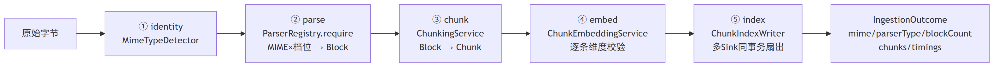

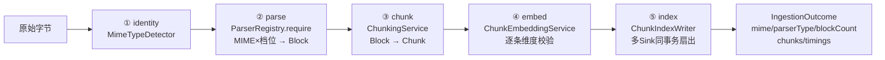

步骤契约：

1. **identity**：`mime_type = detect(bytes, filename)`；入口不收 MIME 入参。字节为空 → `ClientException("文件内容为空")`。
2. **parse**：`parser = registry.require(mime, spec.parse_profile)`；`parser.parse_structured(bytes, mime, options)`，`options = {"sourceFile": 文件名(可空), "documentId": docId}`（`documentId` 决定资产 key 前缀 `assets/{docId}/...`）。
3. **chunk**：`chunks = chunking_service.chunk(blocks, spec.budget)`；空结果 → `ClientException("分块结果为空")`。
4. **embed**：一次性 `embed_batch(texts, target.embedding_model)`；条数不符 → `ServiceException("向量结果条数与分块不符")`；逐条校验非空且 `len(vector) == target.dimension`，任一不符整篇失败（报文含模型 ID、实际维数、要求维数、分区名）。
5. **index**：`chunk_index_writer.replace_document(target, doc, embedded)`；**事务边界在写入器内，不在内核**。

内核无 try/catch：任一步异常即整篇失败，由外层（任务队列 worker / Pipeline 节点）处理状态。返回 `IngestionOutcome(mimeType, parserType, blockCount, chunks, timings)`，向量不随结果传出。

`IngestionSpec`（L3 文档级，JSONB 落 `t_knowledge_document.ingestion_spec`）：

- 字段：`version`（`CURRENT_VERSION=2`）、`parse_profile`（`fast`/`fidelity`，空→`fast`）、`budget`（`ChunkBudget`）。
- 线路哨兵：`maxChars=-1` 表示领域整文档；内部用 `None` 或 `sys.maxsize` 表示，翻译只在 codec 一处完成（见 12.4）。
- **不含 `embeddingModel`**：模型是知识库级约束，只能由 `VectorTarget` 提供。

**类图（视角：内核五步协作）**——`core/ingest` 内核本体及其编排的四个模态组件，类名对应第 14 节模块映射表：

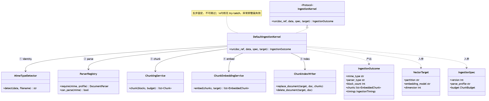

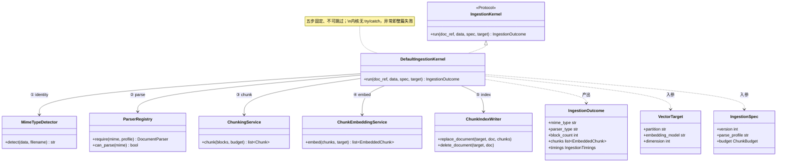

## 3. MIME 探测与解析器路由

### 3.1 `MimeTypeDetector`

MIME 探测同时利用文件内容与文件名；没有文件名时仅根据内容判定。实现设计：

- 主探测：`filetype`（纯 Python magic bytes）识别二进制格式（pdf/doc/xls/ppt/zip 系/图片）。
- Office Open XML 细分：`zipfile` 读 `[Content_Types].xml` 区分 docx/xlsx/pptx（Tika 对纯字节探测会回落 `application/x-tika-ooxml` / `x-tika-msoffice`，路由表已为其安排 POI 等价物，见 3.2）。
- 文本类：按扩展名映射表 + `charset-normalizer` 试探，覆盖 csv/md/txt/html/json/xml/rtf/svg。
- 扩展名 → MIME 映射表作为最后兜底，21 个扩展名与启动自检清单一致。
- 产出只服务解析路由；`file_type`（扩展名短标签，展示用）与 `mime_type`（探测值，路由用）刻意分离，两列都落 `t_knowledge_document`。

### 3.2 格式矩阵与（MIME × 档位）路由表

`ParseProfile`：`FAST("fast")`（本地解析零外部成本，全局兜底档）、`FIDELITY("fidelity")`（付外部成本换版面还原度）。查找顺序：精确+请求档 → 通配+请求档 → 精确+FAST → 通配+FAST → 未命中报错，**永不静默兜底到通用解析器**。

| 扩展名 | MIME（Tika 探测产出） | FAST 档 | FIDELITY 档 | Python 解析库 |
|---|---|---|---|---|
| pdf | `application/pdf`, `application/x-pdf` | MinerU | MinerU | MinerU SaaS（httpx） |
| doc | `application/msword`, `application/vnd.ms-word` | MinerU | MinerU | MinerU SaaS |
| docx | `...wordprocessingml.document` | MinerU | MinerU | MinerU SaaS |
| ppt | `application/vnd.ms-powerpoint` | MinerU | MinerU | MinerU SaaS |
| pptx | `...presentationml.presentation`, `...presentationml.slideshow` | MinerU | MinerU | MinerU SaaS |
| xls | `application/vnd.ms-excel` | **ExcelPoi → openpyxl/xlrd** | **MinerU** | xlrd（只读） |
| xlsx | `...spreadsheetml.sheet` | **ExcelPoi → openpyxl** | **MinerU** | openpyxl |
| （无文件名） | `application/x-tika-msoffice`, `application/x-tika-ooxml` | ExcelPoi | — | openpyxl/xlrd |
| csv | `text/csv`, `application/csv`, `text/comma-separated-values` | Csv | — | stdlib `csv` + chardet |
| md/markdown | `text/x-web-markdown`, `text/markdown`, `text/x-markdown` | Markdown | — | markdown-it-py（+table） |
| txt/text | `text/plain` | Markdown（纯文本经 AST 后自然全部落 Paragraph） | — | 同上 |
| html/htm | `text/html` | Tika → 专用文本解析 | — | BeautifulSoup4 抽文本 |
| json | `application/json` | Tika | — | stdlib `json` 重序列化 |
| xml | `application/xml`, `application/xhtml+xml` | Tika | — | `xml.etree` / BS4 抽文本 |
| rtf | `application/rtf` | Tika | — | `striprtf` |
| png | `image/png` | Image（VLM） | — | VLM（qwen-vl-max） |
| jpg/jpeg | `image/jpeg`, `image/jpg` | Image | — | VLM |
| svg | `image/svg+xml` | Image（先栅格化） | — | cairosvg → VLM |

说明：

- **Excel 是唯一档位敏感格式**：FAST 走本地 openpyxl，FIDELITY 走 MinerU。`profileSensitiveMimeTypes()` 据此算出（非写死），驱动前端"解析档位"选项与扩展名提示。
- Image 解析器刻意只认领 `image/png|jpeg|jpg|svg+xml`，不用 `image/*` 通配。
- 其余 `text/*` 由 Tika 等价物通配兜底（FAST）。
- PDF/Word/PPT 两档都只有 MinerU 一条路；MinerU 不可用时这些格式整体不可入库（见 16 节降级）。

### 3.3 解析库选型总表

| Python 组件 | 用途 |
|---|---|
| `filetype` + zipfile 内容类型判别 + 扩展名表；BS4/striprtf/json/xml 抽取 | MIME 探测与 text 系解析 |
| `markdown-it-py`（GFM table 插件） | Markdown AST → Block |
| `openpyxl`（xlsx）+ `xlrd`（xls） | Excel 解析、公式值、超链接与删除线 |
| `charset-normalizer` / `chardet` | CSV/TXT 编码探测 |
| MinerU SaaS（httpx） | PDF/Office 保真解析 |
| `cairosvg`（白底 + max width 1600） | SVG → PNG |
| `model_runtime.vlm`（httpx） | 图生文 |

**类图（视角：解析器注册与路由）**——`ParserRegistry` 持有全部 `DocumentParser` 实现并按（MIME × 档位）路由：

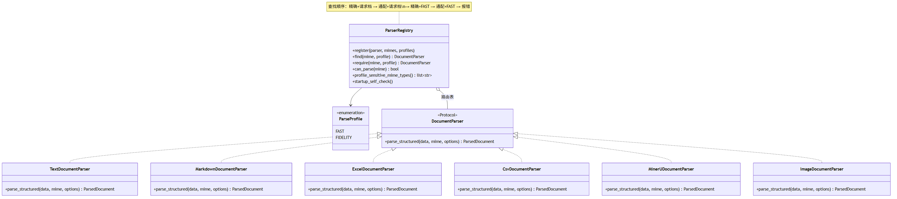

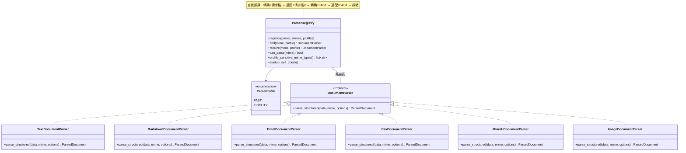

## 4. Block 模型

解析阶段的唯一中间表示使用 `dataclass(frozen=True)` + 判别字段（或 `typing.Union`），仅在解析→分块链路内存存活，不直接序列化。

```
Block = HeadingBlock | ParagraphBlock | TableBlock | HtmlTableBlock
      | ImageBlock | CodeBlock | ListBlock          # 共 7 种，均有 provenance
```

| Block | 字段 | 语义 |
|---|---|---|
| `HeadingBlock` | `level: int (1-6)`, `text: str` | 自身不产独立 chunk 语义单元，累积进后续 chunk 的 `outlinePath` |
| `ParagraphBlock` | `text: str` | 保留链接/图片/行内代码标记，丢强调标记；可含非表格内嵌 HTML |
| `TableBlock` | `headers: list[str]`, `rows: list[list[str]]` | 合并单元格已展开、多行表头已展平（`\|` 拼接） |
| `HtmlTableBlock` | `html: str` | 完整 `<table...` HTML，刻意不拆二维表（合并/换行/公式会失真） |
| `ImageBlock` | `asset: AssetRef`, `caption`, `alt_text`, `description: str|None` | `description` = VLM 图生文（进 embedding + 喂 LLM）；不产图生文的来源为 `None` |
| `CodeBlock` | `language: str|None`, `code: str` | 原子单元，超预算按行切但绝不腰斩行 |
| `ListBlock` | `ordered: bool`, `items: list[str]` | 短列表原子、长列表按渲染字符分组 |

辅助类型：

- `Provenance(source_file, sheet_name=None)`：工厂 `of_file` / `of_excel_cell`；`sheet_name` 只作溯源不进向量文本。
- `AssetRef(public_url, mime)`：对象存储公开 URL（资产桶公共读）。
- `ParsedDocument(blocks, metadata)`：metadata 常见键 `parser` / `mimeType` / `blocks` / `minerU.batchId` / `minerU.zipUrl` 等。

**类图（视角：Block 领域模型）**——解析阶段的唯一中间表示，采用 `dataclass(frozen=True)` + 公共基类：


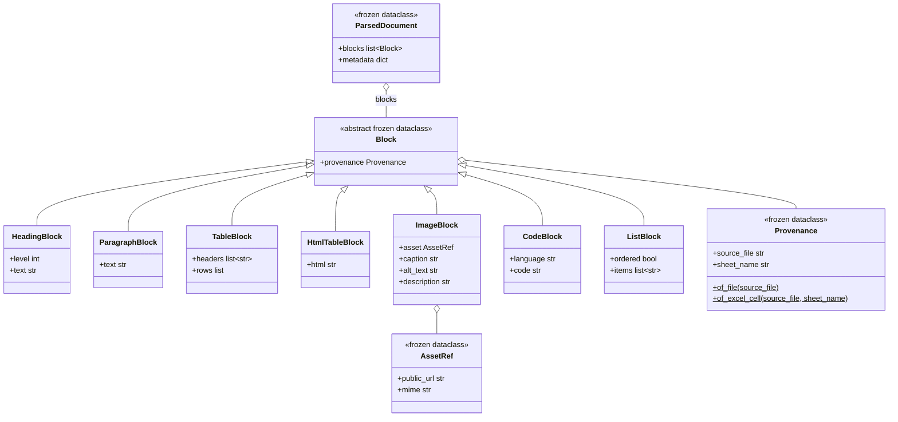

## 5. 各解析器设计

### 5.1 Tika 等价物（`TextDocumentParser`）

- 输入 text/html/json/xml/rtf/txt 系字节 → 按 3.3 的库抽取纯文本 → `TextCleanupUtil.cleanup()` → 按 `\n{2,}` 空行切段，`strip()` 非空者各产一个 `ParagraphBlock`（唯一产物）。
- `cleanup` 规则（顺序固定）：剥所有 `\uFEFF` → `[ \t]+\n` → `\n`（去行尾空白）→ `\n{3,}` 压成 `\n\n` → `trim()`。
- metadata：`parser`、`mimeType`。

### 5.2 `MarkdownDocumentParser`

- markdown-it-py 启用 GFM table；UTF-8 解码；只处理顶层 block，不递归嵌套。
- 映射规则：
  - `heading` → `HeadingBlock(level, extract_inline_text)`。
  - `paragraph`：父为 list item 则跳过（归 ListBlock）；**独占一行的图片**（只允许 image + 空白 inline）提升为 `ImageBlock(asset=AssetRef(url, guess_image_mime(url)), caption=title, altText=inline text, description=None)`；否则 `ParagraphBlock`（空文本不产）。
  - HTML block：strip 后以 `<table` 开头（忽略大小写）→ `HtmlTableBlock`，否则 → `ParagraphBlock`。
  - fenced code → `CodeBlock(info, literal 去尾换行)`；indented code → `CodeBlock(None, ...)`。
  - bullet/ordered list → `ListBlock(ordered, items)`，项文本 trim。
  - GFM table → 首行 headers + 数据行 → `TableBlock`。
  - **不做 front-matter 处理**，YAML 头落为普通段落。
- `extract_inline_text`：行内 code 包反引号；link → `[text](url)`；image → ``；强调丢标记留文本；软/硬换行 → `\n`。
- `guess_image_mime`：`.png→image/png`、`.jpg/.jpeg→image/jpeg`、`.gif→image/gif`、`.webp→image/webp`、`.svg→image/svg+xml`，其他 `None`。

### 5.3 `ExcelDocumentParser`（openpyxl/xlrd 双后端）

- options：`sourceFile`；`headerRows`（默认 `DEFAULT_HEADER_ROWS=1`，Number 或可解析字符串，否则回落 1）。
- 遍历所有 sheet，**跳过隐藏/深度隐藏 sheet**；每 sheet 规范化后非空 → 产 2 个 Block：`HeadingBlock(level=1, text=sheetName)` + `TableBlock(headers, rows)`；provenance = `of_excel_cell(sourceFile, sheetName)`。
- 规范化管线（`ExcelTableNormalizer` 等价物，顺序固定）：
  1. `computeMaxColumns`：跨行取最大列数；
  2. `readGrid`：每格 `ExcelValueFormatter.format` → `ExcelHyperlinkResolver.wrap` → 字体级删除线非空则包 `~~值~~`；
  3. `expandMergedRegions`：合并区左上角值复制到区域内每格（左上角空则跳过）；
  4. `selectNonEmptyColumns`：丢弃全程空列（仅表头空但有数据的列保留）；
  5. `flattenHeaders`：前 `min(headerRows, 总行数)` 行展平，相邻重复值跳过，`|` 拼接（如 `财务|收入`）；
  6. `collectDataRows`：跳过全空行。
- 值格式化（对齐 POI `DataFormatter` 显示值语义）：公式格三级回退 = ① 求值并按显示格式渲染 → ② 读缓存值（数值/字符串/布尔/错误）→ ③ 公式原文。openpyxl 用 `data_only=True` 读缓存值；缓存缺失时回退公式文本。xlrd 只能读 xls 缓存值。
- 超链接：`[visible](url)`，visible 优先级：cell 文本 > hyperlink label > url。**这是 Excel 必须走专用库而非 OCR 的核心原因**。
- 明确不做：多表区域切分、标题识别、横向重复列折叠——复杂版面由 FIDELITY 档路由 MinerU。
- metadata：`parser`、`mimeType`、`totalSheets`、`parsedTables`、`headerRows`。

### 5.4 `CsvDocumentParser`

- 编码：`charset-normalizer` 探测（兼容 UTF-8/GBK/UTF-16），失败回退 UTF-8；剥开头 BOM。
- RFC4180：引号内逗号/换行视作普通字符，`""` → 字面量 `"`；处理 CRLF；末尾无换行的残留记录也收。**只认逗号**，不做分隔符探测（使用 `csv` 模块 + 显式 `dialect`，不使用 `Sniffer`）。
- 结构：去全空行 → 首行 headers → 数据行短于表头右侧补 `""`（超出原样保留）→ 单个 `TableBlock`。空 CSV → 空 `ParsedDocument`。

### 5.5 MinerU 系列

流程（`MinerUDocumentParser`）：

```
① 信号量限流（rag:mineru:parse，许可=concurrencyLimit，tryAcquire(maxWait=30s, lease=900s)）
② POST {apiUrl}/file-urls/batch           # 申请上传 URL
   body: {enable_formula, enable_table, language,
          files:[{name, is_ocr, data_id}]} → batchId + 预签名 uploadUrl
③ PUT uploadUrl（裸字节，无 Content-Type/Authorization，MinerU 官方要求）
④ 轮询 GET {apiUrl}/extract-results/batch/{batchId}，间隔 pollIntervalSeconds
⑤ GET full_zip_url（一次性预签名，立即下载）
⑥ 解包：第一个 .md 为正文（UTF-8）；图片逐张上传资产桶 assets/{docId}/{uuid}.{ext}
⑦ 可选：逐张 VLM 图生文（embeddedDescribeEnabled=true），单张失败只记日志
⑧ markdown 走 MarkdownDocumentParser 同规则 AST → Block（段首连续图片提升 ImageBlock，
   description 取自图生文 map；行内图片保留  随段落）
```

- 响应包 `{code, msg, data}`，`code != 0` → `ServiceException`。
- 状态机：`done/success/succeeded/completed→DONE`；`failed/fail/error→FAILED`；`waiting-file/pending/running/converting/queueing/queue→RUNNING`；其他/缺失→`UNKNOWN`（视为 running 继续轮询）。`extract_result` 空 → RUNNING。
- 轮询（`MinerUPollingExecutor` → asyncio）：`asyncio.create_task` + 循环 `asyncio.sleep(max(0.1, pollIntervalSeconds))`；DONE 返回、FAILED 抛错（带 `err_msg`）、**瞬时异常只 log 不终止**，deadline（`timeoutSeconds`）兜底抛 `TimeoutError`。
- 上传文件名：`sourceFile` 优先，否则 `doc-{documentId}{ext}`，`ext` 按 MIME 推导（pdf→`.pdf`、wordprocessingml→`.docx`、msword→`.doc`、presentationml→`.pptx`、powerpoint→`.ppt`、spreadsheetml→`.xlsx`、ms-excel→`.xls`、其他 `.bin`）。
- 图片 zip 路径三级匹配：精确 → 去 `./` 前缀 → 文件名后缀匹配。
- metadata：`parser="MinerU"`、`minerU.batchId`、`minerU.zipUrl`、`imagesUploaded`、`imagesDescribed`、`blocks`。

### 5.6 `ImageDocumentParser` + VLM

1. **SVG 归一化**：`cairosvg.svg2png(bytestring=..., output_width≤1600, background_color="white")`。**必须铺白底**——透明区会被 VLM 合成为黑/空导致空描述；MIME 改 `image/png`。
2. `vlm.describe_image(bytes, mime, prompt, max_output_tokens)`（`model_runtime.vlm`，OpenAI 兼容多模态 chat：`content=[{type:"text"},{type:"image_url",image_url:{url:"data:{mime};base64,..."}}]`；`max_tokens` 仅当 >0 时带）。模型取 `ai.vlm.default-model=qwen-vl-max` 候选列表首个，无 fallback；失败抛错不兜底。
3. **空描述等同失败** → `ServiceException`。
4. 原图上传资产桶 `assets/{docId}/{uuid}.{ext}`（jpeg/jpg→`jpg`，其他→`png`），取公开 URL。
5. 产单个 `ImageBlock(asset=AssetRef(url, mime), caption=去扩展名 sourceFile, altText=caption, description)`。

默认 prompt（`rag.image-parse.description-prompt`，原样保留）：

```
请用中文详细描述这张图片的内容；若图中包含文字，请逐字识别并完整列出（OCR）。
先给出整体内容描述，再用"图中文字："另起一段列出识别到的所有文字。
```

### 5.7 `BlockTextRenderer`

Block → 纯文本（供 Pipeline rawText 与整文档分块共用）：

- Heading：`"#"*max(1,level) + " " + text + "\n\n"`；Paragraph：`text + "\n\n"`。
- Table：headers 与每行 `" | "` join、`\n` 结尾，最后补 `\n`（非标准管道表，无分隔线行）。
- HtmlTable：原 HTML + `"\n\n"`；Code：` ```lang\ncode\n``` ` + `"\n\n"`。
- Image：description 非空先输出 `description.strip() + "\n\n"`，再 `\n\n`（描述在前，保证拍平路径也能召回）。
- List：有序 `"N. "` / 无序 `"- "` 前缀，每项一行，末尾 `\n`。整体 `trim()`。

## 6. 分块设计

### 6.1 `ChunkBudget`（预算即全部"策略"）

| 参数 | 默认 | 约束 | 说明 |
|---|---|---|---|
| `maxChars` | 1024 | >0；非整文档 ≤ `MAX_CHARS_LIMIT=8192` | 目标块字符数（非硬上限） |
| `overlapChars` | 128（=`maxChars/8`，`OVERLAP_DIVISOR=8`） | `∈[0, maxChars)` | 段落切分重叠 + 句界回溯窗口 |
| `rowsPerChunk` | 50 | >0，≤ `ROWS_PER_CHUNK_LIMIT=1000` | 表格每块最大数据行数 |
| `toleranceFactor` | 3 | `∈[1, TOLERANCE_FACTOR_LIMIT=8]` | 结构容忍倍数 |

派生量：`toleranceChars = min(maxChars * toleranceFactor, 8192)`（整文档哨兵时无上限）；`minChars = max(1, maxChars/4)`（`MIN_CHARS_DIVISOR=4`，默认 256）。整文档：`whole_document()`（内部 max 值，线路值 `-1`），`ChunkingService` 据此走单块分支。

### 6.2 分发（`BlockAwareChunkerDispatcher`）

- 无策略枚举。构造期按 `chunker.block_type()` 建查表 map，同类型两个 chunker 认领 → 启动失败。
- 遍历 Block：遇 `HeadingBlock` **先**更新章节路径栈再照常分发（标题 chunker 拿到含自身的路径）；每块 `chunker.chunk(block, ChunkContext(outline_path, budget))` 产 `ChunkDraft`；未注册类型 → `ServiceException`。
- `HeadingHandler.update`：`level=max(1, heading.level)`；从栈顶弹掉所有 `levels[top] >= level` 的祖先后压入 `(text, level)`。**levels 必须与 path 一起留**——只看深度无法判断挂载点。
- 统一切/不切判据：整块 ≤ `toleranceChars` 不切；超出才按 `maxChars` 降级切，切点落结构边界。

`ChunkDraft(content, embedding_body, metadata, piece, heading)`：中间态无 ID；`pieces(list)` 在多片时逐片置 `piece=true`（禁止合并阶段撤销切块）；`effective_body()` = `embedding_body` 有文本用之否则回落 `content`。

### 6.3 各 Block chunker 行为

| chunker | 行为 |
|---|---|
| `HeadingChunker` | level clamp [1,6]；content = `"#"*level + " " + text`（按原始级别），embeddingBody = 纯文本标题（井号对嵌入是零信息 token）；outlinePath 含自身 |
| `ParagraphChunker` | 先 `TextSplitter.split(text, toleranceChars, overlap)`；若 >1 片**退回** `split(text, maxChars, overlap)` 重切；多片置 piece |
| `TableChunker` | 预算：`rows≤rowsPerChunk 且 全表KV长度≤toleranceChars` → 不切；否则按 `maxChars` 贪心累加行（`overCap=组内行数≥rowsPerChunk`，`overBudget=组非空且 组成本+行成本>预算`，任一满足先落块；单行超预算整行原子成块）。每块 content = 完整 markdown 表格（表头行 + `|---|` + 本组行；cell 内 `\|`→`\\|`、换行→`<br>`）；embeddingBody = KV 渲染（`"列名: 值; 列名: 值"`，空值跳过、换行压空格），**表头不进向量文本**（KV 已带列名，重复前缀会把同表各块向量拉向同方向）。预算只量 KV 行本身，不扣装配器追加的章节前缀 |
| `HtmlTableChunker` | 先清无意义 span（`\s+(colspan\|rowspan)\s*=\s*["']?1["']?`）；正则 `<tr\b[^>]*>.*?</tr>` 切行，首行表头；<2 行原样单块。开标签+`</table>`+表头长度先从预算扣掉；按 tr 贪心分组；每块 = 原始开标签（保留 border/class）+ 表头 + 本组行 + `</table>`；展示与检索同一份 HTML |
| `ListChunker` | 整份渲染 ≤ toleranceChars 不切；否则按渲染字符（非项数）贪心分组（itemCost = 渲染长度+1）；单项超预算独立成块；有序列表 startNumber 逐块续编；展示检索同文 |
| `CodeChunker` | ≤ toleranceChars 整块；否则按行贪心（单行超预算整行独立成块，绝不腰斩行）；每块 content 重复围栏 ` ```lang `，embeddingBody = 裸 segment |
| `ImageChunker` | 一图一块；caption 取 caption→altText→`""`；content = 有描述时 `description.strip() + "\n\n" + `；embeddingBody = 纯描述（去 URL 噪声），无描述走 content 回落；assets 含该 AssetRef；非 piece，可与前导语同块 |

### 6.4 `ChunkPacker`（按节打包，字符计数）

- **节** = 相邻两个 `heading` 草稿之间（标题起一节，文首散块自成一节）。
- 主循环逐节：
  - 节长 > `toleranceChars` → `packWithin` 节内切分，残留 buffer 交回与下一节合并；
  - 否则原子节：`bufferLen < minChars` 时只在 `bufferLen + 2 + sectionLen > toleranceChars` 才断（不够一块就硬并）；否则 `bufferLen + 2 + sectionLen > maxChars` 才断（装得下继续装）；
  - 并入后 buffer 超 `maxChars` → flush（原子节本身可超预算成块，不再拆）。
- `packWithin`（节超容忍逐草稿贪心）：`piece=true` 或自身 ≥ maxChars 的草稿原样落块，先 `pollLeadIn` 从 buffer 尾部取可并入前导语（累加 ≤ maxChars 才取，且 `目标长+前导长 ≤ toleranceChars` 否则不取——表格说明段、代码用途说明靠它同块）；普通草稿按 `buffer总长 + 2 + 新增长 > maxChars` 断。
- `flush`：单草稿直接用、多草稿 `merge`；**不足 minChars 的余量并回上一块**（前提合并后 ≤ toleranceChars）——不产出 < maxChars/4 的碎块。
- `merge`：content 与各 `effectiveBody()` 分别 `"\n\n"` 拼接；`hasExplicitBody` 任一为真才保留拼接 embeddingBody（否则置空走回落，防图片块向量退化带 URL）；assets 并集；provenance 取首块；**outlinePath 取公共前缀**（前导语可能来自上一节）；piece 复位 false，heading 取或。
- **无块级重叠**：切口只落在节边界；唯一重叠来源是段落级 `TextSplitter`。
- 长度度量全部是字符数（Python `len()`），非 token；token 数仅在关系表落库时另行统计。

### 6.5 `TextSplitter`

```
split(text, maxChars, overlapChars):
  normalize(text)                                   # 见下
  if len <= maxChars: return [text]
  overlap = clamp(overlapChars, 0, maxChars-1)
  滑窗: targetEnd = min(start+maxChars, len)
        end = adjustToBoundary(text, start, targetEnd, overlap)
        if end <= start or end <= lastEnd: end = targetEnd   # 强制推进
        片 strip 非空才收
        nextStart = max(0, end - overlap); nextStart<=start 则取 end
adjustToBoundary: maxLookback = min(overlap, targetEnd-start)   # overlap 兼作回溯窗口
  从 targetEnd 向前逐字符三轮扫描:
    ① '\n'  ② 中文句末 '。！？'  ③ 英文 '.!?' 且下一字符是空白或文本结尾（防切 URL 域名点）
  命中返回 pos+1；均不中返回 targetEnd
normalize:
  去 '\r'；URL 断行修复（URL 内单个换行且满足 shouldJoinBrokenUrl 则吞掉续接，
  跨空行绝不合并；下一行像列表项 '2.'/'10)' 不合并）；
  CJK 软换行合并（换行两侧都是 CJK/全宽字母数字且非 CJK 标点则删换行）
```

### 6.6 `ChunkAssembler` 与双文本制

- `assemble_all(drafts)`：序号从 0 按序分配；chunkId = UUIDv7（落库前预分配，时间有序可比较，PostgreSQL 存原生 `UUID`，ES `_id` 使用其标准字符串）。
- 向量文本组装：`missingOutlinePrefix + "\n" + effectiveBody()`——章节路径自根向下找第一级已出现在 content 中的级别，取其**之前**的前缀以 `" / "` 连接（首块正文自带末级标题时不重复拼，只补未覆盖的上级路径）。
- `restore(chunkId, index, content, embeddingText)`：人工编辑/换模型重嵌入的唯一正确入口，`embeddingText` 取库存 `embedding_text` 列（空回落 content），metadata 为空——重建向量必须走这里，不能重跑装配。
- `Chunk` 强校验：`chunkId`/`embeddingText` 非空、`index>=0`、`content` 非 None。
- `ChunkMetadata(outlinePath, assets, provenance, extras)`：`to_map()` 是唯一序列化点——**extras 先写、结构化键后写**（结构化事实不得被加工产物覆盖）；assets → `[{url, mime}]`；provenance → `source_file`/`sheet_name`；文档级键 `doc_id`/`chunk_index` 由 sink 自补。

**类图（视角：分块编排）**——`ChunkingService` 两分支（整文档哨兵直切 / block-aware），后者由分发器 + 打包器 + 装配器协作完成：

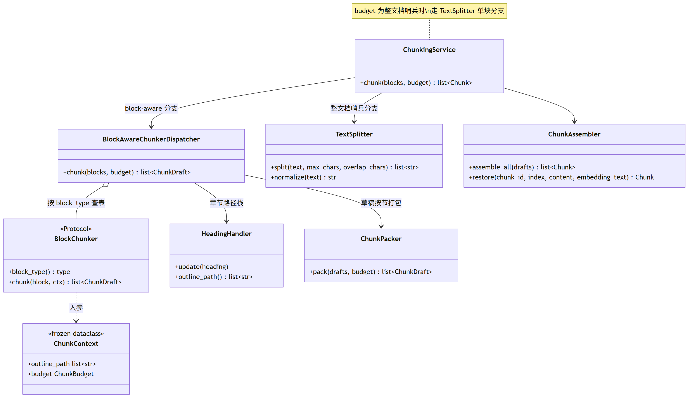

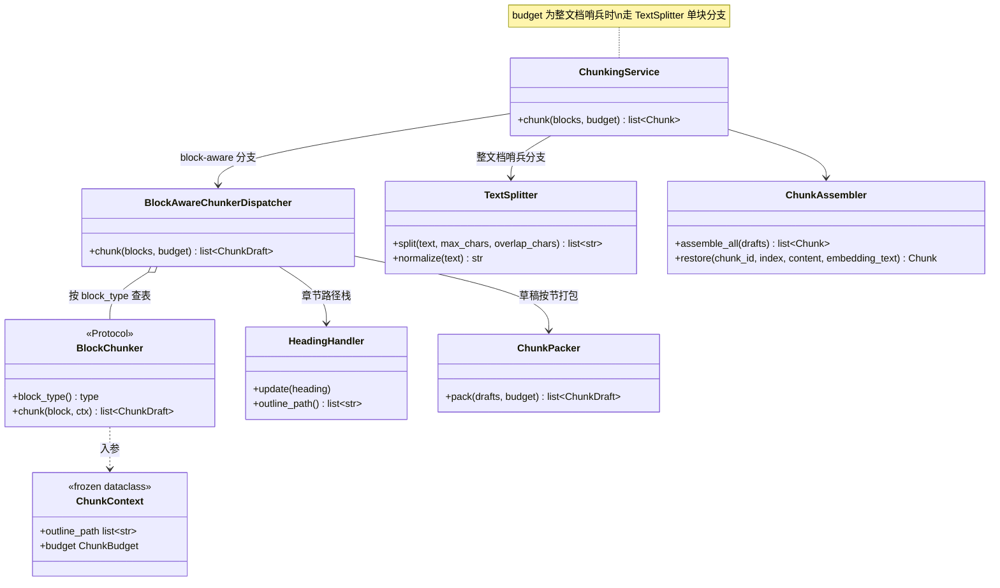

**类图（视角：七型 Block chunker）**——按 Block 类型一对一认领，同类型重复认领启动失败：

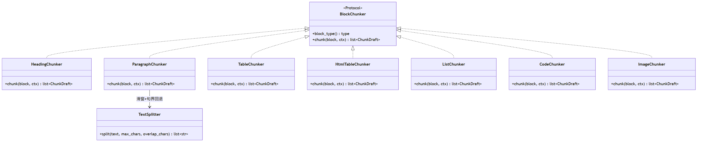

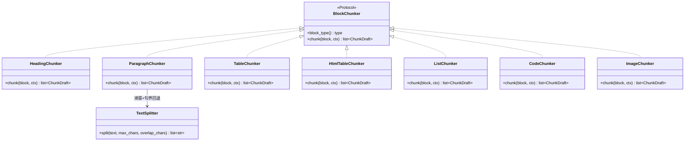

## 7. 向量化与 VectorTarget

- `VectorTarget(partition, embedding_model, dimension)`：
  - `partition` = 知识库 `collection_name`（逻辑分区键，pgvector 下是共享表 `t_knowledge_vector` 的 `collection_name` 列，刻意不叫 collectionName）；
  - `embedding_model` 取自知识库（L2），空即抛错，**禁止回落系统默认模型**；
  - `dimension` 取自部署级 `rag.default.dimension`（L1，=1536），`<=0` 抛错（"部署未配置向量维度 rag.default.dimension"）。
- 唯一产生地：`VectorTargetResolver.resolve(kb)`——保证同一 partition 内向量同语义空间。
- 距离度量：不进 `VectorTarget`，建空间时固化 COSINE（`t_knowledge_vector.embedding` 上 HNSW 索引 `vector_cosine_ops`）。
- `ChunkEmbeddingService.embed`：整批一次 `embed_batch`（分批切片在 model_runtime 底层按 provider 钩子 `max_batch_size` 处理，默认 0=不限制）；请求体 OpenAI 兼容 `/v1/embeddings`（`model`/`input`/`dimensions`/`encoding_format=float`）；条数校验 + 逐条维度校验（见第 2 节）。`RoutingEmbeddingService` 按 modelId 解析 provider 并带 fallback（详见 04 文档）。

**类图（视角：Chunk 领域模型与向量目标）**——分块中间态到落库实体的演进链（`ChunkDraft → Chunk → EmbeddedChunk`），以及唯一产生 `VectorTarget` 的解析器：

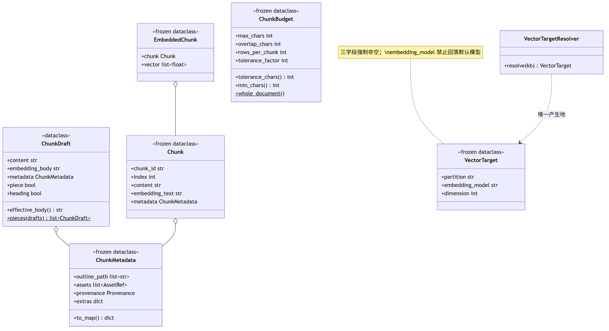

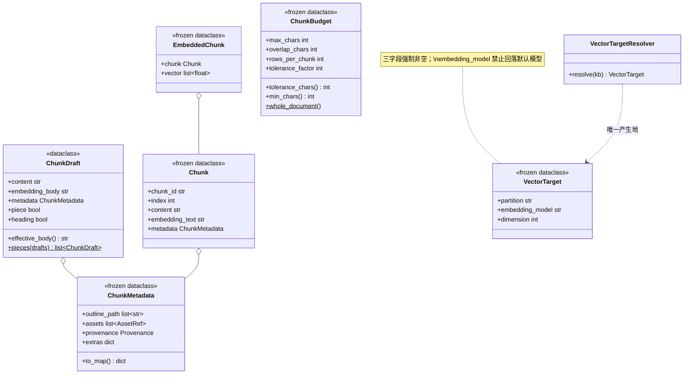

## 8. 多 Sink 扇出与事务

`ChunkSink` 端口只暴露两方法：`replace_document(target, doc, chunks)`（整体替换，空列表=该文档无块）与 `delete_document(target, doc)`。**刻意只暴露整体替换**——先删后建顺序由实现内部保证。

`ChunkIndexWriter.replace_document`：全部 Sink 在**同一个 DB 事务**里按序执行，任一 Sink 抛异常整体回滚：

| 顺序 | Sink | 行为 |
|---|---|---|
| 1 | `RelationalChunkSink` | 写 `t_knowledge_chunk`：先按 docId 删再批量插。行字段：`id=chunkId`、`kb_id`、`doc_id`、`chunk_index`、`content`、`content_hash=sha256(content)`、`char_count`、`token_count`（TokenCounter，空文本计 0）、`embedding_text`（**换模型可免重新解析直接重嵌入**）、`enabled=1` |
| 2 | `VectorChunkSink` | pgvector：先 `DELETE WHERE collection_name=? AND metadata->>'doc_id'=?` 再批量 `INSERT (id, collection_name, content, metadata::jsonb, embedding::vector)`；metadata = `chunk.metadata.to_map()` + `doc_id` + `chunk_index` |

ES / LightRAG **不是独立 Sink**，而是向量写路径的装饰器，在向量写/删成功后**同步调用、best-effort**：

- `KeywordSyncingVectorStore`：同步 ES 关键词索引（`KeywordIndexService`），失败只 log.warn，不回滚向量、不中断主链路；覆盖全部写路径（含单块 update/delete）。
- `GraphSyncingVectorStore`：同步 LightRAG（`insert_text(全文, GraphFileSource.encode(collection, docId))`，全文=各块 content 以 `"\n\n"` 拼接）；删除按 `delete_by_doc(docId)`；"先删后建"天然构成图谱 upsert。只按文档级同步，单块粒度不同步。

Python 实现：FastAPI 依赖注入装配装饰器链（配置开关未启用 ES/LightRAG 则不包装）；DB 事务用 SQLAlchemy async session 的 `async with session.begin()` 包住两个 Sink；ES/LightRAG 调用在事务提交后执行并 try/except 降级。

**类图（视角：Sink 端口与装饰器链）**——`ChunkIndexWriter` 组合有序 Sink 列表同事务扇出；ES / LightRAG 以 `VectorStore` 装饰器形式 best-effort 同步：


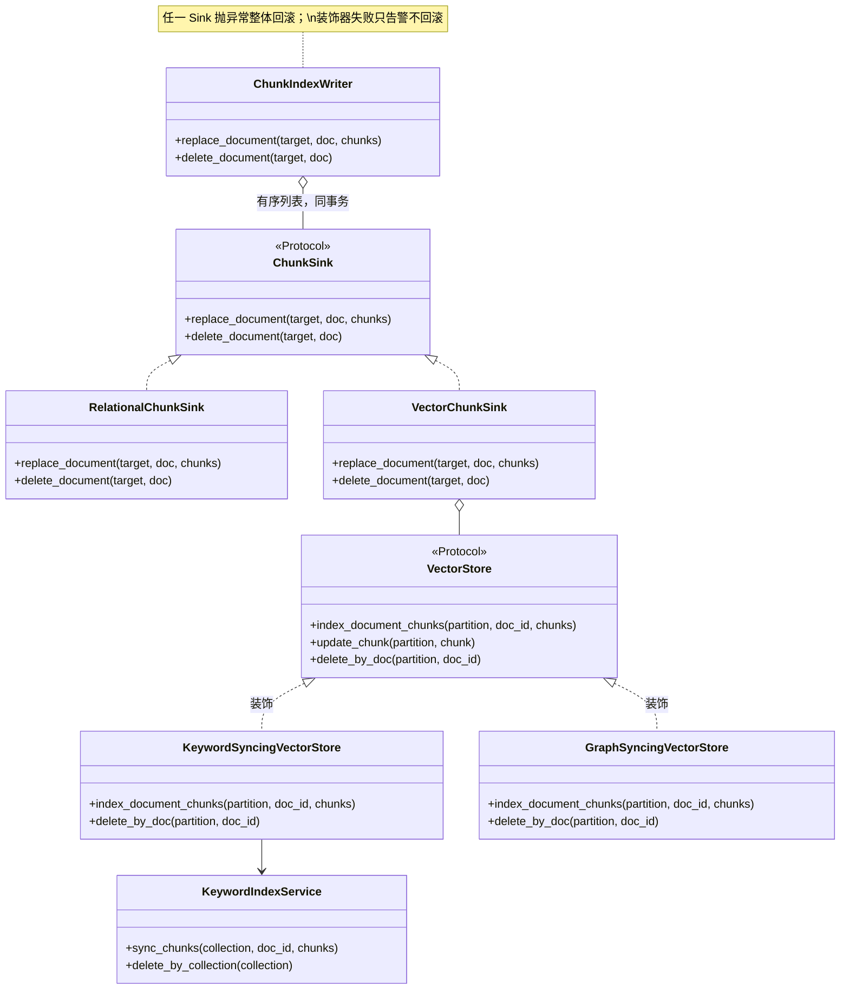

## 9. 可编排 Pipeline

### 9.1 领域模型

`PipelineDefinition`（内存对象，非持久化）：`id`、`name`、`description`、`nodes: list[NodeConfig]`（执行顺序由 `nextNodeId` 链决定，与列表顺序无关）。

`NodeConfig`：`nodeId`（管道内唯一）、`nodeType`（六选一）、`nextNodeId`（空=链尾）、`condition`（JSON 条件树，可空）、`settings`（JSON，各节点反序列化为强类型 Settings）。

枚举的入站、出站和查询归一化收敛为一处：trim + 小写 + `-`→`_`：

- `IngestionNodeType`：`fetcher` / `parser` / `enhancer` / `chunker` / `enricher` / `indexer`
- `IngestionStatus`：`pending` / `running` / `failed` / `completed`；任务入队时为 `pending`，worker 成功领取后才进入 `running`。
- `SourceType`：`file` / `url` / `feishu`
- `EnhanceType`（Enhancer，文档级）：`context_enhance` / `keywords` / `questions` / `metadata`
- `ChunkEnrichType`（Enricher，块级）：`keywords` / `summary` / `metadata`

`IngestionContext`（执行全程可变共享上下文）：`taskId`、`pipelineId`、`source: DocumentSource`、`rawBytes`、`mimeType`、`rawText`、`document: StructuredDocument`、`chunks: list[EmbeddedChunk]`、`vectorTarget`、`enhancedText`、`keywords`、`questions`、`metadata`、`status`、`logs: list[NodeLog]`、`error`、`skipIndexerWrite=False`、`assets: list[AssetRef]`。

- `DocumentSource(type, location, fileName, credentials: dict)`：credentials 键值对（token、app_id/app_secret 等）。
- `StructuredDocument(text, blocks, metadata)`：`blocks` 为准（`sections`/`tables` 旧兼容字段裁剪，不再保留）。
- `NodeLog(nodeId, nodeType, message, durationMs, success, error, output)`：`output` 为摘要级输出（见 9.4 `NodeOutputExtractor`）。
- `NodeResult`：`ok()` / `ok(msg)` / `skip(reason)`（message 前缀 `"Skipped: "`）/ `fail(error)` / `terminate(reason)`（成功但终止后续节点）。
- `IngestionResult(taskId, pipelineId, status, chunkCount, message)`：成功 message="OK"。

### 9.2 引擎执行语义（`IngestionEngine`）

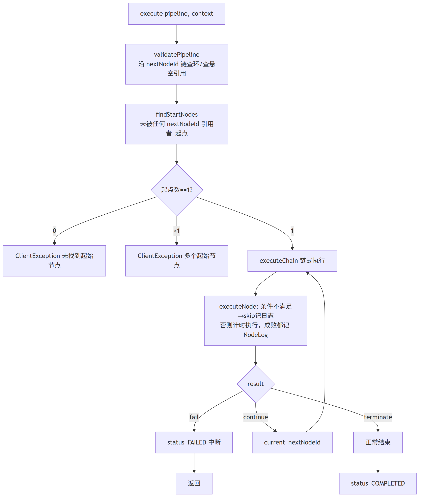

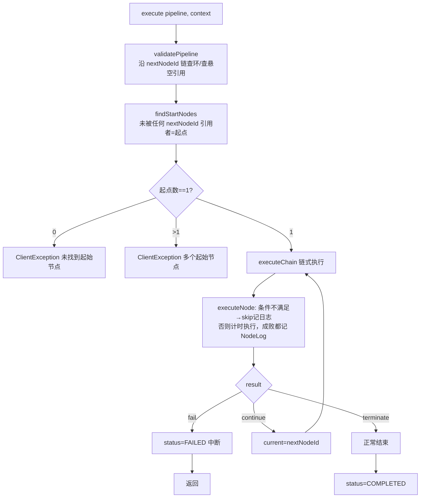

规则：

1. **环校验**：沿 `nextNodeId` 走访，重复节点抛 `"流水线存在环: {nodeId}"`；指向不存在节点抛 `"找不到下一个节点: ..."`。
2. **单起点强校验**：被引用集合的补集为起点；0 个 / 多个均报错。
3. **链式执行**：上限 `maxNodes = 节点总数`，超过抛 `"执行节点数超过上限，可能存在死循环"`（双保险）。
4. **条件跳过**：`condition` 非空且求值为 false → `NodeResult.skip("条件未满足")`，**仍记一条 NodeLog**（durationMs=0、success=true、带 output 摘要），链继续。
5. **失败传播**：节点异常被捕获转 `NodeResult.fail`，链立即中断，无重试无降级；任务置 FAILED，`error` 落库。
6. 执行方式：**HTTP 请求内同步内联**（含 LLM 调用与向量写入）。失败时状态作为正常结果回填提交，不回滚任务行与节点日志；仅入参校验类异常（`ClientException`）返回错误且不落任务。
7. `skipIndexerWrite=true` 旁路：知识库上传路径让 Indexer 只准备不写，向量由调用方在自己事务里统一落库。

### 9.3 条件 DSL（`ConditionEvaluator`）

JSON 条件树，四类形态：

```jsonc
// 1. 字面量：null→true；bool→原值；string→表达式（见下）
// 2. 组合
{"all": [cond, ...]}   // AND
{"any": [cond, ...]}   // OR
{"not": cond}          // 取反
// 3. 规则
{"field": "source.type", "operator": "eq", "value": "url"}
```

- `field` 从 `IngestionContext` 读属性路径（如 `source.type`、`mimeType`），读取异常视为 null。
- 操作符（默认 `eq`）：`eq` / `ne` / `in` / `contains` / `regex`（全匹配）/ `gt` / `gte` / `lt` / `lte`（Double 比较，不可转数字 false）/ `exists` / `not_exists`；字符串比较前 trim 归一。
- 字符串条件实现为受限表达式子集：仅支持 `field op literal` 与 `and/or/not`（如 `mimeType == 'application/pdf'`），用 AST 白名单解析（`ast.parse` 后校验节点类型），求值异常返回 false；复杂表达式统一建议改用规则形态。

### 9.4 六类节点

| 节点 | 职责 | Settings（字段 / 默认） |
|---|---|---|
| `FetcherNode` | 策略模式按 `SourceType` 选 fetcher。**幂等短路**：`rawBytes` 已存在 → 只补探测 mimeType，返回 ok("已跳过获取器")（本地上传靠此预置字节）。成功后回填 `rawBytes`/`mimeType`/`source.fileName` | 无 |
| `ParserNode` | mimeType 空则探测 → `validateMimeType`（规则白名单）→ `registry.find(mime, FAST)`（**管道无档位入口，固定默认档**）→ `parseStructured`（options 注入 `sourceFile`、`documentId=taskId`）→ `BlockTextRenderer.render` 写 `rawText` → 构造 `StructuredDocument` | `rules: [{mimeType, options: dict}]`。类型词汇 `PDF/MARKDOWN/WORD/EXCEL/PPT/IMAGE/TEXT`，扩展名优先于 MIME 关键字；规则值支持 `*/ALL/DEFAULT` 通配与 `MD/DOCX/XLSX/...` 别名。不匹配抛 `"文件类型不符合要求..."` |
| `EnhancerNode` | 文档级增强（分块前）。逐 task 调 LLM（固定 `Tier.FAST` + settings.modelId），结果落 context：`context_enhance→enhancedText`、`keywords→keywords`、`questions→questions`、`metadata→metadata`（JSON 对象 merge）。输入：`CONTEXT_ENHANCE` 用 rawText，其余优先 enhancedText；输入空跳过该 task | `modelId`、`tasks: [{type, systemPrompt?, userPromptTemplate?}]`；模板变量 `text/content/mimeType/taskId/pipelineId`，`{{var}}` 简单替换 |
| `ChunkerNode` | `vectorTarget` 空 → fail；`chunkingService.chunk(blocks, budget)` → 空则 fail → **`ChunkEmbeddingService.embed` 在分块节点内完成向量化** → 写 `context.chunks` | `chunkSize`（目标字符数，**`-1`=整文档哨兵**，≤0 非 -1 走默认 1024）、`overlapSize`（<0 走 `maxChars/8`；`>=maxChars` 压到 `maxChars-1`）、`rowsPerChunk`（空走 50）、`strategy`（**已废弃**，仅 UI 兼容，后端不读）、`separator`（保留字段） |
| `EnricherNode` | 块级富集（分块后）。chunks 空/tasks 空 → ok 跳过。逐 chunk（跳过 content 空块）逐 task 调 LLM（FAST 档），结果写块 extras：`keywords`（JSON 数组）/`summary`（trim 文本）/`metadata`（JSON merge）。**块不可变**：`chunk.withMetadata(extras)` 整块替换，不原地改 | `modelId`、`attachDocumentMetadata`（默认 true：先把 context.metadata 并入 extras）、`tasks: [{type, systemPrompt?, userPromptTemplate?}]`；模板变量 `text/content/chunkIndex/taskId/pipelineId` |
| `IndexerNode` | chunks 空 → fail。partition 优先级：`vectorTarget.partition` > 旧 vectorSpaceId > `rag.default.collection-name`；空 → fail。管道级元数据（`task_id/pipeline_id/source_type/source_location` + context.metadata）写每块 extras，`metadataFields` 非空按白名单过滤。`skipIndexerWrite` → 只准备不写；否则确保向量空间存在后 `index_document_chunks(partition, taskId, chunks)`。维度校验不在此做（向量化阶段已逐条校验） | `embeddingModel`、`metadataFields: list[str]`（空=全部注入） |

**Enhancer vs Enricher**：Enhancer 作用整个文档（分块前），产出挂 context；Enricher 作用每个分块（分块后），产出写块 metadata extras。

`NodeOutputExtractor`：只产摘要不产实体（源文件字节、全量 Block、带向量的块都不进 output）。按类型分派：FETCHER→`source/mimeType/rawBytesLength`；PARSER→`mimeType/rawText/blockCount/blockTypes`（按类名计数）；ENHANCER→`enhancedText/keywords/questions/metadata`；CHUNKER→`chunkCount/totalChars/embeddingDim`（首块维度，作"混语义空间"事故证据）；ENRICHER→chunk 摘要 + `extraKeys`；INDEXER→settings + chunk 摘要。`output_json` 列 1MB 截断（超限追加 `"... [输出过大，已截断，原始大小: N 字节]"`）。

内置 Prompt（`EnhancerPromptManager` / `EnricherPromptManager` → `config/prompts/` 下 YAML 加载，缺省内置）：

- Enhancer：`context_enhance`（文档整理专家：修格式错误、保留核心信息与术语、直接输出整理文本）；`keywords`（提 5-15 个关键词，JSON 数组）；`questions`（生成 3-5 个问题，JSON 数组）；`metadata`（抽取结构化信息为 JSON 对象，英文键名）。
- Enricher：`keywords`（片段提 3-8 个关键词，JSON 数组）；`summary`（1-3 句摘要，直接输出）；`metadata`（片段抽取 JSON 对象）。
- 响应解析（`JsonResponseParser`）：先去 markdown 代码围栏，再截取首个 `{`/`[` 到末个 `}`/`]` 的 JSON 体，解析失败返回空集合。

### 9.5 Fetcher 策略

`DocumentFetcher` 端口：`supported_type()` + `fetch(source) → FetchResult(content, mimeType, fileName)`。`FILE` 无 fetcher——靠调用方预置 `rawBytes`。

- `HttpUrlFetcher`（URL）：location 空 → `ServiceException("链接地址不能为空")`。凭证转 header：键为 `token`（忽略大小写）→ `Authorization: Bearer {v}`；其余原样作 header。`Content-Type` 去 `;` 参数，缺失则 MIME 探测兜底。文件名：`Content-Disposition` 的 `filename=`（去引号、URL decode）→ 兜底 URL path 末段。
- `FeishuFetcher`（FEISHU）：
  - token 解析：优先 credentials 的 `tenantAccessToken`，其次 `accessToken`；都没有则 `app_id`+`app_secret` 调 `POST https://open.feishu.cn/open-apis/auth/v3/tenant_access_token/internal/` 取 `tenant_access_token`。
  - docx 在线文档（URL 含 `/docx/` 或 `/docs/`）：提取 docToken（路径段下一段，去 query）→ `GET /open-apis/docx/v1/documents/{docToken}/raw_content` 取 `data.content` 纯文本；产物 `mimeType="text/plain"`，fileName 缺省 `{docToken}.txt`。**wiki 链接不走 wiki API，按普通二进制直接 GET**。
  - 非 docx：直接 GET location，contentType 缺失 MIME 探测兜底。
- HTTP 能力层（`HttpClientHelper` → httpx AsyncClient）：非 2xx 抛 `ServiceException("网络请求失败: {code} {body}")`；`get_with_limit(maxBytes)` 在 `Content-Length` 超限时直接抛 `"文件大小超过限制: N bytes"`，无 Content-Length 时按 8KB 缓冲流式读取并计数；远程刷新路径不启用 `maxBytes` 限制。
- 远程文件入库（`RemoteFileFetcher`，knowledge 侧）：HEAD 预检 → 临时文件 → 对象存储；上限 = 上传大小上限（默认 50MB）。

**类图（视角：引擎与执行模型）**——`IngestionEngine` 校验 `PipelineDefinition` 的 `nextNodeId` 链后逐节点执行，`ConditionEvaluator` 决定跳过，`NodeLog` 逐节点记录：

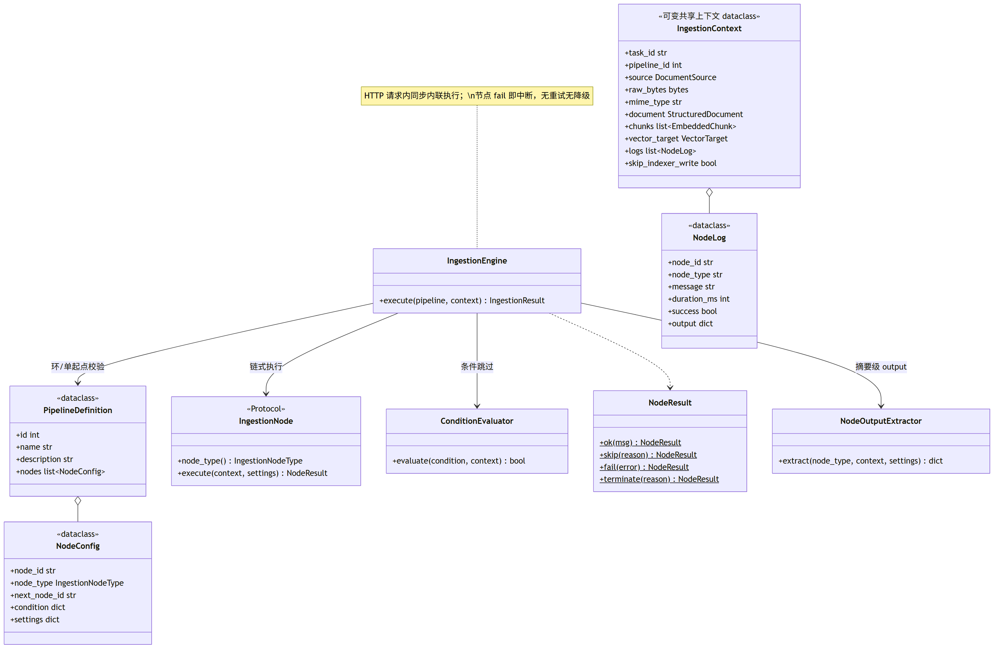

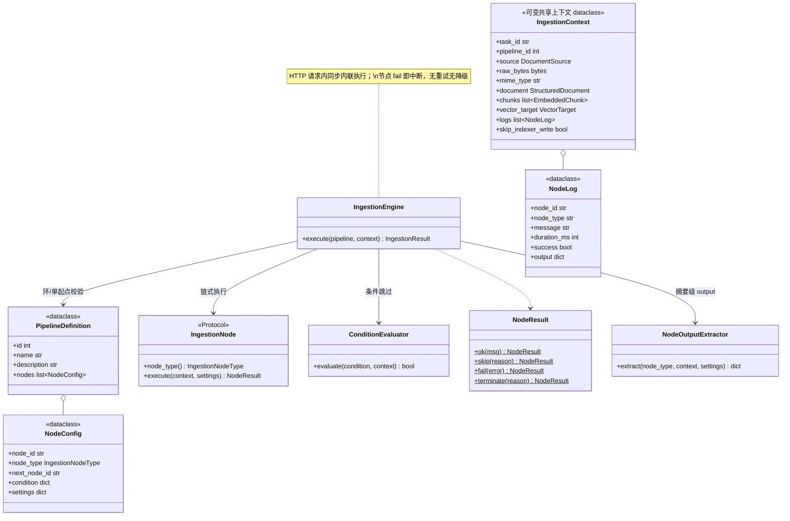

**类图（视角：六类节点与 Fetcher 策略）**——所有节点实现同一 `IngestionNode` Protocol；`FetcherNode` 按 `SourceType` 委派 `DocumentFetcher`（`FILE` 无 fetcher，靠预置字节短路）：

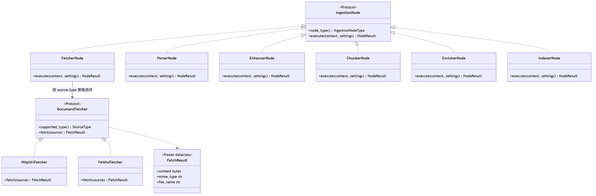

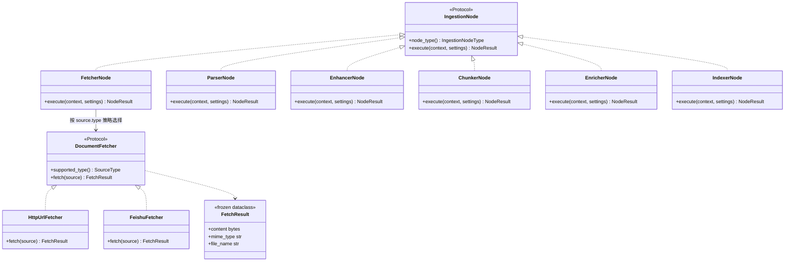

## 10. 远程定时刷新

目标：URL 源文档按 cron 周期自动重抓 + 变更检测 + 重新入库。由 worker 内 asyncio 定时器扫描，调度互斥、任务领取和崩溃恢复统一落在 PostgreSQL，不额外维护 Redis 调度锁。

### 10.1 组件与流程

- **扫描器（worker 内 asyncio 定时任务）**：每 `scan-delay-ms=10000`（10s）开启一个短事务，使用 `SELECT ... FOR UPDATE SKIP LOCKED` 查询 `enabled=1 AND next_run_time <= now` 的 schedule，按时间升序 `LIMIT batch_size=20`。对每行计算并提前写入下一次 `next_run_time`，同时 INSERT `t_async_task(task_type='schedule-refresh', biz_key=schedule_id, payload={scheduleId, scheduleVersion})`；活跃任务部分唯一索引消除重复投递。事务提交后再 NOTIFY。
- **执行所有权**：刷新处理器只在成功 claim `t_async_task` 后执行，任务 `lease_until` 是唯一执行租约；长任务由统一 `LeaseManager` 心跳续约。进程崩溃后由任务恢复器把 task/document/log 一起重置 pending，无 Redis 锁与第二套续约状态机。
- **配置版本**：`t_knowledge_document_schedule.version` 每次编辑、启停时递增。任务 payload 携带 `scheduleVersion`；执行前版本不匹配或 schedule 已禁用则记 skipped，防止旧任务覆盖新配置。
- **状态机写回（`ScheduleStateManager`）**：写回以 `schedule_id + version` 为条件；版本变化时只结束 exec，不覆盖新配置。方法：`markSkipped`（带回写 etag/lastModified/contentHash 或不带）、`markSuccess`（写 lastSuccessTime、清 lastError、回写三个变更指纹）、`markFailed`、`disable`。exec message 截断 512 字符。
- **刷新处理（`ScheduleRefreshProcessor`）**，阶段机 INIT → DOC_OCCUPIED → CHUNK_STARTED → CHUNK_COMPLETED → FILE_SWITCHED：
  1. 校验任务租约与 scheduleVersion → 启动统一任务租约心跳。
  2. 读 schedule + document：文档不存在/已删除/已禁用/非 URL/无 cron/cron 非法 → `disable` 或 skipped 终止；`nextRunTime` 已由扫描事务推进。
  3. 插 exec 行（status=running）。
  4. **变更检测** `fetchIfChanged(url, lastEtag, lastModified, lastContentHash)`：HEAD 比对 ETag（两者都有时）否则 Last-Modified → 未变化 skipped；下载临时文件边下边算 SHA-256 → hash 相同 skipped；否则 changed（返回 tempFile/size/contentType/fileName/hash/etag/lastModified）。
  5. 在短事务内把文档/exec 置 running；若已有同文档活跃任务则 skipped。
  6. 新文件上传对象存储（namespace=collectionName）→ 更新文档运行时副本（docName/fileUrl/fileType/fileSize）→ 校验任务租约与 scheduleVersion → 调分块内核重新解析入库。
  7. 分块非 success → markFailed；否则落文件元数据 → markSuccess。
  8. finally：停止任务租约心跳；FILE_SWITCHED 后删旧文件，CHUNK_COMPLETED 前失败删新文件；租约丢失时不再写成功状态，交由统一恢复器重投或终止。
- **卡死恢复（worker 内 asyncio 定时任务）**：每 60s（initial delay 30s）按 `t_async_task.lease_until` 恢复；task/document/exec 状态必须在同一事务中推进，超过最大重试才置 failed。
- `CronScheduleHelper`：`next_run_time(cron, from)`；`is_interval_less_than(cron, from, minSeconds)`（比较连续两次触发间隔）；启用定时必须有 cron 且周期 ≥ `min-interval-seconds=60`，否则入参报错。
- `upsertSchedule` / `syncScheduleIfExists`：仅 URL 类型生效；doc 禁用或无 cron → enabled=0；删除文档先删 exec 再删 schedule。

## 11. PG 任务队列与 `t_async_task`

异步任务采用 **PG 任务队列单层模型**：`t_async_task` 表即队列，入队是在业务事务内 INSERT 任务行，与业务写同事务提交；worker 为独立 asyncio 进程（`python -m app.worker`），通过 `SELECT ... FOR UPDATE SKIP LOCKED` 原子 claim（PENDING→RUNNING，带 owner/租约），支持多实例水平扩展；唤醒使用 PG `LISTEN/NOTIFY`，并以短轮询兜底。

### 11.1 文档分块任务

核心不变量：**业务状态与任务行在同一事务提交；只有 Worker 成功领取任务后，文档和执行日志才进入 running**。排队时间不计入执行超时。

```
POST /knowledge-base/docs/{doc-id}/chunk:
  单 DB 事务内：
    ① 校验文档存在且可重新处理；文档 status 置/保持 'pending'
    ② INSERT t_knowledge_document_chunk_log(status='pending', ...)
    ③ upsertSchedule（URL 源且有 cron）
    ④ INSERT t_async_task(event_id=UUIDv7, task_type='doc-chunk',
                          biz_key=doc_id, status='pending', ...)
       -- 任务行即入队，与业务写同事务提交
       -- 活跃任务唯一约束冲突 → "正在进行中"
  事务提交后：NOTIFY async_task_channel 唤醒 worker

worker chunk_document:
  领取短事务：SELECT ... FOR UPDATE SKIP LOCKED 原子 claim；
             task pending→running，文档 pending→running，log pending→running，
             同时写 owner + lease_until + start_time 后立即提交
  幂等：event_id 保证同一事件只完成一次；业务副作用另有数据库唯一约束/CAS
  回查：文档、任务、log 三者状态匹配，否则记录一致性错误并进入恢复流程
  执行：读对象存储字节 → VectorTargetResolver.resolve(kb)
       → IngestionKernel.run(...) → 成功: status='success' + chunk_count 回填
       失败: status='failed' + error_message；chunk_log 回填各段耗时与状态
```

- 文档状态机：`pending(含排队/待重试) → running → success | failed`（`DocumentStatus`）。重复触发由 `t_async_task` 活跃任务部分唯一索引拦截。
- 恢复：Worker 每 60s 扫描租约过期的 RUNNING 任务，在一个短事务中将 task、document、log 一起重置为 pending 并增加重试次数；超过 `max_retries` 才将三者置 failed。不得只把 task 重置 pending、同时把 document 置 failed。
- `processMode=pipeline`：M4 落地后走 Pipeline 执行（`skipIndexerWrite=true` + 调用方事务统一写向量）；在功能完成前显式返回"管道模式尚未开放"，不得静默降级。

### 11.2 知识库清理任务

删除知识库采用“事务内软删并入队、worker 异步清理”的流程：

- 通用异步任务表 **`t_async_task`（Alembic baseline）**：`id BIGINT GENERATED BY DEFAULT AS IDENTITY` PK、`event_id UUID UNIQUE NOT NULL`（每次投递的 UUIDv7）、`task_type VARCHAR(32)`、`biz_key VARCHAR(128)`（业务聚合键，如 `kb-cleanup:{kbId}`）、`payload JSONB`、`status VARCHAR(16)`（pending/running/success/failed）、`owner VARCHAR(64)`、`lease_until TIMESTAMP`、`retry_count INTEGER DEFAULT 0`、`max_retries INTEGER DEFAULT 5`、`next_retry_at TIMESTAMP`、`error_message TEXT`、审计列。使用部分唯一索引 `CREATE UNIQUE INDEX uk_async_task_active ON t_async_task(task_type, biz_key) WHERE status IN ('pending','running')` 防止同一业务同时存在多个活跃任务；success/failed 历史行不阻止后续合法重投。需要 last-write-wins 的事件（如反馈变更）在活跃冲突时原子更新 payload，其他任务返回重复提交。
- 流程：`DELETE /knowledge-base/{kb-id}` → 校验无文档 → 单事务内（软删 kb 行 + 插 `t_async_task(task_type='kb-cleanup', biz_key, payload={kbId, collectionName, operator})`）→ 提交后 NOTIFY 唤醒 worker。
- worker `cleanup_knowledge_base`：依次 `drop_vector_space(collectionName)` → 删对象存储目录 → ES `deleteByCollection` → LightRAG `deleteByCollection`（全部幂等）；任一失败 → `retry_count+1` + 指数退避 `next_retry_at`，超 `max_retries` 置 failed 告警。worker 定时任务每 60s 扫描 `next_retry_at <= now` 的 failed/pending 任务重投；RUNNING 租约 `lease_until` 超时重置 pending。

### 11.3 任务总表（`app/worker.py` 任务注册与定时器）

| 任务 | 类型 | 说明 |
|---|---|---|
| `chunk_document(doc_id, log_id, operator)` | 队列任务（`t_async_task` 行） | 文档分块入库（11.1） |
| `cleanup_knowledge_base(task_id)` | 队列任务 | 知识库清理（11.2） |
| `refresh_schedule(schedule_id)` | 队列任务 | 单文档定时刷新（10.1） |
| `scan_due_schedules` | worker 定时任务（10s） | 扫描到期 schedule 并投递刷新任务 |
| `recover_stuck` | worker 定时任务（60s） | 租约超时后 task/document/log 原子重置 pending；超过最大重试才统一 failed |
| 反馈持久化、会话摘要 | 队列任务 | 见 01 文档（本域不展开） |

可靠性三件套：事务内 INSERT 任务行（与业务写同提交）、`FOR UPDATE SKIP LOCKED` 原子 claim + RUNNING 租约超时重投、数据库 `event_id`/业务唯一约束/CAS 保证幂等。Redis SETNX 仅作为减压优化，不作为正确性的唯一依据；重试以任务表 `retry_count/max_retries` 字段为准。

**类图（视角：自研 PG 任务队列组件）**——`t_async_task` 表即队列，`TaskQueue` 封装入队/领取/确认，`ClaimLoop` 驱动 `TaskHandler` 执行，`LeaseManager` 与 `TaskNotifier` 分别承载租约与唤醒（`app/worker.py` 装配）：

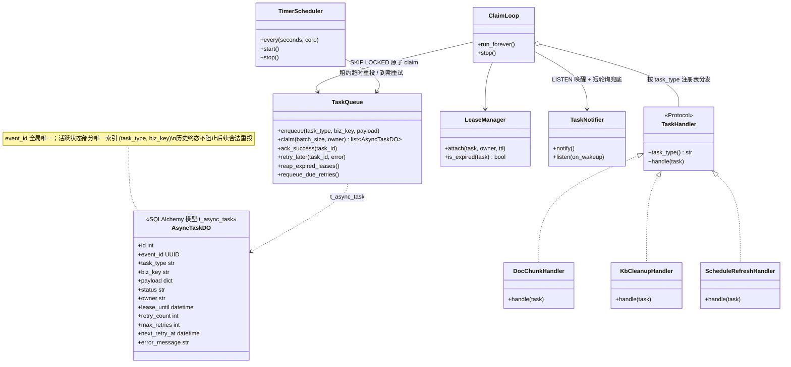

**时序图（视角：入队 → 唤醒 → 领取 → 执行 → 确认/重投）**——对应 11.1 文字流程的组件交互视图：

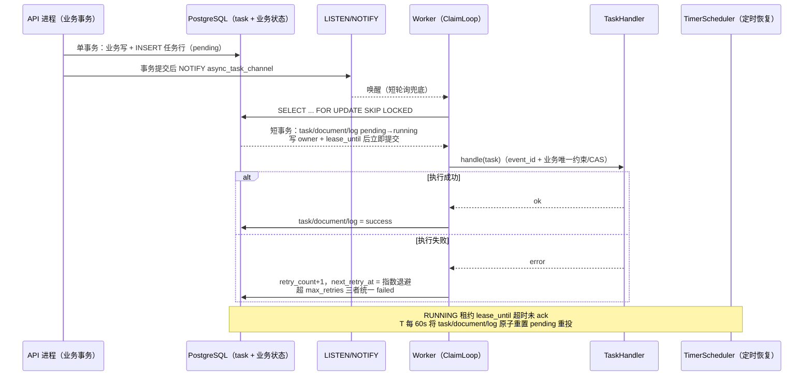

## 12. 领域模型与表设计

本章表结构属于项目独立 Schema，由 Alembic baseline 创建。仅在关系库内部使用的主键采用 `BIGINT GENERATED BY DEFAULT AS IDENTITY`；需落库前预分配或跨存储对齐的业务标识（chunkId 等）采用 UUIDv7，并在 PostgreSQL 中优先存为原生 `UUID`。统一保留审计列 `create_time/update_time` 和逻辑删 `deleted SMALLINT DEFAULT 0`；`t_async_task` 与业务表一起进入首个 baseline。

### 12.1 `t_knowledge_base` ↔ `KnowledgeBaseDO`

`id` PK；`name VARCHAR(128) NOT NULL`（`idx_kb_name`）；`embedding_model VARCHAR(64) NOT NULL`（库级模型，L2；有分块文档后禁改）；`collection_name VARCHAR(64) NOT NULL`（**唯一 `uk_collection_name`**，兼任：向量分区键 + 对象存储目录名）；`created_by BIGINT NOT NULL`（对应 `t_user` 自增主键）、`updated_by`；审计 + `deleted`。

### 12.2 `t_knowledge_document` ↔ `KnowledgeDocumentDO`

`id` PK；`kb_id`（`idx_kb_id`）；`doc_name VARCHAR(256)`；`enabled SMALLINT DEFAULT 1`；`chunk_count INTEGER DEFAULT 0`；`file_url VARCHAR(1024)`（对象存储裸 key）；`file_type VARCHAR(16)`（扩展名短标签，展示用）；`mime_type VARCHAR(128)`（探测值，解析路由用）；`file_size BIGINT`；`process_mode VARCHAR(16) DEFAULT 'chunk'`（`chunk`/`pipeline`）；`status VARCHAR(16) DEFAULT 'pending'`（`pending/running/failed/success`）；`source_type VARCHAR(16)`（`file/url`，`file` 兼容别名 `localfile/local_file`）；`source_location VARCHAR(1024)`；`schedule_enabled SMALLINT`；`schedule_cron VARCHAR(64)`；`ingestion_spec JSONB`（L3 文档级入库参数）；`pipeline_id BIGINT`（引用 `t_ingestion_pipeline.id`）；审计 + `deleted`。

### 12.3 `t_knowledge_chunk` ↔ `KnowledgeChunkDO`

`id UUID` PK（= chunkId，UUIDv7；ES `_id` 使用标准字符串）；`kb_id`；`doc_id`（`idx_doc_id`）；`chunk_index INTEGER NOT NULL`；`content TEXT NOT NULL`；`content_hash VARCHAR(64)`（SHA-256）；`char_count`、`token_count INTEGER`；`embedding_text TEXT`（向量文本=章节路径+正文，**重嵌入唯一正确来源**）；`enabled SMALLINT DEFAULT 1`；审计 + `deleted`。**向量不在此表**。

### 12.4 其余表

- `t_knowledge_vector`（pgvector）：`id UUID` PK（=chunkId，UUIDv7）、`collection_name VARCHAR(64)`（`idx_kv_collection_name`）、`content TEXT`、`metadata JSONB`（GIN `idx_kv_metadata`）、`embedding vector(1536)`（HNSW `vector_cosine_ops`）。
- `t_knowledge_document_chunk_log`：`doc_id`（索引）、`status`、`process_mode`、`parse_profile`、`pipeline_id`、`extract/chunk/embed/persist/total_duration BIGINT`（毫秒）、`chunk_count`、`error_message TEXT`、`start_time/end_time`。VO 的 `otherDuration = total − 其余各项`（pipeline 模式不减 extract/embed；下限 0），**无此列**。
- `t_knowledge_document_schedule`：`doc_id`（**唯一 `uk_doc_id`**）、`kb_id`、`cron_expr VARCHAR(64)`、`enabled SMALLINT DEFAULT 0`、`version BIGINT DEFAULT 0`、`next_run_time`（`idx_next_run`）、`last_run_time`、`last_success_time`、`last_status`、`last_error VARCHAR(512)`、变更指纹 `last_etag VARCHAR(256)`/`last_modified VARCHAR(256)`/`last_content_hash VARCHAR(128)`；不设置 Redis/DB 镜像锁列。
- `t_knowledge_document_schedule_exec`：`schedule_id`（联合索引 `idx_schedule_time(schedule_id, start_time)`）、`doc_id`、`kb_id`、`status`（`running/success/failed/skipped`）、`message VARCHAR(512)`、`start_time/end_time`、`file_name VARCHAR(512)`、`file_size BIGINT`、`content_hash`、`etag`、`last_modified`。
- `t_ingestion_pipeline`：`name`（唯一索引）、`description`、审计 + `deleted`。
- `t_ingestion_pipeline_node`：`pipeline_id`、`node_id`、`node_type`、`next_node_id`、`settings_json JSONB`、`condition_json JSONB`、审计 + `deleted`。
- `t_ingestion_task`：`pipeline_id`、`source_type`、`source_location`、`source_file_name`、`status`、`chunk_count`、`error_message`、`logs_json JSONB`（去 output 的摘要）、`metadata_json JSONB`（context.metadata + keywords + questions）、`started_at`、`completed_at`、审计 + `deleted`。
- `t_ingestion_task_node`：`task_id`、`pipeline_id`、`node_id`、`node_type`、`node_order`（从起点沿链 1 起编号）、`status`（`success/failed/skipped`）、`duration_ms`、`message`、`error_message`、`output_json TEXT`（1MB 截断）、审计 + `deleted`。
- `t_async_task`：见 11.2，与业务表一同纳入 Alembic baseline。

`IngestionSpecCodec` 线路键：`maxChars`/`overlapChars`/`rowsPerChunk`/`toleranceFactor`/`parseProfile`；哨兵 `-1` ↔ 整文档；`read`（空/损坏 → defaults）、`write`（规整 JSON）、`normalize`（空→null 列留空=走默认；非法 JSON→ClientException；越界值翻译成用户可读错）。出参前旧行 `Integer.MAX_VALUE` 哨兵翻译成 `-1`。

## 13. 对外 API 契约

全部挂在 `/api/ragent` 下，统一 `Result<T>{code,message,data}`，分页 `IPage{records,total,size,current}`。路径、方法和参数以现有前端调用契约为准。

### 13.1 知识库

| 方法 | 路径 | 入参 | 返回 data |
|---|---|---|---|
| POST | `/knowledge-base` | `{name, embeddingModel, collectionName}` | `String` kbId |
| PUT | `/knowledge-base/{kb-id}` | `{id, name, embeddingModel}`（重命名/改模型，有分块文档禁改模型） | `null` |
| DELETE | `/knowledge-base/{kb-id}` | — | `null`（异步清理，见 11.2） |
| GET | `/knowledge-base/{kb-id}` | — | `KnowledgeBaseVO` |
| GET | `/knowledge-base` | query `current/size/name`（模糊） | `IPage<KnowledgeBaseVO>` |

`KnowledgeBaseVO`：`id, name, embeddingModel, collectionName, documentCount, createdBy, createTime, updateTime`。

### 13.2 文档

| 方法 | 路径 | 入参 | 返回 data |
|---|---|---|---|
| GET | `/knowledge-base/docs/ingestion-spec-schema` | — | `IngestionSpecSchemaVO` |
| POST | `/knowledge-base/{kb-id}/docs/upload` | multipart：`file`（可选）+ `sourceType(file/url), sourceLocation, scheduleEnabled, scheduleCron, processMode(chunk/pipeline), ingestionSpec(JSON, 仅 chunk), pipelineId(仅 pipeline)` | `KnowledgeDocumentVO` |
| POST | `/knowledge-base/docs/{doc-id}/chunk` | — | `null`（触发分块，见 11.1） |
| DELETE | `/knowledge-base/docs/{doc-id}` | — | `null`（逻辑删 + 删向量 + 删文件） |
| GET | `/knowledge-base/docs/{docId}` | — | `KnowledgeDocumentVO` |
| PUT | `/knowledge-base/docs/{docId}` | `{docName, processMode, ingestionSpec, pipelineId, sourceLocation, scheduleEnabled, scheduleCron}` | `null` |
| GET | `/knowledge-base/{kb-id}/docs` | query `current/size/status/keyword` | `IPage<KnowledgeDocumentVO>` |
| GET | `/knowledge-base/docs/search` | `keyword`（可空）、`limit`（默认 8，钳 [1,20]） | `List<KnowledgeDocumentSearchVO>` |
| PATCH | `/knowledge-base/docs/{docId}/enable` | `value: bool` | `null` |
| GET | `/knowledge-base/docs/{docId}/chunk-logs` | `current/size` | `IPage<KnowledgeDocumentChunkLogVO>` |
| GET | `/knowledge-base/docs/{docId}/preview` | — | `String`（markdown 渲染） |
| GET | `/knowledge-base/docs/{docId}/file` | — | 文件流（非 Result；`Content-Disposition: inline`，类型按扩展名映射，缺省 `application/octet-stream`） |

`KnowledgeDocumentVO`：`id, kbId, docName, sourceType, sourceLocation, scheduleEnabled, scheduleCron, enabled, chunkCount, fileUrl, fileType, fileSize, processMode, ingestionSpec（出参经 codec 归一化，旧哨兵→-1）, pipelineId, status, createdBy, updatedBy, createTime, updateTime, chunksEdited`（非持久化，由 `chunk.update_time > create_time + 1s` 推断）。

`IngestionSpecSchemaVO`：`parseProfileLabel="表格结构"`；`parseProfiles=[{value:"fast",label:"规整表格",hint},{value:"fidelity",label:"复杂表格",hint}]`；`parseProfileExtensions`（由 `profileSensitiveMimeTypes()` 推导）；`budgetFields`（4 字段：`maxChars`"块大小"、`overlapChars`"块重叠"、`rowsPerChunk`"表格每块行数"、`toleranceFactor`"结构容忍倍数"，各带 `defaultValue/min/max/recommendedMin/recommendedMax/hint/detail`，范围取 `ChunkBudget` 常量，推荐区间 512~8192 / 64~1024 / 20~50 / 2~4）；`wholeDocumentSentinel=-1`。

### 13.3 Chunk

| 方法 | 路径 | 入参 | 返回 data |
|---|---|---|---|
| GET | `/knowledge-base/docs/{doc-id}/chunks` | query `current/size/enabled` | `IPage<KnowledgeChunkVO>` |
| POST | 同上 | `{content, index?(空→最大 chunkIndex+1), chunkId?}` | `KnowledgeChunkVO` |
| PUT | `.../chunks/{chunk-id}` | `{content}` | `null` |
| DELETE | `.../chunks/{chunk-id}` | — | `null` |
| PATCH | `.../chunks/{chunk-id}/enable` | `value: bool` | `null` |
| PATCH | `.../chunks/batch-enable` | `value: bool` + body `{chunkIds}`（必填，上限 500） | `null` |

`KnowledgeChunkVO`：`id, kbId, docId, chunkIndex, content, contentHash, charCount, tokenCount, enabled, createTime, updateTime`。人工块规则：文档非 RUNNING 才可操作；`embedding_text = content`；create 后 `chunk_count+1`，delete 用 `CASE WHEN > 0 THEN -1`；向量同步走 `index_document_chunks / update_chunk / delete_chunk(s)`；重嵌入经 `ChunkAssembler.restore` + 库存 `embedding_text`。文档禁用 = 文档+全部 chunk `enabled=0` + 删向量；启用 = 先重嵌入再事务更新 + 写向量。

### 13.4 入库 Pipeline

| 方法 | 路径 | 入参 | 返回 data |
|---|---|---|---|
| POST | `/ingestion/pipelines` | `{name, description, nodes:[{nodeId, nodeType, settings, condition, nextNodeId}]}` | `String` id（name 唯一，重名报"流水线名称已存在"） |
| PUT | `/ingestion/pipelines/{id}` | 同上（全可选；`nodes != null` 才整体替换：先物理删再插） | `null` |
| GET | `/ingestion/pipelines/{id}` | — | `IngestionPipelineVO` |
| GET | `/ingestion/pipelines` | `pageNo/pageSize/keyword`（name like，updateTime 倒序） | `IPage<IngestionPipelineVO>` |
| DELETE | `/ingestion/pipelines/{id}` | — | `null`（软删管道 + 逻辑删节点） |
| POST | `/ingestion/tasks` | `{pipelineId, source:{type, location, fileName, credentials}, metadata, vectorSpaceId}`（同步执行） | `IngestionResult` |
| POST | `/ingestion/tasks/upload` | multipart：`pipelineId` + `file`（预置字节，fetcher 短路） | `IngestionResult` |
| GET | `/ingestion/tasks/{id}` | — | `IngestionTaskVO` |
| GET | `/ingestion/tasks/{id}/nodes` | — | `List<IngestionTaskNodeVO>` |
| GET | `/ingestion/tasks` | `pageNo/pageSize/status`（createTime 倒序） | `IPage<IngestionTaskVO>` |

VO：`IngestionPipelineVO{id, name, description, createdBy, nodes:[{id, nodeId, nodeType, settings, condition, nextNodeId}], createTime, updateTime}`；`IngestionTaskVO{id, pipelineId, sourceType, sourceLocation, sourceFileName, status, chunkCount, errorMessage, logs, metadata, startedAt, completedAt, createdBy, createTime, updateTime}`；`IngestionTaskNodeVO{id, taskId, pipelineId, nodeId, nodeType, nodeOrder, status, durationMs, message, errorMessage, output, createTime, updateTime}`。

## 14. Python 模块与类映射

落到 00 文档目录结构（`app/core` 为无状态模态层，`app/knowledge`、`app/ingestion` 为业务域）：

```
app/
├── core/
│   ├── parser/
│   │   ├── models.py            # Block 七型 + Provenance/AssetRef/ParsedDocument（dataclass frozen）
│   │   ├── registry.py          # ParserRegistry / ParseProfile / ParserType（启动自检）
│   │   ├── mime.py              # MimeTypeDetector（filetype+zipfile+扩展名表）
│   │   ├── text_parser.py       # TextDocumentParser ← TikaDocumentParser（BS4/striprtf/json/xml）
│   │   ├── markdown_parser.py   # MarkdownDocumentParser（markdown-it-py）
│   │   ├── excel/               # ExcelDocumentParser + normalizer/value_formatter/hyperlink_resolver
│   │   │                        #   （openpyxl 主，xlrd 兜底 xls）
│   │   ├── csv_parser.py        # CsvDocumentParser
│   │   ├── mineru/              # MinerUDocumentParser / MinerUClient（httpx）/ polling（asyncio）
│   │   │                        # / result_unpacker / properties
│   │   ├── image_parser.py      # ImageDocumentParser（cairosvg + model_runtime.vlm）/ ImageParseSettings
│   │   ├── cleanup.py           # TextCleanupUtil
│   │   └── renderer.py          # BlockTextRenderer
│   ├── chunk/
│   │   ├── models.py            # Chunk/ChunkDraft/EmbeddedChunk/ChunkMetadata
│   │   ├── budget.py            # ChunkBudget（默认值/上限/哨兵）
│   │   ├── assembler.py         # ChunkAssembler（UUIDv7 分配 chunkId、向量文本前缀、restore）
│   │   ├── text_splitter.py     # TextSplitter
│   │   ├── service.py           # ChunkingService（两分支）
│   │   └── blockaware/          # dispatcher / heading_handler / chunk_context
│   │        ├── heading_chunker.py  paragraph_chunker.py  table_chunker.py
│   │        ├── html_table_chunker.py  list_chunker.py  code_chunker.py
│   │        ├── image_chunker.py  packer.py（ChunkPacker）
│   └── ingest/
│       ├── kernel.py            # IngestionKernel / DefaultIngestionKernel
│       ├── spec.py              # IngestionSpec / IngestionOutcome / IngestionTimings / DocumentRef
│       ├── target.py            # VectorTarget
│       ├── embed.py             # ChunkEmbeddingService
│       └── sink.py              # ChunkSink Protocol / ChunkIndexWriter（事务扇出）
├── knowledge/
│   ├── models.py                # SQLAlchemy：knowledge_base/document/chunk/chunk_log/schedule/schedule_exec
│   ├── schemas.py               # Pydantic：Request/VO（对齐第 13 节）
│   ├── api.py                   # 三个 Controller 的 FastAPI router
│   ├── service.py               # KnowledgeBase/Document/Chunk/DocumentSchedule Service
│   ├── sink.py                  # RelationalChunkSink（@Order 最高）
│   ├── vector_sink.py           # VectorChunkSink（pgvector）+ ES/LightRAG 装饰器
│   ├── support.py               # VectorTargetResolver / IngestionSpecCodec / SpecSchemaProvider
│   │                            # / ChunkMetadataResolver
│   ├── storage.py               # 对象存储（boto3，桶 ragent-sources，namespace=collectionName）
│   ├── schedule/
│   │   ├── scanner.py           # 定时扫描（worker 内 asyncio 定时器触发）+ 投递
│   │   ├── dispatch.py          # SKIP LOCKED 扫描、推进 next_run_time、事务内投递刷新任务
│   │   ├── state.py             # ScheduleStateManager / ScheduleStateContext
│   │   ├── processor.py         # ScheduleRefreshProcessor（阶段机）
│   │   └── cron_helper.py       # CronScheduleHelper（croniter）
│   └── ratelimit.py             # 上传信号量中间件（429）
├── ingestion/
│   ├── models.py                # pipeline/pipeline_node/task/task_node 四表
│   ├── schemas.py               # PipelineDefinition/NodeConfig/NodeLog/NodeResult/IngestionResult
│   │                            # / DocumentSource/StructuredDocument/IngestionContext/枚举
│   ├── engine/
│   │   ├── engine.py            # IngestionEngine
│   │   ├── condition.py         # ConditionEvaluator（JSON DSL + 受限表达式）
│   │   └── output.py            # NodeOutputExtractor
│   ├── nodes/                   # fetcher/parser/enhancer/chunker/enricher/indexer 六节点
│   │   └── settings.py          # 五个 Settings Pydantic 模型
│   ├── fetchers/
│   │   ├── base.py              # DocumentFetcher Protocol / FetchResult
│   │   ├── feishu.py            # FeishuFetcher
│   │   ├── http_url.py          # HttpUrlFetcher / HttpClientHelper（httpx）
│   ├── prompts.py               # Enhancer/Enricher Prompt 管理（config/prompts 覆盖）
│   ├── service.py               # Pipeline/Task Service（同步执行 + 日志落库）
│   └── api.py                   # Pipeline/Task router
└── worker.py                    # 独立 asyncio 进程（python -m app.worker）：SKIP LOCKED claim 循环 + LISTEN/NOTIFY + 定时任务（11.3）
```

依赖方向遵守 `framework ← model_runtime / system ← knowledge / ingestion ← rag ← admin ← main`：`core/` 只依赖 `framework` 与 `model_runtime`；`knowledge`、`ingestion` 依赖 `core`；反向禁止。

## 15. 配置项清单

`config/application.yaml` 由 pydantic-settings 加载，支持 `RAGENT_` 前缀环境变量覆盖。默认值如下：

| 键 | 默认 | 说明 |
|---|---|---|
| `rag.default.dimension` | 1536 | 部署级向量维度（L1），启动期与 embedding 候选一致性校验 |
| `rag.default.collection-name` | — | Indexer partition 最终兜底 |
| `mineru.api-url` | `https://mineru.net/api/v4` | SaaS 地址 |
| `mineru.api-key` | env `MINERU_API_KEY` | Bearer |
| `mineru.poll-interval-seconds` | 5 | 轮询间隔（下限 0.1s） |
| `mineru.timeout-seconds` | 300 | 单文档解析超时（+30s 宽限） |
| `mineru.enable-table` / `enable-formula` | true / true | 提交参数 |
| `mineru.ocr` | false | 提交参数 `is_ocr` |
| `mineru.language` | `ch` | 提交参数 |
| `mineru.concurrency-limit` | 16（yaml 5） | Redis 信号量许可数 |
| `mineru.semaphore-name` | `rag:mineru:parse` | 信号量 key |
| `mineru.max-wait-seconds` / `lease-seconds` | 30 / 900 | 取许可等待 / 租约（须 > timeout） |
| `rag.image-parse.description-prompt` | 见 5.6 | VLM 图生文 prompt |
| `rag.image-parse.max-output-tokens` | 1024 | ≤0 不限制 |
| `rag.image-parse.embedded-describe-enabled` | true | MinerU 内嵌图图生文开关 |
| `ai.vlm.default-model` | `qwen-vl-max` | VLM 模型（provider bailian，候选列表首个，无 fallback） |
| `rag.knowledge.schedule.scan-delay-ms` | 10000 | 扫描周期（worker 内定时任务） |
| `rag.knowledge.schedule.batch-size` | 20 | 单轮扫描条数 |
| `rag.knowledge.schedule.min-interval-seconds` | 60 | cron 最小周期 |
| `rag.task.lease-seconds` / `heartbeat-seconds` | 按任务类型配置 | 长任务统一租约与心跳；租约过期触发 task/document/log 原子恢复 |
| `rag.semaphore.document-upload.name` | `rag:document:upload` | 上传信号量 key |
| `rag.semaphore.document-upload.max-concurrent` | 10 | 许可数 |
| `rag.semaphore.document-upload.max-wait-seconds` / `lease-seconds` | 30 / 30 | 等待 / 租约 |
| `rag.upload.max-file-size` | 50MB | multipart/远程抓取上限（对应 `spring.servlet.multipart.max-file-size`） |
| `rag.storage.type` / `kb-bucket` | s3 / `ragent-sources` | 对象存储（boto3，S3 兼容） |
| `rag.task.max-retries` | 5 | `t_async_task` 最大重试 |

启动期一致性校验：21 扩展名 MIME 均在 FAST 精确表有认领；非 FAST 档无通配认领；embedding 候选维度 == `rag.default.dimension`；`lease-seconds > timeout-seconds`；档位文案只覆盖表格类 MIME。

## 16. 异常与降级策略

| 场景 | 策略 |
|---|---|
| MIME 探测无结果 / 无可认领解析器 | `ClientException`，上传前置拦截（`canParse`），已存对象存储文件删除 |
| 解析器执行失败（Tika 等价物/Excel/CSV/MinerU/Image） | `ServiceException("...解析失败: ...")`，整篇失败，任务/文档置 FAILED |
| MinerU 信号量取不到许可 | `ServiceException("MinerU 解析任务过多，请稍后重试")`（调用方可重试） |
| MinerU 轮询瞬时网络异常 | 只 log 不终止，deadline 兜底 `TimeoutError` |
| MinerU 内嵌图单张图生文失败 | 只记日志，该图向量文本退化为链接（不失败整篇） |
| 独立图片 VLM 空描述 / 调用失败 | 等同解析失败，整篇失败（无兜底降级） |
| embedding 条数不符 / 逐条维度不符 | `ServiceException`，整篇失败，**无跳过/截断**；报文提示"改用同维度模型或调整部署维度并重建向量空间" |
| 分块结果为空 | `ClientException("分块结果为空")` |
| Sink 扇出失败 | 同一 DB 事务整体回滚（关系表 + pgvector 一致）；文档置 FAILED 可重试（先删后建幂等） |
| ES / LightRAG 同步失败 | best-effort：log.warn，不回滚向量、不中断主链路 |
| 上传并发超限 | 429 `{"code":"429","message":"当前上传人数过多，请稍后再试"}` |
| Pipeline 节点失败 | 链立即中断，任务 FAILED，节点日志照常提交；无重试无降级 |
| Pipeline 条件求值异常 | 视为 false（跳过该节点，记 skipped 日志） |
| 调度锁续约失败 / 锁丢失 | 停止写调度状态；占过文档则 `markFailedIfRunning`；exec 记"调度锁已失效" |
| 远程刷新抓取失败 / 分块失败 | `markFailed`；CHUNK_COMPLETED 前失败删除新文件，保留旧文件继续服务 |
| worker 进程崩溃 | `t_async_task` 租约超时后 task/document/log 原子重置 pending 重投；超过最大重试才统一 failed |
| 消费重复投递 | 幂等装饰器（业务键 + Redis SETNX）+ CAS 状态拦截（`status != 'running'` 才可触发） |

## 17. 测试要点

### 17.1 单元测试（pytest）

- `MimeTypeDetector`：21 扩展名 × 真实样本字节 → 期望 MIME；无文件名纯字节 → OOXML/MSOffice 回落 MIME。
- `ParserRegistry`：路由表全组合（MIME × 档位）命中期望 parser；查找顺序四级；同键冲突启动失败；`profileSensitiveMimeTypes` 恰好 = Excel 两个 MIME。
- Markdown parser：标题/段落/独立图/行内图/GFM 表/HTML 表/代码围栏/列表 → Block 类型与字段断言；front-matter 落普通段落。
- Excel normalizer：合并单元格展开、多行表头 `|` 展平、相邻重复去重、空列剔除、删除线 `~~`、超链接 `[t](u)`、公式缓存值回退、隐藏 sheet 跳过、`headerRows` 解析（Number/字符串/非法回落 1）。
- CSV：UTF-8/GBK/UTF-16/BOM、引号内逗号与换行、短行补 `""`、空 CSV。
- `ChunkBudget`：默认值 `(1024,128,50,3)`、上限校验、`toleranceChars=min(maxChars*3,8192)`、哨兵。
- `TextSplitter`：三轮句界回退（`\n`/`。！？`/`.!?`+空白）、回溯窗口 = min(overlap, 剩余)、强制推进、URL 断行修复、CJK 软换行合并、overlap=0。
- 各 chunker：表格 KV 渲染（空值跳过、表头不进向量文本）、rowsPerChunk 分组边界、单行超预算原子成块；HtmlTable span 清理与预算扣减；List 按字符分组与有序续编；Code 不腰斩行、每块重复围栏；Image embeddingBody 去 URL。
- `ChunkPacker`：节边界、`minChars=256` 碎块合并、前导语并入条件（双阈值）、piece 草稿不撤销、merge 的 outlinePath 公共前缀与显式 body 规则。
- `ChunkAssembler`：missingOutlinePrefix 拼接（首块自带末级标题不重复）、`restore` 语义。
- `IngestionSpecCodec`：`-1` ↔ 整文档双向、损坏 JSON → defaults、越界值报错文案。
- `ConditionEvaluator`：12 操作符 × 组合嵌套、异常路径 → false。
- `IngestionEngine`：环检测、多起点/无起点、悬空 nextNodeId、条件跳过记日志、失败中断、maxNodes 双保险。

### 17.2 集成测试（httpx ASGITransport + 测试 PG/Redis）

- 入库主链路：上传 MD/PDF(mock MinerU) → chunk → success；`t_knowledge_chunk` 与 `t_knowledge_vector` 行数一致、ID 一致、`embedding_text` 非空；重复触发被 CAS 拦截。
- Sink 事务：Vector sink 注入故障 → 关系表无残留（回滚）；ES mock 失败 → 主链路成功。
- 维度校验：mock embedding 返回 768 维 → 整篇 FAILED，错误报文含模型/实际/期望维度。
- chunk CRUD：人工块 `embedding_text=content`、chunk_count 增减、禁用删向量/启用重嵌入、批量上限 500。
- Pipeline 端到端：upload → parser → chunker → indexer 同步执行；任务行 + 节点日志（nodeOrder、skipped 状态、1MB 截断）。
- 定时刷新：ETag 未变 → skipped；hash 相同 → skipped；变更 → 新文件切换 + 重新分块 + 旧文件删除；cron < 60s 入参报错；锁丢失路径。
- PG 任务队列可靠性：worker 模拟崩溃 → 定时恢复任务重置；`t_async_task` 重投与幂等键去重。
- 契约测试：关键接口（知识库/文档/chunk/pipeline/task）响应 JSON 结构满足统一 `Result<T>` 与现有前端消费约定。

### 17.3 业务黄金样本

- 固定样本集（md/xlsx/csv/html/图片）维护版本化预期产物，断言 Block 序列（类型+关键字段）、chunk 切分结果（块数、各块 content/embeddingText）与 `content_hash`；解析库显示值格式化的允许差异记录在白名单中。
