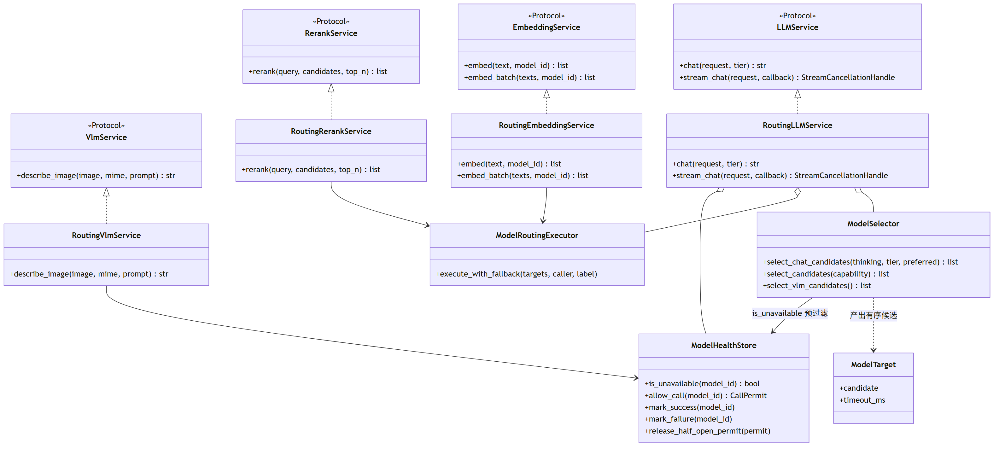
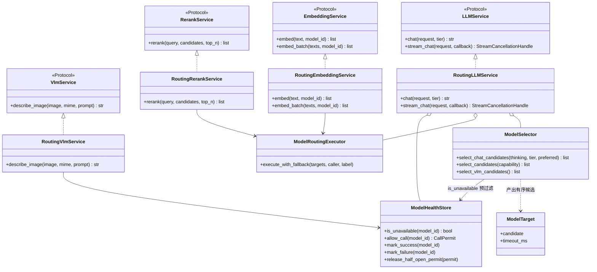
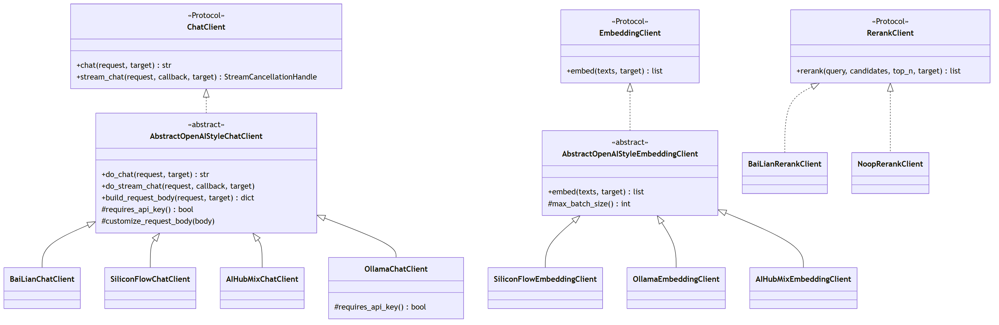
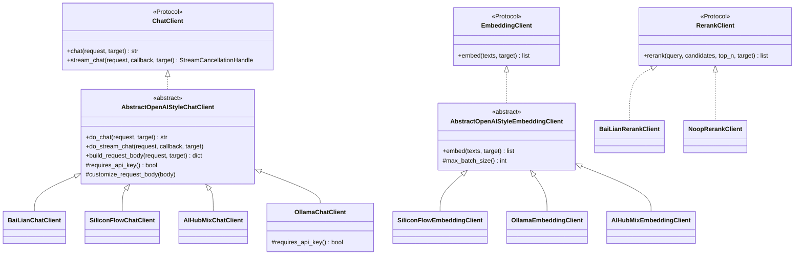
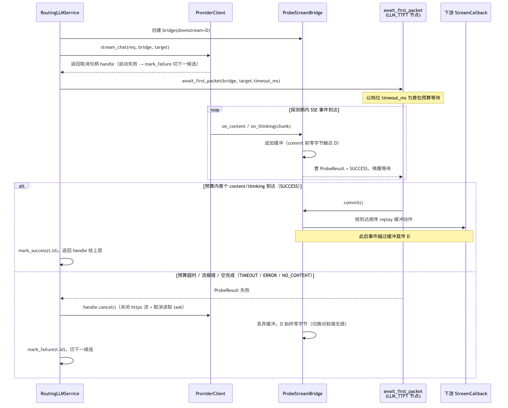
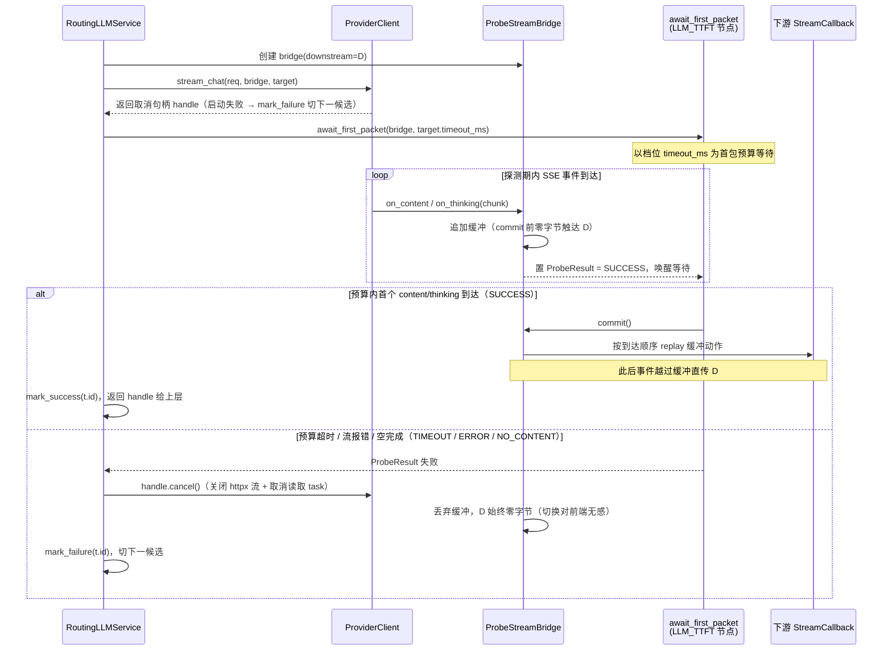
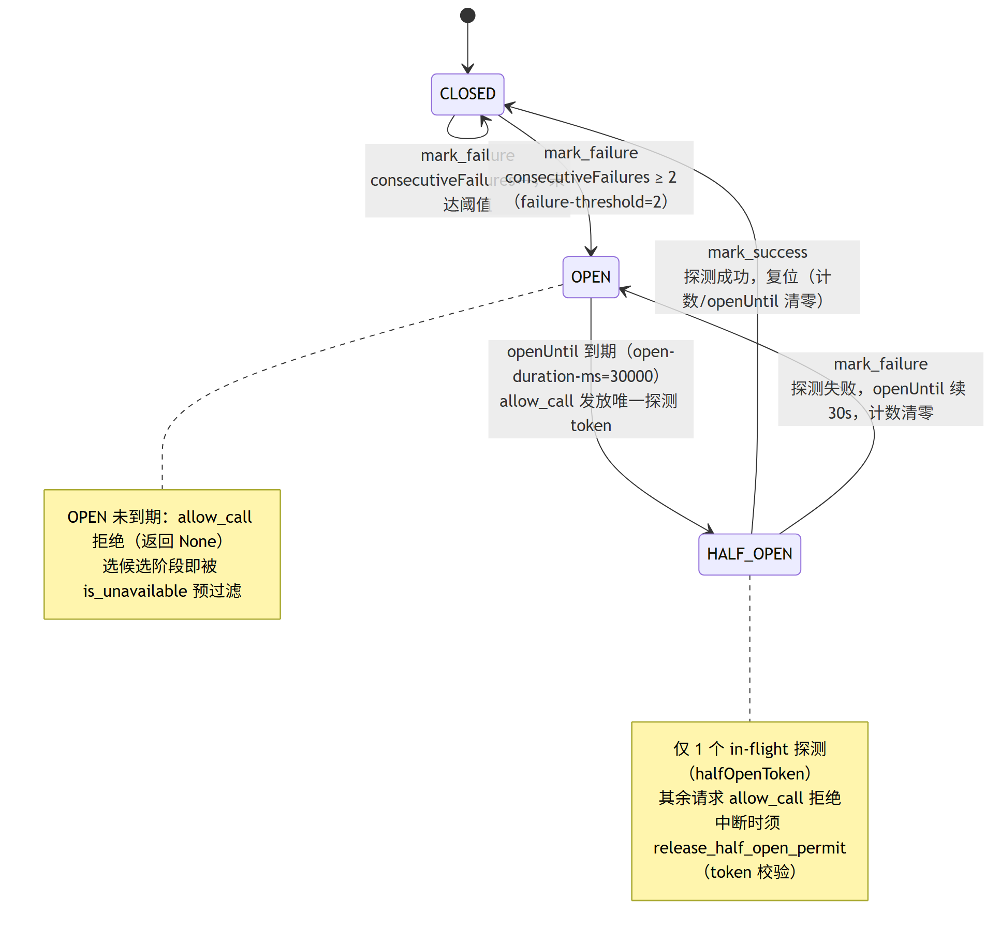
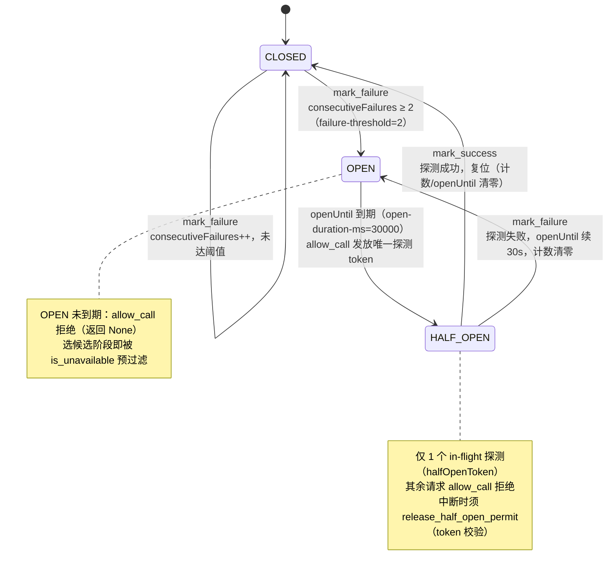
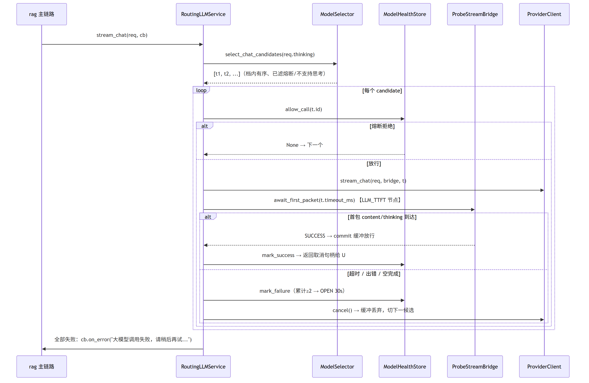
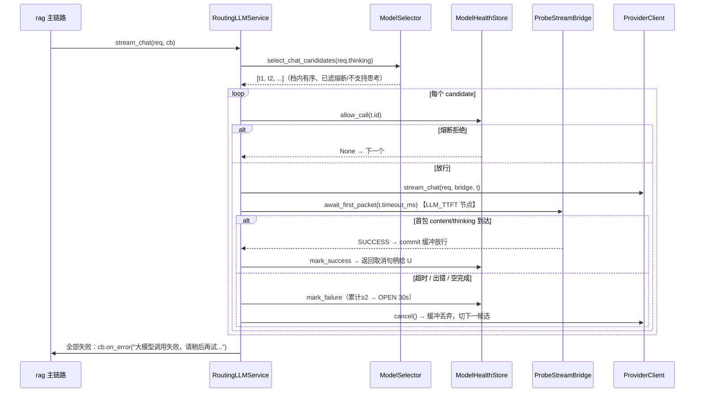

# Ragent — 模型运行时（`model_runtime`）

> 本文是 `00-总体架构与技术选型.md` 第 5.2 节的展开：OpenAI 兼容协议 + httpx 自研，不引入 LangChain 等框架。
> 网络与并发模型统一采用 asyncio + httpx 协程；本文直接定义路由、探测和熔断语义。

## 1. 功能清单

| # | 功能 | 落点 | 状态要求 |
|---|---|---|---|
| 1 | 统一接口 + Routing 实现 + 每 provider 一个 Client 三层结构（chat / embedding / rerank / vlm 四能力同构） | Protocol + Routing 类 + provider Client 类 | 必须 |
| 2 | 模型档位 fast/standard/deep，有序候选逐个容错 | `Tier` StrEnum + `ModelSelector` | 必须 |
| 3 | 档位超时预算（示例 5s/30s/120s），随 target 下沉 | 配置 + `ModelTarget.timeout_ms` | 必须 |
| 4 | `thinking=true` 自动走 deep-thinking-tier；`supportsThinking=false` 候选剔除 | `ModelSelector` 档位解析与候选构建 | 必须 |
| 5 | 辅助任务显式 FAST 档（标题/歧义/改写/摘要/推荐问题/入库增强富化） | 调用点显式传 `Tier.FAST` | 必须 |
| 6 | preferredModelId 置队首 + 回退档位其余候选 | `ModelSelector.select_chat_candidates` | 必须 |
| 7 | 流式首包探测（缓冲-提交桥）：预算内等第一个 content/thinking 包，成功 commit 放行；超时/出错/空完成取消该流切下一候选 | asyncio `ProbeStreamBridge` | 必须 |
| 8 | 三态熔断：连续失败 ≥2 熔断 OPEN 30s，HALF_OPEN 单探测 token，成功复位 | `ModelHealthStore`（asyncio 锁） | 必须 |
| 9 | OpenAI 风格 SSE 解析：`data:` 前缀、`[DONE]`、`delta.content` / `delta.reasoning_content`、`finish_reason` | `sse.py::parse_line` | 必须 |
| 10 | embedding 路由：defaultModel + priority，无档位；维度部署级固定 1536，启动校验 | embedding routing + client | 必须 |
| 11 | rerank：qwen3-rerank（百炼协议）+ noop 兜底 | rerank routing + client | 必须 |
| 12 | VLM：qwen-vl-max 图生文，取首个候选、无 fallback | VLM routing | 必须 |
| 13 | 启发式 Token 估算：ASCII 4 字符≈1、CJK 1 字≈1、其他 2 字符≈1 | `token/counter.py` | 必须 |
| 14 | HTTP 层：按档位 timeoutMs 派生客户端（缓存）、错误按状态码分类、URL 解析 | `http.py` | 必须 |
| 15 | Trace 埋点：LLM_ROUTING / LLM_TTFT / LLM_PROVIDER / VLM 节点 | `framework.trace_ctx` 装饰器 | 必须 |
| 16 | 启动期配置校验（档位引用、timeoutMs 必填、Tier 枚举覆盖、deep 档至少一个可思考候选） | lifespan 启动校验 | 必须 |
| 17 | Prompt 运行时管理：agents 人设 + prompt slot 存储/取用/回落/缓存 | `app/rag/prompt/` + `app/admin/agents/` | 必须 |
| 18 | LLM 响应清理（去 Markdown 代码围栏） | `model_runtime/util.py` | 必须 |

## 2. 总体结构：三层同构

四能力（chat / embedding / rerank / vlm）统一为三层：

```
┌────────────────────────────────────────────────────────────┐
│ 第 1 层 统一接口（Protocol）                                 │
│   LLMService / EmbeddingService / RerankService / VlmService│
│   业务侧（rag、ingestion）只依赖这一层                        │
├────────────────────────────────────────────────────────────┤
│ 第 2 层 Routing 实现（@Primary 语义，依赖注入默认实现）        │
│   RoutingLLMService / RoutingEmbeddingService /             │
│   RoutingRerankService / RoutingVlmService                  │
│   组合：ModelSelector（选候选）+ ModelRoutingExecutor（容错）  │
│        + ModelHealthStore（熔断）+ 首包探测（仅 chat 流式）    │
├────────────────────────────────────────────────────────────┤
│ 第 3 层 Provider Client（每 provider 每能力一个类）           │
│   ChatClient Protocol：BaiLian / SiliconFlow / AIHubMix /   │
│   Ollama(无 API Key) / Noop(仅 rerank)                      │
│   OpenAI 兼容协议公共逻辑沉在 Abstract 基类                   │
└────────────────────────────────────────────────────────────┘
```

- Routing 按 `target.candidate.provider` 从 `{provider: client}` 注册表取 Client。
- Provider 枚举 `ModelProvider`：`ollama` / `bailian` / `siliconflow` / `aihubmix` / `noop`。
- 能力枚举 `ModelCapability`：`CHAT` / `EMBEDDING` / `RERANK`，displayName 用于日志与报错。

下面两张类图分别给出「接口层 + 路由层」与「Provider Client 层」的静态结构，类名与第 11 节模块映射表一致。

第一张图视角：业务侧只面向四个能力 Protocol，四个 Routing 实现共享 `ModelSelector`（选候选）、`ModelRoutingExecutor`（容错执行）、`ModelHealthStore`（三态熔断）三件路由基础设施：





第二张图视角：Provider Client 层，OpenAI 兼容协议的公共逻辑（URL 解析、鉴权、请求体构造、错误分类）沉在 Abstract 基类，每个 provider 一个薄子类；rerank 的百炼协议为非 OpenAI 兼容，直接实现 `RerankClient`：





Routing 层持有的 `{provider: client}` 注册表即以上 Client 实例的装配结果；VLM 无独立 Client 层，复用 chat 的 provider/URL/错误体系（见 7.3）。

## 3. 模型档位与候选路由

### 3.1 档位定义（`Tier`）

| 档位 | key | 语义 | 典型调用点 |
|---|---|---|---|
| FAST | `fast` | 低延迟优先，高频低风险任务 | 标题生成、歧义检查、改写拆分、会话摘要、推荐问题、入库增强/富化 |
| STANDARD | `standard` | 质量/成本平衡，**默认档** | 主链路问答（未开深度思考） |
| DEEP | `deep` | 高质量高成本 | `thinking=true` 的深度思考回答 |

档位表达「质量/成本/时延预算」，非业务任务本身。调用点需要更快或更强时显式传 `Tier` 覆盖；第 1 节列出的辅助任务必须显式传 FAST。

### 3.2 档位解析规则（`ModelSelector.resolveTierName`）

按优先级：

1. `request.thinking == true` 且配置了 `deep-thinking-tier` → 用 deep-thinking-tier（**override 也不能压过 thinking**）；
2. 显式 `Tier` override 非空 → 用 override.key；
3. 否则 → `default-tier`。

### 3.3 候选构造（`ModelSelector.buildTierTargets`）

1. `chat.candidates` 是**物理模型注册表**（id → provider/model/url/supportsThinking 等），不决定顺序；
2. `chat.tiers.<tier>.candidates` 是有序 id 列表，**顺序即容错顺序**（局部有序，不用全局 priority）；
3. `preferredModelId` 非空时置队首，之后拼接档位候选（去重）；preferred 未登记或思考请求下不支持思考 → 忽略并告警；
4. 逐个过滤：未登记（告警跳过）、`enabled=false`、`requireThinking && supportsThinking!=true`（含 preferred）、熔断不可用（`ModelHealthStore.isUnavailable`）、provider 配置缺失（noop 除外）；
5. 每个 `ModelTarget` 携带该档位的 `timeoutMs` 下沉到调用层。

### 3.4 非 chat 能力：defaultModel + priority（`ModelSelector.selectCandidates`）

embedding / rerank / vlm **无档位**：`defaultModel` 置顶，其余按 `(priority 升序, id 字典序)` 排序；过滤 `enabled=false`；`timeoutMs=null`（超时走 HTTP 客户端默认）。

### 3.5 容错执行（`ModelRoutingExecutor.executeWithFallback`）

同步调用统一走此执行器：

```
for target in targets:                # targets 为空直接抛 RemoteException
    client = resolve_client(target)   # 缺失 → 告警 continue
    permit = health_store.allow_call(target.id)  # 熔断拒绝 → continue
    try:
        result = caller(client, target)
        health_store.mark_success(target.id)
        return result
    except Exception as e:
        last = e
        health_store.mark_failure(target.id)
        # 告警日志：modelId/provider/原因，切下一候选
raise RemoteException(f"All {label} model candidates failed: {last}")
```

注意：`mark_success/mark_failure` 以 **modelId（候选 id）** 为粒度，不是 provider 粒度。

## 4. 流式首包探测（缓冲-提交桥）

仅 chat 流式使用，对应 `RoutingLLMService.streamChat` + `ProbeStreamBridge` + `LlmFirstPacketProbe`。

### 4.1 语义

对每个候选 target：

1. 熔断取 permit；创建 `ProbeStreamBridge(downstream_callback)`；
2. 启动流（`client.stream_chat(request, bridge, target)`）拿到取消句柄，启动即抛异常或无句柄 → `markFailure` 切下一候选；
3. 以 **`target.timeoutMs`（档位预算）为首包预算** 等待探测结果：
   - 第一个 `onContent` 或 `onThinking` 到达 → SUCCESS：commit 缓冲区放行，`markSuccess`，返回句柄给上层；
   - 预算超时（TIMEOUT）/ 流报错（ERROR）/ 无任何内容就 `onComplete`（NO_CONTENT）→ `markFailure`，**cancel 该流**，缓冲丢弃，切下一候选；
4. 所有候选失败：`callback.onError(RemoteException("大模型调用失败，请稍后再试..."))` 并抛出。

关键性质：commit 前下游收不到任何字节，因此切换候选对前端**无感**（不会产生半截回答拼接）。

### 4.2 Python（asyncio）落地

`ProbeStreamBridge` 使用 asyncio 锁与回调缓冲实现以下语义：

```
class ProbeStreamBridge:
    def __init__(self, downstream):        # downstream: StreamCallback 协议
        self._event = asyncio.Event()      # 探测完成信号
        self._result: ProbeResult | None   # SUCCESS / ERROR / TIMEOUT / NO_CONTENT
        self._buffer: deque[Callable]      # commit 前的下游动作
        self._committed = False

    async def on_content(self, c):  self._complete(SUCCESS);  self._buffer_or_dispatch(...)
    async def on_thinking(self, c): self._complete(SUCCESS);  ...
    async def on_complete(self):    self._complete(NO_CONTENT); ...
    async def on_error(self, e):    self._complete(ERROR); ...

    async def await_first_packet(self, budget_ms) -> ProbeResult:
        # asyncio.wait_for(self._event.wait(), budget_ms/1000)
        # TimeoutError → ProbeResult.timeout()
        # SUCCESS → 一次性 replay 缓冲并置 committed
```

- 单事件循环内 `_committed` 判定与 replay 不需要锁（回调与 await 均在同一 loop），但 replay 必须保持到达顺序。
- 取消流 = 关闭 httpx 响应流（`await response.aclose()`）+ 取消读取 task。
- HALF_OPEN 探测期间被中断或取消时，必须用 permit token 调 `releaseHalfOpenPermit`。
- Trace：`await_first_packet` 由独立函数/方法包裹并标记 `@trace_node(name="llm-first-packet", type="LLM_TTFT")`；节点层级固定为父节点 `llm-stream-routing`(LLM_ROUTING) → 子节点 `llm-first-packet`(LLM_TTFT)，provider 节点 `{provider}-stream-chat`(LLM_PROVIDER) 包住整段流到终态。

下面这张协作图聚焦**单个候选内部**的缓冲-提交机制（12.1 节是全候选容错循环视角，此处展开 bridge 内部时序，两图互补）。`await_first_packet` 是 `probe.py` 中带 `@trace LLM_TTFT` 的探测函数：





### 4.3 错误文案（进入日志与异常链）

`流式请求被中断` / `无可用大模型提供者` / `流式请求启动失败` / `流式首包超时` / `流式请求未返回内容` / `大模型调用失败，请稍后再试...`。

## 5. 三态熔断（`ModelHealthStore`）

### 5.1 状态机

```
                 markFailure，consecutiveFailures >= failureThreshold(2)
   CLOSED ────────────────────────────────────────────────────────► OPEN
     ▲                                                              │
     │ markSuccess（任意状态）                                        │ openUntil = now + openDurationMs(30000)
     │                                                              ▼
     │         allowCall：openUntil 到期 → 转 HALF_OPEN，发探测 token
     └──────────────── markSuccess ◄── HALF_OPEN（仅 1 个 in-flight 探测）
                          markFailure → 立即回 OPEN（openUntil 续 30s，失败计数清零）
```

同一状态机的 mermaid 版本（标出阈值与时长参数，便于渲染查看）：





### 5.2 精确语义

- `isUnavailable(id)`：`OPEN && openUntil > now` → true；`HALF_OPEN && halfOpenInFlight` → true；其余 false。选候选时用它预过滤。
- `allowCall(id)` 的检查与状态更新必须由同一把 `asyncio.Lock` 原子保护：
  - OPEN 未到期 → 拒绝（返回 None）；到期 → 转 HALF_OPEN，发递增 `probeTokenSeq` 作 `halfOpenToken`，返回 `CallPermit(id, token)`；
  - HALF_OPEN 已有 in-flight → 拒绝；否则发新 token 放行；
  - CLOSED → 放行，`halfOpenToken=0`（不持有探测名额）。
- `markSuccess(id)`：复位 CLOSED，`consecutiveFailures=0`、`openUntil=0`、`halfOpenInFlight=false`。
- `markFailure(id)`：HALF_OPEN 中失败 → 立即回 OPEN 并续期；CLOSED 中失败 → `consecutiveFailures++`，**≥ 2 时**转 OPEN（`openUntil = now + 30000`）并把计数清零。
- `releaseHalfOpenPermit(permit)`：仅当 `state==HALF_OPEN && halfOpenInFlight && token 相等` 才释放，防止迟到的释放误清新一轮探测名额。
- 参数：`selection.failure-threshold=2`、`selection.open-duration-ms=30000`（配置可调，见第 10 节）。
- 健康状态是**进程内存态**，不落 Redis；多副本部署时各副本独立熔断。

## 6. Provider Client 与 HTTP 层

### 6.1 同步 chat（`AbstractOpenAIStyleChatClient.doChat`）

- URL：`ModelUrlResolver` —— `candidate.url` 优先，否则 `provider.url + provider.endpoints[capability小写]`，斜杠智能拼接；
- 鉴权：`Authorization: Bearer <apiKey>`；Ollama 覆写 `requiresApiKey()=false`；
- 请求体：

```json
{
  "model": "<candidate.model>",
  "messages": [{"role": "system|user|assistant", "content": "..."}],
  "stream": false,
  "temperature": 0.7,          // 非空才带
  "top_p": 0.9, "top_k": 50,   // 非空才带
  "max_tokens": 2048,          // 非空才带
  "enable_thinking": true      // 恒带：thinking=true→true，否则 false（子类可覆写 customizeRequestBody）
}
```

- 响应抽取：`choices[0].message.content`，缺 choices / message / content / content 空白均抛 `ModelClientException(INVALID_RESPONSE)`。

### 6.2 按档位 timeoutMs 派生客户端

以 `timeoutMs` 为 key 缓存派生 httpx 客户端：

- 维护 `{timeout_ms: httpx.AsyncClient}` 缓存（档位超时值只有少数几种，复用连接池）；
- `timeout_ms is None` → 基础客户端（全局默认超时）；
- 派生客户端使用 `httpx.Timeout(read=ms/1000, ...)`；连接/写超时沿用基础值，因为请求体较小且连接建立不占整段预算；
- 流式调用使用**独立的长超时 streaming 客户端**，首包预算由探测层（第 4 节）单独控制，不依赖 HTTP 读超时。

### 6.3 错误分类（`ModelClientErrorType.fromHttpStatus`）

| HTTP 状态 | 错误类型 |
|---|---|
| 401 / 403 | `UNAUTHORIZED` |
| 429 | `RATE_LIMITED` |
| ≥500 | `SERVER_ERROR` |
| 其他 4xx | `CLIENT_ERROR` |
| 连接/超时异常（httpx `TransportError`） | `NETWORK_ERROR` |
| 响应结构不符 | `INVALID_RESPONSE` |
| 配置缺失等 | `PROVIDER_ERROR` |

统一封装 `ModelClientException(message, error_type, http_status, cause)`；路由层不区分类型一律 fallback，类型进日志与 Trace 供排查。

### 6.4 SSE 流式解析（`OpenAIStyleSseParser`）

逐行读取，规则精确如下：

1. 空行跳过；行 trim 后去掉 `data:` 前缀再 trim；
2. payload 等于 `[DONE]`（忽略大小写）→ `completed=True`；
3. JSON 解析失败 → 告警跳过该行，**不中断流**；
4. `choices` 缺失或为空 → 空事件；
5. 取 `choices[0]`，文本字段优先 `delta.<field>`、回落 `message.<field>`（非 null 才取）：
   - `content` 非空白 → `onContent`；
   - `reasoning_content`（仅当 `reasoningEnabled`，默认 = `request.thinking`）非空 → `onThinking`；
6. `finish_reason` 非 null → `onComplete` 并结束循环；
7. 流自然结束（连接关闭）但未收到完成标记 → 抛 `INVALID_RESPONSE("流式响应异常结束")`；已取消则静默退出，取消期间的异常只记 info 日志。

示例报文：

```
data: {"id":"...","choices":[{"index":0,"delta":{"reasoning_content":"让我"},"finish_reason":null}]}
data: {"id":"...","choices":[{"index":0,"delta":{"content":"答案是"},"finish_reason":null}]}
data: {"id":"...","choices":[{"index":0,"delta":{},"finish_reason":"stop"}]}
data: [DONE]
```

## 7. Embedding / Rerank / VLM

### 7.1 Embedding（`RoutingEmbeddingService` + `AbstractOpenAIStyleEmbeddingClient`）

- 接口：`embed(text)` / `embed(text, model_id)` / `embed_batch(texts)` / `embed_batch(texts, model_id)`；指定 modelId 的变体**不做重试降级**（候选列表只含该 target，不存在即抛 `Embedding 模型不可用: <id>`）。
- 候选：defaultModel 置顶 + priority 排序（3.4），走通用 fallback + 熔断。
- 请求体（OpenAI 兼容）：`{"model": ..., "input": [...], "dimensions": <candidate.dimension>, "encoding_format": "float"}`；子类钩子 `max_batch_size()`（默认 0 不限）超限时分片并保持返回顺序与输入一致。
- **维度部署级固定 1536**：所有候选的 `dimension` 必须等于 `rag.default.dimension`(1536)，启动期校验不一致即启动失败（见 00 文档第 6 节）。

### 7.2 Rerank（`RoutingRerankService` + `BaiLianRerankClient` + `NoopRerankClient`）

- 接口：`rerank(query, candidates, top_n) -> list[RetrievedChunk]`。
- `BaiLianRerankClient` 使用百炼工作空间的兼容 Rerank API（`/compatible-api/v1/reranks`），请求体：

```json
{
  "model": "qwen3-rerank",
  "query": "...",
  "documents": ["chunk文本", ...],
  "top_n": 10
}
```

  响应 `results[]` 提供原文档 `index` 和 `relevance_score`；客户端校验索引范围并按结果顺序重排。
- `NoopRerankClient`（provider=`noop`，注册表中 `priority: 100` 兜底）：不重排，`topN<=0 || size<=topN` 返回原列表，否则截断前 topN。百炼熔断/失败时经 fallback 自动落到 noop，检索链路永不因 rerank 中断。

### 7.3 VLM（`RoutingVlmService`）

- 接口：`describe_image(image_bytes, mime, prompt, max_output_tokens) -> str`；入库期图片理解（图生文：中文描述 + 图中文字）。
- 取 `selectVlmCandidates()` 的**首个候选**且**不做 fallback**；不可用或失败时直接抛 `ModelClientException`。
- 复用 chat 的 provider/URL/错误体系，URL 按 `ModelCapability.CHAT` 端点解析；请求体为多模态 `messages`：

```json
{
  "model": "qwen-vl-max",
  "messages": [{"role": "user", "content": [
    {"type": "text", "text": "<prompt>"},
    {"type": "image_url", "image_url": {"url": "data:<mime>;base64,<...>"}}
  ]}],
  "max_tokens": 512   // maxOutputTokens>0 才带
}
```

- Trace：`@trace_node(name="vlm-describe", type="VLM")`。

## 8. Token 估算（`HeuristicTokenCounterService`）

接口 `count_tokens(text) -> int`（空串返回 0）。规则：

```
for ch in text:
    if ch.isspace():            continue      # 空白不计
    if ord(ch) <= 0x7F:         ascii += 1
    elif is_cjk(ch):            cjk   += 1
    else:                       other += 1

tokens = ceil(ascii/4) + cjk + ceil(other/2)   # (ascii+3)//4、(other+1)//2
return max(tokens, 1)                           # 非空至少 1
```

`is_cjk` 覆盖以下 Unicode block：CJK Unified Ideographs 及 Ext A–F、CJK Compatibility Ideographs 及 Supplement、CJK Radicals Supplement、CJK Symbols and Punctuation、Hiragana、Katakana（含 Phonetic Extensions）、Hangul Syllables / Jamo / Compatibility Jamo。使用码点区间表实现，逐区间判定；用于记忆压缩、上下文预算、摘要截断等估算场景，不追求精确分词。

## 9. Prompt 运行时管理（agents 人设 + prompt slot）

> Prompt 取用逻辑放在 `app/rag/prompt/`，管理 API 放在 `app/admin/agents/`（00 文档 admin 域含 agents）。本节只覆盖**存储与取用**，页面交互细节见 07 文档。

### 9.1 表设计（沿用 `schema_pg.sql`，不改动）

`t_agent_profile`（智能体人设表）：

| 字段 | 类型 | 说明 |
|---|---|---|
| `id` | BIGINT PK | 自增主键（`GENERATED BY DEFAULT AS IDENTITY`） |
| `name` | VARCHAR(64) | 唯一（`uk_agent_name`），非空 |
| `description` | VARCHAR(512) | 可空 |
| `avatar` | VARCHAR(32) | 前端预设标识，超长(>32)拒绝 |
| `builtin` | SMALLINT | 1=内置：不可编辑不可删除，是所有空槽位的回落终点 |
| `active` | SMALLINT | 1=激活：全局仅一条，激活即对全部会话生效 |
| `create_by/update_by/create_time/update_time/deleted` | — | 框架通用列 |

`t_agent_prompt`（槽位提示词表）：`id` BIGINT PK（`GENERATED BY DEFAULT AS IDENTITY` 自增）、`agent_id`、`slot_key`（`uk_agent_slot(agent_id, slot_key)`）、`content` TEXT（**空白归一化为 NULL，NULL 即未配置并回落内置**）、通用列。

### 9.2 槽位枚举（`AgentPromptSlot`）

| slot_key | 显示名 | 分组 | 生效架构 | 未生效原因 | 必需占位符（保存时强校验） |
|---|---|---|---|---|---|
| `SYSTEM_CHAT` | 闲聊 / 关于助手 | WORKFLOW | WORKFLOW | Agent 模式下由主 Agent 直接应答 | — |
| `MCP_ANSWER` | MCP 问答 | WORKFLOW | WORKFLOW | Agent 模式下改用原生工具调用 | — |
| `MIXED_ANSWER` | 混合问答 | WORKFLOW | WORKFLOW | Agent 模式下由主 Agent 综合多个工具的结果 | — |
| `AGENT_MAIN` | Agent 人设 | AGENT | AGENT | WorkFlow 模式不经过 ReAct 架构 | — |
| `KB_ANSWER` | 知识库问答 | COMMON | 两者 | — | — |
| `CONVERSATION_SUMMARY` | 会话压缩 | COMMON | 两者 | — | `{summary_max_chars}` |
| `RECOMMENDED_QUESTIONS` | 推荐问题 | COMMON | 两者 | — | `{chunks}` `{count}` `{question}` `{answer}` |

生效判定依据部署级配置 `ragent.engine.type`（WORKFLOW/AGENT），供控制台展示；运行期读取不做架构过滤，存在配置即使用。

### 9.3 取用：两级回落 + Redis 缓存（`AgentPromptResolver`）

```
resolve_all() -> dict[slot_key, content]:
    cached = redis GET ragent:agent:resolved-prompts   # JSON，TTL 1h
    if cached: return cached
    resolved = {}
    put_non_blank(resolved, builtin_agent)   # 先铺内置为基线
    put_non_blank(resolved, active_agent)    # 激活智能体非空槽位覆盖（同一对象时重复覆盖无副作用）
    redis SET ... EX 3600
    return resolved

resolve(slot)  = resolved.get(slot.name, "")
render(slot, slots) = cleanup(fill_slots(resolve(slot), slots))   # 占位符填充 + 格式清理，同 PromptTemplateLoader.render
```

- 回落单位为**槽位**：激活智能体某槽位空白 → 该槽位落回内置智能体内容；内置也没有 → 空串（调用方模板兜底）。
- **任何 agents/prompt 写操作（增删改、激活、保存槽位）后必须 `DELETE ragent:agent:resolved-prompts`**（`AgentPromptCacheManager.clearCache`），否则改动最长 1h 后才生效。
- 编辑态展示用 `load_own_prompts(agent_id)`（不回落）；`/agents/prompt-slots/{slotKey}/default` 返回内置智能体的槽位内容供「从默认复制」。

### 9.4 管理 API 契约（路径在 `root_path=/api/ragent` 下，`Result<T>` 包装不变）

| 方法 | 路径 | 请求体 | 响应 data |
|---|---|---|---|
| GET | `/agents` | — | `AgentProfileListVO{mode, effectiveSlotTotal, agents:[AgentProfileVO]}` |
| POST | `/agents` | `{name, description?, avatar?}` | `String`（新 id） |
| PUT | `/agents/{id}` | `{name, description?, avatar?}` | `null` |
| DELETE | `/agents/{id}` | — | `null` |
| POST | `/agents/{id}/activate` | — | `null` |
| GET | `/agents/{id}/prompts` | — | `AgentPromptConfigVO{agentId, agentName, builtin, defaultAgentName, mode, slots:[Slot]}` |
| PUT | `/agents/{id}/prompts/{slotKey}` | `{content}`（空 = 恢复回落内置） | `null` |
| GET | `/agents/prompt-slots/{slotKey}/default` | — | `String` |

`AgentProfileVO`：`{id, name, description, avatar, builtin, active, effectiveSlots, inactiveSlots, createTime, updateTime}`；列表内置智能体排最前，其余按创建时间。
`AgentPromptConfigVO.Slot`：`{slotKey, displayName, group, groupName, effective, inactiveReason, requiredPlaceholders, content}`（content 为自身配置、不回落）。

业务规则（`AgentProfileAdminServiceImpl`）：name 唯一（排除自身）；内置不可改删（提示「内置智能体不可编辑或删除，如需调整请复制一份新建」）；激活中的智能体不可删（先激活其他）；激活 = 事务内先把全部 active 清 0 再置目标为 1；删除级联删槽位；保存槽位时校验必需占位符齐全（缺失报「「X」缺少必需占位符：...」）；全部写操作落业务变更审计（`t_biz_change_log`，AGENT_PROFILE 类型）。

## 10. 配置项清单（`config/application.yaml`，pydantic-settings 加载）

模型配置结构如下：

```yaml
ai:
  providers:
    ollama:      { url: http://localhost:11434, endpoints: { chat: /v1/chat/completions, embedding: /v1/embeddings } }
    bailian:     { url: https://dashscope.aliyuncs.com, api-key: ${BAILIAN_API_KEY:},
                   endpoints: { chat: /compatible-mode/v1/chat/completions,
                                rerank: /api/v1/services/rerank/text-rerank/text-rerank } }
    aihubmix:    { url: https://aihubmix.com, api-key: ${AIHUBMIX_API_KEY:},
                   endpoints: { chat: /v1/chat/completions, embedding: /v1/embeddings } }
    siliconflow: { url: https://api.siliconflow.cn, api-key: ${SILICONFLOW_API_KEY:},
                   endpoints: { chat: /v1/chat/completions, embedding: /v1/embeddings } }

  selection: { failure-threshold: 2, open-duration-ms: 30000 }
  stream:    { message-chunk-size: 1 }        # SSE message 事件分块大小，透传给 rag 层

  chat:
    candidates:               # 物理模型注册表：id/provider/model/url?/supports-thinking/enabled
      - { id: qwen-plus,   provider: bailian,     model: qwen-plus-latest }
      - { id: qwen-flash,  provider: bailian,     model: qwen-flash }
      - { id: qwen3-local, provider: ollama,      model: "qwen3:8b-fp16" }
      - { id: qwen3-max,   provider: bailian,     model: qwen3-max, supports-thinking: true }
      - { id: glm-4.7,     provider: siliconflow, model: Pro/zai-org/GLM-4.7, supports-thinking: true }
      - { id: gpt-5.4,     provider: aihubmix,    model: gpt-5.4 }
    default-tier: standard
    deep-thinking-tier: deep
    tiers:
      fast:     { candidates: [qwen-flash, qwen-plus, qwen3-local],          timeout-ms: 5000 }
      standard: { candidates: [qwen3-max, qwen-plus, qwen3-local, gpt-5.4],  timeout-ms: 30000 }
      deep:     { candidates: [qwen3-max, glm-4.7],                          timeout-ms: 120000 }

  embedding:
    default-model: qwen-emb-8b
    candidates:
      - { id: qwen-emb-8b,           provider: siliconflow, model: Qwen/Qwen3-Embedding-8B, dimension: 1536, priority: 1 }
      - { id: qwen-emb-local,        provider: ollama,      model: "qwen3-embedding:8b-fp16", dimension: 1536, priority: 2 }
      - { id: text-embedding-3-large, provider: aihubmix,   model: text-embedding-3-large,   dimension: 1536, priority: 3 }

  rerank:
    default-model: qwen3-rerank
    candidates:
      - { id: qwen3-rerank, provider: bailian, model: qwen3-rerank, priority: 1 }
      - { id: rerank-noop,  provider: noop,    model: noop,         priority: 100 }

  vlm:
    default-model: qwen-vl-max
    candidates:
      - { id: qwen-vl-max, provider: bailian, model: qwen-vl-max }
```

候选字段完整集：`id`（缺省回退 `provider::model`）、`provider`、`model`、`url?`（覆盖 provider 拼接）、`dimension?`、`priority`(默认 100)、`enabled`(默认 true)、`supports-thinking`(默认 false)。

### 启动期校验（`ChatTierConfigValidator`，硬失败即进程退出）

1. `ai.chat.tiers` 非空；`default-tier` / `deep-thinking-tier` 已配置且引用存在的档位；
2. 每个档位：`timeout-ms` 必填且为正（流式=首包 TTFT 预算，同步=整段调用上限）、候选列表非空、引用的 id 均已登记；
3. `Tier` 枚举三个键（fast/standard/deep）在 tiers 中全覆盖；
4. 候选注册表 id 无重复；
5. deep-thinking-tier 至少一个「已登记 & 启用 & `supports-thinking=true`」候选（硬校验）；其余未声明支持思考的候选逐个告警（软）；
6. embedding 候选 `dimension` ≠ `rag.default.dimension`(1536) → 失败（00 文档约定）。

## 11. 模块与类落点（对应 00 文档目录结构）

```
app/model_runtime/
├── config.py                  # AIModelSettings（pydantic）：providers/chat/embedding/rerank/vlm/selection/stream
│                              #   对应 AIModelProperties；含 validate_chat_tiers() 启动校验（ChatTierConfigValidator）
├── enums.py                   # Tier(StrEnum: fast/standard/deep)、ModelProvider、ModelCapability
├── routing.py                 # ModelTarget、ModelSelector、ModelRoutingExecutor、ModelHealthStore(CallPermit)
│                              #   候选选择、路由执行与健康状态
├── http.py                    # ModelClientErrorType(.from_http_status)、ModelClientException、
│                              #   resolve_url()（ModelUrlResolver）、require_provider/api_key/model、
│                              #   派生客户端缓存 derive_client(timeout_ms)、基础 sync/streaming AsyncClient 工厂
├── chat/
│   ├── base.py                # ChatClient(Protocol)、StreamCallback(Protocol)、StreamCancellationHandle、
│   │                          #   AbstractOpenAIStyleChatClient（do_chat/do_stream_chat/build_request_body）
│   ├── service.py             # LLMService(Protocol)、RoutingLLMService（chat×3 重载语义 + stream_chat）
│   ├── probe.py               # ProbeStreamBridge、await_first_packet()（@trace LLM_TTFT）
│   ├── sse.py                 # parse_line() → ParsedEvent(content, reasoning, completed)
│   └── providers.py           # BaiLianChatClient / SiliconFlowChatClient / AIHubMixChatClient / OllamaChatClient
├── embedding/
│   ├── base.py                # EmbeddingClient(Protocol)、AbstractOpenAIStyleEmbeddingClient（分片批处理）
│   ├── service.py             # EmbeddingService(Protocol)、RoutingEmbeddingService
│   └── providers.py           # SiliconFlow / Ollama / AIHubMix EmbeddingClient
├── rerank/
│   ├── base.py                # RerankClient(Protocol)
│   ├── service.py             # RerankService(Protocol)、RoutingRerankService
│   └── providers.py           # BaiLianRerankClient、NoopRerankClient
├── vlm/
│   └── service.py             # VlmService(Protocol)、RoutingVlmService（单类即可，无 provider 变体）
├── token/
│   └── counter.py             # TokenCounterService(Protocol)、HeuristicTokenCounterService
└── util.py                    # strip_markdown_code_fence()（LLMResponseCleaner）、log_safe()

app/rag/prompt/                # Prompt 取用（00 目录已有 rag/prompt/）
│   ├── slots.py               # AgentPromptSlot 枚举（分组/生效架构/必需占位符）
│   ├── resolver.py            # AgentPromptResolver（resolve/resolve_all/render + 两级回落）
│   ├── cache.py               # Redis 缓存 ragent:agent:resolved-prompts，TTL 1h，写后清除
│   └── template.py            # PromptTemplateLoader（load/render/load_section/render_section，
                               #   模板文件在 config/prompts/）、fill_slots/cleanup/parse_sections
app/admin/agents/              # /agents CRUD + 槽位管理 API（契约见 9.4，细节见 07 文档）
```

`ChatRequest`/`ChatMessage`/`RetrievedChunk`/`SourceRef`/`GroundingChunk` 等跨模块约定类型放 `app/framework/`，model_runtime 只引用不定义。

## 12. 核心流程

### 12.1 流式问答选路 + 首包探测





### 12.2 熔断状态机

见 5.1 节图示。要点：失败计数只在 CLOSED 累计；HALF_OPEN 失败直接回 OPEN 并清零计数；OPEN 到期只允许一个探测流量（token 机制），其余请求在选候选阶段即被 `isUnavailable` 过滤。

## 13. 异常与降级策略汇总

| 场景 | 行为 |
|---|---|
| 候选列表为空（chat） | 抛 `RemoteException("无可用大模型提供者")` / 同步 `"No Chat model candidates available"` |
| 单候选同步调用失败 | `markFailure` → 切下一候选；全部失败抛 `RemoteException("All Chat model candidates failed: ...")` |
| 单候选流式启动失败 / 无句柄 | `markFailure` → 切下一候选 |
| 首包超时 / 出错 / 空完成 | `markFailure` + cancel 该流 → 切下一候选，下游无感知 |
| 全部候选流式失败 | `callback.onError` + 抛 `RemoteException("大模型调用失败，请稍后再试...")`，由 SSE 层转 reject/error 事件（见 01 文档） |
| 熔断 OPEN | 选候选阶段过滤，不产生调用；30s 后 HALF_OPEN 单探测 |
| HTTP 4xx/5xx/网络错误 | 统一 `ModelClientException`（类型见 6.3），路由层一律 fallback |
| SSE 单行解析失败 | 告警跳过，不中断流 |
| embedding 指定 modelId 不可用 | 直接抛错，不降级（调用方入库任务重试，见 03 文档） |
| rerank 全失败 | fallback 到 `noop` 截断，检索链路不断 |
| VLM 失败 | 直接抛错，由入库节点决定跳过/重试（见 03 文档） |
| Prompt 槽位未配置 | 回落内置智能体；内置也空 → 空串，由调用方模板兜底 |
| Prompt Redis 缓存故障 | 读写失败只记 error 日志，回源 DB，不影响主流程 |

## 14. 测试要点

- **ModelSelector**：档位解析优先级（thinking > override > default）；preferred 置队首 / 未登记忽略 / 思考请求下不支持思考的 preferred 被剔除；`supports-thinking=false` 候选在 thinking=true 时全部剔除；enabled=false 过滤；embedding 组 defaultModel 置顶 + priority/id 排序。
- **ModelHealthStore**：连续 2 次失败转 OPEN；OPEN 期间 allowCall 拒绝；到期转 HALF_OPEN 且只允许单探测；HALF_OPEN 成功复位 / 失败回 OPEN 续期；`releaseHalfOpenPermit` token 不匹配不释放。
- **ProbeStreamBridge**：SUCCESS 前下游零字节、commit 后按序 replay；TIMEOUT/ERROR/NO_CONTENT 三种探测结果各就各位；失败路径缓冲被丢弃且流被取消。
- **RoutingLLMService.stream_chat**：首候选超时后切第二候选且前端只见第二候选内容；全部失败时 onError 文案精确匹配。
- **SSE 解析**：`data:` 前缀变体、`[DONE]` 大小写、delta/message 双路径、reasoning 开关、finish_reason 终止、坏行跳过、无完成标记判异常结束。
- **HTTP 层**：timeoutMs 派生客户端缓存命中；401/403/429/5xx/其他 4xx 的错误类型映射；URL 候选覆盖与斜杠拼接。
- **Token 估算**：纯英文（4 字符≈1）、纯中文（1 字=1）、混合、空白忽略、其他字符 2≈1、下限 1、空串 0。
- **Rerank**：id 去重保序、topN 短路、index 越界丢弃、relevance_score 写回、noop 截断兜底。
- **Embedding**：指定 modelId 不降级；`dimensions` 透传；启动维度校验。
- **启动校验**：构造缺 timeout-ms / 未登记 id / 缺 Tier 枚举档 / deep 档无可思考候选等配置，断言启动失败信息。
- **Prompt**：两级回落（激活覆盖内置、空槽位回落）、缓存命中/失效（写操作后 key 被删）、占位符强校验、内置保护、激活唯一性；`/agents` 契约按版本化响应样本逐字段回归。
