# Ragent — 流量保护与韧性设计

> 实现落点：`app/rag/ratelimit/`、`app/framework/idempotency.py`、`app/framework/sse.py`、`app/framework/stream_tasks.py`、`app/core/parser/mineru.py`、`app/worker.py`（PG 任务队列 worker 进程）。
> 本文只写设计，不写实现；Lua 与协议报文用伪代码表达。

## 1. 功能清单

| # | 能力 | 实现 | 验收要求 |
|---|---|---|---|
| F1 | SSE 问答全局并发公平排队 | `fair_limiter.py` + `chat_limiter.py` | Redis Key、Lua、Ticket 状态机和参数默认值稳定 |
| F2 | 带租约 permit 分布式信号量 | Redis counter + ZSet 租约 + pub/sub | 初始化幂等、非阻塞获取返回 permitId、按 permitId 释放 |
| F3 | FIFO 队列 + 自增序号 score | Redis ZSet + `INCR` | score 单调递增，严格先到先服务 |
| F4 | ticket entry 存活标记 | String key `SET ... PX` | 先写标记再入队；TTL = maxWait + 5000ms |
| F5 | Lua 原子 claim（僵尸清理 + 队头窗口） | `queue_claim_atomic.lua` | slack=16，语义见 §5.2 |
| F6 | claim 成功但无 permit 时保位重入队 | 原 score 重入队 | 重入队后回查状态，避免僵尸条目 |
| F7 | 定频轮询 + pub/sub 批量唤醒 | asyncio `PollNotifier` + Redis pub/sub | firing 标志 + pending 计数合并，permit=0 跳过扫描 |
| F8 | Ticket 状态机 PENDING→GRANTED/TIMED_OUT/CANCELLED | 单事件循环状态字段 + 幂等 cleanup | 终态互斥；GRANTED 后 cancel 不释放 permit |
| F9 | 排队超时 reject | 落库 REJECTED + SSE reject/finish/done | 文案 `系统繁忙，请稍后再试`；记录失败不阻塞 done |
| F10 | 提交幂等 | `idempotent_submit` + Redis SET NX PX | 同用户并发提交被拦截，token 校验后释放 |
| F11 | 消费幂等 | `idempotent_consume` + Lua | CONSUMING/CONSUMED 两态，异常删 key 放行重试 |
| F12 | 流任务跨节点取消 | `app/framework/stream_tasks.py` | topic `ragent:stream:cancel`、标记 TTL 30min、registry 上限 10000 |
| F13 | 取消绑定上游中断 + INTERRUPTED 落库 | 关闭 httpx 流 + cancel finalizer | 已累积内容落库并补发 cancel/done |
| F14 | SSE 全局超时与断连保护 | SSE 响应包装器 | 默认超时 5min；closed 标志保证只关闭一次 |
| F15 | MinerU 解析独立信号量 | parser 内嵌信号量 | 上限 16、等待 30s、租约 900s、轮询 5s、超时 300s |
| F16 | PG 任务队列可靠性 | `t_async_task` + SKIP LOCKED + worker 恢复扫描 | 事务内入队、租约超时重投、消费幂等，见 §7 |
| F17 | 异步并发与上下文传播 | asyncio + `contextvars` | 见 §9 |

## 2. 领域模型与存储设计

### 2.1 PostgreSQL 表（沿用现有 schema，不新增）

| 表 | 关键字段 | 本文涉及语义 |
|---|---|---|
| `t_message` | `id, conversation_id, user_id, role, content, reply_to_message_id, message_status` | `message_status`：`NORMAL` 正常完成 / `INTERRUPTED` 用户中断 / `REJECTED` 限流拒绝（reject 与 cancel 收尾均写此表） |
| `t_conversation` | `id, user_id, title` | reject 流程新建会话时回查 LLM 标题；兜底标题 = 问题截断 |
| `t_ingestion_task` | `id, pipeline_id, source_type, status, chunk_count, error_message, started_at, completed_at` | 入库任务状态机（`PENDING→RUNNING→SUCCESS/FAILED`），PG 队列表即状态机，无外部 broker |
| `t_ingestion_task_node` | `task_id, node_id, node_order, status, duration_ms, error_message` | 节点级状态，崩溃恢复按节点续跑/重跑 |
| `t_knowledge_document` | `id, status(pending/running/success/failed)` | 文档级状态与任务租约联动；排队/待重试为 pending，领取后才 running |
| `t_knowledge_document_schedule(_exec)` | `next_run_time, version, status` | 定时刷新：DB SKIP LOCKED 扫描 + 配置版本 + 执行记录 |

### 2.2 Redis Key 模型（独立 namespace）

| Key | 类型 | 说明 |
|---|---|---|
| `rag:global:chat:semaphore` | 自研信号量（见 §5.1） | 全局并发 permit，默认 50 |
| `rag:global:chat:queue` | ZSet | FIFO 队列，member=requestId（UUIDv7 字符串，时间有序可比较），score=自增序号 |
| `rag:global:chat:queue:seq` | String（INCR） | 队列序号发号器 |
| `rag:global:chat:queue:notify` | pub/sub channel | permit/队列变更通知，载荷固定 `permit_changed` |
| `rag:global:chat:entry:{requestId}` | String，PX TTL | ticket 存活标记，值 `"1"`，TTL=maxWaitMillis+5000 |
| `ragent:stream:cancel` | pub/sub channel | 流任务取消广播，载荷=taskId |
| `ragent:stream:cancel:{taskId}` | String，TTL 30min | 取消标记（先写标记再发广播） |
| `rag:mineru:parse` | 自研信号量 | MinerU 解析 outstanding 上限 16 |
| `idempotent-submit:key:{expression结果}` / `idempotent-submit:path:{path}:currentUserId:{uid}:md5:{md5}` | String（锁） | 提交幂等锁 key |
| 消费幂等：`{keyPrefix}{业务键}` | String，PX TTL | 值 `0`=CONSUMING / `1`=CONSUMED，默认 TTL 3600s |

> 说明：统一使用配置项 `redis.key_prefix` 生成独立 namespace。API 与 Worker 必须使用同一前缀，测试环境通过不同前缀隔离。

### 2.3 自研 PermitExpirableSemaphore 的 Redis 数据结构

Redisson 该原语不开源协议保证，Python 侧自研等价实现，三个部件：

```
{name}              String   可用 permit 计数（SET 初始化，DECR/INCR 变更）
{name}:permits      ZSet     member=permitId(UUID)，score=租约到期时间戳(ms)
{name}:channel      pub/sub  permit 释放通知
```

- `trySetPermits(n)`：Lua 内通过 `EXISTS` 判断，仅首次生效，保证初始化幂等。
- `tryAcquire(leaseSeconds)`：Lua 原子执行 —— 先 `ZREMRANGEBYSCORE {name}:permits -inf now` 清理过期租约（过期即回收计数），计数>0 则 DECR 并 `ZADD permitId now+lease*1000`，返回 permitId；否则返回 nil。
- `availablePermits()`：清过期租约后读计数（Lua 只读版）。
- `release(permitId)` / `tryRelease(permitId)`：`ZREM` 成功才 INCR 计数并 `PUBLISH`，保证重复释放不透支；已自然过期的 permitId 释放返回 false（调用方仅告警，对齐 `releasePermitQuietly`）。

崩溃安全：holder 进程死亡 → 租约到期被任意后续操作回收；不会出现 permit 永久泄漏（租约 600s 兜底，对齐 `lease-seconds=600` 注释「许可自动释放时间（兜底用）」）。

## 3. 对外 API 契约（保持兼容）

| 接口 | 方法 | 说明 |
|---|---|---|
| `/api/ragent/rag/v3/chat` | GET，`text/event-stream;charset=UTF-8` | 参数 `question`（必填）、`conversationId`、`deepThinking`、guidance 回传 `intentCodes`（后三项可选）。提交幂等 key=userId，冲突报 `当前会话处理中，请稍后再发起新的对话` |
| `/api/ragent/rag/v3/stop` | POST | 参数 `taskId`；`Result<Void>` 包装；默认提交幂等（path+uid+md5），文案 `您操作太快，请稍后再试` |

SSE 基础六事件保持不变：`meta` / `message` / `finish` / `cancel` / `reject` / `done`。
F3 新增可选 `guidance` 自定义事件；命中时仍先发普通 `message` 文本，未监听该事件的客户端
可忽略它并按原终态序列工作。

```
event: meta
data: {"conversationId": "...", "taskId": "..."}

event: reject                       # 限流拒绝
data: {"type": "response", "content": "系统繁忙，请稍后再试"}

event: finish                       # reject 分支
data: {"messageId": "...", "title": "...", "sources": null, "messageStatus": "REJECTED"}

event: cancel                       # 用户中断
data: {"messageId": "..."|null, "title": "...", "sources": [...]|null, "messageStatus": "INTERRUPTED"}

event: done
data: [DONE]
```

reject/cancel 分支的 `finish`/`cancel` 载荷字段名与正常完成完全一致（`CompletionPayload`：messageId/title/sources/messageStatus），仅 `messageStatus` 不同；`messageId` 落库失败时可为 null。正常流（message/finish/done）契约见 01 文档，本文不重复。

## 4. 核心流程

### 4.1 公平排队主流程（F1–F9）


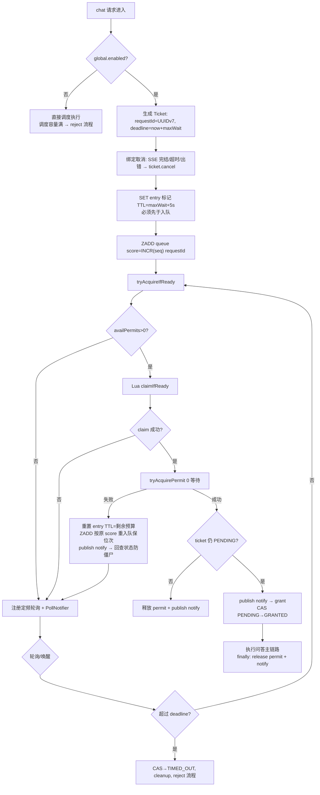

关键并发约束：

1. **entry 标记先于入队写入**：否则并发 claim 的 Lua 会把刚入队条目当僵尸 ZREM。
2. **单 CAS 协调点**：状态一旦离开 PENDING 不再变更，业务回调（onAcquired/onTimeout）最多触发一次；cleanup 与状态机解耦，幂等执行。
3. **grant 顺序**：先写 permitRef 再 CAS GRANTED；CAS 失败（被 cancel/timeout 抢占）时按 CAS 防双重释放。
4. **GRANTED 后 cancel 不释放 permit**：permit 生命周期已由业务 try/finally 接管，跨界释放会把同一 slot 让给两个请求。
5. **cleanup 幂等**：ZREM 队列 + DEL entry 标记 + （非 GRANTED 时）释放 permit + 有实际变更才 publish notify + 注销 poller + 取消定时任务。
6. **执行业务回调的容量不足**（对齐 `chatEntryExecutor` AbortPolicy 拒绝）：显式释放 permit + cleanup + 走 onTimeout 降级（等价 reject 流程），不丢请求。

### 4.1.1 公平排队限流类图

下图为公平排队限流的整体结构视角：`ChatQueueLimiter` 面向 chat 入口，`FairDistributedRateLimiter` 是协调核心，存储访问拆为 `FairQueue`（ZSet 队列 + entry 存活标记）、`PermitExpirableSemaphore`（带租约信号量）、`ClaimScript`（Lua 原子 claim 承载类）三个内部协作类——后三者均为 `fair_limiter.py`/`semaphore.py` 模块内的实现细节，非独立模块。

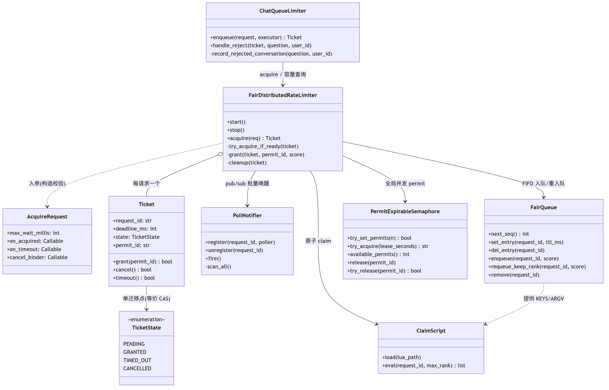

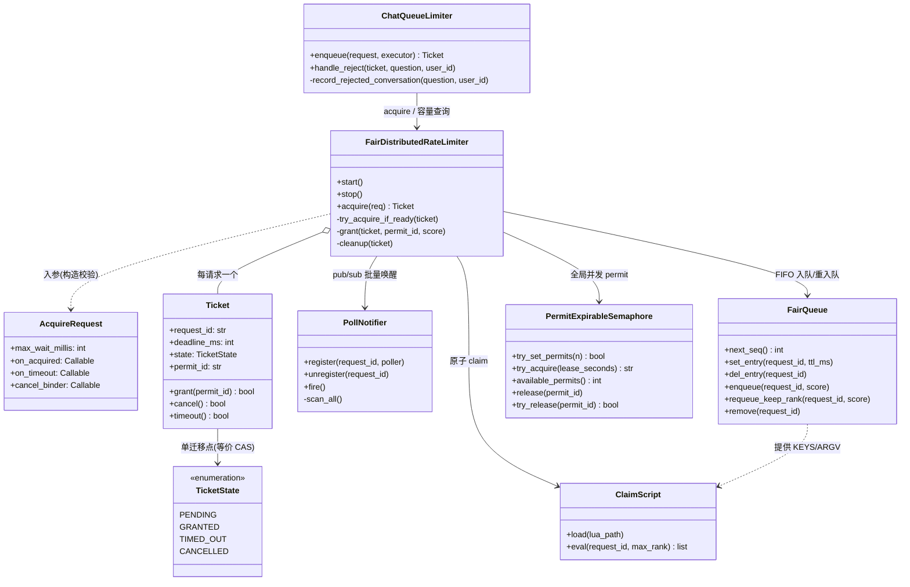

类图要点：

- `ChatQueueLimiter` 只做「入口编排 + reject 流程」，排队和状态机全部委托 `FairDistributedRateLimiter`；§4.2 的 reject 落库是 `handle_reject` 的内部步骤。
- `Ticket` 是唯一的并发协调点：`grant/cancel/timeout` 三个迁移方法互斥，单事件循环下先检查 `state == PENDING` 再迁移；`cleanup` 与状态机解耦且幂等。
- `ClaimScript` 负责加载 `resources/lua/queue_claim_atomic.lua` 并缓存 `EVALSHA`，脚本加载失败回退 `EVAL`；返回 `[0]` / `[1, score]` 与 §5.1 伪代码一一对应。
- `PermitExpirableSemaphore` 为 §2.3 自研原语的接口面；MinerU 解析信号量（§F15）复用同一实现类、独立实例，不复用全局 chat 信号量。

`Ticket` 状态机的迁移路径单独用状态图表达（与 §4.1 主流程图的视角互补，不重复）：

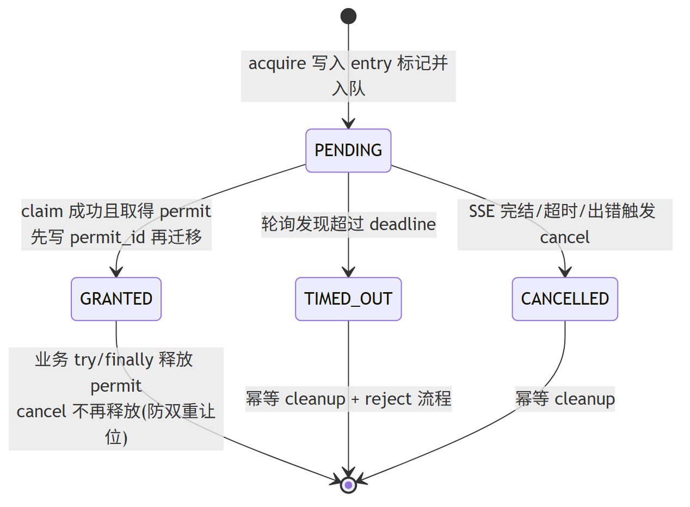

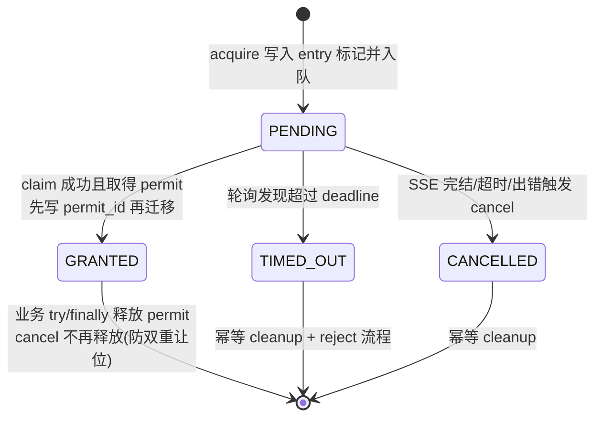

终态（GRANTED/TIMED_OUT/CANCELLED）互斥且不可逆，业务回调 `on_acquired`/`on_timeout` 因此最多触发一次（对齐关键点 2/3/4）。

### 4.2 排队超时 reject 流程（F9，对齐 `ChatQueueLimiter.handleReject`）

1. 解析 userId（Trace 上下文优先）。
2. 落库（`recordRejectedConversation`）：
   - 无 conversationId → 直接 UUIDv7 生成（新 UUIDv7 不可能命中已有会话，跳过存在性查询）；有则查会话判断 `isNewConversation`；
   - append user 消息（`append` 内部触发会话创建 + LLM 生成标题）；
   - append assistant 消息：content=`系统繁忙，请稍后再试`，`reply_to_message_id`=上一条 ID，`message_status=REJECTED`；
   - 新会话回查标题，空则兜底 = 问题 trim 后截断 `title-max-length`（默认 30）。
3. 发送 SSE：`meta` → `reject` → `finish`(REJECTED) → `done [DONE]` → 关闭。
4. **落库失败不阻塞**：记录失败仅告警，仍发 `done`，否则前端永远收不到结束事件。

### 4.3 流任务取消流程（F12/F13）

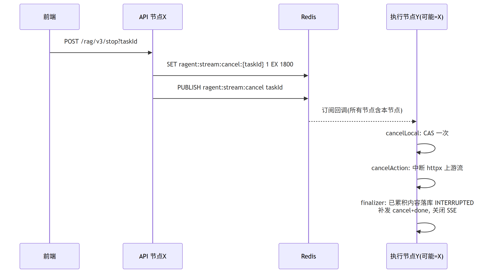

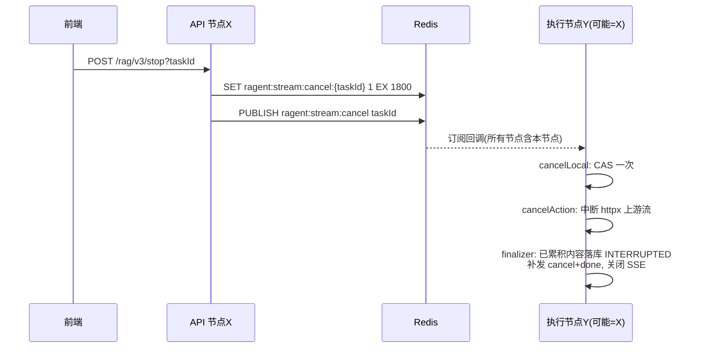

- `register(taskId, finalizer)`：先查本地 registry，再回查 Redis 标记（覆盖「任务还没在本节点注册就被取消」的时序）；已取消立即执行 finalizer。
- `bindHandle(taskId, cancelAction)`：绑定上游中断动作（Python 侧 = 关闭 httpx 流式响应 / cancel 当前 asyncio Task），取消时**先于** finalizer 执行；绑定时刻已取消则立即执行。
- 执行中每个回调（onContent/onThinking/onSources/onComplete/onError）先查 `isCancelled(taskId)`，已取消直接丢弃后续增量。
- 正常 `onComplete` / `onError` 时 `unregister(taskId)`：清本地 registry + 异步删 Redis 标记。
- 取消时无累积内容 → `messageId=null`，仍发 cancel+done。

### 4.4 PG 任务队列可靠性流程（F16，替代 RocketMQ 事务消息）

异步任务按 00 文档 §5.3 采用 **PG 任务队列单层模型**（`t_async_task` 表即队列，无外部 broker）：

1. 业务事务内 INSERT 任务行（`t_async_task.status=pending`，与业务写同事务提交）——入队即落库，天然替代事务消息原子性。
2. 事务提交后 PG `NOTIFY` 唤醒 worker；NOTIFY 丢失不影响（短轮询 + 步骤 4 兜底）。
3. worker 领取：`SELECT ... FOR UPDATE SKIP LOCKED` 原子 claim；在同一个短事务中将 task/document/log 从 `PENDING→RUNNING`，写 owner + `lease_until` 后立即提交，再执行耗时任务。
4. **租约超时重投**：worker 定时任务每 60s（initialDelay 30s）扫描 `RUNNING AND lease_until < now`，将 task/document/log 原子重置 `PENDING` 并增加重试次数；超过 `max_retries` 才统一置 `FAILED`。
5. 定时刷新扫描使用 `FOR UPDATE SKIP LOCKED` 领取到期 schedule，在同一事务推进 `next_run_time` 并插入刷新任务；活跃任务部分唯一索引防重，`schedule.version` 防旧任务覆盖新配置。

## 5. 关键算法与默认参数

### 5.1 Lua 原子 claim（`queue_claim_atomic.lua`）

```lua
-- KEYS[1]=queueKey  ARGV[1]=requestId  ARGV[2]=maxRank(可用permit数)  ARGV[3]=entryPrefix
local slack = 16
local head = ZRANGE queueKey 0 (maxRank + slack - 1)   -- 队头窗口 + slack，僵尸密集时推进存活条目
local liveRank, liveCount = -1, 0
for member in head:
    if EXISTS(entryPrefix .. member):                   -- 存活
        if member == requestId: liveRank = liveCount
        liveCount += 1
    else:
        ZREM queueKey member                            -- 僵尸（TTL 过期/显式删除），清理
if liveRank < 0 or liveRank >= maxRank: return {0}      -- 不在存活队头窗口
local score = ZSCORE queueKey requestId                 -- 留原始 score 供按位次重入队
ZREM queueKey requestId
DEL entryPrefix .. requestId                            -- 同步删标记，避免被自己误判
return {1, score}
```

- 返回 `{0}` 或 `{1, score}`；score 解析失败时回退 `nextQueueSeq()`。
- `slack=16`、entry TTL 缓冲 `5000ms` 为硬编码常量，不做配置。

### 5.2 PollNotifier 批量唤醒合并（F7，对齐 CAS 合并风暴设计）

```
register(requestId, poller) / unregister(requestId)     # dict 维护本进程全部 poller
fire():                                                  # pub/sub 通知到达
    pending += 1
    if not firing.cas(False, True): return               # 已有扫描在跑，仅计数
    schedule_scan():
        do:
            pending = 0
            if availablePermits() <= 0: break            # permit 耗尽不空转，等下次 release 通知
            for poller in pollers.values(): safe_run(poller)
            firing = False
        while pending > 0 and firing.cas(False, True)    # 扫描期间又来了通知则再来一轮
```

Python 单事件循环下 `firing` CAS 退化为普通布尔检查（无跨线程竞争），但保留「pending 计数合并 + do-while」语义，防止通知风暴导致 O(通知数×poller数) 扫描。

### 5.3 默认参数表（精确值）

| 参数 | 配置键（yaml） | 默认值 | 说明 |
|---|---|---|---|
| 全局限流开关 | `rag.rate-limit.global.enabled` | `true` | 关闭则直通执行容量 |
| 全局最大并发 | `rag.rate-limit.global.max-concurrent` | `50` | 信号量 permit 数；同时决定执行容量上限 |
| 排队最大等待 | `rag.rate-limit.global.max-wait-seconds` | `20` | ticket deadline；entry TTL=该值+5s |
| permit 租约 | `rag.rate-limit.global.lease-seconds` | `600` | 兜底自动释放，防 holder 崩溃泄漏 |
| 排队轮询间隔 | `rag.rate-limit.global.poll-interval-ms` | `200` | 下限钳制 `max(50, 配置值)` |
| 队列名 | — | `rag:global:chat` | 对齐 `ChatRateLimiterConfig.CHAT_LIMITER_NAME` |
| entry TTL 缓冲 | — | `5000ms` | 硬编码，防毫秒级时钟漂移误判僵尸 |
| Lua slack | — | `16` | 硬编码 |
| SSE 全局超时 | `rag.default.sse-timeout-ms` | `300000`（5min） | 对齐 `RAGDefaultProperties.sseTimeoutMs = 5*60*1000` |
| 取消标记 TTL | — | `30min` | `StreamTaskManager.CANCEL_TTL`，硬编码 |
| 本地任务 registry 上限 | — | `10000` | 超出 LRU 淘汰（对齐 Guava maximumSize） |
| 消费幂等 TTL | 装饰器参数 | `3600s` | 对齐 `@IdempotentConsume.keyTimeout` |
| MinerU 并发上限 | `mineru.concurrency-limit` | `16` | `setPermits` 初始化（启动期强制设定） |
| MinerU 取许可等待 | `mineru.max-wait-seconds` | `30` | 超时抛 `MinerU 解析任务过多，请稍后重试` |
| MinerU 许可租约 | `mineru.lease-seconds` | `900` | 必须 > `timeout-seconds`（300），启动校验 |
| MinerU 轮询间隔 | `mineru.poll-interval-seconds` | `5` | 下限 100ms（测试用） |
| MinerU 单任务超时 | `mineru.timeout-seconds` | `300` | 瞬时网络错误不终止，轮询至 deadline 兜底 |
| 任务租约 | `rag.task.lease-seconds` | 按任务类型配置 | 长于正常心跳间隔；过期后 task/document/log 原子恢复，超过最大重试才失败 |
| 刷新扫描间隔 | `rag.knowledge.schedule.scan-delay-ms` | `10000` | 批量 `batch-size=20`，`FOR UPDATE SKIP LOCKED`；cron 最小间隔 60s |
| 限流器后台调度 | — | 单 asyncio 定时任务 | poller 与通知读取各自为常驻协程 |

### 5.4 幂等 key 规则（F10/F11）

```
提交幂等：
  指定 key（支持简单参数表达式）→ idempotent-submit:key:{value}
  默认 → idempotent-submit:path:{route_path}:currentUserId:{uid}:md5:{md5(json(args))}
  获取锁失败 → ClientException(message)  # chat: "当前会话处理中，请稍后再发起新的对话"
                                        # 默认: "您操作太快，请稍后再试"
  ragent.eval.enabled=true 时整体旁路（评测压测用）

消费幂等（Lua 一次往返）：
  SET {keyPrefix}{业务键} "0" NX GET PX {ttl*1000}
  返回 "0"(CONSUMING) → 抛异常延迟重试
  返回 "1"(CONSUMED)  → 跳过执行，返回 None
  执行成功 → SET key "1" EX ttl
  执行异常 → DEL key（放行后续重试）
```

注意 `SET NX GET` 需要 Redis ≥ 6.2（部署基线已满足，启动自检加一条版本校验）。

### 5.4.1 幂等框架类图

下图为 `app/framework/idempotency.py` 的框架设计视角：两个装饰器是仅有的对外入口，key 解析抽象为 `IdempotentKeyResolver` 协议（提交幂等按「表达式 key / 默认 path+uid+md5」两个实现），Redis 原子操作收敛到两个执行器（锁 / 消费标记），装饰器本身不直接碰 Redis 命令。

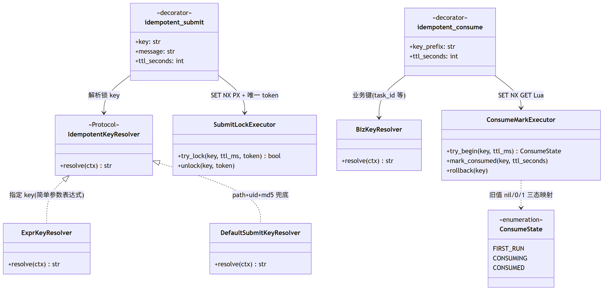

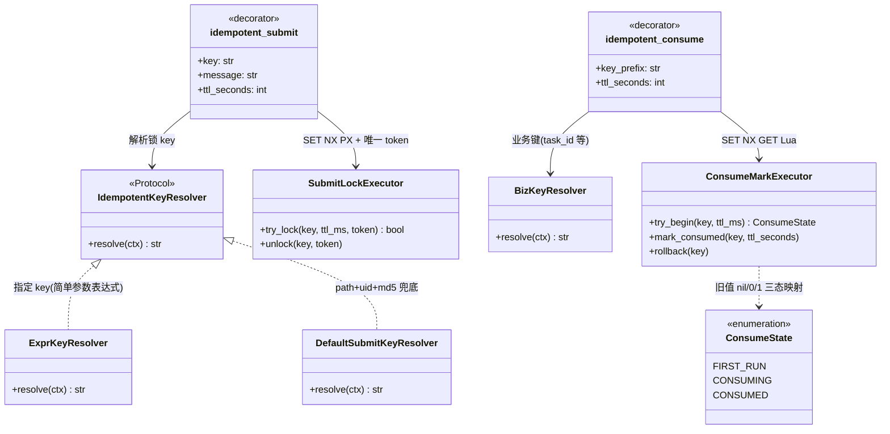

类图要点：

- `idempotent_submit`（对齐 `@IdempotentSubmit`）：进入前 `try_lock`，冲突抛 `ClientException(message)`（文案见 §5.4）；`finally` 中 `unlock` 用 Lua 校验 token 后 DEL，防误删他人锁；`ragent.eval.enabled=true` 时装饰器整体旁路。
- `idempotent_consume`（对齐 `@IdempotentConsume`）：`try_begin` 一次 Lua 往返返回三态——`FIRST_RUN` 放行执行、`CONSUMING` 抛异常延迟重试、`CONSUMED` 跳过返回 `None`；执行成功 `mark_consumed`（值置 `"1"`），执行异常 `rollback`（DEL key 放行重试），与 §5.4 伪代码逐步对应。
- `BizKeyResolver` 默认从被装饰函数的参数中取 `task_id`（节点级重跑时为 `task_id + node_id`），与 §7「重复消费」一行呼应。
- 两个执行器是幂等框架与 Redis 之间仅有的触点，Worker（§7）与 API 进程共用同一实现，保证进程间语义一致。

## 6. Python 模块与类映射

```
app/
├── rag/ratelimit/
│   ├── __init__.py
│   ├── semaphore.py        # PermitExpirableSemaphore：try_set_permits/try_acquire/
│   │                       #   available_permits/release/try_release（Lua 脚本内嵌）
│   ├── fair_limiter.py     # FairDistributedRateLimiter
│   │                       #   ├─ Ticket（状态机 PENDING/GRANTED/TIMED_OUT/CANCELLED）
│   │                       #   ├─ PollNotifier（register/unregister/fire 合并扫描）
│   │                       #   ├─ acquire(AcquireRequest) / start() / stop()
│   │                       #   └─ claim Lua：加载 resources 下 queue_claim_atomic.lua
│   └── chat_limiter.py     # ChatQueueLimiter.enqueue + reject 流程（依赖 memory/会话服务）
├── framework/
│   ├── idempotency.py      # idempotent_submit / idempotent_consume 装饰器
│   ├── sse.py              # SseSender（closed 标志、complete/fail 只关一次）、事件协议 DTO
│   └── stream_tasks.py     # StreamTaskManager：本地 dict(TTL LRU) + Redis 标记 + pub/sub 广播
├── core/parser/mineru.py   # 解析入口内嵌 MinerU 信号量（独立 PermitExpirableSemaphore 实例）
└── worker.py               # 自研 PG 任务队列 worker：SKIP LOCKED claim 循环 + LISTEN/NOTIFY + 定时任务(recover_stuck_running 60s / schedule scan 10s)
resources/lua/queue_claim_atomic.lua   # 原子 claim 与僵尸清理
```

映射要点：

- `AcquireRequest` → `@dataclass`：`max_wait_millis / on_acquired / on_timeout / cancel_binder`，构造校验 `max_wait_millis > 0`。
- `chatEntryExecutor`（50 线程 SynchronousQueue AbortPolicy）→ 无对应物：拿到 permit 后在当前事件循环 `asyncio.create_task` 执行；「提交失败降级」对应 create_task 异常分支（理论上不发生，保留防御）。
- `SseEmitterSender` → `SseSender`：`closed: bool`（单循环天然原子），`send_event` 在 closed 时静默丢弃；`complete()`/`fail()` 只首次生效；写入抛 `ClientDisconnect`/连接异常 → 置 closed 并吞掉（对齐「不再抛出避免全局异常处理响应冲突」）。
- 生命周期：`start()/stop()` 挂 FastAPI lifespan——start 内 `trySetPermits`（幂等）+ 订阅 notify channel；stop 内退订、取消全部 poller、清 PollNotifier（对齐 `stop()`）。

## 7. PG 任务队列细则（F16）

| 维度 | 设计 |
|---|---|
| 入队与持久化 | 业务事务内 INSERT `t_async_task` 任务行（与业务写同事务提交，替代事务消息原子性）；提交后 NOTIFY 唤醒 + 短轮询兜底，任务不丢失 |
| 领取并发安全 | `SELECT ... FOR UPDATE SKIP LOCKED` 原子 claim（PENDING→RUNNING，写 owner + `lease_until` 租约）；worker 独立 asyncio 进程，多实例水平扩展安全 |
| 崩溃恢复 | worker 每 60s 扫 RUNNING 租约超时，在同一短事务将 task/document/log 重置 `PENDING`；超过 `max_retries` 才统一 `FAILED` |
| 心跳续约 | 长任务 RUNNING 期间 worker 心跳续约 `lease_until`，防执行中的任务被误重投；进程死亡即停止续约，租约自然过期重投 |
| 重复消费 | `event_id` 唯一、活跃任务部分唯一索引、业务副作用唯一约束/CAS；Redis 幂等仅作减压优化 |
| 重试 | 任务表 `retry_count/max_retries` 字段（默认 5 次）+ 指数退避 `next_retry_at`；超限置 `FAILED` + `error_message` 告警，不再重投 |
| 节点级续跑 | `t_ingestion_task_node` 已 `SUCCESS` 的节点跳过，`FAILED/RUNNING(超时)` 节点重跑 |
| 定时刷新并发 | schedule 扫描使用 `FOR UPDATE SKIP LOCKED`；推进 next_run_time 与插任务同事务，活跃任务唯一索引兜底 |

### 7.1 韧性视角协作时序

03 文档第 11 节已给出 PG 队列的机制总述（表即队列、SKIP LOCKED claim），此处只补「韧性」视角的两张时序图：正常路径下租约/心跳/数据库幂等如何协作，以及 worker 被杀后的恢复时序。

正常消费路径（租约 + 心跳续约 + 数据库幂等的协作）：

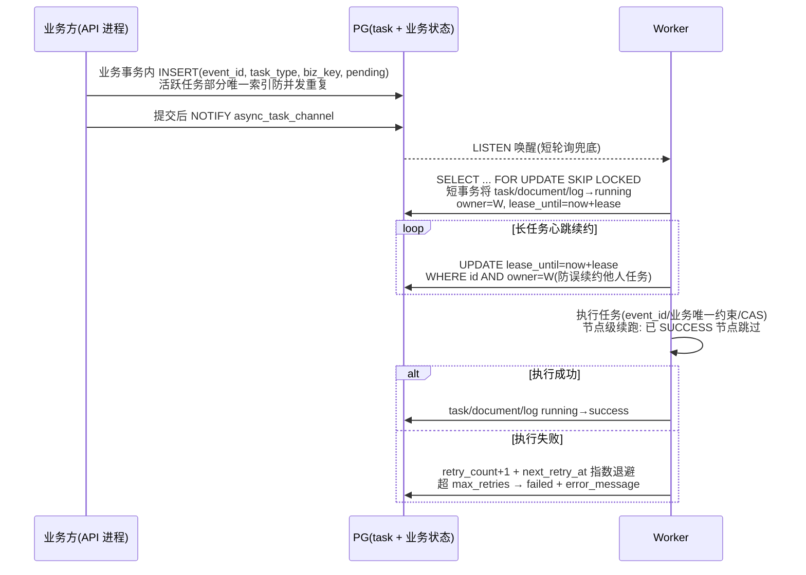

kill worker 恢复时序（租约超时重投 + 幂等防重，对应 §10 测试要点 10）：

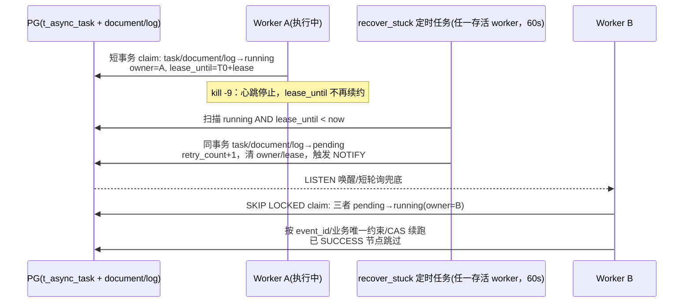

时序要点：

- 重投安全性由 PostgreSQL 负责：`lease_until` 超时才恢复，`event_id`/活跃任务部分唯一索引防任务重复，业务表唯一约束、CAS 和节点终态防副作用重复。Redis 不作为正确性前提。
- `recover_stuck` 与 claim 都走 `FOR UPDATE SKIP LOCKED`/条件 UPDATE，多 worker 实例同时扫描不会重复重置同一行。
- task/document/log 的恢复必须同事务推进，不存在独立的“文档超时直接失败”定时器；只有超过最大重试次数才统一失败。

## 8. 异常与降级策略

| 场景 | 行为 |
|---|---|
| `global.enabled=false` 且执行容量满 | 转 reject 流程（对齐直通分支 `RejectedExecutionException` 处理） |
| grant 后业务提交失败 | 显式释放 permit + cleanup + 走 onTimeout(reject) 降级，不丢请求 |
| claim 成功但取不到 permit | 按原 score 重入队保位次；回查已终态则自行回滚（ZREM+DEL），防僵尸占队头 |
| permit 释放失败（已过期） | 仅 debug 日志（`releasePermitQuietly`），租约兜底回收 |
| entry 标记读写失败 | debug 日志，不阻断流程（Lua 侧会按僵尸/存活自然收敛） |
| reject 落库失败 | 告警后仍发 `done`，保证前端终结事件 |
| cancel finalizer 落库失败 | error 日志，`messageId=null` 照常发 cancel+done |
| Redis 不可用 | chat 请求 acquire 抛错 → 全局异常处理返回错误页/SSE fail；不做本地降级放行（防打爆模型层） |
| pub/sub 断连 | redis-py 自动重连恢复订阅；轮询（200ms 定频）本身不依赖 pub/sub，通知只是加速，语义不退化 |
| MinerU 取许可超时 | `ServiceException("MinerU 解析任务过多，请稍后重试")` → 入库节点 FAILED 可重试 |
| MinerU 轮询网络瞬断 | 不终止任务，继续轮询至 deadline（300s） |

## 9. 并发原语与实现约束

| 场景 | 实现 | 说明 |
|---|---|---|
| 状态原子迁移 | 普通字段 + 显式状态检查 | 所有状态迁移均在同一事件循环内完成；跨协程共享处加 `asyncio.Lock` |
| 定时轮询 | `asyncio` 循环 `call_later` 自续期任务（每 ticket 一个句柄） | poller 间隔=max(50, poll-interval-ms)；ticket 持有句柄用于取消 |
| pub/sub | redis-py `pubsub.subscribe` + 后台读循环 task | notify/cancel 两个 channel 各一个常驻 task |
| 提交幂等锁 | `SET key token NX PX ttl` + Lua 校验后 DEL | 锁时长覆盖请求处理全程；唯一 token 防误删 |
| 带租约信号量 | 自研 Redis 实现（§2.3） | 含租约回收、幂等 setPermits |
| 上下文传播 | `contextvars.ContextVar` + `context.copy()` | user_id/trace_id 跨 task 传递；`asyncio.create_task` 自动复制上下文 |
| 有界 TTL 缓存 | `dict` + 惰性过期 + 容量淘汰，或 `cachetools.TTLCache` | 流任务 registry：10000 上限 / 30min |
| 分域并发隔离 | `asyncio.Semaphore` + `asyncio.gather` | 无界场景直接 gather；有容量限制处使用 Semaphore |
| MinerU 轮询 | `asyncio.wait_for` + 每任务轮询协程 | 无需独立调度池，可承载数百个等待任务 |
| 可选 structured concurrency | `anyio` | 仅在新代码确有需求时引入 |

## 10. 测试要点

1. **Lua claim 单测**（fake redis / testcontainers redis）：
   - 僵尸条目在队头窗口内被 ZREM，存活条目 rank 正确前移；
   - slack=16 边界：窗口外僵尸不清理、窗口外存活不晋级；
   - claim 成功返回原 score；`liveRank >= maxRank` 返回 0；
   - entry 标记缺失即僵尸；claim 成功后标记被 DEL。
2. **信号量**：trySetPermits 幂等（二次调用不重置）；租约到期自动回收；重复 release 不透支计数。
3. **公平性**：并发 200 请求、permit=10，断言 grant 顺序与入队 score 严格一致；permit 短暂不足时重入队保位次（注入「claim 成功但 tryAcquire 失败」桩）。
4. **Ticket 状态机**：grant 与 cancel 并发（时序交错注入）→ 回调恰好一次、permit 不泄漏；timeout 与 grant 竞争同理；GRANTED 后 cancel 不释放 permit，业务 finally 释放。
5. **PollNotifier 合并**：连续 1000 次 fire 只触发 ≤2 轮全量扫描；permit=0 时跳过扫描。
6. **reject 流程**：超时后 SSE 事件序严格为 meta→reject→finish(REJECTED)→done；DB 中 assistant 消息 `message_status=REJECTED`、`reply_to_message_id` 正确；落库故障注入下仍收到 done。
7. **取消流程**：跨节点场景（两个进程）stop → 执行节点中断 httpx 流、已累积内容落库 INTERRUPTED、cancel+done 补发；注册前已取消 → register 立即触发 finalizer；取消后到达的增量被丢弃。
8. **幂等**：同用户并发两次 chat → 一次 200、一次幂等错误文案；消费幂等三态（首执行/CONSUMING 冲突/CONSUMED 跳过/异常删 key 可重试）。
9. **SSE 保护**：5min 超时触发 closed；客户端断连后 send_event 静默、complete 幂等。
10. **PG 任务队列恢复**：kill worker（RUNNING 遗留）→ 租约超时后 task/document/log 原子重置 pending → 重投成功且不重复副作用；超过最大重试才统一 failed。
11. **一致性压测**（M5 验收）：API 多实例与 Worker 多实例使用隔离测试前缀，在并发、超时、取消和故障恢复场景下验证不超发、不泄漏许可、不重复副作用。
