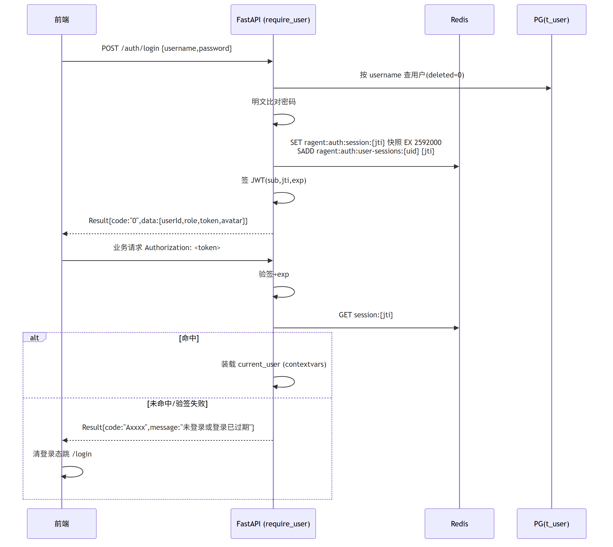
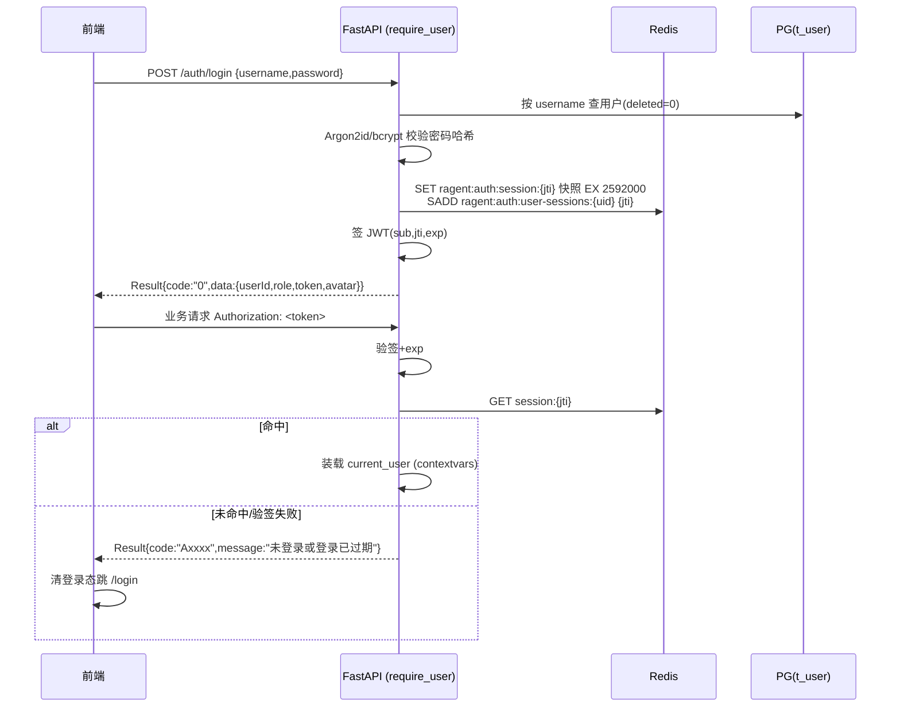

# Ragent — 系统管理与可观测

> 本文覆盖：认证与会话、用户与角色、数据归属隔离、业务变更审计、RAG Trace、Dashboard、agents 人设与 Prompt 槽位、示例问题、评测接口、运行时设置。
> 基线：`00-总体架构与技术选型.md`。实现分布在 `system`、`rag/admin`、`rag/trace` 与 `framework` 等模块。
> 所有 REST 路径挂载在 `root_path=/api/ragent` 之下，响应统一 `Result<T>` 包装（`{code, message, data}`，成功 `code="0"`），HTTP 状态恒 200，业务错误走 `code != "0"`。

## 1. 功能清单

| # | 功能 | 落点 | 契约要求 |
|---|---|---|---|
| 1 | 登录 / 登出 | `app/system/auth/router.py` | 固定路径、请求体与 `LoginVO` 字段 |
| 2 | token 会话 | PyJWT + Redis 会话白名单（见 §2） | `Authorization: <token>` 原值直传，无 Bearer 前缀 |
| 3 | 当前用户 | `app/system/user/router.py` | 固定 `CurrentUserVO` 字段 |
| 4 | 用户 CRUD + 改密 | `app/system/user/` | 仅 `admin` 角色可管理用户，业务校验见 §3 |
| 5 | 角色模型 | `app/system/user/enums.py` + 依赖注入守卫 | admin/user 两角色，仅角色校验 |
| 6 | 数据归属隔离 | 各域 Repository 强制过滤 | 规则见 §3.4 |
| 7 | 业务变更审计 | `@audit_log` + contextvars（见 §4） | `t_biz_change_log`、`/biz-change-logs` |
| 8 | Diff 计算 | `app/system/audit/diff.py` | JSON Pointer 路径和转义规则 |
| 9 | Trace 采集 | `@rag_trace_node` + contextvars | `t_rag_trace_run/node` |
| 10 | 流式 span | `app/rag/trace/stream_span.py` | 终态幂等、CANCELLED 收尾 |
| 11 | 用户感知 TTFT | `app/rag/trace/runner.py` | `USER_TTFT` / `user-first-packet` 节点语义 |
| 12 | Trace 查询 | `app/admin/traces.py` | 分页、详情、节点三类接口 |
| 13 | Dashboard | `app/admin/dashboard.py` | 指标口径见 §6 |
| 14 | agents 人设 CRUD + 激活 | `app/admin/agents.py` + `app/rag/prompt/` | 槽位枚举、回落链与缓存行为 |
| 15 | Prompt 槽位管理 | `app/rag/prompt/slots.py` 等 | 7 槽位、占位符校验、内置回落 |
| 16 | 示例问题 | `app/rag/sample_questions.py` | 随机 3 条 + 管理 CRUD |
| 17 | 评测接口 | `app/rag/eval.py` | `ragent.eval.enabled` 开关，默认关闭 |
| 18 | 运行时设置 | `app/rag/settings.py` | 只读汇总，密钥脱敏 |

## 2. 认证与会话

### 2.1 前端契约与安全约束

- 前端契约（`frontend/src/services/api.ts`、`stores/chatStore.ts`）：token 存 localStorage，请求头为 **`Authorization: <token>` 原值**（无 `Bearer ` 前缀）；axios 响应拦截器判断 `payload.code !== "0"` 且 `message` 含「未登录」时清登录态跳 `/login`。**因此未登录错误的 `message` 必须包含"未登录"三个字**。
- 会话约束：token 默认有效期 2592000 秒（30 天）；允许同账号多端登录；每次登录生成独立 token，不复用旧会话。
- 路由约束：`/auth/login` 与 OpenAPI 文档路径豁免登录校验；OPTIONS 由 CORSMiddleware 处理；其余路由通过 FastAPI 依赖装载 `LoginUser{userId, username, role, avatar}`。
- 角色只取 `admin` / `user`，管理路由服务端强制校验，不依赖前端隐藏入口。
- 密码：用户表从首版开始只存 Argon2id（优先）或 bcrypt 哈希，不接收或迁移明文密码；登录使用恒定时间校验，日志、审计和 API 永不返回密码或哈希。
- 默认头像：`avatar` 为空时回落 `https://avatars.githubusercontent.com/u/583231?v=4`（登录响应与 `UserContext` 均适用）。

### 2.2 PyJWT + Redis 会话白名单

token 选型：**JWT（HS256）+ Redis 白名单**。JWT 提供可验证身份载荷，Redis 白名单提供登出、强制下线和权限变更后的即时失效能力。

- JWT claims：`sub`=userId（数字字符串，对应 `t_user` BIGINT 自增主键）、`jti`=会话 ID（uuid4 hex）、`iat`、`exp`（`iat + auth.token-ttl-seconds`，默认 2592000）。**不**在 claims 放 role，角色以 Redis 会话快照为准，并在角色变更时批量失效会话。
- Redis key（前缀沿用 `ragent:*`）：
  - `ragent:auth:session:{jti}` → JSON `{userId, username, role, avatar}`，TTL = 2592000s。会话快照避免每请求查库；登录时写入。
  - `ragent:auth:user-sessions:{userId}` → Set(jti)，TTL 同上。用于删除用户、重置或修改密码、变更角色时批量失效该用户全部会话。
- 校验链（FastAPI 依赖，替代双拦截器）：
  1. 路由注册白名单：`/auth/login`、OpenAPI 文档路径豁免；其余业务路由统一挂 `require_user` 依赖。OPTIONS 由 CORSMiddleware 处理，SSE 在 ASGI 单请求内完成。
  2. `require_user`：取 `Authorization` 头原值 → PyJWT 验签 + 验 `exp`（失败 → `ClientException("未登录或登录已过期")`）→ `GET ragent:auth:session:{jti}`（miss → 同上异常）→ 快照写入 `request.state` + contextvars `current_user`。
  3. `require_admin`：在 `require_user` 之上校验 `role == "admin"`，否则抛 `ClientException("无权限访问")`。
- 登录流程：校验用户名/密码（空 → "用户名或密码不能为空"；不匹配 → "用户名或密码错误"）→ 生成 jti → 写两个 Redis key → 签 JWT → 返回 `LoginVO{userId, role, token, avatar}`（avatar 空回落默认 URL）。`is-concurrent` 语义：不清理该用户旧 jti；`is-share` 语义：每次登录新 jti 新 token。
- 登出流程：从当前 token 取 jti → `DEL ragent:auth:session:{jti}` + `SREM ragent:auth:user-sessions:{userId} {jti}`。
- 会话失效触发点：删除用户、管理员重置密码、用户自行改密、变更角色时，按 `user-sessions` 集合批量 `DEL` 会话 key 并清集合；改密请求完成后当前 token 也立即失效，前端重新登录。





### 2.3 API 契约

| 方法 | 路径 | 守卫 | 请求 | 响应 data |
|---|---|---|---|---|
| POST | `/auth/login` | 无 | `{username, password}` | `{userId, role, token, avatar}` |
| POST | `/auth/logout` | 登录 | — | `null` |
| GET | `/user/me` | 登录 | — | `{userId, username, role, avatar}` |

## 3. 用户管理与角色模型

### 3.1 表设计 `t_user`（独立 Schema）

`id BIGINT PK`（`GENERATED BY DEFAULT AS IDENTITY` 自增）、`username VARCHAR(64) UNIQUE NOT NULL`、`password_hash VARCHAR(255) NOT NULL`（Argon2id/bcrypt，见 §2.1）、`role VARCHAR(32) NOT NULL`（`admin`/`user`）、`avatar VARCHAR(128)`、`create_time`、`update_time`、`deleted SMALLINT`（逻辑删，0 正常）。开发环境管理员通过显式 bootstrap 命令或环境变量创建并强制首次改密；生产环境不得内置 `admin/admin` 默认凭据。

### 3.2 角色与守卫矩阵

- 角色枚举仅 `admin` / `user`（`UserRole`），**只有角色校验、无权限点**。
- `/users*`、`/admin/**` 必须挂 `require_admin`；其余业务接口挂 `require_user`。管理权限由服务端强制执行，前端角色展示只用于改善交互。

### 3.3 API 契约与业务规则

| 方法 | 路径 | 守卫 | 请求 | 响应 data |
|---|---|---|---|---|
| GET | `/users?current=&size=&keyword=` | admin | query | 分页 `IPage<UserVO>` |
| POST | `/users` | admin | `{username, password, role?, avatar?}` | `String`（新用户 id） |
| PUT | `/users/{id}` | admin | `{username?, password?, role?, avatar?}`（null 字段不改） | `null` |
| DELETE | `/users/{id}` | admin | — | `null` |
| PUT | `/user/password` | 登录 | `{currentPassword, newPassword}` | `null` |

分页包装统一为 `{records, total, size, current, pages}`，查询参数名为 `current` / `size`。`UserVO` 为 `{id, username, role, avatar, createTime, updateTime}`，时间字段使用毫秒精度 ISO 字符串，以前端既有解析为准。

业务规则（逐条对齐，提示语即错误 message）：

- 分页：`deleted=0`，`keyword` 非空时 `(username LIKE %k% OR role LIKE %k%)`，按 `update_time DESC`。
- 创建：username/password 去空白后非空；用户名等于 `admin`（忽略大小写）→ "默认管理员用户名不可用"；role 归一化——空 → `user`，忽略大小写匹配 `admin`/`user`，其余 → "角色类型不合法"；用户名唯一（排除自身）→ "用户名已存在"。
- 更新/删除：目标不存在 → "用户不存在"；目标 username 为 `admin`（忽略大小写）→ "默认管理员不允许修改或删除"；请求字段为 null 的项不修改（密码 null 跳过、非空白才更新）。
- 改密：当前密码不匹配 → "当前密码不正确"；仅改自己（userId 取自上下文，不接受传参）。
- 用户 CRUD 与改密全部落审计（bizType=`USER`，见 §4）。

### 3.4 数据归属隔离规则

- 规则：凡按用户归属的数据（会话 `t_conversation`、消息 `t_message`、会话摘要 `t_conversation_summary`、消息反馈 `t_message_feedback`），Repository/Service 层一律强制 `WHERE user_id = <当前登录用户>`，**user_id 只取上下文，绝不采信请求传参**。
- 一期不提供管理员跨用户查看会话接口；admin 访问会话类接口时也只能查看自己的数据。
- 管理面共享数据（知识库、agents、示例问题、Trace、审计、Dashboard）不做归属隔离，登录即可读（写路径按 §3.2 守卫）。
- Trace 的 `user_id` 字段（`t_rag_trace_run.user_id`）仅作展示与统计，不构成隔离维度。

## 4. 业务变更审计

### 4.1 表设计 `t_biz_change_log`（沿用）

| 字段 | 类型 | 说明 / 截断规则（对齐 `BizChangeLogRecordService#limit`） |
|---|---|---|
| `id` | BIGINT PK | 自增（`GENERATED BY DEFAULT AS IDENTITY`） |
| `biz_type` | VARCHAR(64) | 业务类型，截 64 |
| `biz_id` | VARCHAR(64) | 业务主键，缺省 `UNKNOWN`，截 64 |
| `operation_type` | VARCHAR(32) | 操作类型，截 32 |
| `action_desc` | VARCHAR(512) | 操作描述（成功文案或失败文案），截 512 |
| `before_snapshot` / `after_snapshot` | JSONB | 变更前/后快照 |
| `change_diff` | JSONB | Diff 数组（见 §4.3） |
| `operator_id` / `operator_name` / `operator_role` | VARCHAR(64/128/64) | 无登录上下文时 operator_id 回落 `SYSTEM` |
| `success` | BOOLEAN | 异常路径记 false |
| `error_message` | TEXT | 失败时的失败文案 |
| `class_name` / `method_name` | VARCHAR(255) | 触发位置，截 255 |
| `ip` | VARCHAR(64) | `X-Forwarded-For` 首段 → `X-Real-IP` → client host |
| `user_agent` | VARCHAR(512) | 请求头原值 |
| `create_time` | TIMESTAMPTZ | |

索引：`(biz_type, biz_id)`、`(create_time)`、`(operator_id)`。

常量（`BizChangeBizType`）：`KNOWLEDGE_BASE / KNOWLEDGE_DOCUMENT / KNOWLEDGE_CHUNK / INGESTION_PIPELINE / INGESTION_TASK / INTENT_TREE / QUERY_TERM_MAPPING / SAMPLE_QUESTION / USER / AGENT_PROFILE`。
操作类型（`BizChangeOperationType`）：`CREATE / UPDATE / DELETE / ENABLE / DISABLE / RUN`。

### 4.2 `@audit_log` 装饰器 + contextvars

审计链路由 `@audit_log`、`AuditContext` 与独立事务的 `AuditRecordService` 组成：

- `app/system/audit/context.py`：`AuditContext`（contextvars），方法 `put(biz_id, before, after)`、`skip()`、`put_name(name)`。`before/after` 为可 JSON 序列化对象（Pydantic model / dict / ORM 转 dict）。
- `app/system/audit/decorator.py`：

```python
@audit_log(biz_type=BizType.USER, op=OpType.CREATE,
           success_desc=lambda args, ret: f"创建用户：{args['request'].username}",
           fail_desc=lambda err: f"创建用户失败：{err}")
async def create(...): ...
```

- 执行语义：业务函数正常返回 → success=true、desc=success_desc；抛异常 → success=false、error_message=fail_desc，**异常原样上抛**。`AuditContext.skip()` 被调用则整条不记（对应 `RECORD_CONDITION`）。
- 落库：**独立 DB session/连接提交**（对应 `REQUIRES_NEW`），业务事务回滚不带走审计记录；审计写库自身失败仅 warn 日志，不反向影响业务。
- 操作人解析：contextvars 当前用户 → 否则 `SYSTEM`（对应 `RagentOperatorGetService`）。`class_name/method_name` 由装饰器取被包装函数的 `__module__`/`__qualname__`。
- IP/User-Agent：中间件把当前请求对象放入 contextvars（请求级），审计落库时读取；非请求上下文（worker 进程）为 null。

### 4.3 Diff 算法（对齐 `BizChangeLogContext#collectDiff`）

输入 before/after 两棵 JSON 树，输出变更条目数组：

```text
diff(before, after):
  collect(path="", before, after):
    若 before == after: 返回
    若两侧均为 object: 字段名并集(升序) 逐字段递归 collect(path+"/"+escape(field))
    若两侧均为 array:  按下标 0..max(len)-1 递归 collect(path+"/"+i, 缺失侧按 null)
    否则:              追加 {field: path为空则"/", before: <值>, after: <值>}
  escape(s): s.replace("~","~0").replace("/","~1")   # JSON Pointer 转义
```

- 快照载体：装饰器从 `AuditContext` 取 `(biz_id, before, after)`，组装 `{beforeSnapshot, afterSnapshot, changeDiff}` 三键分别落列；before/after 为 null 时对应列为 null（创建：before=null；删除：after=null）。
- 数组 diff 默认按位置比较（无语义匹配），保证结果确定；若字段需要集合语义，必须在字段级策略中显式声明。

### 4.4 查询 API

| 方法 | 路径 | 守卫 | 说明 |
|---|---|---|---|
| GET | `/biz-change-logs` | 登录 | 分页，query：`current/size/bizType/bizId(LIKE)/operationType/operatorId/operatorName(LIKE)/success/beginTime/endTime`（时间格式 `yyyy-MM-dd HH:mm:ss`），按 `create_time DESC` |
| GET | `/biz-change-logs/{id}` | 登录 | 单条，不存在 → "变更审计日志不存在" |

`BizChangeLogVO` 字段与 DO 一一对应（见 §4.1 表头）。

## 5. RAG Trace

Trace 是领域功能而非通用 APM：记录一次流式问答（run）及其管线节点树（node），供管理端排查「慢在哪、错在哪、TTFT 多少」。

### 5.1 表设计（Python 独立 Schema）

`t_rag_trace_run`：`id BIGINT GENERATED BY DEFAULT AS IDENTITY PK`、`trace_id UUID UNIQUE`、`trace_name`（默认 `rag-stream-chat`）、`entry_point`（如 `app.rag.pipeline.StreamChatPipeline.run`，使用实际 Python 入口名）、`conversation_id`、`task_id`、`user_id`、`status`（`RUNNING/SUCCESS/ERROR`）、`error_message VARCHAR(1000)`、`start_time/end_time TIMESTAMP(3)`、`duration_ms BIGINT`、`extra_data JSONB`（如 `{questionLength, question}`）、`create_time/update_time/deleted`。索引 `(task_id)`、`(user_id)`。

`t_rag_trace_node`：`id PK`、`trace_id`、`node_id`、`parent_node_id`、`depth INTEGER DEFAULT 0`、`node_type VARCHAR(16)`、`node_name VARCHAR(128)`、`class_name VARCHAR(256)`、`method_name VARCHAR(128)`、`status`（`RUNNING/SUCCESS/ERROR/CANCELLED`）、`error_message VARCHAR(1000)`、`start_time/end_time TIMESTAMP(3)`、`duration_ms`、`extra_data`、逻辑删。`UNIQUE(trace_id, node_id)`。

### 5.2 上下文与 `@rag_trace_node` 装饰器

- `app/framework/trace_ctx.py`（00 已预留）：contextvars 三个变量——`trace_id`、`task_id`、`node_stack`。**node_stack 使用不可变 tuple**：push 时 `set(stack + (node_id,))`、pop 时 `set(stack[:-1])`，避免 `asyncio.create_task` 复制 context 后兄弟任务共享可变栈而互相串挂。
- 装饰器：

```python
@rag_trace_node(name="retrieval-engine", type="RETRIEVE")  # name 缺省取函数名，type 缺省 METHOD
```

  - 开关关闭（`rag.trace.enabled=false`）或当前无 `trace_id` → 直接透传调用，零开销。
  - 进入：`node_id=UUIDv7`、`parent=栈顶`、`depth=len(stack)`，insert 一行 `status=RUNNING`；push。
  - 正常返回：update `SUCCESS + end_time + duration_ms`；异常：update `ERROR + truncate(error)`（`ClassName: message`，截 `rag.trace.max-error-length=1000`）后原样上抛；finally pop。
  - 需同时支持 async / sync 函数（`inspect.iscoroutinefunction` 双实现）。
- 跨 task 传递：contextvars 在 `asyncio.create_task` 时自动快照复制。约束：**子任务必须在父节点 pop 之前创建**；后台 fire-and-forget 任务（如推荐问题生成）用 `contextvars.copy_context()` 显式捕获创建点上下文。

已埋点目录（节点名与类型是稳定的观测协议）：

| 节点 name | type | 组件位置 |
|---|---|---|
| `query-rewrite` / `query-rewrite-and-split` | `REWRITE` | `MultiQuestionRewriteService` |
| `intent-resolve` | `INTENT` | `IntentResolver` |
| `guidance-detect` | `GUIDANCE` | `IntentGuidanceService` |
| `retrieval-engine` | `RETRIEVE` | `RetrievalEngine` |
| `multi-channel-retrieval` | `RETRIEVE_CHANNEL` | `MultiChannelRetrievalEngine` |
| `conversation-title-gen` | `TITLE_GEN` | `ConversationTitleGenerator` |
| `recommended-question-gen` | `RECOMMEND_GEN` | `RecommendedQuestionGenerator` |
| `{provider}-stream-chat` | `LLM_PROVIDER` | `AbstractOpenAIStyleChatClient`（stream span） |
| `user-first-packet` | `USER_TTFT` | `StreamChatTraceRunner`（合成节点） |

### 5.3 流式 span（StreamSpan）

问题：`@rag_trace_node` 只能测到「任务提交」；LLM SSE 读循环的真正耗时在协程后续执行中。设计如下：

- `begin_stream_node(name, type)`：在调用方上下文 insert RUNNING 行（type 缺省 `STREAM`）并 push node_id，返回 `StreamSpan`。
- `StreamSpan` 四方法：`detach()`（同步部分结束时弹栈，仅当栈顶是自己才 pop，防并发错乱）、`finish_success()`、`finish_error(err)`、`finish_cancelled_if_running()`。三个 finish 幂等，单事件循环下用 `bool` 标志确保先触发者生效。
- 收尾时机：SSE 终态事件（finish / cancel / reject / done，见 01 文档）发送路径上调用对应 finish；取消路径必须走 `finish_cancelled_if_running` 避免 RUNNING 悬挂。finish 写库失败仅 warn。
- 子节点（如 `first-packet` 首包探测，见 04 文档）在 begin 与 detach 之间创建，从而挂到 stream 节点之下。

### 5.4 run 生命周期与用户感知 TTFT

实现位于 `app/rag/trace/runner.py` 的 `StreamChatTraceRunner`：

1. 入口（`StreamChatPipeline` 启动处）：生成 `trace_id`（UUIDv7），insert run（status=RUNNING，`extra_data={questionLength, question}`，userId 取上下文）。
2. 设置 `trace_id`/`task_id` 到 trace_ctx，执行业务管线。
3. 包装 SSE 发送器回调（对应 `ForwardingStreamCallback`）：**首次推送正文内容**时记录 TTFT 节点——`node_type=USER_TTFT`、`node_name=user-first-packet`、`depth=0`、`start_time=run 开始时刻`、`duration_ms=now-run_start`、`status=SUCCESS`（insert+update 两次写，失败仅 warn）。口径：从 pipeline 入口到推给前端第一个字，含路由/改写/意图/检索/LLM 首包全部前置开销。
4. 管线终态（完成/异常）→ `finish_run(SUCCESS|ERROR, truncate(error), duration)`；同步阶段异常走 `on_error` 复用其幂等，避免与异步终态重复收尾。
5. 请求结束清理 contextvars（请求级生命周期由中间件保证）。
6. `enabled=false` 时整段短路，回调原样透传。

### 5.5 查询 API（`RagTraceController`）

| 方法 | 路径 | 说明 |
|---|---|---|
| GET | `/rag/traces/runs` | 分页，query：`current/size/traceId/conversationId/taskId/status`，按 `start_time DESC` |
| GET | `/rag/traces/runs/{traceId}` | `{run, nodes}`；run 不存在返回 `data=null`（不报错） |
| GET | `/rag/traces/runs/{traceId}/nodes` | 节点列表，按 `start_time ASC, id ASC` |

`RagTraceRunVO`：`{traceId, traceName, entryMethod, conversationId, taskId, userId, username, status, errorMessage, durationMs, ttftMs, question, startTime, endTime}`。组装规则（`RagTraceQueryServiceImpl`）：`username` 按本页 user_id 批量查 `t_user` 回填；`ttftMs` 取该 run 下 `node_type=USER_TTFT` 节点的 `duration_ms`（批量查）；`question` 从 `extra_data` JSON 解析，解析失败为 null。
`RagTraceNodeVO`：DO 字段直出（无 extraData）。

## 6. Dashboard 统计

`DashboardController` → `app/admin/dashboard.py`。三接口均 `require_admin`（见 §3.2），实时 SQL 聚合，无缓存。

### 6.1 API 契约

| 方法 | 路径 | query | 响应 data |
|---|---|---|---|
| GET | `/admin/dashboard/overview` | `window?` | `DashboardOverviewVO` |
| GET | `/admin/dashboard/performance` | `window?` | `DashboardPerformanceVO` |
| GET | `/admin/dashboard/trends` | `metric`(必填)`/window?/granularity?` | `DashboardTrendsVO` |

窗口解析（`parseWindow`）：`Nh`=N 小时、`Nd`=N 天（忽略大小写），非法/空取默认值（overview/performance 默认 `24h`，trends 默认 `7d`）；`window` 标签原样回显，缺省回显格式化值（如 `24h`、`7d`），`compareWindow = "prev_" + window`。

### 6.2 overview 指标口径

`{window, compareWindow, updatedAt(ms  epoch), kpis{...}}`，每项 KPI 为 `{value, delta, deltaPct}`：

| KPI | value | delta | deltaPct |
|---|---|---|---|
| `totalUsers` | `t_user` 全量计数 | 窗口内新增用户数 | null |
| `activeUsers` | 窗口内 `t_message` `count(distinct user_id)` | 本窗口 − 前窗口 | 前窗口 ≤0 为 null，否则 `(cur-prev)/prev*100` 保留 1 位 |
| `totalSessions` | `t_conversation` 全量计数 | 窗口内新增会话数 | null |
| `sessions24h` | 窗口内新增会话数 | 与前窗口差 | 同上 |
| `totalMessages` | `t_message` 全量计数 | 窗口内新增消息数 | null |
| `messages24h` | 窗口内新增消息数 | 与前窗口差 | 同上 |

窗口区间 `[now-window, now)`，前窗口 `[now-2*window, now-window)`；计数条件 `create_time >= start AND < end`。`deltaPct` 四舍五入 1 位小数（`round1`）。

### 6.3 performance 指标口径

`{window, avgLatencyMs, p95LatencyMs, successRate, errorRate, noDocRate, slowRate}`：

- 延迟样本：窗口内 `t_rag_trace_run` 中 `status=SUCCESS` 且 `duration_ms > 0` 的集合。
- `avgLatencyMs` = 均值四舍五入取整；`p95LatencyMs` = 排序后下标 `ceil(n*0.95)-1`（clamp 到 `[0, n-1]`）；空集均为 0。
- `successRate/errorRate`：窗口内 run 按 `start_time` 统计 SUCCESS/ERROR，分母 = 两者之和（RUNNING 不计入），分母 0 → 0.0，保留 1 位。
- `noDocRate`：窗口内 assistant 消息中 `content = "未检索到与问题相关的文档内容。"`（**精确等值匹配，常量与 01 文档共用**）占比，分母 = assistant 消息数。
- `slowRate`：延迟样本中 `duration_ms > 20000` 占比（慢请求阈值 20s）。

### 6.4 trends 指标口径

`metric ∈ {sessions, messages, activeusers, avglatency, quality}`（小写归一）；`granularity ∈ {hour, day}`，缺省按窗口时长 ≤48h → hour，否则 day。

- hour：以当前时刻向上取整到下一整点为右边界（左闭右开），向左推窗口小时数，每桶 `to_char(ts,'YYYY-MM-DD HH24:00:00')` 分组；day：按本地日期 bucket（`to_char(ts,'YYYY-MM-DD')`），覆盖 `[start日, end日]` 含端点。
- 点位 `{ts: bucket 起点 epoch ms, value}`，缺桶补 0，时区用服务端本地时区（`ZoneId.systemDefault` 等价 Python 本地 tz）。
- 序列：sessions→`会话数`（t_conversation 计数）；messages→`消息数`（t_message）；activeusers→`活跃用户`（distinct user_id）；avglatency→`平均响应时间`（SUCCESS run 的 avg(duration_ms)，round1）；quality→两条线 `错误率`（ERROR/(SUCCESS+ERROR)*100）与 `无知识率`（口径同 §6.3）。
- 未知 metric → `series` 为空数组（不报错）。

## 7. Agents 人设与 Prompt 槽位

### 7.1 表设计（沿用）

`t_agent_profile`：`id PK`、`name VARCHAR(64) UNIQUE`、`description VARCHAR(512)`、`avatar VARCHAR(32)`（前端预设标识，后端仅长度校验，认不出的值前端按 id 哈希兜底）、`builtin SMALLINT`（内置=1，不可编辑/删除，空槽位回落终点）、`active SMALLINT`（全局仅一条=1）、`create_by/update_by`、时间戳、逻辑删。种子：内置「默认助手」`builtin=1, active=1`。
`t_agent_prompt`：`id PK`、`agent_id`、`slot_key VARCHAR(64)`、`content TEXT`（null/空白=未配置）、`UNIQUE(agent_id, slot_key)`、逻辑删。

### 7.2 槽位枚举（唯一权威源，对齐 `AgentPromptSlot`）

| slotKey | displayName | group | 生效架构 | 未生效原因文案 | 必需占位符 |
|---|---|---|---|---|---|
| `SYSTEM_CHAT` | 闲聊 / 关于助手 | WORKFLOW | WORKFLOW | Agent 模式下由主 Agent 直接应答 | — |
| `MCP_ANSWER` | MCP 问答 | WORKFLOW | WORKFLOW | Agent 模式下改用原生工具调用，无独立的数据合成环节 | — |
| `MIXED_ANSWER` | 混合问答 | WORKFLOW | WORKFLOW | Agent 模式下由主 Agent 综合多个工具的结果 | — |
| `AGENT_MAIN` | Agent 人设 | AGENT | AGENT | WorkFlow 模式不经过 ReAct 架构 | — |
| `KB_ANSWER` | 知识库问答 | COMMON | 两者 | — | — |
| `CONVERSATION_SUMMARY` | 会话压缩 | COMMON | 两者 | — | `{summary_max_chars}` |
| `RECOMMENDED_QUESTIONS` | 推荐问题 | COMMON | 两者 | — | `{chunks}`、`{count}`、`{question}`、`{answer}` |

`effectiveSlotTotal`：WORKFLOW=6、AGENT=4。架构取自 `ragent.engine.type`（部署级只读）。

### 7.3 解析与回落链（运行态，对应 `AgentPromptResolver` + `AgentPromptCacheManager`）

- 解析：`resolved = 内置智能体全部非空槽位 → 激活智能体非空槽位覆盖`；内置缺失则空槽位回落空串。业务读取一律走 `resolve(slot)`，禁止直接查表。
- 缓存：Redis key `ragent:agent:resolved-prompts`，value = 全量 resolved map 的 JSON，TTL 1 小时；读失败/未命中回源 DB 并回填；**任何 agents/prompt 写操作（删智能体、激活、保存槽位）后 `DELETE` 该 key**。缓存读写异常仅 error 日志，降级为直查 DB。
- 「已配置」判定：`content IS NOT NULL AND content != ''`（保存时空白已归一化为 null），与运行态 `isNotBlank` 判定一致。

### 7.4 API 契约与业务规则（`AgentProfileController` / `AgentProfileAdminServiceImpl`）

| 方法 | 路径 | 请求 → 响应 data |
|---|---|---|
| GET | `/agents` | → `{mode, effectiveSlotTotal, agents:[AgentProfileVO]}` |
| POST | `/agents` | `{name, description?, avatar?}` → `String`(id) |
| PUT | `/agents/{id}` | 同上 → null |
| DELETE | `/agents/{id}` | → null |
| POST | `/agents/{id}/activate` | → null |
| GET | `/agents/{id}/prompts` | → `AgentPromptConfigVO` |
| PUT | `/agents/{id}/prompts/{slotKey}` | `{content}` → null |
| GET | `/agents/prompt-slots/{slotKey}/default` | → `String`（内置智能体该槽位内容，供「从默认复制」） |

`AgentProfileVO`：`{id, name, description, avatar, builtin, active, effectiveSlots, inactiveSlots, createTime, updateTime}`。列表排序：内置在前，其余按 `create_time` 升序。`effectiveSlots` = 自身已配置且当前架构生效的槽位数，`inactiveSlots` = 已配置但当前架构不生效数。
`AgentPromptConfigVO`：`{agentId, agentName, builtin, defaultAgentName, mode, slots:[{slotKey, displayName, group, groupName, effective, inactiveReason, requiredPlaceholders, content}]}`（content 未配置回空串）。group 展示名：`WORKFLOW→WorkFlow 专属`、`AGENT→Agent 专属`、`COMMON→通用`。

业务规则：

- 名称：trim 后非空（"智能体名称不能为空"）、全局唯一（"智能体名称已存在"）；avatar ≤32 字符（"头像标识过长"）。
- 内置保护：`builtin=1` 的更新/删除/槽位保存 → "内置智能体不可编辑或删除，如需调整请复制一份新建"。
- 删除：激活中的智能体 → "该智能体正在激活中，请先激活其他智能体再删除"；删除同事务级联清 `t_agent_prompt`（逻辑删）+ 清缓存。
- 激活：先把全部 `active=1` 置 0，再置目标为 1（单活跃约束），清缓存。
- 保存槽位：未知 slotKey → "未知的提示词：{slotKey}"；**content 非空白且缺必需占位符 → "「{displayName}」缺少必需占位符：{…}（顿号连接、排序）"**；content 空白 → 已存在行更新为 null（恢复回落内置）、不存在行不插入；保存后清缓存。
- 写操作全部落审计（bizType=`AGENT_PROFILE`）。
- `defaultPrompt`：内置不存在返回空串。

## 8. 示例问题 / 评测 / 运行时设置

### 8.1 示例问题（`SampleQuestionController`）

表 `t_sample_question`：`id PK`、`title VARCHAR(64)`、`description VARCHAR(255)`、`question VARCHAR(255) NOT NULL`、时间戳、逻辑删。

| 方法 | 路径 | 说明 |
|---|---|---|
| GET | `/rag/sample-questions` | 欢迎页随机列表：`deleted=0 ORDER BY RANDOM() LIMIT 3`（`DEFAULT_LIMIT=3`） |
| GET | `/sample-questions` | 管理分页：`current/size/keyword`，keyword 匹配 title/description/question（OR LIKE），`update_time DESC` |
| GET | `/sample-questions/{id}` | 详情，不存在 → "示例问题不存在" |
| POST | `/sample-questions` | `{title?, description?, question}`，question 必填（"示例问题内容不能为空"）→ id |
| PUT | `/sample-questions/{id}` | null 字段不改 → null |
| DELETE | `/sample-questions/{id}` | 逻辑删 → null |

`SampleQuestionVO`：`{id, title, description, question, createTime, updateTime}`。写操作落审计（bizType=`SAMPLE_QUESTION`）。

### 8.2 评测接口（`EvalController`）

- `GET /rag/eval?question=`，仅当 `ragent.eval.enabled=true` 注册（默认 false；未启用时路由不存在，返回 404——对齐 `@ConditionalOnProperty` 语义），零运行时开销。
- 流程：`改写拆分(空历史) → 意图解析 → 检索`，**纯检索证据、无 LLM 生成**，返回 `EvalResponse`：
  `{retrievedDocIds, retrievedChunkIds, retrievedContexts, retrievedContextDocIds, mcpContext, hasMcpSuccess, needsClarification, hasMcpFailure, hasKb, subIntents, intentLeafIds, latencyMs}`。
- 口径：chunks = 各意图召回摊平后按 chunk id 去重（保首次顺序）；`retrievedDocIds` = 业务 docId（链路 chunkId → `t_knowledge_chunk.doc_id` → `t_knowledge_document.doc_name` → 剥最后一个 `.` 后缀），按首次出现去重滤空，对齐评测集 `reference_doc_ids`；`retrievedContextDocIds` 与 contexts 等长、保留 null、不去重（chunk 级指标按 index 取用）；`intentLeafIds` = 每个子问题 top-1 意图叶子 id（无候选为 null），与 `subIntents` 同序。

### 8.3 运行时设置（`RAGSettingsController`）

`GET /rag/settings`（登录即可），只读汇总运行中配置，结构 `{engine, backends, rag, ai, upload}`：

- `engine.type`：`workflow|agent`（`ragent.engine.type` 小写）。
- `backends`：`storage{type,kbBucket,assetBucket,endpoint,publicUrl,region}`、`vector{type}`（恒为 `pg`）、`keyword{type,uris,index,analyzer,searchAnalyzer}`、`graph{type,baseUrl,queryMode,embeddingModel}`。
- `rag.default`（JSON 键名为 `"default"`）：`{collectionName, dimension, metricType, sseTimeoutMs}`；`rag.features`：`{queryRewrite, rerank, citation, contextEnrich, trace}`；`rag.search`：`{defaultTopK, recallBudget, scope{minIntentScore,confidenceThreshold,supplementRatio}, channels{timeoutMs, vector/keyword/graph{enabled,weight}, webSearch{enabled,weight,count,timeoutSeconds,apiKeyConfigured}}, fusion{strategy, rrfK, rerankCandidateLimit}}`；`rag.rateLimit.global{enabled,maxConcurrent,maxWaitSeconds,leaseSeconds,pollIntervalMs}`；`rag.memory{historyKeepTurns,summaryEnabled,summaryStartTurns,summaryMaxChars,titleMaxLength}`。默认值与 00 文档 §6 一致（recall-budget=20、rrf-k=20、权重 1.0/1.0/0.8/0.5、rerank-candidate-limit=40、top-k=10、supplement-ratio=0.25、confidence-threshold=0.6）。
- `ai`：`providers{key→{url, apiKey(脱敏), endpoints}}`、`chat/embedding/rerank/vlm` 各 `{defaultModel, candidates[{id,provider,model,url,dimension,priority,enabled,supportsThinking}], defaultTier, deepThinkingTier, tiers{key→{candidates,timeoutMs}}}`、`selection{failureThreshold, openDurationMs}`、`stream{messageChunkSize}`。
- **apiKey 脱敏**：空 → null；长度 ≤10 → `******`；否则 `前6 + "***" + 后4`。`apiKeyConfigured` 只暴露布尔。
- `upload`：`{maxFileSize, maxRequestSize}`（字节）。

## 9. 模块与类落点

| 路径（`app/`） | 类 / 函数 |
|---|---|
| `framework/context.py` | `current_user`（contextvars）、`LoginUser` |
| `framework/trace_ctx.py` | `trace_id/task_id/node_stack`、`push/pop/clear` |
| `system/auth/router.py` | `login()`、`logout()` |
| `system/auth/service.py` | `AuthService` |
| `system/auth/jwt.py` | `encode_token/decode_token` |
| `system/auth/session.py` | `SessionStore`（Redis 白名单 + user-sessions 索引） |
| `system/auth/deps.py` | `require_user`、`require_admin` |
| `system/user/router.py` | `me/page/create/update/delete/change_password` |
| `system/user/service.py` | `UserService` |
| `system/user/models.py` | `User(Base)`（t_user） |
| `system/audit/decorator.py` | `@audit_log` |
| `system/audit/context.py` | `AuditContext` |
| `system/audit/diff.py` | `collect_diff` |
| `system/audit/service.py` | `AuditRecordService`（独立事务落库）、`AuditQueryService` |
| `system/audit/router.py` | `page/get` |
| `rag/trace/decorator.py` | `@rag_trace_node` |
| `rag/trace/record.py` | `RagTraceRecordService`（start/finish run/node） |
| `rag/trace/stream_span.py` | `begin_stream_node`、`StreamSpan`、`NOOP_SPAN` |
| `rag/trace/runner.py` | `StreamChatTraceRunner.run` |
| `admin/traces.py` | `page_runs/detail/nodes` router + `TraceQueryService` |
| `admin/dashboard.py` | `overview/performance/trends` router + `DashboardService` |
| `admin/agents.py` | agents/prompt 槽位 router |
| `rag/prompt/slots.py` | `AgentPromptSlot` 枚举（含 group/生效架构/占位符） |
| `rag/prompt/resolver.py` | `AgentPromptResolver`（resolve/load_own_prompts） |
| `rag/prompt/cache.py` | `AgentPromptCache`（`ragent:agent:resolved-prompts`，1h） |
| `rag/prompt/agents_admin.py` | `AgentProfileAdminService` |
| `rag/sample_questions.py` | router + `SampleQuestionService` |
| `rag/eval.py` | router（条件注册） |
| `rag/settings.py` | router + 脱敏组装 |

ORM 模型落各域 `models.py`：`RagTraceRun/RagTraceNode`（rag）、`AgentProfile/AgentPrompt`（rag/prompt）、`SampleQuestion`（rag）、`BizChangeLog`（system/audit），字段名沿用 snake_case 列名，主键按 ID 方案（DB 内部主键 BIGINT 自增，trace_id/node_id 等跨存储/对外标识为 UUIDv7 字符串）。

## 10. 配置项清单

| 配置键（yaml） | 默认 | 说明 |
|---|---|---|
| `ragent.auth.jwt-secret` | 无（必填） | HS256 密钥；环境变量 `RAGENT_AUTH_JWT-SECRET` 覆盖 |
| `ragent.auth.token-ttl-seconds` | `2592000` | 会话 TTL（=JWT exp 偏移），对齐 sa-token `timeout` |
| `ragent.auth.header-name` | `Authorization` | token 请求头名，原值读取不加 Bearer |
| `ragent.auth.default-avatar-url` | `https://avatars.githubusercontent.com/u/583231?v=4` | avatar 空回落 |
| `rag.trace.enabled` | `true` | Trace 采集总开关 |
| `rag.trace.max-error-length` | `1000` | error_message 截断长度 |
| `ragent.eval.enabled` | `false` | 评测接口注册开关 |
| `ragent.engine.type` | `workflow` | agents 槽位生效判定与 `/agents`、`/rag/settings` 展示 |
| `redis.key_prefix` | `ragent:` | 会话/缓存 namespace；API、Worker 必须一致，环境间使用不同前缀 |

Redis key 一览：`ragent:auth:session:{jti}`、`ragent:auth:user-sessions:{userId}`、`ragent:agent:resolved-prompts`。

## 11. 异常与降级策略

- 认证：Redis 不可用时会话校验 fail-closed（统一返回「未登录或登录已过期」），不引入旁路开关。JWT 验签失败、过期或会话 miss 的 message 都必须包含「未登录」。
- 审计：审计写库失败仅 warn，业务不受影响；业务异常照常记 fail 记录（独立事务）；`skip()` 路径零写库。
- Trace：所有写库点（start/finish run/node、TTFT）捕获异常并降级为 warn，绝不影响主链路；`enabled=false` 全链路透传零开销；进程崩溃可能遗留 `RUNNING` 行，一期不做自动过期清理，可通过运营 SQL 处理。
- Prompt 缓存：Redis 读写异常 → 回源 DB；内置智能体缺失 → 回落空串（`defaultAgentName=null`），不阻断问答。
- Dashboard/查询类接口无降级，SQL 异常按全局异常处理返回业务错误码。
- `/rag/eval` 未启用即 404，不暴露存在性以外的信息。

## 12. 测试要点

- 认证：登录成功/密码错误/空参；token 原值头解析；过期 JWT、伪造签名、会话被删 → message 含「未登录」；登出后旧 token 立即失效；删除用户、改角色、重置或修改密码后该用户全部会话失效；默认头像回落。
- 用户：`/users` 非 admin 拦截；默认 admin 创建/改名/删除保护；用户名唯一（含排除自身）；role 归一化与非法值；更新 null 字段跳过；keyword 分页过滤。
- 审计：diff 算法单测（嵌套对象、数组按位、`~`/`/` 转义、根路径 `/`、两侧 null）；创建/删除单侧快照；业务异常 → success=false 且异常上抛；`skip()`；业务事务回滚后审计记录仍在；operator 回落 `SYSTEM`；字段截断长度。
- Trace：嵌套调用父子/depth 正确；`asyncio.gather` 并发子任务栈不串（tuple 栈防护）；fire-and-forget 子任务用 `copy_context` 捕获；stream span detach 仅弹自己、finish 幂等、cancel → CANCELLED；USER_TTFT 节点 start=run start、duration=首包时刻；错误截断 1000；enabled=false 零写库；查询接口 username/ttft/question 回填与 detail 不存在返回 null。
- Dashboard：窗口解析（`24h/7d`/非法值回落）；KPI delta/deltaPct（prev=0 → null）；p95 下标公式；noDocRate 精确文案等值；slowRate 阈值 20000；granularity 缺省 48h 分界；缺桶补 0；quality 双序列。
- Agents：槽位枚举 7 项与 effectiveSlotTotal（WORKFLOW=6/AGENT=4）；占位符缺失拒绝与提示语；空白 content 写 null 恢复回落；内置三保护；激活单活跃；删除级联清槽位+缓存；写操作后缓存 key 被删；`loadConfiguredSlots` 不统计未知 slot_key。
- 示例问题：随机接口恒 ≤3 条；keyword 三字段 OR；审计落库。
- 评测：开关关 → 404；开 → docId 两跳映射与剥后缀、contextDocIds 等长保 null。
- 设置：apiKey 脱敏三档；`rag.default` JSON 键名为 `"default"`；vector.type 恒 `pg`。
- 契约回归：以上全部接口用 httpx ASGITransport 走 `Result` 包装断言（`code=="0"`、分页五字段、VO 字段名 camelCase），并与版本化前端协议样本比对。
