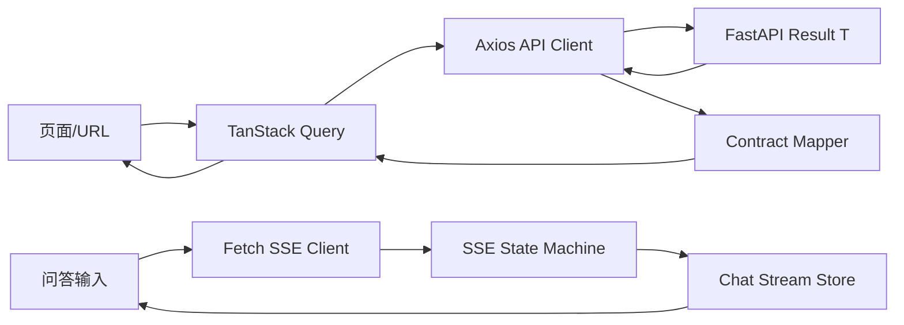
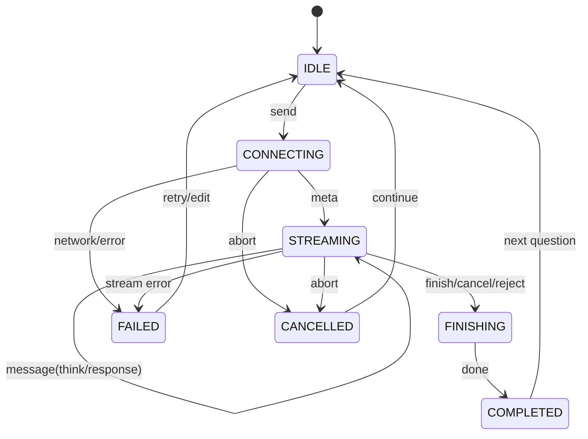
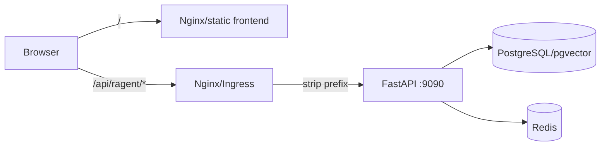

# Ragent — 前端工程与页面设计

> 本文覆盖：前端工程选型、蓝色视觉体系、信息架构、页面规划、组件边界、状态管理、REST/SSE 联调、权限、响应式、测试与分期交付。
> 参考实现：`/Users/wangtongzhou/Documents/twoWork/ragent/frontend`；目标工程：当前仓库新建 `frontend/`。
> 基线：`00-总体架构与技术选型.md`、`01-问答主链路与会话记忆.md`、`02-问题理解与混合检索.md`、`07-系统管理与可观测.md`。
> 状态标记：`READY` 表示当前后端可直接联调；`ADAPT` 表示需前端做字段或开发代理适配；`BLOCKED` 表示需先补后端 API。

## 1. 建设目标与原则

### 1.1 产品目标

Ragent 前端不拆成多个独立应用，首期建设一个 React SPA，包含两个工作区：

1. **智能问答端**：面向业务用户，完成流式问答、思考过程、来源引用、歧义选择和会话管理。
2. **RAG 管理控制台**：面向管理员与开发运维，完成知识库、文档、Chunk、意图树、查询词映射与 RAG Trace 管理。

两个工作区共享登录态、API 客户端、设计 Token、基础组件和预览能力，不引入微前端。

### 1.2 设计原则

- **蓝色是品牌主色**：整体以明亮、清晰、有层次的蓝色体系为主，不使用深墨色作为大面积主视觉。
- **白色承载内容**：表格、表单、对话和 Trace 详情使用白色或极浅蓝色底，保证长时间使用的可读性。
- **蓝色必须有语义**：主按钮、选中态、链接、聚焦和流式进度使用品牌蓝；成功、警告、失败仍使用绿/橙/红，不把所有信息都染成蓝色。
- **产品工具优先**：界面以中文业务名称、真实状态和高频操作为中心，不使用装饰性英文眉题、阶段代号、机器人图标或概念指标营造“AI 感”。
- **减少容器装饰**：优先用留白、分隔线和稳定的信息层级组织页面，渐变、阴影、圆角卡片只在确有层级含义时使用。
- **数据真实优先**：没有后端契约的页面不做伪指标、伪表格和永久 Mock。
- **桌面效率优先**：管理端主要面向 `1280px–1920px` 宽屏，同时保证 `768px` 平板可完成关键操作。
- **可观测即产品特征**：用统一的「RAG 信号轨」展示改写、意图、检索、重排和生成，形成项目辨识度。

## 2. 参考项目复用边界

### 2.1 可复用

| 能力 | 参考位置 | 复用方式 |
|---|---|---|
| Vite + React + TypeScript 工程 | `frontend/package.json`、`vite.config.ts` | 参考依赖和 alias，重新生成本项目 lockfile |
| Router 与权限守卫 | `src/router.tsx` | 保留 `RequireAuth` / `RequireAdmin` 思路，按当前角色契约改写 |
| REST 响应拦截 | `src/services/api.ts` | 复用 `Result<T>` 解包与认证失效跳转思路 |
| SSE 解析 | `src/hooks/useStreamResponse.ts` | 复用分帧器，按当前六事件契约补完状态机 |
| Markdown 与引用 | `components/chat/` | 复用渲染思路，重写引用定位和可访问性 |
| PDF/DOCX/Excel 预览 | `components/document/` | 按当前 `/preview` 和 `/file` 契约取舍 |
| Radix 基础组件 | `components/ui/` | 保留行为和无障碍能力，重做蓝色视觉 Token |

### 2.2 不直接复制

- 不整包复制 `src/pages` 和 `src/stores`，避免带入当前后端没有的会话、Dashboard、Agent 等契约。
- 不复制参考项目的蓝紫渐变与通用 SaaS 卡片风格。
- 不复用 `@ts-nocheck` 或大范围 ESLint disable；业务契约必须有完整 TypeScript 类型。
- 不复制参考项目 `.env`、构建产物、`node_modules` 或与 Java 后端绑定的字段。

## 3. 技术选型

| 分层 | 选型 | 用途 |
|---|---|---|
| 构建 | Vite + TypeScript strict | 本地启动、构建、环境变量 |
| UI | React 18 | 页面与组件 |
| 路由 | React Router 7 | 工作区、守卫、详情路由 |
| 样式 | Tailwind CSS + CSS Variables | 布局与设计 Token |
| 无障碍原语 | Radix UI | Dialog、Dropdown、Tooltip、Select |
| 图标 | Lucide React | 统一线性图标 |
| 服务端状态 | TanStack Query | 查询缓存、失效、重试、Mutation |
| 客户端状态 | Zustand | 登录快照、当前对话、SSE 状态 |
| HTTP | Axios | REST 请求、`Result<T>` 解包 |
| 流式 | Fetch + ReadableStream | GET SSE，支持 AbortController |
| 表单 | React Hook Form + Zod | 表单状态与前端校验 |
| 表格 | TanStack Table | 复杂表格状态；简单表格使用语义 HTML |
| 内容 | react-markdown + remark-gfm | Markdown 答案与代码块 |
| 测试 | Vitest + Testing Library + MSW + Playwright | 单元、组件、契约和 E2E |

不引入 Next.js：当前是登录后工作台，不依赖 SEO 和 SSR，Vite SPA 与 FastAPI 分离部署更直接。

## 4. 信息架构与路由

### 4.1 路由表

| 路由 | 页面 | 角色 | 状态 |
|---|---|---|---|
| `/login` | 登录 | 公开 | READY |
| `/chat` | 新对话 | 登录 | READY |
| `/chat/:conversationId` | 持续对话/历史会话 | 登录 | 新对话 READY，历史 BLOCKED |
| `/preview/doc/:docId` | 文档预览 | 登录 | READY |
| `/admin` | 控制台默认跳转 | admin | ADAPT |
| `/admin/knowledge-bases` | 知识库 | admin | READY |
| `/admin/knowledge-bases/:kbId/documents` | 文档 | admin | READY |
| `/admin/documents/:docId/chunks` | Chunk | admin | READY |
| `/admin/intent-tree` | 意图树 | admin | READY |
| `/admin/mappings` | 查询词映射 | admin | READY |
| `/admin/traces` | Trace 列表 | admin | READY |
| `/admin/traces/:traceId` | Trace 详情 | admin | READY |
| `/admin/dashboard` | 概览与质量指标 | admin | BLOCKED |
| `/admin/users` | 用户管理 | admin | BLOCKED |
| `/admin/ingestion` | Pipeline/任务 | admin | BLOCKED |
| `/admin/agents` | Agent/Prompt | admin | BLOCKED |
| `/admin/mcp` | MCP 工具 | admin | BLOCKED |
| `/admin/settings` | 模型与运行时设置 | admin | BLOCKED |

### 4.2 菜单规则

- 仅展示 READY 页面；BLOCKED 页面不以灰色占位菜单形式上线。
- 问答端和控制台在顶部提供明确的「进入控制台/返回问答」入口。
- 左侧导航一级分组为「知识」「检索」「观测」「系统」，第一期只显示前三组的可用项。
- 侧边栏支持 `280px`/折叠 `72px`，折叠态必须有 Tooltip。

## 5. 蓝色视觉体系

### 5.1 设计方向

视觉语气为「**克制、清晰、面向高频操作的蓝色工作台**」。RAG 信号轨只在真实问答进度和 Trace 时序中出现，不作为所有页面的通用装饰：

```text
问题 ●━ 改写 ●━ 意图 ●━ 检索 ●━ 重排 ●━ 回答
```

- 问答时，信号轨以弱化的蓝色节点表示处理进度。
- Trace 详情时，信号轨成为可展开的真实节点时间线。
- 不向普通用户暴露内部 prompt 和敏感 `extraData`，管理端按权限展示。

### 5.2 颜色 Token

```css
:root {
  --blue-950: #102a56;
  --blue-900: #173b75;
  --blue-800: #1e4f9e;
  --blue-700: #1f5fc7;
  --blue-600: #2563eb;
  --blue-500: #3b82f6;
  --blue-400: #60a5fa;
  --blue-300: #93c5fd;
  --blue-200: #bfdbfe;
  --blue-100: #dbeafe;
  --blue-50: #eff6ff;

  --canvas: #f5f8fd;
  --surface: #ffffff;
  --surface-blue: #f7faff;
  --text-primary: #14213d;
  --text-secondary: #52627a;
  --text-muted: #8a9ab2;
  --border: #dce6f3;
  --border-strong: #bfd2ea;

  --success: #16a36a;
  --warning: #e89219;
  --danger: #df4b55;
  --info: var(--blue-600);
}
```

使用约束：

- 页面大底使用 `--canvas`，内容容器使用 `--surface`。
- 导航使用中等明度的纯蓝色，不使用近黑的深墨色或装饰性渐变。
- 主按钮固定 `blue-600`，hover `blue-700`，焦点环使用 `blue-300` 且至少 `2px`。
- 浅蓝卡片仅用于「当前选中」「处理中」和「引用来源」，不做全页蓝色块堆叠。
- 不使用紫色作为品牌辅色；紫色只能在确有独立业务语义时出现。

### 5.3 字体与排版

- 中文正文：自托管 `Noto Sans SC`，不依赖远程 CDN。
- 英文、数字和标题：`IBM Plex Sans`。
- Trace ID、Chunk ID、耗时与代码：`IBM Plex Mono`。
- 页面 H1 `28/36, 650`；区块 H2 `18/28, 600`；正文 `14/22, 400`；辅助文字 `12/18, 400`。
- 正文最小 `13px`，只有紧凑标签可使用 `12px`，不使用 `10px` 承载关键信息。

### 5.4 间距、圆角和阴影

| Token | 值 | 用途 |
|---|---:|---|
| 基础间距 | `4px` | 所有间距为 4 的倍数 |
| 控件高度 | `36/40/44px` | 紧凑/默认/强调 |
| 控件圆角 | `8px` | Input、Button、Select |
| 卡片圆角 | `12px` | 面板与 Dialog，禁止滥用大药丸形 |
| 浮层阴影 | `0 12px 36px rgb(31 95 199 / 12%)` | Dialog、Popover |
| 卡片阴影 | `0 2px 8px rgb(16 42 86 / 6%)` | 仅在需要层级时使用 |

### 5.5 动效

- 页面首次进入只做一次 `160–240ms` 的透明度+微位移编排，不对每张卡片无限飘浮。
- SSE 生成中使用信号轨流动光点，不使用大面积骨架屏闪烁。
- Dialog/Drawer `180ms`，菜单 hover `120ms`，页面路由不做华丽转场。
- 遵循 `prefers-reduced-motion`，关闭位移和流动动画，保留状态文字。

## 6. 前端工程结构

```text
frontend/
├── public/
│   └── fonts/                       # 自托管 woff2
├── src/
│   ├── app/
│   │   ├── App.tsx
│   │   ├── router.tsx
│   │   └── providers.tsx             # QueryClient/Toast/ErrorBoundary
│   ├── layouts/
│   │   ├── ChatLayout.tsx
│   │   └── ConsoleLayout.tsx
│   ├── features/
│   │   ├── auth/
│   │   ├── chat/
│   │   ├── knowledge/
│   │   ├── intent/
│   │   ├── mappings/
│   │   └── traces/
│   ├── shared/
│   │   ├── api/                      # client/result/error/contracts
│   │   ├── components/               # 跨域业务组件
│   │   ├── sse/                      # parser/state-machine
│   │   ├── ui/                       # Button/Dialog/Table...
│   │   ├── hooks/
│   │   ├── lib/
│   │   └── types/
│   ├── stores/
│   │   ├── auth-store.ts
│   │   └── chat-stream-store.ts
│   └── styles/
│       ├── tokens.css
│       ├── globals.css
│       └── markdown.css
├── tests/
│   ├── fixtures/
│   └── contract/
├── .env.example
├── package.json
├── tsconfig.json
└── vite.config.ts
```

组织原则：

- `features/*` 自包含 `api.ts`、`types.ts`、`queries.ts`、`components/` 和 `pages/`。
- `shared/ui` 不引用业务域；业务组件不放进 `ui`。
- 禁止建立全局 `types/index.ts` 大杂烩，契约跟随业务域。
- 页面只负责组装和 URL 状态，请求、转换、表单和复杂交互下沉。

## 7. 状态管理与数据流

### 7.1 状态归属

| 状态 | 归属 | 示例 |
|---|---|---|
| URL 状态 | React Router | 页码、搜索词、状态筛选、当前详情 ID |
| 服务端状态 | TanStack Query | 知识库页、文档页、意图树、Trace |
| 会话流状态 | Zustand | 当前 conversationId、消息、thinking、sources、AbortController |
| 认证快照 | Zustand + storage | token、当前用户；服务端 `/user/me` 为真相源 |
| 局部 UI | useState/useReducer | Dialog 开关、表单草稿、表格勾选 |

不将知识库列表、Trace 列表等可重新请求数据复制到 Zustand。

### 7.2 主数据流



## 8. REST 客户端契约

### 8.1 Base URL 与本地代理

```env
VITE_API_BASE_URL=/api/ragent
VITE_API_PROXY_TARGET=http://127.0.0.1:9090
```

FastAPI `root_path=/api/ragent` 用于反向代理语义，开发环境 Vite 必须移除前缀后再转发：

```ts
proxy: {
  "/api/ragent": {
    target: "http://127.0.0.1:9090",
    changeOrigin: true,
    rewrite: (path) => path.replace(/^\/api\/ragent/, ""),
  },
}
```

生产环境由 Nginx/Ingress 对 `/api/ragent/*` 做等价前缀剥离。前端不使用 CORS 直连 API，默认同源部署。

### 8.2 `Result<T>` 解包

```ts
type Result<T> = {
  code: string;
  message: string;
  data: T;
  requestId?: string;
};
```

- `code === "0"` 返回 `data`。
- `code !== "0"` 抛出 `ApiError{code,message,requestId,httpStatus}`。
- 未登录错误清除 token，保存 `location.pathname + search` 后跳转 `/login`。
- 500 类错误在 Toast 中附带可复制 requestId，不向用户暴露堆栈。
- GET 仅对网络错误和 5xx 最多重试 1 次；Mutation 默认不自动重试。

### 8.3 认证适配

- Header 必须是 `Authorization: <token>`，**不添加 `Bearer `**。
- 登录响应没有 username，登录成功后立即调 `/user/me` 获取完整用户。
- 前端权限判断使用 `role.toLowerCase()`，兼容 `admin`/`ADMIN`；服务端仍是最终权限边界。
- token 持久化允许 localStorage，但不在日志、Toast、URL 或 Trace 中输出。

### 8.4 分页适配

当前 Python 分页响应为 `{records,total,current,size}`，前端契约层补：

```ts
pages = Math.max(1, Math.ceil(total / size));
```

页码、关键词和筛选必须写入 URL search params，刷新和后退不丢失上下文。

### 8.5 当前可联调 API 对照

| 领域 | 方法与路径 | 前端用途 |
|---|---|---|
| 认证 | `POST /auth/login` | 登录并取得 token |
| 认证 | `POST /auth/logout` | 注销当前 token |
| 认证 | `GET /user/me` | 恢复完整用户快照 |
| 问答 | `GET /rag/v3/chat` | SSE 流式问答 |
| 知识库 | `GET/POST /knowledge-base` | 分页/搜索/创建 |
| 知识库 | `GET/PUT/DELETE /knowledge-base/{kbId}` | 详情/修改/删除 |
| 文档 | `GET /knowledge-base/docs/search` | 控制台全局搜索 |
| 文档 | `GET /knowledge-base/{kbId}/docs` | 文档分页和筛选 |
| 文档 | `POST /knowledge-base/{kbId}/docs/upload` | 文件上传或 URL 导入 |
| 文档 | `GET/PUT/DELETE /knowledge-base/docs/{docId}` | 详情/修改/删除 |
| 文档 | `PATCH /knowledge-base/docs/{docId}/enable` | 启用/停用 |
| 文档 | `POST /knowledge-base/docs/{docId}/chunk` | 触发分块任务 |
| 预览 | `GET /knowledge-base/docs/{docId}/preview` | 拼接后的文本预览 |
| 预览 | `GET /knowledge-base/docs/{docId}/file` | 原文件预览/下载 |
| Chunk | `GET /knowledge-base/docs/{docId}/chunks` | Chunk 分页和筛选 |
| Chunk | `PUT/DELETE /knowledge-base/docs/{docId}/chunks/{chunkId}` | 编辑/删除 |
| Chunk | `PATCH .../{chunkId}/enable` | 单条启停 |
| Chunk | `PATCH .../chunks/batch-enable` | 批量启停 |
| 意图 | `GET /intent-tree/trees` | 读取完整树 |
| 意图 | `POST /intent-tree`、`PUT/DELETE /intent-tree/{id}` | 节点 CRUD |
| 意图 | `POST /intent-tree/batch/{enable|disable|delete}` | 批量操作 |
| 映射 | `GET/POST /mappings`、`GET/PUT/DELETE /mappings/{id}` | 分页、详情和 CRUD |
| Trace | `GET /rag/traces/runs` | 运行分页和筛选 |
| Trace | `GET /rag/traces/runs/{traceId}` | 运行+节点详情 |
| Trace | `GET /rag/traces/runs/{traceId}/nodes` | 节点独立刷新 |

所有路径在浏览器中都以 `/api/ragent` 为前缀；表内为 FastAPI 应用内部路径。

## 9. SSE 问答设计

### 9.1 请求

`GET /rag/v3/chat?question=&conversationId=&deepThinking=`，Header 携带原始 token。问题使用 `URLSearchParams`，不手写字符串拼接。

### 9.2 状态机



约束：

- `meta` 固定首帧，立即保存 `conversationId/taskId`。
- `message.type=think` 进思考折叠区；`response` 进回答区，两者不混存。
- `finish` 回填 `messageId/title/sources/messageStatus`，之后等待 `done`。
- `cancel/reject` 是协议终态，不当作普通 message。
- 刷新、切路由和重新提问前必须 abort 旧连接，用 generation id 丢弃晚到帧。
- 当前后端没有 stop API，第一期的「停止」只中断客户端连接，页面必须准确表达这一限制。

### 9.3 消息渲染

- 用户消息使用浅蓝气泡；助手回答使用无气泡的文档流布局，避免双边聊天软件感。
- 思考内容默认折叠，生成时展示标题、耗时和信号轨，不使用无限旋转 loading。
- Markdown 必须经 `rehype-sanitize`，代码块支持复制，表格小屏横向滚动。
- `[N](#cite-N)` 渲染为可键盘聚焦的引用标记，点击打开右侧 Sources Drawer 并定位来源。
- 歧义引导第一期按普通消息展示；第二期在后端提供结构化 guidance 事件后升级为选项卡。

## 10. 页面详细规划

### 10.1 登录页 `READY`

**目标**：快速进入工作台，不展示虚构产品营销数据。

- 左侧为蓝色品牌面，展示抽象的 RAG 信号轨和「入库→理解→检索→回答」能力。
- 右侧为白色登录表单，仅用户名、密码和登录按钮。
- 提交中禁用重复点击；Enter 提交；错误保留用户名但清空密码。
- 登录成功后调 `/user/me`，按 redirect 或角色进入问答/控制台。

### 10.2 问答首页 `READY`

**布局**：左侧会话栏（历史 API 完成前可折叠隐藏）+中央问答流+右侧来源 Drawer。

- 空状态中心标题与输入框不超过 `880px`，背景使用极浅蓝信号网格。
- 输入框支持多行、`Enter` 发送、`Shift+Enter` 换行和深度思考开关。
- 建议问题首期使用前端静态配置，明确标记为示例；后端示例问题 API 完成后替换。
- 来源项展示文档名、类型、摘要和预览入口，不向用户显示内部 docId。
- 无检索结果、SYSTEM 回答、MCP 回答和歧义引导都是正常终态，不渲染错误红框。

### 10.3 控制台框架 `ADAPT`

- 左侧蓝色导航、顶部白色工具栏、浅蓝灰内容底。
- 顶部包含面包屑、全局知识搜索入口、返回问答和用户菜单。
- 全局搜索可使用 `/knowledge-base` + `/knowledge-base/docs/search`，输入防抖 `250ms`。
- 只有 admin 展示控制台入口；路由守卫仅是交互优化，后端必须同步校验。

### 10.4 知识库列表 `READY`

- 顶部：标题、关键词搜索、刷新、新建知识库。
- 主体：表格优先，字段为名称、collectionName、embeddingModel 和操作。
- 新建：`name/collectionName/embeddingModel` 全必填；collectionName 创建后不允许修改。
- 删除前二次确认，后端返回「知识库下存在文档」时直接呈现业务文案。
- 当前响应没有 documentCount/createTime，首期不显示虚假统计卡。

### 10.5 文档管理 `READY`

- 筛选：文档名、状态；主操作：上传文件/导入 URL。
- 表格：文档名、来源、状态、启用、Chunk 数、类型、大小、操作。
- 上传 Dialog 支持拖放、文件/URL 切换、parseProfile 和分块预算；表单 schema 从 `/docs/ingestion-spec-schema` 动态读取。
- 上传成功只表示文档已创建；还需显式点击「开始分块」，除非后端后续改为自动入队。
- pending/running/success/failed 必须同时有文字和图标，不只依赖颜色。

### 10.6 Chunk 管理 `READY`

- 顶部显示文档名、分块总数、启用筛选和批量启停。
- Chunk 使用紧凑列表，展示 `chunkIndex/content/enabled`，内容最多预览 4 行。
- 编辑使用大尺寸 Dialog/Drawer，明确提示保存会重新 embedding。
- 批量操作最多 500 条，前端与后端同时校验。

### 10.7 文档预览 `READY`

- 优先按 MIME/fileType 使用 PDF/DOCX 原文预览；无法原文预览时使用 `/preview` 拼接 Chunk 文本。
- `/file` 需要 Authorization Header，不能直接把路径填入无认证的 `iframe src`；先通过 fetch/axios 取 Blob，再创建临时 Object URL，离开页面时 revoke。
- 顶部固定返回、文档名、下载/新窗口打开；预览内容不使用 `dangerouslySetInnerHTML`。
- 来源 Drawer 打开预览时携带 source 上下文，返回后恢复引用定位。

### 10.8 意图树 `READY`

- 桌面端为左树右详情的双栏布局，小屏改为树 + Drawer。
- 节点标签展示 DOMAIN/CATEGORY/TOPIC 和 KB/SYSTEM/MCP，蓝色表示选中，类型用中性描边标签。
- 编辑字段严格对齐当前 `IntentNodeWrite`，不带入参考项目的 sortOrder/promptSnippet/promptTemplate。
- collectionNames 从知识库接口多选；kind=MCP 时才显示 mcpToolId；topK 仅接受正整数。
- 列表视图与树视图共享 Query cache 和 Mutation，批量启停/删除后统一 invalidate。

### 10.9 查询词映射 `READY`

- 分页表格字段：sourceTerm、targetTerm、matchType、domain、priority、enabled、remark。
- 查询关键词写 URL，新建/编辑共用表单，删除需确认。
- matchType 在前端使用枚举映射展示文案，但提交仍使用数字，不自行改变后端语义。

### 10.10 RAG Trace 列表 `READY`

- 筛选：traceId、conversationId、taskId、status，全部写 URL。
- 表格：问题、状态、总耗时、用户 ID、开始时间、Trace ID。
- 当前 API 无 TTFT，不展示「平均首字」卡片；统计仅标注「当前页」口径。
- Trace ID 使用等宽字体、中间省略和一键复制。

### 10.11 RAG Trace 详情 `READY`

- 顶部概览：状态、问题、总耗时、conversationId/taskId/traceId。
- 主体使用 RAG 信号轨，按节点顺序展示 nodeName/nodeType/durationMs/status。
- 点击节点在右侧检查面板展开 `extraData`，支持 JSON 折叠和复制；`extraData` 是对象，不按字符串二次 parse。
- 失败节点使用红色标识，其余轨道仍保留蓝色主视觉；耗时最长节点用「慢」标签而不用错误色。

### 10.12 后续页面 `BLOCKED`

| 页面 | 所需后端契约 |
|---|---|
| 会话侧边栏/历史 | 会话分页、消息列表、重命名、删除 |
| 消息反馈/推荐问题 | feedback CRUD、recommended-questions |
| Dashboard | overview/performance/trends 统计 |
| 用户管理 | users CRUD、改密、admin 守卫 |
| Pipeline/任务 | Pipeline CRUD、调试、任务分页和日志 |
| Agent/Prompt | Agent Profile 与 Prompt Slot API |
| MCP 管理 | Server/Tool 发现、启停、调试 API |
| 系统设置 | 脱敏运行时设置、模型健康和可编辑项 |
| 知识图谱 | LightRAG 图数据和检索 API |

## 11. 关键组件

| 组件 | 职责 |
|---|---|
| `AppShell` | 页面高度、跳转、ErrorBoundary、Toast |
| `ConsoleSidebar` | 分组导航、折叠、权限可见性 |
| `PageHeader` | 标题、副标题、主操作与面包屑 |
| `DataTableState` | loading/empty/error 的统一表格状态 |
| `ConfirmActionDialog` | 删除、批量启停等高影响操作 |
| `StatusBadge` | pending/running/success/failed 统一映射 |
| `CopyableId` | UUID 省略、等宽展示、复制 |
| `RagSignalRail` | 问答进度和 Trace 节点的共享视觉语言 |
| `StreamMessage` | thinking/response 分流、Markdown、中断态 |
| `CitationMark` | `[N]` 引用、键盘操作、来源定位 |
| `SourcesDrawer` | 来源列表、摘要、文档预览 |
| `IntentTree` | 层级展开、选中、键盘导航 |
| `JsonInspector` | Trace extraData 折叠、复制、长值截断 |

所有共享组件必须定义 loading、empty、disabled、error 和 focus-visible 状态，不允许页面临时拼凑。

## 12. 类型与契约适配

### 12.1 明确差异

| 领域 | 当前后端 | 前端适配 |
|---|---|---|
| role | 存在大小写差异可能 | 读取时归一化为 `admin/user` |
| LoginVO | 无 username | 登录后立即 `/user/me` |
| Page | 无 pages | mapper 计算 |
| KnowledgeBaseVO | 无 documentCount/时间 | 页面不展示 |
| ingestionSpec | JSON object | 表单状态保持对象，上传 FormData 时 JSON.stringify |
| Intent examples | `string[]` | 标签输入器，不按逗号字符串持久化 |
| Intent enabled | boolean | 不使用 0/1 UI 类型 |
| Trace run | `entryPoint`，无 ttftMs | 按真实字段显示 |
| Trace node | `extraData` 为 object | JsonInspector 直接消费 |
| SourceRef | docId 为 string | 仅作路由和引用键，不转 number |

### 12.2 契约准入

- API 响应不在页面直接 `as SomeType`，关键契约用 Zod parse 或开发环境 assert。
- 所有 ID 在前端默认用 string，不对 BIGINT/UUID 做不必要的 Number 转换。
- 时间按接口契约传输；Trace 使用 Unix epoch milliseconds，其他 ISO 时间必须包含明确时区，格式化时使用用户本地时区。
- 前端契约 fixture 从后端测试样本导出，不依赖人工长期双维护。

## 13. 权限与安全

- `/chat*` 和 `/preview*` 需登录；`/admin*` 需 admin。
- 知识库、文档、Chunk、意图树、映射和 Trace 的管理接口由后端统一执行 `require_admin`；文档 `/preview` 与 `/file` 保留 `require_user`，供普通用户核对问答来源。
- 前端隐藏菜单和 `/admin*` 路由守卫只负责交互，服务端 `40300` 才是最终授权边界。
- 未登录访问业务页保存 redirect；已登录访问 `/login` 跳转默认工作区。
- Markdown 禁止未净化 HTML；外部链接添加 `rel="noopener noreferrer"`。
- 文件名、文档内容、Trace extraData 都按不可信输入处理。
- 删除、批量操作、重新分块显示对象名和影响范围，不使用含糊的「确定？」。
- 日志不记录 token、密码、完整 prompt 或文档正文。

## 14. 响应式与无障碍

### 14.1 断点

| 宽度 | 策略 |
|---|---|
| `>= 1440px` | 完整导航、主内容、右侧 Drawer 可并排 |
| `1024–1439px` | 侧边栏可折叠，Drawer 覆盖打开 |
| `768–1023px` | 导航改为 Drawer，表格横滚，意图详情用 Drawer |
| `< 768px` | 保证登录和问答；管理页只保证查看和低风险操作 |

### 14.2 无障碍要求

- WCAG 2.1 AA 颜色对比；浅蓝底上不使用 `blue-400` 作小字正文。
- 所有图标按钮有 accessible name，尺寸不小于 `36px`。
- Dialog 聚焦圈定、Esc 关闭和触发器聚焦恢复由 Radix 保证。
- 表单错误与字段通过 `aria-describedby` 关联，不只显示 Toast。
- 动态生成内容使用节制的 `aria-live="polite"`，不对每个 token 单独播报。

## 15. 性能与可靠性

- 路由级 lazy loading，聊天首页不加载 PDF/DOCX/Excel 预览依赖。
- Markdown 语法高亮按需加载；长会话消息列表后续超过 100 条再引入虚拟化。
- 搜索输入防抖 `250ms`，数据请求使用 AbortSignal 取消旧请求。
- Mutation 成功后精确 invalidate query key，不使用全局刷新。
- SSE 断线不自动重放已发送问题，避免重复消费模型；向用户提供显式重试。
- 构建目标：首页 gzip JS 不超过 `250KB`，预览依赖独立 chunk。

## 16. 开发、构建与部署

### 16.1 命令

```bash
cd frontend
npm ci
npm run dev
npm run lint
npm run typecheck
npm run test
npm run build
npm run e2e
```

### 16.2 环境变量

| 变量 | 默认 | 说明 |
|---|---|---|
| `VITE_APP_NAME` | `Ragent AI` | 产品名 |
| `VITE_API_BASE_URL` | `/api/ragent` | REST/SSE 统一前缀 |
| `VITE_API_PROXY_TARGET` | `http://127.0.0.1:9090` | 仅开发代理 |
| `VITE_ENABLE_DEVTOOLS` | `false` | 查询工具开关 |

仅 `VITE_*` 可进前端 bundle，不得将模型 API Key、DB 或 Redis 密码写入前端环境变量。

### 16.3 部署拓扑



SPA 路由回退到 `index.html`；`/api/ragent/` 不参与回退；SSE 路径关闭代理缓冲并提高超时。

## 17. 测试策略

### 17.1 单元与组件测试

1. `Result<T>` 解包：成功、业务错误、未登录、requestId。
2. 分页 mapper：total=0、非整页、size 非法防御。
3. SSE parser：拆包、粘包、多 data 行、UTF-8 边界、`[DONE]`。
4. SSE 状态机：meta 首帧、thinking/response 分流、finish+done、cancel/reject、晚到帧。
5. 路由守卫：未登录、admin/user 大小写、redirect 恢复。
6. Citation：编号定位、无匹配来源、键盘操作。
7. 知识库/文档/Chunk 表单校验和 Query invalidate。
8. 意图树展开、选中、类型条件字段和批量操作。
9. Trace extraData 对象、长字符串、null 和敏感字段展示。

### 17.2 契约测试

- 从 FastAPI 实际响应保存脱敏 fixture，验证 Zod schema 和 mapper。
- REST 重点：auth、knowledge-base/docs/chunks、intent-tree、mappings、traces。
- SSE 保存六事件黄金样本，回归 event 名、payload camelCase、终态顺序。
- 后端字段新增可向后兼容，删除/改名关键字段必须在 CI 失败。

### 17.3 E2E

1. admin 登录 → 创建知识库 → 上传 MD/PDF → 触发分块 → 查看 Chunk。
2. 发起问答 → 接收 thinking/response → finish 来源 → 打开文档预览。
3. 新建意图节点 → 绑定知识库 → 批量停用 → 刷新树。
4. 新建查询词映射 → 编辑 → 搜索 → 删除。
5. 问答后进入 Trace 列表 → 打开详情 → 展开 retrieval 节点。
6. token 失效 → 自动跳登录 → 登录后返回原路由。

### 17.4 视觉验收

- `1440x900`、`1280x800`、`768x1024`、`390x844` 截图回归。
- 蓝色 Token 是唯一主品牌色，无意外紫色渐变。
- 表格、空状态、错误、Drawer、Dialog 和长文本全部有基准图。
- 键盘单独完成登录、提问、打开引用、筛选和关闭 Dialog。

## 18. 分期路线图

### F0 工程与设计系统

- [x] 创建 `frontend/` 工程、strict TypeScript、alias 和命令
- [x] 建立蓝色 Token、字体、Button/Input/Dialog/Table 基线
- [x] 实现 API client、Result 解包、ApiError、本地 proxy
- [x] 实现 Router、RequireAuth、RequireAdmin、ErrorBoundary
- [x] 建立 Vitest/MSW/Playwright 骨架

F0 于 2026-09-01 完成。桌面 `1440x1000` 与移动端 `390x844` 已完成视觉验收；
`lint`、TypeScript、9 个单元测试、生产构建、Playwright Chromium 冒烟测试和
`npm audit` 均通过。

### F1 可用问答端

- [x] 登录/登出/当前用户
- [x] 问答首页、输入、深度思考开关
- [x] SSE 六事件解析和状态机
- [x] Markdown、thinking、sources、引用定位
- [x] 文档预览
- [x] 断线、空检索、歧义和中断状态处理

F1 于 2026-09-01 完成代码与自动化验收：SSE parser 覆盖拆包、粘包、多 `data` 行、
UTF-8 边界与 `[DONE]`，状态机覆盖正常、拒绝、取消、异常与晚到帧；Playwright 覆盖
登录首屏以及提问→思考→回答→来源→文档预览黄金路径。真实开发代理已确认后端健康
`200` 与认证拦截业务码 `40100`；使用开发账号完成一次真实模型首问作为人工发布确认，
凭据不写入测试和仓库。

### F2 当前后端已支持的管理面

- [ ] 控制台框架和全局搜索
- [x] 知识库 CRUD
- [x] 文档上传/URL 导入/状态/分块
- [x] Chunk 编辑、启停、批量操作
- [x] 意图树 CRUD 和批量操作
- [x] 查询词映射 CRUD
- [x] Trace 列表与信号轨详情
- [x] 管理 API 统一补齐后端 `require_admin` 生产守卫

F2 第一批于 2026-09-01 完成：控制台导航、知识库分页表格、搜索、刷新、创建、编辑、
删除确认及业务错误提示已接入。Playwright 覆盖完整 CRUD 与 Query cache 刷新；真实开发
API 只读验收返回空状态且无错误，未对现有数据执行写操作。

F2 第二批于 2026-09-02 完成：知识库到文档的分层导航、文件拖放与 URL 导入、动态
入库参数、状态筛选和轮询、显式分块、启停、预览与删除均已接入；Chunk 工作台覆盖
分页、启用筛选、单条/批量启停、编辑后重新向量化和删除，批量选择遵守 500 条上限。
三个管理页面使用路由级懒加载，Playwright 覆盖“导入→启动分块→进入 Chunk→批量停用
→编辑重向量化”黄金路径。

F2 第三批于 2026-09-02 完成：意图树使用左侧层级树和右侧配置详情，支持三级节点
创建、编辑、删除、整分支选择以及最多 500 条批量启停/删除；知识库类型从真实
Collection 多选，MCP 类型按需显示工具 ID，示例问题以标签维护。后端同步拆分运行时树
和管理树，停用节点仍可在管理页恢复。依据视觉复核，控制台去除了英文阶段标签、
机器人图标、装饰性流程卡和大面积渐变，保留纯蓝品牌导航与平直内容结构。

F2 第四批于 2026-09-02 完成：查询词映射提供分页、关键词搜索、创建、编辑、单条启停
与删除，搜索条件同步到 URL。页面按真实后端枚举展示精确、前缀、正则和整词匹配，并
明确提示当前归一化链路只执行精确匹配；Playwright 覆盖完整 CRUD、状态更新与 URL
筛选。页面保持高密度业务表格和克制蓝色操作色，不增加装饰性统计卡或 AI 风格文案。

F2 第五批于 2026-09-02 完成：RAG Trace 列表支持 traceId、conversationId、taskId 和
status 的 URL 筛选，展示当前页真实统计、问题、状态、总耗时、用户与开始时间；详情
使用节点运行时间线和右侧 JSON 检查面板，支持嵌套折叠、复制、异常状态与最慢节点标记。
前后端契约同步收敛到当前真实字段，时间统一输出 Unix epoch milliseconds，由前端按用户
本地时区格式化。

F2 第六批于 2026-09-02 完成：新增大小写兼容的 `require_admin` 依赖，知识库、文档、
Chunk、意图树、查询词映射和 Trace 管理接口统一以 `40300` 拒绝普通用户；问答来源所需
的文档预览与原文件接口继续允许已登录用户访问。自动化测试逐条审计当前 36 条相关路由，
并覆盖普通用户拒绝与来源预览放行。

### F3 会话产品化（先补后端）

- [ ] 会话列表、消息历史、重命名、删除
- [ ] 服务端停止任务
- [ ] 消息反馈和推荐问题
- [ ] 结构化歧义选项事件

### F4 M4 管理面

- [ ] Dashboard
- [ ] 用户、审计日志
- [ ] Pipeline 与任务
- [ ] Agent/Prompt
- [ ] MCP 管理与调试
- [ ] 运行时/模型设置

## 19. 阶段验收标准

### F0/F1 准出

- `npm run lint`、`npm run typecheck`、`npm run test`、`npm run build` 全部通过。
- 可使用当前 admin 账号登录，刷新后登录态可恢复，登出后 token 失效。
- 可在真实 API 上完成一次流式问答，thinking、response、sources、done 渲染正确。
- 中断连接不再写入已离开页面的状态，不出现双重消息。
- 蓝色视觉与本文 Token 一致，无深墨色主视觉、无紫色品牌渐变。

### F2 准出

- 知识库→文档→Chunk 全链路可用，操作后列表不依赖手工刷新。
- 意图树与查询词映射所有当前 API 有对应 UI，批量上限和错误文案正确。
- 完成问答后可从 Trace 页定位本次运行，查看 retrieval 节点与候选/Final ID。
- admin/user 路由隔离和服务端权限校验一致。
- Playwright 黄金路径、契约测试和四个视口截图全部通过。

## 20. 实施决策

1. 当前仓库内建一个 `frontend/` SPA，不拆问答端/管理端两套构建。
2. 参考项目作为组件和交互来源，不作为 Git 子模块或运行时依赖。
3. 视觉以蓝色为主，白色/浅蓝为内容底，深色只作文字与必要对比。
4. 第一批仅实现 READY 页面，BLOCKED 菜单随后端契约一起开放。
5. 先建契约层与 SSE 状态机，再建页面；页面不直接适配后端历史差异。
6. RAG 信号轨是本项目的特征组件，同时服务问答进度与 Trace 分析。
7. 每个阶段同时交付页面、契约测试、空/错误状态和视觉回归，不把质量收尾推到最后。
