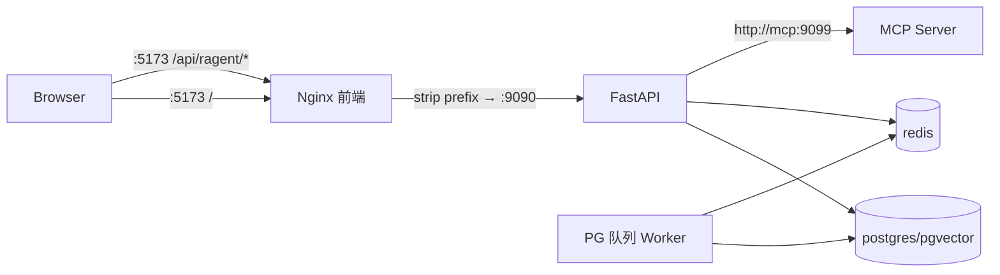

# 容器化部署

## 1. 目标与边界

容器化交付的目标是：一条 `docker compose` 命令拉起完整可用的 Ragent AI 栈，覆盖
PostgreSQL/pgvector、Redis、MCP 工具服务、API、PG 队列 Worker 与前端 Nginx。

覆盖范围：

- 开发机自验收与内网单机部署；
- 全部进程使用同一份锁文件构建的确定性镜像；
- 数据落命名卷，支持备份、升级与回滚。

不在范围内：Kubernetes 编排、多副本水平扩容、托管型 PG/Redis 的托管配置。若使用外部
PG/Redis，只需覆盖 `RAGENT_DATASOURCE__*`、`RAGENT_REDIS__*` 指向对应地址即可，镜像本身
不绑定中间件。

## 2. 镜像

### 2.1 后端镜像 `ragent-backend:<tag>`

`Dockerfile` 为多阶段构建：

| 阶段 | 基础镜像 | 作用 |
|---|---|---|
| `uv` | `ghcr.io/astral-sh/uv:0.12.7` | 提供与开发机一致的 uv 版本 |
| `builder` | `python:3.13-slim` | `uv sync --frozen --no-dev`，先装依赖再复制源码 |
| `runtime` | `python:3.13-slim` | 仅复制 `.venv` 与业务代码，非 root 运行 |

要点：

- 依赖层与源码层分离，只改业务代码时重建不需要重装依赖；
- `--frozen` 保证镜像内依赖与 `uv.lock` 完全一致，构建期不会静默升级；
- 运行用户为 `ragent`（uid/gid 10001），不使用 root；
- `.dockerignore` 排除 `.env`、`tests`、`docs`、`frontend` 与本地虚拟环境，镜像不含密钥与开发资产；
- 同一镜像承担三种进程角色：API（默认 `CMD`）、Worker（`python -m app.worker`）、
  MCP（`python -m mcp_server.main`），避免重复安装依赖。

### 2.2 前端镜像 `ragent-frontend:<tag>`

| 阶段 | 基础镜像 | 作用 |
|---|---|---|
| `builder` | `node:22-alpine` | `npm ci` + `vite build`，构建参数 `VITE_API_BASE_URL`（默认 `/api/ragent`） |
| `runtime` | `nginx:1.27-alpine` | 托管 `dist` 静态资源，并把 `/api/ragent/` 反向代理到 `api:9090` |

`frontend/nginx.conf` 关键配置：

- `location /api/ragent/` 通过 `proxy_pass http://api:9090/` 剥离前缀，与后端
  `server.root_path=/api/ragent` 对齐；
- 该路径关闭 `proxy_buffering`、`proxy_cache`，读超时提升到 310s，保证 SSE 逐步下发；
- SPA 路由回退到 `index.html`；`/healthz` 为容器健康检查端点；
- `client_max_body_size 100m` 支持文档上传。

## 3. 服务拓扑

| 服务 | 镜像 | 容器端口 | 宿主端口 | 说明 |
|---|---|---|---|---|
| `postgres` | `pgvector/pgvector:pg16` | 5432 | `127.0.0.1:15432` | 向量库与业务表，`auto_ddl` 启动建表 |
| `redis` | `redis:7-alpine` | 6379 | `127.0.0.1:16379` | 认证会话、限流、取消广播，`appendonly yes` 且强制密码 |
| `mcp` | `ragent-backend:$tag` | 9099 | 不映射 | MCP 工具服务，仅容器网络可达 |
| `api` | `ragent-backend:$tag` | 9090 | `9090` | FastAPI，启动时建扩展与建表 |
| `worker` | `ragent-backend:$tag` | 无 | 无 | PG 队列消费、入库与反馈任务 |
| `frontend` | `ragent-frontend:$tag` | 80 | `5173` | 静态资源 + 反向代理，唯一必须对外暴露的入口 |

启动顺序由健康检查串起来：`postgres`/`redis`/`mcp` 健康后 `api` 启动，
`api` 健康后 `worker` 与 `frontend` 启动。任一中途不健康会阻塞后续服务，避免出现
"前端已可访问但后端不可用"的半启动状态。



## 4. 配置项

配置文件基线为 [.env.docker.example](../.env.docker.example)，复制为 `.env.docker` 后修改，
该文件已在 `.gitignore` 覆盖范围内，不会入库。

| 变量 | 默认 | 说明 |
|---|---|---|
| `COMPOSE_PROJECT_NAME` | `ragent` | 项目名，决定容器、网络与卷前缀 |
| `RAGENT_IMAGE_TAG` | `local` | 后端/前端镜像标签，用于版本化与回滚 |
| `POSTGRES_PASSWORD` | 无（必填） | compose 用 `:?` 强制校验，缺失直接报错 |
| `REDIS_PASSWORD` | 无（必填） | 同上；Redis 以 `--requirepass` 启动 |
| `POSTGRES_PORT` / `REDIS_PORT` | `15432` / `16379` | 仅宿主侧映射端口，避免与本机已有 5432/6379 冲突 |
| `API_PORT` / `FRONTEND_PORT` | `9090` / `5173` | 宿主侧入口端口 |
| `RAGENT_AUTH_ENABLED` | `false` | 首次启动保持关闭，创建管理员后再开启 |
| `JWT_SECRET` | 空 | 启用认证时必填，建议 ≥32 位随机串 |
| `RAGENT_EVAL_ENABLED` | `false` | 开启后才挂载检索质量评测接口 |
| `BAILIAN_API_KEY` | 空 | 模型能力密钥；留空时检索/管理面可用但无法生成回答 |

compose 内部还会注入一组不对外暴露的覆盖项：数据源与 Redis 主机名固定为服务名
`postgres`/`redis`，上传目录固定为 `/app/resources/uploads`，MCP 地址通过
`RAGENT_RAG__MCP__SERVERS` 注入为 `http://mcp:9099`。配置读取优先级为
环境变量 > `config/application.yaml` > 字段默认值。

## 5. 首次启动

```bash
cp .env.docker.example .env.docker
# 修改 POSTGRES_PASSWORD / REDIS_PASSWORD，按需填写 BAILIAN_API_KEY
docker compose --env-file .env.docker up -d --build
docker compose --env-file .env.docker ps
```

健康检查：

```bash
curl -s http://127.0.0.1:9090/health              # 直连 API
curl -s http://127.0.0.1:5173/api/ragent/health   # 经前端 Nginx 代理
curl -s -o /dev/null -w '%{http_code}\n' http://127.0.0.1:5173/healthz
```

浏览器访问 `http://127.0.0.1:5173/`。首次启动会由 API 在 `init_schema` 中执行
`CREATE EXTENSION IF NOT EXISTS vector` 与 `create_all`，无需单独跑迁移命令。

故障排查入口：

```bash
docker compose --env-file .env.docker logs -f api worker
docker compose --env-file .env.docker exec api python -c "print('ok')"
```

## 6. 认证与首个管理员

默认 `RAGENT_AUTH_ENABLED=false`：`AuthService` 会把所有请求映射为 `development` 管理员，
因此**在开启认证之前**先用管理接口写入第一个管理员账号：

```bash
curl -s -X POST http://127.0.0.1:5173/api/ragent/users \
  -H 'Content-Type: application/json' \
  -d '{"username":"admin","password":"<强密码>","role":"ADMIN"}'
```

随后在 `.env.docker` 中设置 `RAGENT_AUTH_ENABLED=true` 与 `JWT_SECRET=<32 位以上随机串>`，
再执行 `docker compose --env-file .env.docker up -d` 重建 API 与 Worker。启用后未携带
`Authorization` 的请求返回未登录错误，前端登录页使用该账号登录。

认证一旦开启就不要再回退为 `false`：回退会让所有请求重新变回 development 管理员，
等同于关闭权限校验。

## 7. 数据与持久化

| 卷 | 内容 | 说明 |
|---|---|---|
| `ragent_postgres-data` | PG 数据目录 | 业务表与向量索引，最重要的备份对象 |
| `ragent_redis-data` | AOF 文件 | 会话、限流与取消广播状态，可丢失重建 |
| `ragent_uploads` | 上传文档原文件 | API 与 Worker 共享挂载，供解析与预览下载 |

备份与恢复：

```bash
docker compose --env-file .env.docker exec -T postgres \
  pg_dump -U postgres -d ragagent -Fc > ragent-$(date +%Y%m%d).dump
docker compose --env-file .env.docker exec -T postgres \
  pg_restore -U postgres -d ragagent --clean --if-exists < ragent-20260912.dump
```

`docker compose down` 保留数据卷；`docker compose down -v` 会同时删除数据卷，仅在确认
可以丢弃全部数据时使用。

## 8. 升级与回滚

```bash
docker compose --env-file .env.docker build
docker compose --env-file .env.docker up -d
```

版本化发布：构建后打标签（`RAGENT_IMAGE_TAG=20260912`）并推送镜像仓库，回滚时把
`RAGENT_IMAGE_TAG` 切回上一个版本再 `up -d` 即可。数据库侧当前采用幂等 `create_all`
自动补齐新增表与列，跨版本破坏性变更需要单独提供迁移脚本。

## 9. 安全基线

- 对外只暴露前端端口；`api` 端口按需开放，`postgres`/`redis` 仅绑定回环地址，`mcp:9099`
  不映射宿主，符合"MCP 端点必须处于受控网络"的设计约束。
- `POSTGRES_PASSWORD`/`REDIS_PASSWORD` 为必填项，Redis 强制密码；`.env.docker` 不入库。
- 生产环境在前端 Nginx 之前再挂一层 TLS 终结（Ingress/负载均衡），并保持 SSE 路径禁用缓冲、
  超时不低于 300s。
- 容器以非 root 运行；镜像内不含 `.env`、测试工程与前端源码。
- MCP Server 地址与密钥由部署配置管理，管理台只读展示，不允许页面写入。

## 10. 常见问题

| 现象 | 原因与处理 |
|---|---|
| `Bind for 0.0.0.0:5432 failed: port is already allocated` | 本机已有 PG/Redis 实例占用默认端口；保持示例中的 15432/16379，或改 `POSTGRES_PORT`/`REDIS_PORT` |
| 拉取镜像报 `this image is not in the allowlist` | 本机 Docker 配置了带白名单的镜像加速站；直连 docker.io 或换可用镜像源后重试 |
| 聊天无模型输出，检索与管理面正常 | `BAILIAN_API_KEY` 未配置；补齐后重启 API 与 Worker |
| `worker` 一直未启动 | worker 依赖 `api` 健康；先看 `api` 日志确认建表或 MCP 连接是否失败 |
| 首次构建耗时长 | 依赖下载集中在 builder 阶段；命中构建缓存后重建只需数秒 |
| 评测接口 404 | `RAGENT_EVAL_ENABLED` 为 `false` 时路由不挂载，属预期行为 |

## 11. 验收记录

2026-09-12 在开发机（Apple Silicon + Docker Desktop）实测：

- 构建产出 `ragent-backend:local`（API/MCP 复用）与 `ragent-frontend:local`；
- 六个服务全部 healthy，`mcp` 完成对 `api` 的注册调用，`worker` 打印 `worker started`；
- `GET /health` 在 9090 直连与 `:5173/api/ragent/health` 代理两条路径均返回 `code=0`；
- 前端 `GET /healthz` 与 SPA 首页均 200；
- 业务链路：`GET /knowledge-base`、`GET /admin/dashboard/overview` 返回 200，
  `POST/GET/DELETE /users` 写入、查询、删除通过（临时账号已清理）；
- 容器内以 uid 10001 运行，`/app/resources/uploads` 卷可写；
- 过程中修复的问题：默认映射 5432/6379 与本机已有实例冲突，改为仅回环 + 15432/16379。

CI 侧由 `Quality Gate` 的 `Container` Job 持续守护：每次 push/PR 校验 compose 配置可解析，
并完整构建后端与前端镜像，防止 Dockerfile、锁文件或 nginx 配置漂移。
